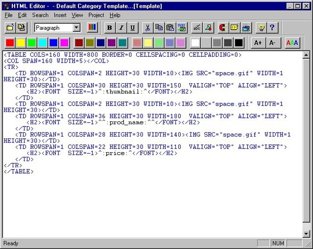

---
---

# 🎬 Mise en situation

Une tempête solaire massive, la plus importante jamais enregistrée, a ravagé l'infrastructure internet mondiale. Les réseaux de fibre optique haute vitesse, les réseaux de distribution de contenu complexes et les serveurs puissants sur lesquels nous nous sommes appuyés pendant des décennies ont été gravement endommagés. Bien que la connectivité internet de base soit lentement rétablie, la bande passante est maintenant précieuse et limitée.

Dans cette nouvelle réalité, les pages web qui se chargeaient instantanément prennent maintenant des minutes à apparaître si elles sont surchargées de frameworks lourds, de multiples bibliothèques JavaScript et d'images haute résolution. Les utilisateurs abandonnent les sites qui ne se chargent pas en quelques secondes.

Votre mission en tant que développeurs web: Apprendre à construire des sites web qui peuvent prospérer dans ce monde aux ressources limitées.

Vous devez maîtriser les principes fondamentaux du HTML qui se charge rapidement, du CSS efficace qui stylise sans surcharge, et Bootstrap comme framework léger pour un design adaptatif.

Il ne s'agit pas de reculer, mais bien de revenir aux bases pour avancer. Les développeurs qui peuvent créer des sites web rapides, légers et accessibles sont maintenant les plus précieux. Vous apprenez des compétences qui fonctionnent que vous ayez des vitesses de fibre optique ou des connexions dial-up.

Voici la nouvelle réalité:

  <iframe class="embed-responsive-item" width="560" height="315" src="https://www.youtube.com/embed/PDE9b5iU8vI?si=qAi2xQ0p8PqYO3Dt" title="YouTube video player" frameborder="0" allow="accelerometer; autoplay; clipboard-write; encrypted-media; gyroscope; picture-in-picture; web-share" referrerpolicy="strict-origin-when-cross-origin" allowfullscreen></iframe>

