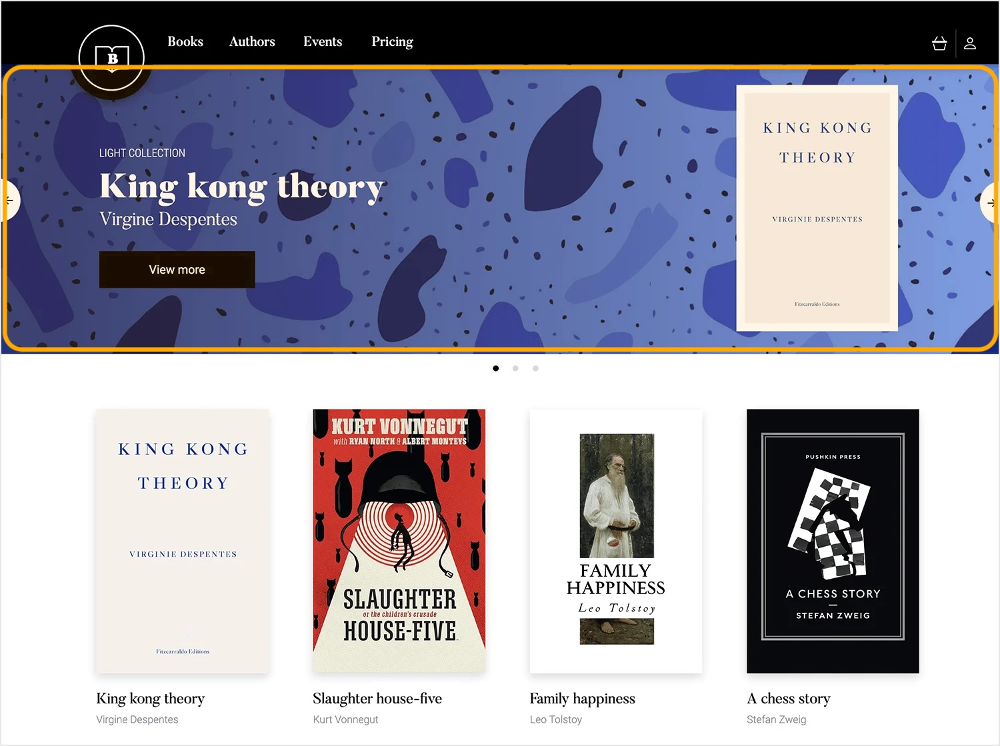
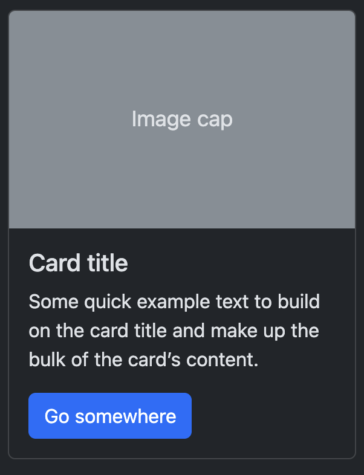
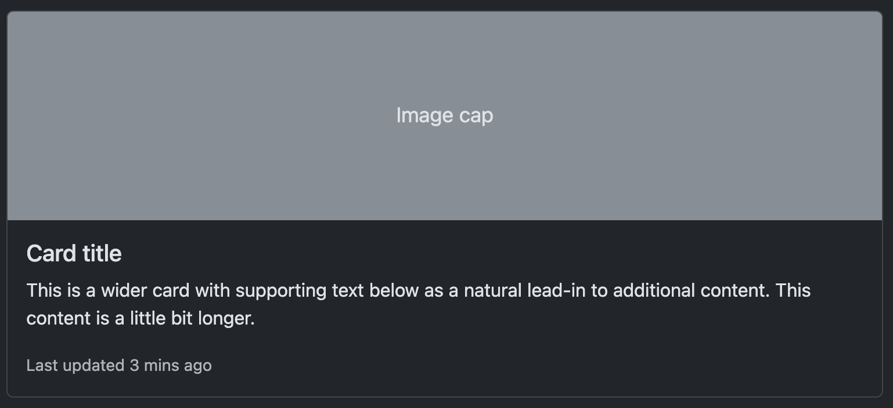
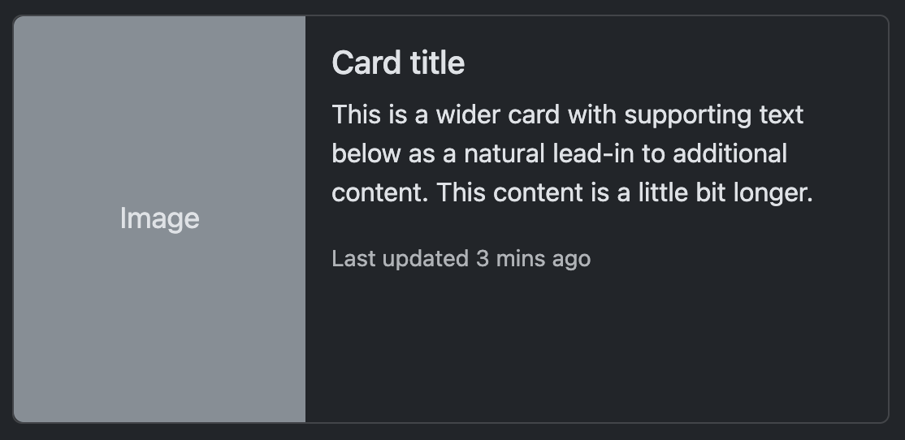

---
---

# (S10) Mission 2 - Site Web HTML & CSS
 

## Votre mission

:::danger
L'utilisation d'une IA comme Claude ou ChatGPT n'est pas autorisée pour ce travail.
:::

:::caution Votre objectif
Pour 15% de la session, transformer votre site HTML de la mission 1 en un site web moderne et attrayant en utilisant CSS, tout en conservant la structure HTML existante.

Dans la même semaine que la remise de votre travail, vous aurez un examen en classe, basé sur votre travail. Vous devrez faire des ajouts et des modifications à votre site directement en classe.
:::

Suite au succès de votre prototype HTML, la direction du festival est impressionnée et vous mandate maintenant d'ajouter une couche de présentation professionnelle à votre site. Vous devez créer une feuille de style CSS qui transformera votre site HTML brut en un site  moderne et engageant.

## Prérequis

- Vous devez utiliser votre TP1 comme base de travail
- Si votre TP1 nécessite des corrections mineures de structure HTML, vous pouvez les effectuer
- Vous ne pouvez PAS utiliser de frameworks CSS (Bootstrap, Tailwind, etc.)
- Vous ne pouvez PAS utiliser de JavaScript

## Structure de dossiers

Copiez votre dossier `1234567_TP1` et renommez-le `1234567_TP2` (en remplaçant `1234567` par votre numéro de DA).

Ajoutez un dossier `styles` à votre structure existante:

```
TP2_1234567/
├── index.html
├── ... autres pages HTML
├── styles/
│   └── app.css
└── images/
    ├── image1.png
    ├── image2.jpg
    └── ...
```

## Exigences techniques CSS

### 1. Feuille de style externe
- Créez un fichier `app.css` dans le dossier `styles`
- Liez ce fichier à TOUTES vos pages HTML avec la balise `<link>`
- Aucun style inline ou interne (directement dans le `head`) ne sera accepté

### 2. Mise en page et adaptation
Votre site doit avoir une mise en page structurée:

- **Largeur maximale du contenu** (ex: 1200px) avec marges automatiques pour centrer
- Au moins **deux media query** pour adapter certains éléments sur écrans plus petits (< 768px)
  - Par exemple: taille de police, marges, ou empilage d'éléments côte à côte
  - Je ne testerai pas de façon exhaustive votre site sur mobile outre ces éléments
- **Flexbox ou grille** pour organiser les éléments, lorsque pertinents (navigation, éléments côtes-à-cotes, etc.)
- **Marges et paddings** cohérents et pertinents

### 3. Navigation
Transformez votre barre de navigation en une barre de navigation conventionnelle.
- **Navigation pleine largeur** (s'étend sur toute la largeur de l'écran)
- **Utilisation de Flexbox** pour organiser les éléments dans la barre de navigation (logos, liens)
- La navigation doit utiliser une liste `ul`/`li` pour les liens de navigation. Évidemment, vous devez modifier le style. Référez-vous à la section sur Flexbox pour un exemple de départ.
- Navigation qui, idéalement, reste lisible sur mobile (les liens peuvent s'empiler verticalement si nécessaire), même si le format n'est pas optimal
- **Couleurs personnalisées pour tous les liens** (pas de bleu/violet par défaut)
  - Vous devez **gérer les différents états (hover et active)** pour les liens
- Indicateur visuel sur le lien de la page active
- Logo intégré à la barre de navigation

### 4. Typographie et hiérarchie visuelle
- Utilisez au moins 2 polices de caractères différentes
- Modifiez le style des titres `h1` à `h6` (couleur, alignement, bordure, etc.)
- Assurez-vous d'une différenciation visuelle entre les niveaux de titres (ex.: taille)

### 5. Palette de couleurs et thème
- Créez une palette cohérente d'au moins 3 couleurs (vous pouvez utiliser [Coolors.co](https://coolors.co/) pour vous aider)
  - Une couleur primaire qui fait ressortir certains éléments importants
  - Une couleur secondaire
  - Une couleur plus pâle pouvant être utilisée pour des arrière-plans ou encore des bordures
  - Toute autre couleur(s) de votre choix
- Utilisez des variables CSS (`:root`) pour vos couleurs principales
- Utilisez des couleurs qui reflètent l'ambiance du festival
- Assurez-vous d'utiliser des contrastes appropriés pour la lisibilité (pas de texte blanc sur fond jaune! 😉)

### 6. Éléments interactifs et animations
Ajoutez de la vie à votre site avec:

- **Couleurs personnalisées pour TOUS les liens** (pas de bleu/violet par défaut)
- **États `:hover` sur les liens** (changement de couleur, soulignement, etc.)
- Au moins 1 animation CSS (`@keyframes`)
- Au moins 1 transition CSS sur l'élément de votre choix
- Les boutons doivent être stylisés (couleur, taille, etc.)

### 7. Composants spécifiques

#### Page d'accueil
- Section principale avec grande image de fond (background-image) et texte par-dessus (Communément appelée hero section). Voici un exemple d'une section `hero` avec une image en arrière-plan et du texte par-dessus
    
- Bonus: Utilisation d'un overlay (couche semi-transparente) pour améliorer la lisibilité du texte sur l'image
- Le reste est à votre guise pour le style!

#### Page programmation
- Utilisez un style de couleur alterné pour les lignes des tableaux. Le style exact est à votre choix, mais vous devez obligatoirement utiliser les pseudo-classes `:nth-child(even)` et `:nth-child(odd)` pour votre tableau.
    :::caution
    Cet aspect n'a pas été vu directement dans le cours, c'est un petit défi documentation 😉

    Voir la section "Alternance de couleurs pour les lignes": https://developer.mozilla.org/fr/docs/Learn_web_development/Core/Styling_basics/Tables#mettre_en_forme_notre_tableau
    :::
- **Menu de navigation latéral** (aligné à gauche ou à droite du contenu) pour votre table des matières permettant de naviguer entre les jours avec les ancres
- Vous devez **utiliser flexbox** pour positionner le menu à côté du contenu principal
- Le reste est à votre guise pour le style!

#### Page artistes
- Pour afficher chaque artiste, utilisez un système de "cartes". Voici quelques exemples de carte:
    
    
    
- Utilisez `Flexbox` ou `Grid` pour disposer les cartes sous forme de grille
- **Menu de navigation latéral** (gauche ou droite) pour naviguer entre les artistes avec les ancres
- **Utilisation de Flexbox** pour positionner le menu à côté du contenu principal

#### Page billetterie
- Formulaire stylisé (modifier la taille des champs, couleur des bordures, padding, arrondis, etc.)
- Tableau de prix stylisé (bordures, couleurs de fond, mise en évidence d'une option recommandée). Vous pourriez aussi utiliser des cartes "flex" plutôt qu'un tableau.
- Boutons stylisés (couleur de fond, taille, bordures, effet au survol, différents du style par défaut)

#### Page informations générales
- FAQ avec `details`/`summary` stylisés (couleurs, bordures, icônes ou symboles pour indiquer l'ouverture/fermeture). Vous devez changer l'apparence pour que cela ressemble à des blocs de FAQ. Par exemple:
- Vous pouvez garder la flèche par défaut du navigateur, mais modifiez le style de la boîte
- Carte Google Maps avec bordure personnalisée

### 8. Pied de page
- **pied de page pleine largeur** (s'étend sur toute la largeur de l'écran, pas limité au conteneur de 1200px)
- Séparation visuelle entre le pied de page et le contenu principal (ex.: mettre le pied de page d'une autre couleur d'arrière-plan)
- Contenu positionné de façon cohérente à l'intérieur du pied de page

### 9. Créativité et cohérence
- Design unique et original
- Cohérence visuelle à travers toutes les pages
- Niveau d'attention aux détails
- Qualité générale de l'intégration CSS

## Modalités de remise

- Remis par Léa
- Remis avant le 4 novembre 2025 23:59
- Archive `Zip` de votre répertoire `1234567_TP2`

## Grille d'évaluation

| **Critère**                                                  | **Points** |
| ------------------------------------------------------------ | ---------- |
| Feuille de style et organisation des styles                  | 10%        |
| Mise en page et disposition générale                         | 10%        |
| Barre de navigation                                          | 10%        |
| Typographie                                                  | 10%        |
| Composants spécifiques: Cartes artistes                      | 10%        |
| Composants spécifiques: FAQ                                  | 10%        |
| Composants spécifiques: Section hero                         | 10%        |
| Composants spécifiques: Navigation verticale                 | 5%         |
| Composants spécifiques: Formulaire de contact                | 10%        |
| Composants spécifiques: Tableaux alternés                    | 5%         |
| Animations et transitions                                    | 5%         |
| Palette de couleurs, thème, créativité et niveau de finition | 5%         |
| **Total**                                                    | **100%**   |
