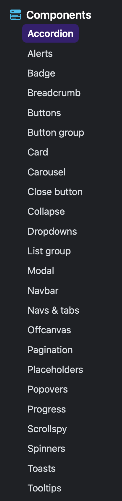

---
---

# (S15) Mission 3 - Site Web utilisant Bootstrap
 

## Votre mission

:::danger
L'utilisation d'une IA comme Claude ou ChatGPT n'est pas autorisée pour ce travail.
:::

:::caution Votre objectif
Pour 25% de la session, **créer un site Web complet en utilisant Bootstrap sur un sujet qui vous passionne ou pour lequel vous avez un intérêt marqué**.
:::

:::caution
N'utilisez pas de javascript.

Seules les bibliothèques intégrées avec Bootstrap 5 peuvent être utilisées. Exceptionnellement, vous pouvez utiliser du JavaScript pour initialiser les composants qui le requiert, comme les popover ou les tooltips.
:::

Maintenant que vous connaissez bien les bases du HTML et que le CSS n'a plus de secret pour vous, ce dernier travail présente plus de liberté.

En effet, choisissez un sujet qui vous passionne ou pour lequel vous avez un fort intérêt et développez un site Web comprenant **au minimum 5 pages**:

1. Une **page d'accueil** qui présente sommairement votre passion ou intérêt et le but du site.
2. **Page de contact** avec un formulaire utilisant les styles de Bootstrap
3. **Page à propos** qui parle de l'auteur du site (vous!)
4. **2 pages au choix**, selon ce qui a du sens pour votre site. Par exemple:
   1. Plus d'informations sur votre passion
   2. Règles du jeu ou stratégies s'il s'agit d'un jeu
   3. Galerie de photos ou portfolio
   4. Ressources intéressantes
   5. Tutoriels ou guides
   6. Historique ou chronologie
   7. Personnes/personnages marquants
   8. Etc.
   
## Exemples de sujets possibles

* Un jeu vidéo que vous adorez (Minecraft, League of Legends, etc.)
* Un sport ou une activité physique (skateboard, escalade, yoga, etc.)
* Une passion créative (photographie, musique, dessin, cuisine, etc.)
* Un domaine d'intérêt (astronomie, histoire, technologie, voitures, etc.)
* Une série, un film ou un univers fictif
* Un animal ou la nature
* Tout autre sujet qui vous inspire!

## Structure de dossiers

Créez un dossier `TP3_1234567` ayant la structure suivante:

```
TP3_1234567/
├── index.html (page d'accueil)
├── contact.html
├── page3.html (à nommer différemment seulon le rôle)
├── page4.html (à nommer différemment seulon le rôle)
├── js/
│   └── bootstrap.bundle.min.js (JavaScript de Bootstrap)
├── styles/
│   └── app.css (votre CSS personnalisé, si applicable)
│   └── bootstrap.min.css (CSS de Bootstrap)
├── images/
│   └── (vos images)
└── README.txt (court texte expliquant votre site et listant les composants Bootstrap utilisés)
```

## Exigences techniques de base

* Minimum 5 pages HTML, dont une page d'accueil, une page contact et une page à propos
* Navigation principale sur toutes les pages **utilisant navbar de Bootstrap**
* Structure HTML adéquate utilisant le système de grilles de Bootstrap
* Site adaptatif qui fonctionne bien sur mobile, tablette et ordinateur

## Utilisation de Bootstrap (OBLIGATOIRE!)

Votre site doit utiliser `Bootstrap 5.3` de manière significative. Vous devez intégrer:

### Système de grille et mise en page

* Utilisation du système de grille (container, row, col) sur toutes vos pages

### Composants Bootstrap (minimum 6, **EN PLUS** de la navbar imposée)
Choisissez au moins **6 composants différents** offerts par Bootstrap et intégrez-les à votre site. Votre navbar **ne compte pas** parmis ces 6 composants.



## Classes utilitaires Bootstrap

Utilisation variée des classes utilitaires de Bootstrap:
* Espacement (`margin`, `padding`: `m-`, `p-`, etc.)
* Couleurs (`text-`, `bg-`, etc.)
* Display (`d-flex`, `d-grid`, `d-none`, etc.)
* Texte (`text-center`, `text-uppercase`, etc.)

### Page de contact

* Formulaire utilisant les classes de formulaire Bootstrap
* Champs minimums:
  * Prénom (texte)
  * Nom (texte)
  * Courriel (texte)
  * Raison de vous contacter: une boîte de sélection `select` avec au moins 3 raisons de contact
  * Message (texte long)
* Mise en page soignée du formulaire

## Contenu et qualité
* Contenu pertinent et suffisant (pas de lorem ipsum ou trucs du genre)
* Images de bonne qualité
* Orthographe et grammaire soignées
* Design cohérent et professionnel

## Personnalisation
* Vous pouvez ajouter votre propre CSS pour personnaliser les couleurs, polices, espacements
* Vous pouvez remplacer les variables CSS de Bootstrap
* Important: Bootstrap doit rester la base de votre mise en page et design

## Modalités de remise
- Remis par Léa
- Remis avant le 12 décembre 2025 23:59
- Archive `Zip` de votre répertoire `TP3_1234567`

## Grille d'évaluation

| **Critère**                                                                      | **Points** |
| -------------------------------------------------------------------------------- | ---------- |
| Variété des composants Bootstrap (minimum 6 différent, bien intégré)             | 20%        |
| Structure et navigation (5 pages, navbar fonctionnel, liens fonctionnels)        | 15%        |
| Utilisation du système de grille Bootstrap (adaptatif, bien structuré)           | 15%        |
| Formulaire Bootstrap stylisé (page contact)                                      | 15%        |
| Créativité, design et cohérence visuelle (site agréable, professionnel, complet) | 15%        |
| Classes utilitaires Bootstrap (espacement, couleurs, texte, display, etc.)       | 10%        |
| Qualité du contenu (pertinent, suffisant, sans fautes)                           | 5%         |
| Respect des consignes (pas de JS sauf exception, README inclut)                  | 5%         |
| **Total**                                                                        | **100%**   |