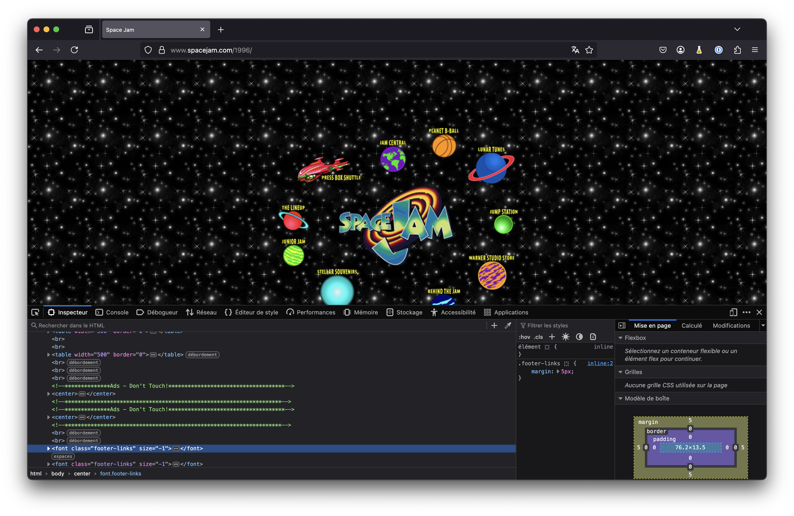
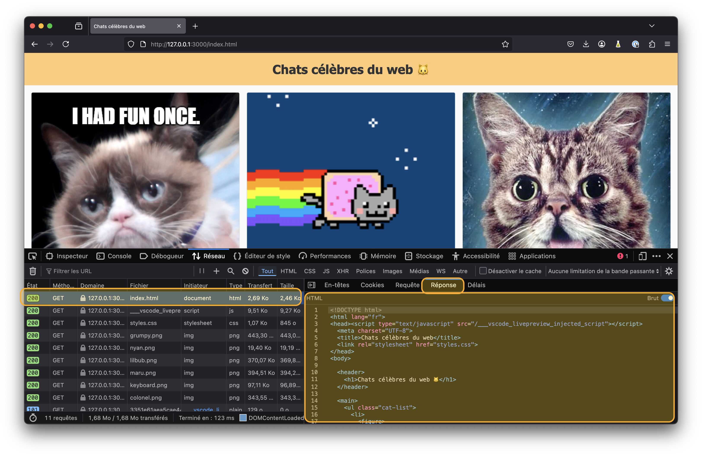
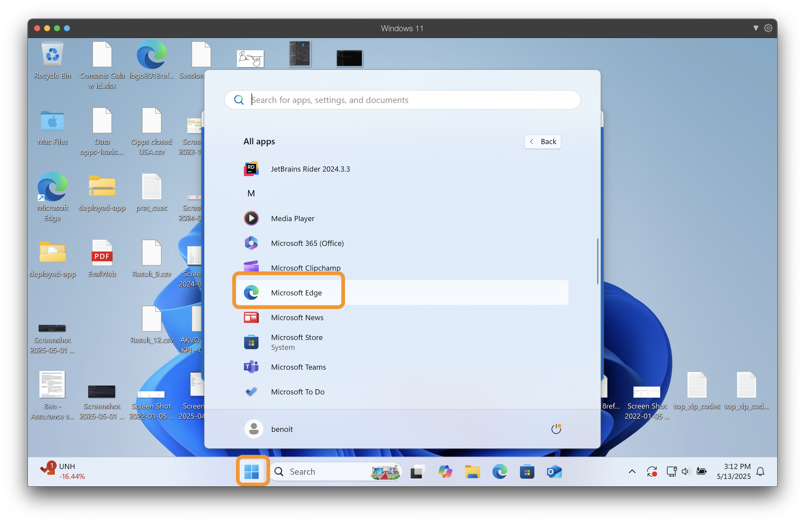
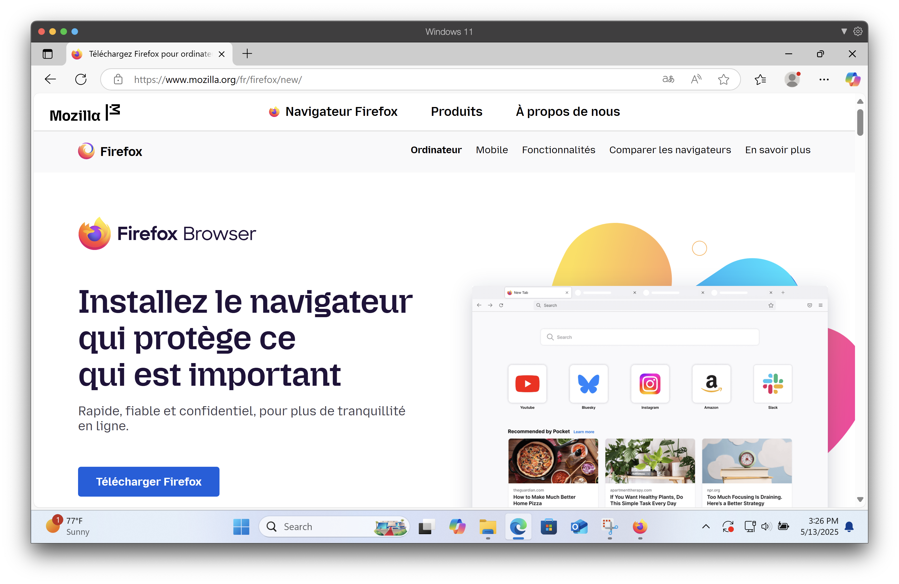
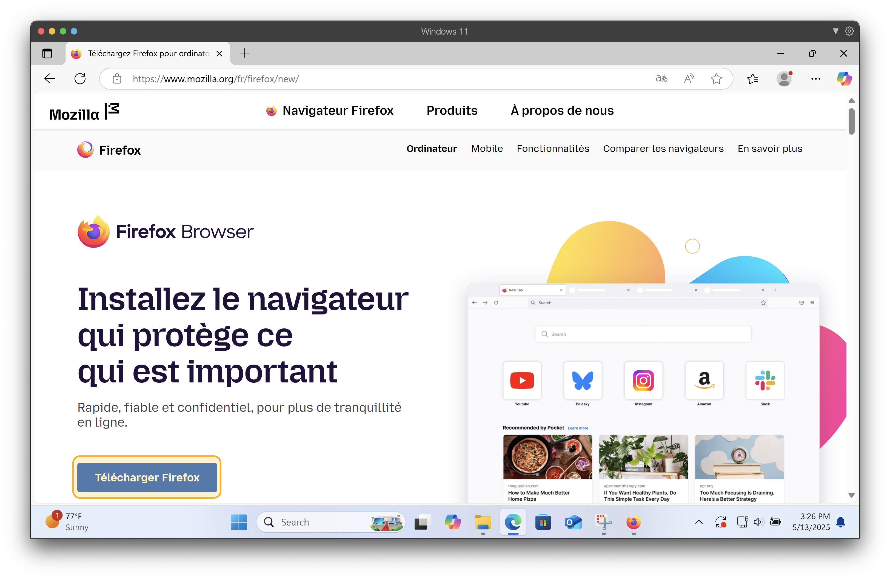
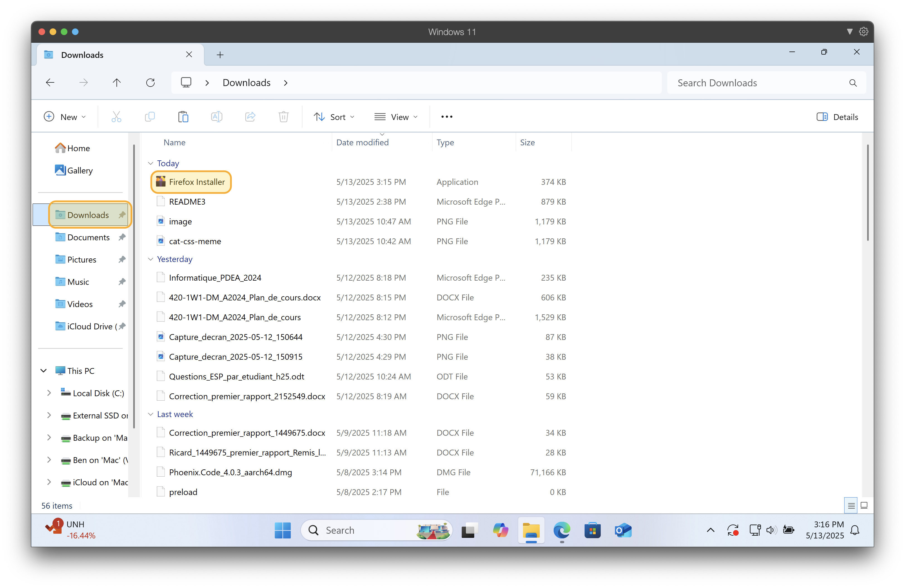
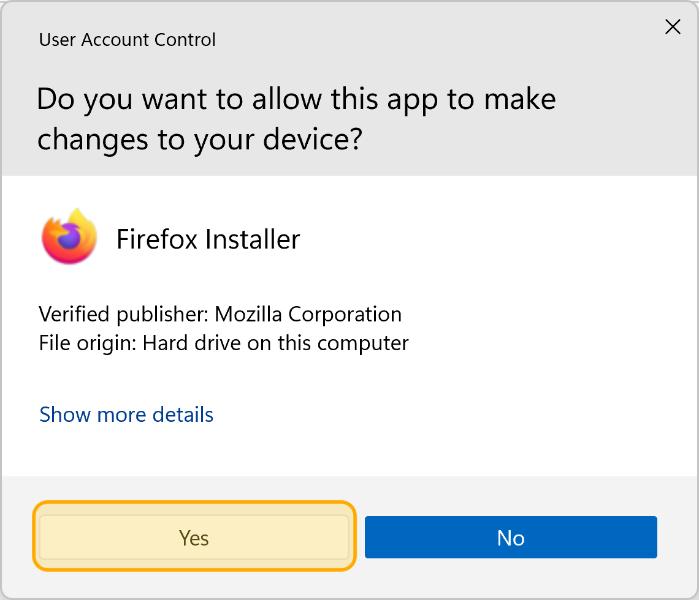
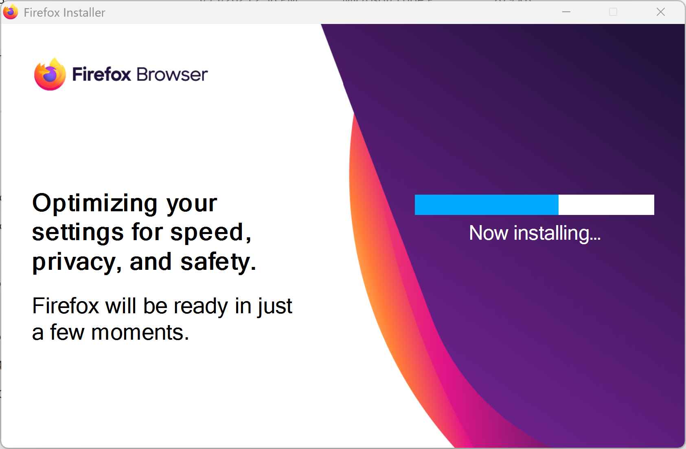
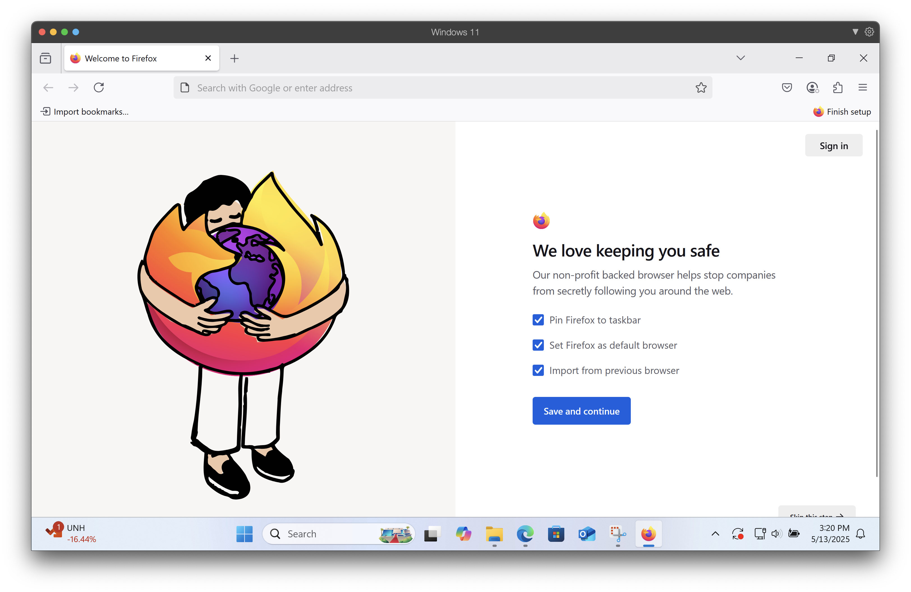

---
---
import chatsHtml   from '!!raw-loader!@site/src/playground/s01/chats/index.html';
import chatsStyles from '!!raw-loader!@site/src/playground/s01/chats/styles.css';

# 3 - Le navigateur pour accéder au web

## Qu'est-ce qu'un navigateur?

Un navigateur web est une application **permettant à un utilisateur d’accéder et d’interagir avec des pages web** et autres ressources hébergées sur Internet.

Vous avez très certainement déjà utilisé un de ces navigateurs: Chrome, Firefox, Safari (iPhone) ou encore Edge.

Le navigateur agit comme un **client HTTP**: il **envoie des requêtes aux serveurs web et récupère les réponses** (ex.: document HTML):

Un moteur de rendu (par exemple Blink pour Chrome, Gecko pour Firefox, WebKit pour Safari) est responsable **d'interpréter le code HTML, JavaScript et CSS reçu afin d'afficher la page web**. Plus particulièrement:
* Interpréter le code HTML reçu pour l'afficher visuellement dans le navigateur
* **Lire exécuter du code JavaScript afin de rendre une application Web plus dynamique**. Par exemple, en y ajoutant des animations, validations de formulaires, interactions utilisateurs, etc. **Vous verrez cet aspect dans votre cours de Web II**.
* Le moteur est aussi responsable d'**appliquer le style visuel des pages** (couleurs, polices de caractère, etc.) à l'aide d'un language appelé le **CSS**. Nous aurons l'occasion de voir ce langage dans le cadre du cours.

Sans moteur de rendu, votre navigateur ne pourrait qu'afficher les fichiers textes qui représentent la page.

En résumé, le navigateur vous permet d'interagir de façon conviviale avec le Web: il est reponsable de gérer la communication avec les serveurs, d'interpréter et d'afficher les contenus, en plus de fournir un ensemble d’outils et de mécanismes de sécurité utiles à l'utilisateur et au développement web.

## Les principaux navigateurs

Les principaux navigateurs sont:
* Chrome
* Safari
* Firefox
* Edge

Au Canada, Chrome a la plus grosse part de marché, suivi de Safari puisque ce dernier est le navigateur par défaut sur les appareils iPhone.

Au final, il n'existe pas "un meilleur navigateur". Plusieurs navigateurs coexistent parce qu’ils offrent chacun un équilibre différent entre performance, compatibilité, confidentialité et fonctionnalités. Cela permet aux utilisateurs et aux développeurs de choisir l'outil le mieux adapté à leurs besoins.

La concurrence entre navigateurs (Google Chrome, Mozilla Firefox, Microsoft Edge, Safari, etc.) encourage l'innovation: chacun optimise son moteur de rendu pour accélérer le chargement des pages ou encore pour renforcer la sécurité et propose des extensions ou des modules spécifiques.

De plus, certains navigateurs adoptent plus ou moins rapidement les nouveaux standards du Web. En tant que développeur, il peut être parfois utile d'utiliser une version de navigateur ayant adopté les derniers standards.

Il est donc important de tester son application web sur plusieurs navigateurs. De cette façon, on s’assure que l'application fonctionne de manière cohérente pour tous les utilisateurs, quel que soit le navigateur utilisé.

## Installation de Firefox

Dans le cadre du cours, vous êtes libre d'utiliser le navigateur qui vous convient, mais je vous propose d'utiliser Firefox.

1. Utilisez un navigateur que vous avez déjà sur votre ordinateur. Par exemple, Edge devrait être installé par défaut sur Windows.
    
2. Rendez-vous à l'addresse https://www.mozilla.org/fr/firefox/new/ pour télécharger Firefox
    
3. Appuyez sur le bouton de téléchargement pour débuter
    
4. Ouvrez l'installateur. Il devrait être dans votre dossier `Téléchargements` ou `Downloads` en anglais
    
5. Choisir `Oui` ou `Yes` à cette question
    
6. Attendez que le processus d'installation se termine
    
7. Lorsque l'installation sera terminée, Firefox s'ouvrira. L'étape suivante est à votre discrétion, tout dépendant si vous voulez faire de Firefox votre navigateur par défaut ou non.
    