---
---

# 4 - Un éditeur (IDE) pour créer des pages web

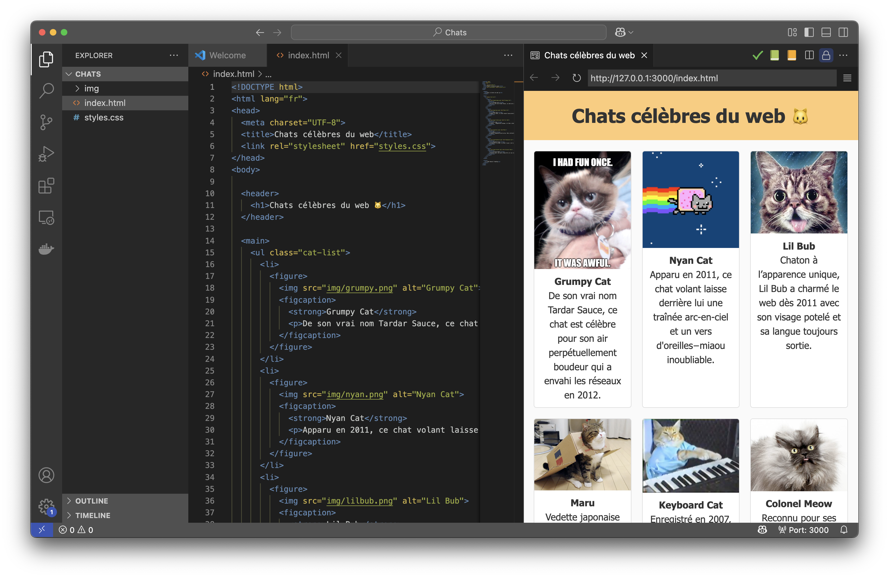

Pour créer des pages Web et des documents HTML, il nous faudra un éditeur! Dans le contexte de développement logiciel, on utilise des applications spécialisées dans l'écriture de code. On appel ces applications des IDE (Integrater Development Environment).

## Qu'est-ce qu'un IDE?

Un Environnement de Développement Intégré (IDE, Integrater Development Environment en anglais) est une application qui regroupe tous les outils dont on a besoin pour créer des applications. Dans notre cas, un IDE pour le Web comprends:
1. **Éditeur de code**. Un espace pour écrire et modifier vos fichiers (HTML et CSS), avec une mise en forme et une coloration syntaxique qui rend le code plus lisible.
2. **Explorateur de projet**. Un panneau permettant de naviguer dans les différents dossiers et fichiers de votre projet et de créer de nouveaux fichiers `HTML` ou `CSS`.
3. **Aide à la saisie et détection d’erreurs**. L’IDE peut suggérer automatiquement des balises ou des propriétés CSS, souligner les fautes de frappe et avertir quand une balise n’est pas fermée correctement.
4. **Raccourcis**. Des suggestions et les raccourcis clavier accélèrent l’écriture du code et réduisent les erreurs.
5. **Plusieurs autres fonctionnalités plus avancées** que nous n'utiliserons pas dans le cadre du cours telles qu'un terminal intégré, la possiblité de lancer un serveur de développement, etc.

## Visual Studio Code

Il existe beaucoup d'IDE! Parmi les IDE les plus populaires pour débuter en développement web, on retrouve Visual Studio Code. Ce dernier est souvent utilisé comme IDE, autant par les débutants que les développeurs expérimentés pour plusieurs raisons:
- Il possède Une interface simple et modulable, facile à prendre en main
- Un répertoire d’extensions pour ajouter des fonctionnalités supplémentaires dont vous pourriez avoir besoin
- Des mises à jour régulières et une grande communauté de développeurs

Dans ce cours, nous utiliserons VS Code pour créer les pages web.

## Installation de Visual Studio Code

1. Rendez-vous, à l'aide de votre navigateur, sur la page suivante: https://code.visualstudio.com/Download
2. Appuyez sur le bouton `Windows` ou celui correspondant à votre système d'exploitation (ex.: Mac) pour télécharger l'installateur.
    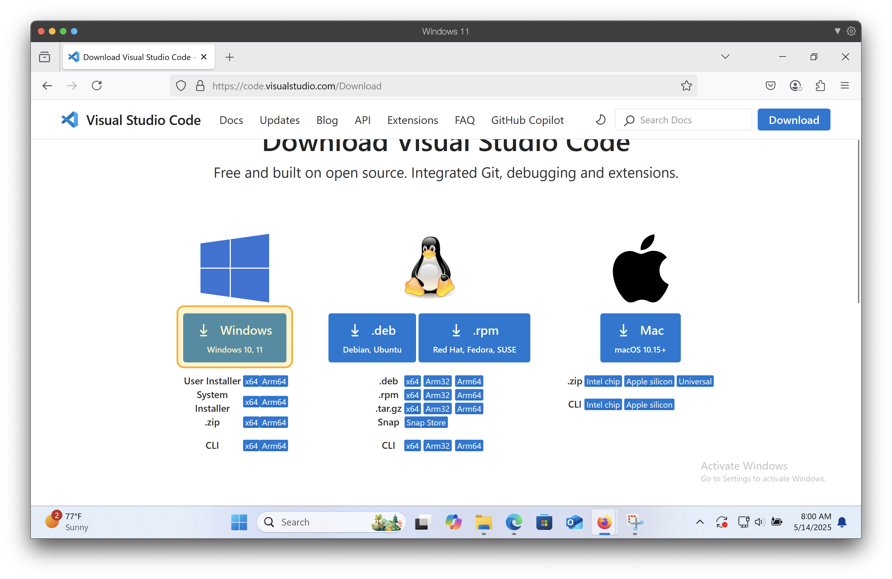
3. Ouvrez l'installateur à partir de l'endroit où il a été sauvegardé (probablement le dossier `Téléchargements`)
    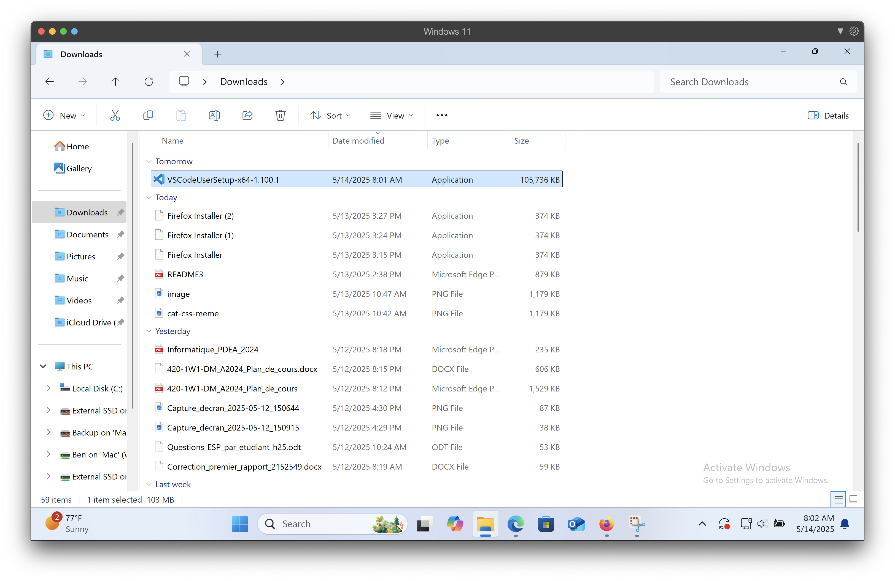
4. Suivez les étapes pour installer le logiciel. Assurez-vous de cocher les 4 options suivantes à cette étape:
    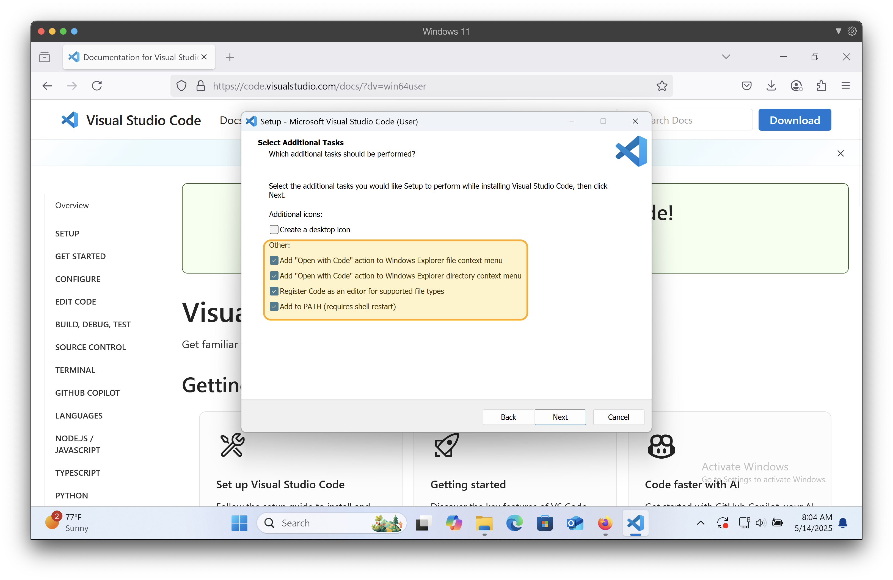
5. Vous pouvez appuyer sur `Finish`, ce qui devrait lancer automatiquement Visual Studio Code.
    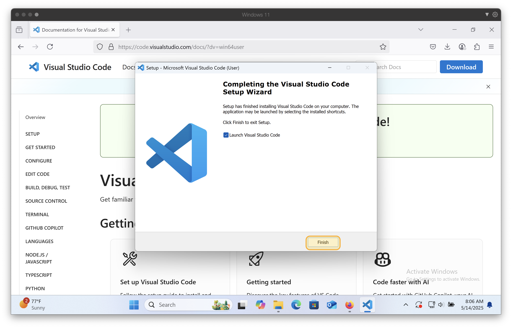

## Configuration Visual Studio Code

### Choisir un thème

1. Lors du premier lancement de VS Code, **appuyez sur l'option `Choose your theme`**.
    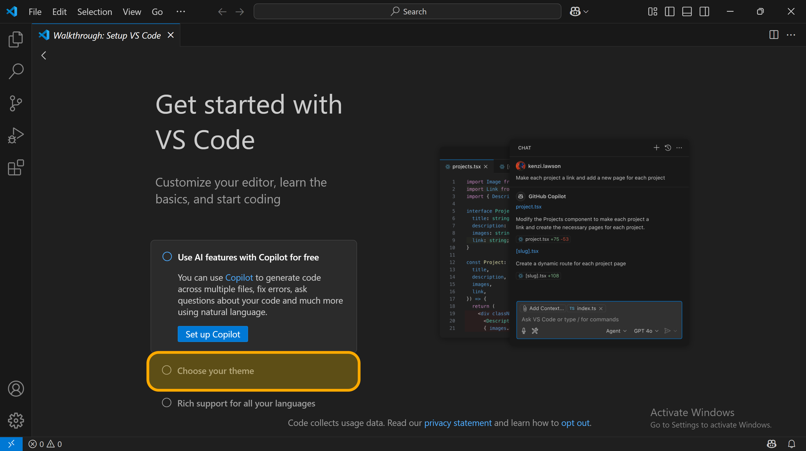

2. **Sélectionnez un thème** qui vous convient. Les développeurs tendent à préférer les options "dark" puisque cela est plus reposant pour les yeux. **`Dark Modern` est généralement un bon choix**.
    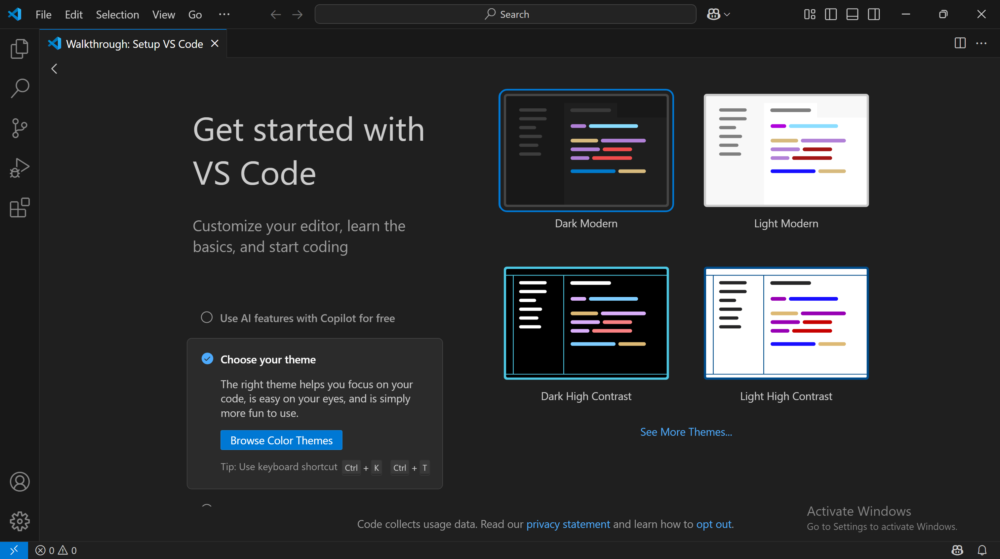

3. Une fois le thème choisi, **fermez l'onglet de démarrage**
    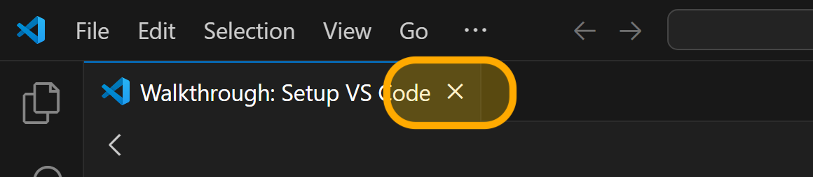

### Installer l'extension `Live Preview`

Visual Studio Code permet d'installer des extensions. Ces extensions permettent d'ajouter des fonctionnalités supplémentaires à l'éditeur.

Une fonctionnalité très pratique est de pouvoir avoir accès à un aperçu de la page que vous êtes en train de créer directement dans l'éditeur.

:::info
Il n'est pas possible de faire le rafraichissement automatique directement dans le navigateur sans avoir recours à un serveur web. Live Preview démarre donc pour vous un serveur Web et affiche l'aperçu de la page directement dans l'éditeur.
:::

1. **Ouvrez l'onglet `Extensions`**
    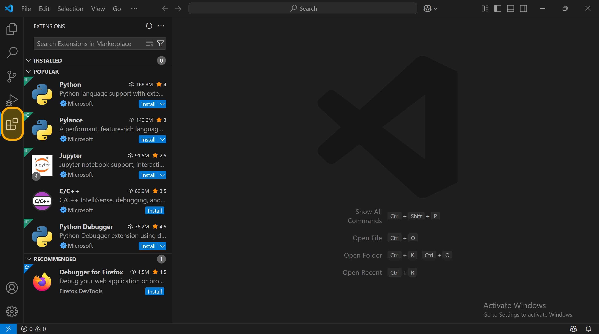

2. Faites une **recherche pour `Live Preview`** dans la barre de recherche
    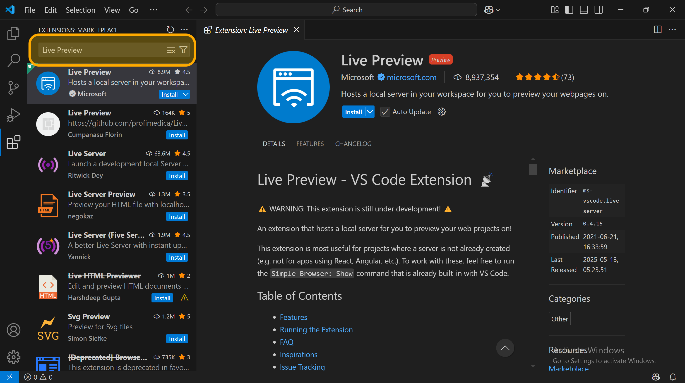

3. **Installez l'extension** à l'aide du bouton `Install`
    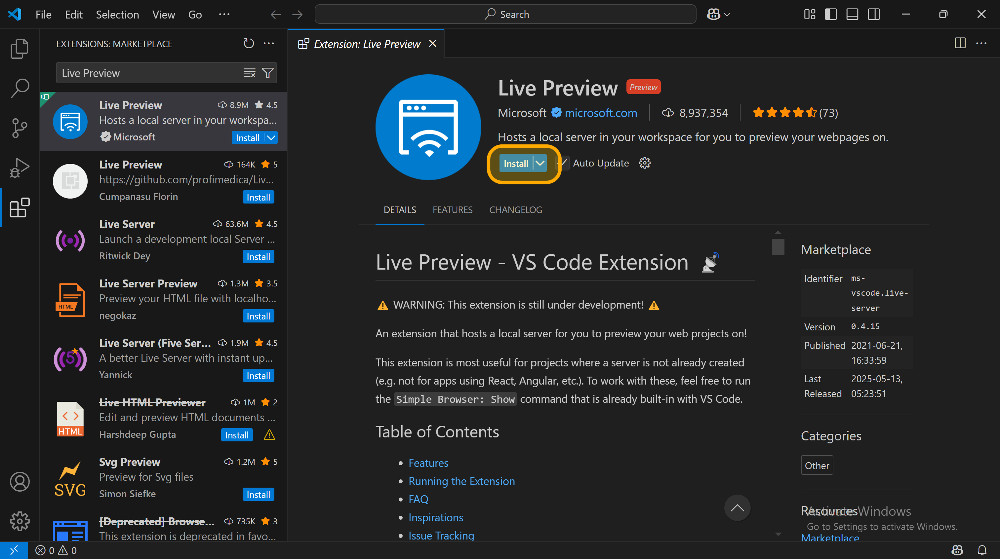

### Installer l'extension `HTMLHint`

Pour analyser votre code HTML et vérifier sa validité, l'extension `HTMLHint` est très utile. En effet, elle permettra de surligner le code pouvant poser problème et vous proposer des suggestions afin de régler les problèmes.

1. Dans l'onglet extension, faites une recherche pour `HTMLHint` et installez l'extension
    :::caution
    Assurez-vous de choisir l'extension qui n'est pas rayée, ces dernières ne sont plus supportées!
    :::
    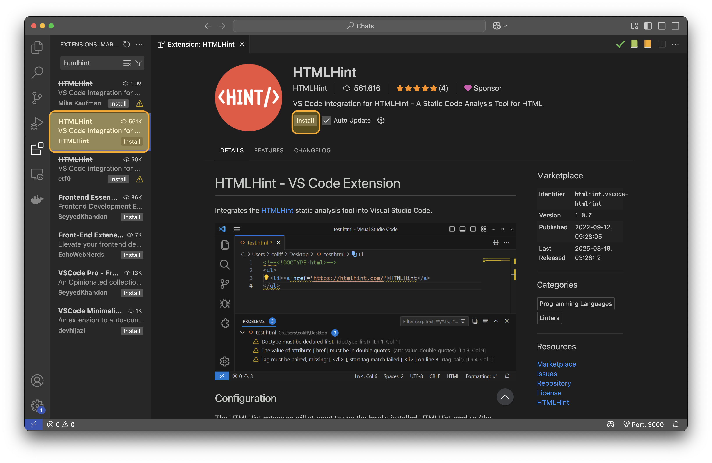
2. Appuyez sur `Trust Publisher & Install` lorsque demandé
    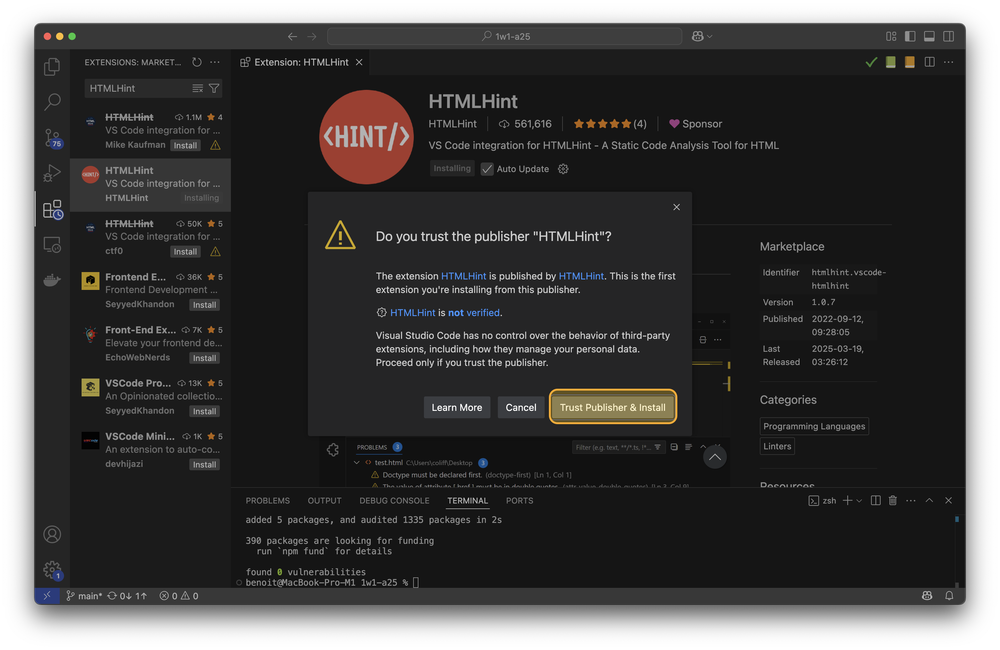

## Rendez-vous au niveau 1!

Vous êtes maintenant prêts à créer votre première page web, **rendez-vous au [niveau 1](../04-html/01-s01/01-base-html/01-doc-html.md)!**

