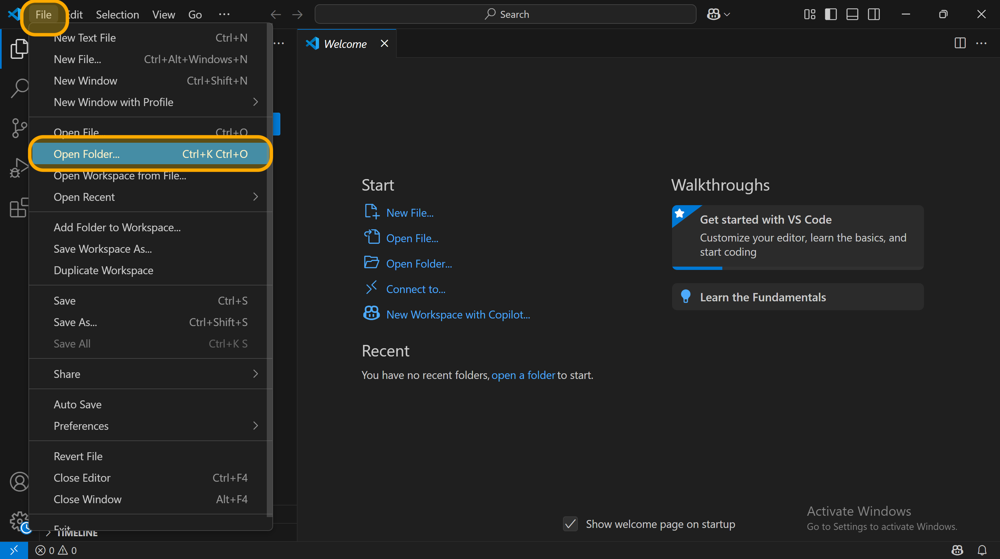
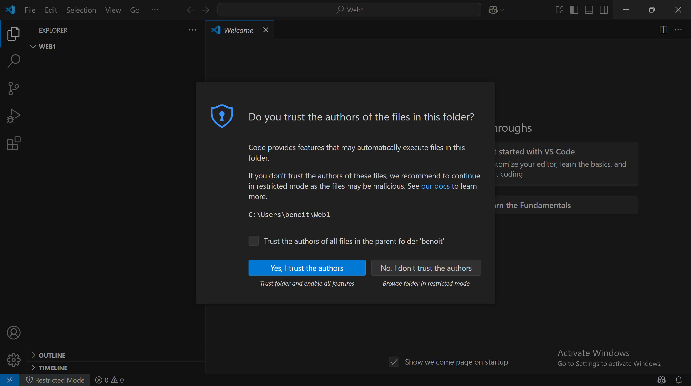
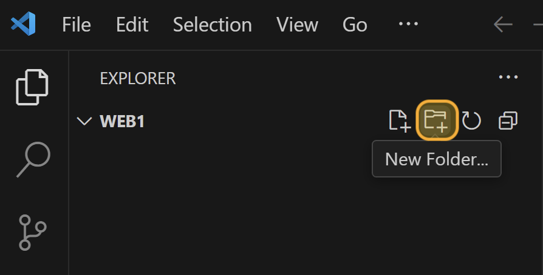
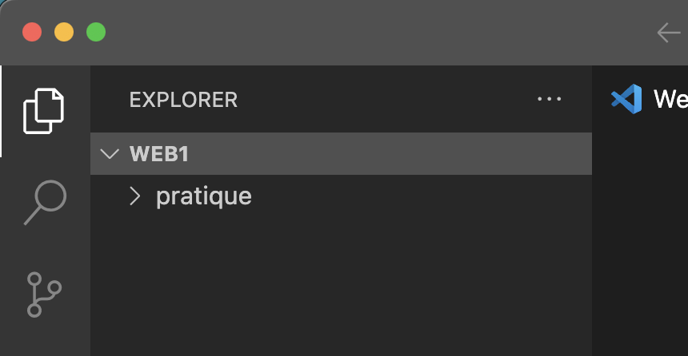
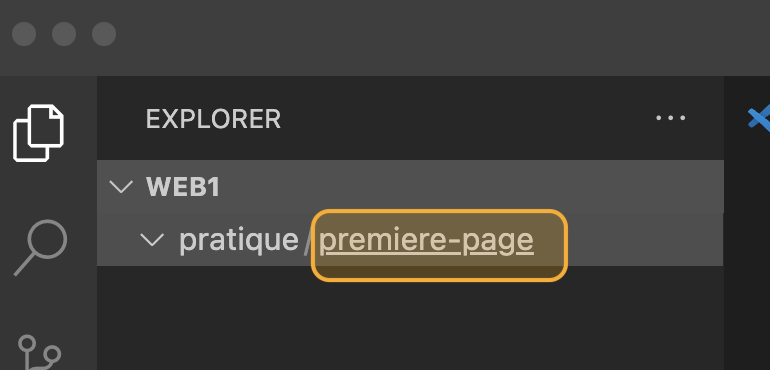
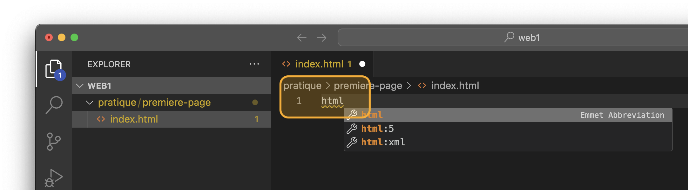
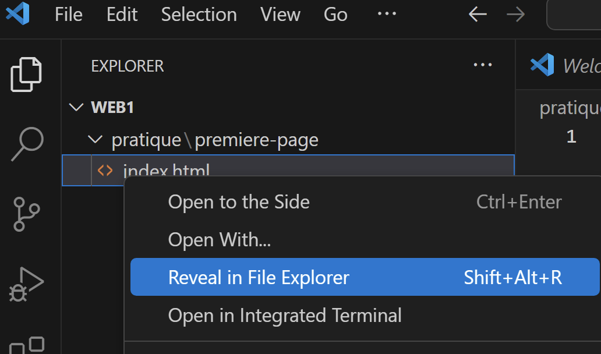
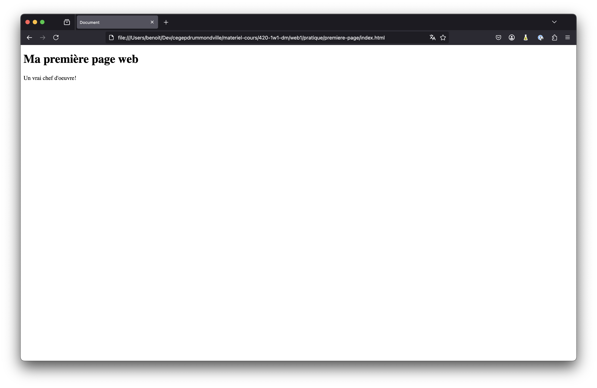
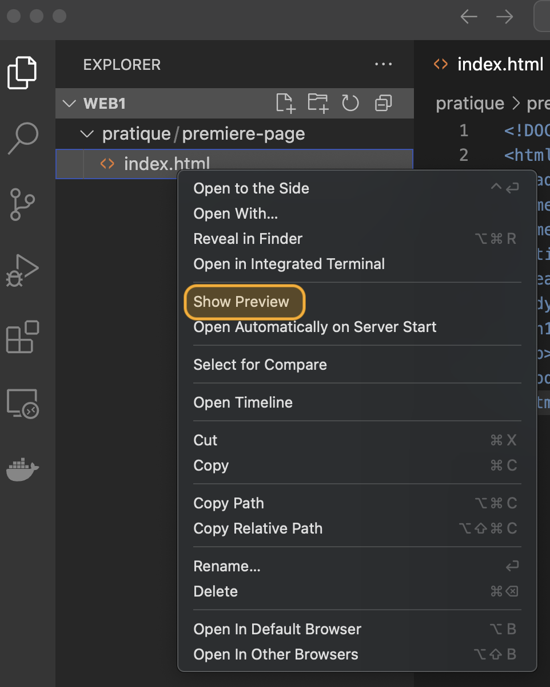
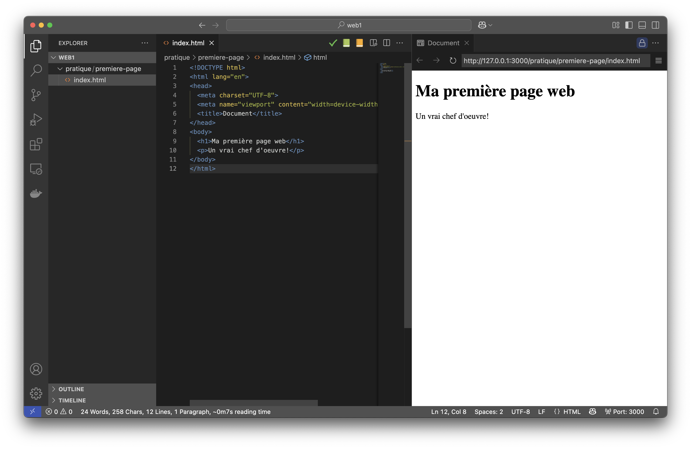

---
---

# 1-1 Votre première page web!

En utilisant `Visual Studio Code`, nous allons créer une première page web et l'afficher à l'aide de `Live Preview`.

:::info
**Nous allons en profiter pour créer un dossier qui pourra contenir plusieurs des exercices du cours, afin que vous puissiez les centraliser à un endroit**.
:::

## Créer une structure de dossiers pour le cours

1. À partir du menu `File` de `VS Code`, sélectionnez `Open Folder...`
    

2. Créez un dossier `Web1` pour le cours et appuyez sur `Select Folder` (ou l'équivalent en français).
    :::caution
    Ne mettez pas d'espaces dans le dossier, on évite généralement les espaces qui peuvent parfois poser problème.
    :::
    

3. À l'ouverture, si vous avez ce message, vous pouvez appuyer sur `Yes, I trust the authors` (c'est vous l'auteur! 🙂)
    

4. À l'aide du bouton `New Folder`, créez un dossier `pratique`
    

5. Vous devriez voir ceci
    

:::info
Il vous sera possible à partir de ce dossier et de le diviser de façon structuré pour le cours. Par exemple:

```
Web1/
├── pratique/
│   ├── premiere-page/
│   │   └── index.html
│   └── …
├── mission01/
│   ├── index.html
│   └── …
├── mission02/
│   ├── index.html
│   └── …
└── …
```
:::

## Votre première page Web

### Créer un dossier et un fichier `index.html`

1. Sous le dossier `pratique`, créez un dossier `premiere-page`
    :::caution
    Évitez les accents et les espaces! C'est pourquoi j'ai nommé le dossier `premiere-page`.
    :::
2. Assurez-vous de cliquer sur le dossier `premiere-page` une fois créé
    

3. Sous `pratique/premiere-page`, créez un fichier `index.html` à l'aide du bouton `New File...`.
4. Nommez le fichier `index.html`

:::info
Un document HTML est contenu dans un fichier avec l'extension `.html`.

La convention veut que la page principale d'un site, l'accueil, soit contenue dans un fichier nommé `index.html`: il s'agit de l'index du site.
:::

### Créer votre page web

1. Pour créer la coquille du document HTML, on peut s'appuyer sur notre éditeur VS Code. Commencez à tapper `html` dans le fichier `index.html`
    

2. **Sélectionnez `html:5`** parmi la liste
3. Vous devriez voir apparaitre ceci:
    ```html title="index.html"
    <!DOCTYPE html>
    <html lang="en">
    <head>
        <meta charset="UTF-8">
        <meta name="viewport" content="width=device-width, initial-scale=1.0">
        <title>Document</title>
    </head>
    <body>
    
    </body>
    </html>
    ```
4. Entre les deux éléments `<body> </body>`, ajoutez un titre à l'aide de la balise `h1` et un paragraphe de texte à l'aide de la balise `p`.   
    > **Titre**: Ma première page web   
    > **Paragraphe**: Un vrai chef d'oeuvre!

    ```html
    <!DOCTYPE html>
    <html lang="en">
    <head>
        <meta charset="UTF-8">
        <meta name="viewport" content="width=device-width, initial-scale=1.0">
        <title>Document</title>
    </head>
    <body>
        //highlight-start
        <h1>Ma première page web</h1>
        <p>Un vrai chef d'oeuvre!</p>
        //highlight-end
    </body>
    </html>
    ```
5. À l'aide de l'explorateur de fichier, localisez votre fichier. Pour cela, vous pouvez faire: `clic doit sur index.html` -> `Reveal in File Explorer`

   

6. **À partir de l'explorateur de fichiers Windiws** (pas dans VS Code), double-cliquez sur le fichier `index.html` pour l'ouvrir dans le navigateur par défaut.
7. Votre navigateur devrait s'ouvrir et vous devriez voir quelque chose comme ceci!
    

### Visualiser à l'intérieur de VS Code avec Live Preview

Il est possible de visualiser votre page web directement à l'intérieur de VS Code à l'aide de l'extension `Live Preview` installée précédemment.

Pour cela:

1. `Clic droit` sur le fichier `index.html` et sélectionnez `Show Preview`
    
    

2. Live Preview devrait s'ouvrir avec l'aperçu de votre page!
    
    
3. Vous pouvez aussi cliquer n'importe où dans la fenêtre du HTML à l'aide d'un `clic droit` et la même option devrait être disponible.

Vous venez de créer votre première page web et de l'afficher, félicitations! 🎉

