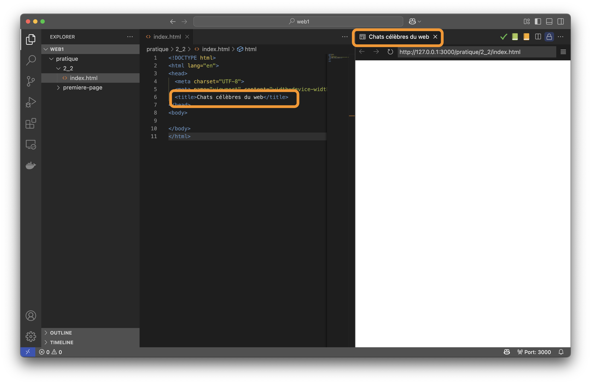

---
---

# 📚 Texte, listes et mise en forme

Plusieurs balises sont disponibles afin d'afficher et mettre en forme du texte dans une page Web.

Utiliser la bonne balise est important, puisque chaque balise vient avec un style par défaut et porte aussi une signification sémantique importante pour les navigateurs.

## Titres (`h1`-`h6`)

**Les balises de titre (`<h1>` à `<h6>`) permettre de représenter un titre dans la page**. Plusieurs niveaux de titre sont offerts afin de créer une hiérarchie logique dans la page:  
- **`<h1>`**: titre principal (**un seul par page**).  
- **`<h2>`**: grandes sections.  
- **`<h3>`**: sous-sections, etc.  

Les moteurs de recherche et les technologies d’assistance utilisent cette structure pour comprendre la page et faciliter la navigation.

<SandpackPlayground
  template="static"
  showTabs={false}
  files={{
    '/index.html': `<h1>Chats célèbres du web</h1>
<h2>Grumpy Cat</h2>
<h3>Biographie</h3>
<h4>Caractéristiques</h4>
<h5>Faits amusants</h5>
<h6>Références</h6>`
  }}
/>

<p></p>

:::info h1
La titre `h1` est doit être présent une seule fois dans la page puisqu'il est le titre principal.

Les autres titres peuvent être présents plusieurs fois.
:::

:::info h1 vs title
Peut-être vous demandez-vous la différence entre `h1` dans la section `body` et la balise `title` dans la section `head`.

La balise `title` permet de changer le titre de la page, mais ce dernier n'est pas affiché dans le corps (`body`).

Il est plutôt affiché comme titre de l'onglet dans le navigateur ou encore dans les résultats de recherche sur Google, par exemple.

Par exemple:


:::

### Bonnes pratiques et conseil pratique

Assurez-vous de conserver une hiérarchie logique dans vos titres!

```html
<!-- ❌ Mauvais: saut de niveau -->
<h1>Titre principal</h1>
<h3>Section</h3> <!-- On passe de h1 à h3 directement -->

<!-- ✅ Bon: hiérarchie logique -->
<h1>Titre principal</h1>
<h2>Section</h2>
<h3>Sous-section</h3>
```

## Paragraphes (`<p>`)

**La balise `<p>` entoure un bloc de texte afin de représenter un paragraphe**. Elle ajoute automatiquement un espace vertical avant et après le paragraphe. Afin d'améliorer la lisibilité des pages, utilisez plusieurs paragraphes afin de découper les idées principales.

<SandpackPlayground
  template="static"
  showTabs={false}
  files={{
    '/index.html': `<p>Grumpy Cat est devenu célèbre en 2012 pour son air perpétuellement boudeur.</p>

<p>Nyan Cat, créé en 2011, vole dans l’espace en laissant une traînée arc-en-ciel et une musique 8-bit.</p>`
  }}
/>

## Sauts de ligne (`<br />`)

**`<br />` force un retour à la ligne sans démarrer de nouveau paragraphe**. Cette balise n'est pas un remplacement aux paragraphes! Elle est à réserver au contenu composé de courts fragments qui doivent être séparés par un retour de ligne (ex.: adresses). Pour séparer des blocs de contenu textuels dans un texte, utilisez plusieurs paragraphes.

<SandpackPlayground
  template="static"
  showTabs={false}
  files={{
    '/index.html': `<p>
    Grumpy Cat Corp.<br />
    123 Rue du Meow<br />
    J0C 1K0, QC<br />
    Canada
</p>`
  }}
/>

## Listes

Une liste améliore la lisibilité et l’accessibilité de la page en ajoutant des points de forme ou des numéros devant les éléments à afficher. De plus, un espace à gauche est ajouté automatiquement par le navigateur. Chaque élément est encapsulé dans **`<li>`**, qu'il s'agisse d'une liste numérotée ou de points de forme.

### Numérotées (ordered-list `<ol>`)

La balise **`<ol>`** permet de créer une liste numérotée, c'est-à-dire lorsque l’ordre compte (ex.: étapes, classement, chronologie).

Pour créer la liste, on utilise la balise `<ol>` et sous cette balise, chaque élément doit être contenu dans une balise `<li>` (list item).

<SandpackPlayground
  template="static"
  showTabs={false}
  files={{
    '/index.html': `<p>Liste de mes chats préférés du Web, en ordre d'importance</p>
  <ol>
    <li>Nyan Cat</li>
    <li>Grumpy Cat</li>
    <li>Lil Bub</li>
  </ol>
`
  }}
/>

### Points de forme (unordered-list `<ul>`)

Similaire aux listes numérotées, **`<ul>`** convient plutôt aux listes où l’ordre importe peu (ex.: caractéristiques).

<SandpackPlayground
  template="static"
  showTabs={false}
  files={{
    '/index.html': `<p>Caractéristiques principales de quelques chats célèbres du Web</p>
<ul>
    <li>Maru se glisse dans chaque carton qu’il trouve.</li>
    <li>Keyboard Cat « joue » du synthétiseur depuis 2007.</li>
    <li>Colonel Meow règne sur Instagram avec son pelage imposant.</li>
</ul>
`
  }}
/>

<p></p>

Le principe demeure toujours le même. Pour créer la liste, on utilise la balise `<ul>` et sous cette balise, chaque élément doit être contenu dans une balise `<li>` (list item).

## Styles

### Gras (`<strong>` et `<b>`)

- **`<strong>`**: indique une importance sémantique. Les lecteurs d’écran insistent sur ce contenu.  
- **`<b>`**: applique simplement un style gras sans implication sémantique (à éviter pour le contenu crucial).

<SandpackPlayground
  template="static"
  showTabs={false}
  files={{
    '/index.html': `<p><strong>Grumpy Cat</strong> ne sourit jamais… et c’est son charme !</p>
<p><b>Nyan Cat</b> est coloré et divertissant.</p>`
  }}
/>

<p></p>

:::tip
Privilégiez toujours `<strong>` pour du contenu important. Réservez `<b>` pour du style purement visuel (noms de produits, termes techniques).
:::

### Italique (`<em>` et `<i>`)

- **`<em>`**: ajoute de l’emphase (ton ou sens accentué) et est annoncé par les lecteurs d’écran.  
- **`<i>`**: italique purement décoratif (souvent utilisé pour les noms scientifiques, icônes, mots étrangers).

<SandpackPlayground
  template="static"
  showTabs={false}
  files={{
    '/index.html': `<p><em>Nyan Cat</em> est un symbole de la culture mème.</p>
<p><i>Lil Bub</i> possède une apparence unique.</p>`
  }}
/>

<p></p>

:::tip
Privilégiez toujours `<em>` pour du contenu important. Réservez `<i>` pour du style purement visuel (noms de produits, termes techniques).
:::

## Commentaires (`<!-- ... -->`)

Les commentaires HTML (`<!-- ... -->`) restent invisibles dans le navigateur. Ils servent à documenter le code, à indiquer des sections à compléter ou à masquer temporairement des éléments.  

Évitez d’y laisser des informations sensibles et n’utilisez pas les commentaires pour contourner des fonctionnalités manquantes (ex. : cacher/montrer du contenu à l’utilisateur).

<SandpackPlayground
  template="static"
  showTabs={false}
  files={{
    '/index.html': `<!-- Liste des chats emblématiques du web -->
<ul>
    <li>Nyan Cat</li>
    <li>Grumpy Cat</li>
    <li>Lil Bub</li>
    <li>...</li>
</ul>`
  }}
/>

<p></p>

### Commentaires sur plusieurs lignes

Il est possible d'écrire un commentaire sur plusieurs lignes. Cette approche est privilégiée lorsque le texte est très long et deviendrait difficile à lire sur une seule ligne.

<SandpackPlayground
  template="static"
  showTabs={false}
  files={{
    '/index.html': `<!-- Liste des chats emblématiques du web.
Une balise \`ul\` est utilisée puisque l\'ordre n\'a pas d\'importance.
Une balise \`li\` à l’intérieur du \`ul\` est utilisée pour chaque élément. 
-->
<ul>
    <li>Nyan Cat</li>
    <li>Grumpy Cat</li>
    <li>Lil Bub</li>
    <li>...</li>
</ul>`
  }}
/>

<p></p>

## Balises parentes et enfants

Peut-être l'avez-vous remarqué, mais en HTML, les éléments forment un **arbre** de nœuds où certains conteneurs (les **parents**) renferment d’autres éléments (les **enfants**). Comprendre cette relation est essentiel pour structurer correctement une page.

- **Parent**: un élément qui enveloppe un ou plusieurs autres éléments.  
- **Enfant**: un élément directement contenu dans un parent.  
- **Descendant**: un enfant, ou un enfant d’un enfant (et ainsi de suite).

Par exemple:

```html
<body>                          <!-- body est parent -->
  <h2>Titre</h2>                <!-- h2 est enfant direct de body -->
  <p>Paragraphe introductif.</p><!-- p est aussi enfant direct de body -->
  <ul>                          <!-- ul est enfant direct de body -->
    <li>Point 1</li>            <!-- li est enfant de ul -->
    <li>Point 2</li>            <!-- li est enfant de ul -->
  </ul>
</body>
```

* `<body>` est parent de `<h2>`, `<p>` et `<ul>`.
* `<ul>` est parent de chaque `<li>`.
* Les `<li>` sont enfants de `<ul>` et petits-enfants de `<body>`.