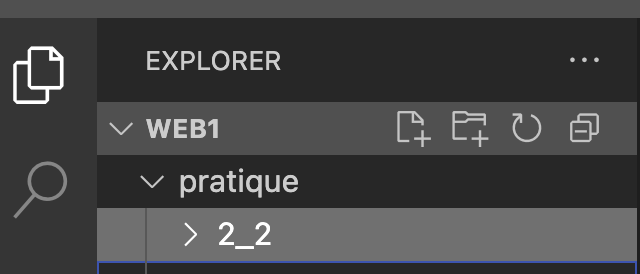
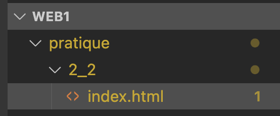
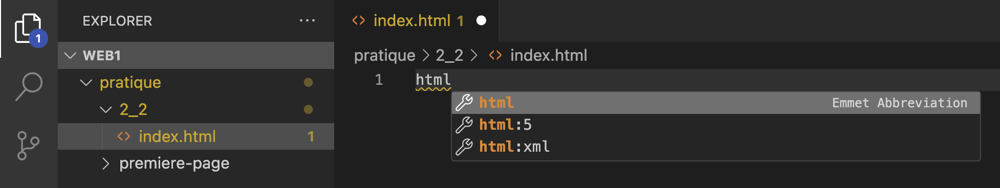

---
---
import chatsHtml from '!!raw-loader!@site/src/playground/s02/texte-chats.html';

# 2-2 Page web simple au format texte

Pour cette activité, **nous allons recréer ensemble la page web de la section précédente**, soit les chats célèbres du Web.

<SandpackPlayground
    template="static"
    editorHeight={600}
    files={{
    '/index.html': `<!DOCTYPE html>
<html lang="en">
<head>
  <meta charset="UTF-8">
  <meta name="viewport" content="width=device-width, initial-scale=1.0">
  <title>Chats célèbres du web</title>
</head>
<body>
    <h1>Chats célèbres du web</h1>
    <h2>Introduction</h2>

    <p>Internet nourrit depuis ses débuts une véritable passion pour les chats: de Grumpy Cat à Maru, en passant par les innombrables <i>GIFs</i> et mèmes, ces félins curieux et attachants règnent en maîtres sur nos écrans. Leur capacité à susciter sourire, étonnement et tendresse fait d’eux les vedettes incontestées du web, attirant chaque jour des millions de clics et de partages à travers le monde.</p>

    <p>Voici une <strong>sélection de chats et de mèmes félins qui ont conquis Internet</strong>.</p>

    <h2>Liste des chats célèbres par popularité</h2>
    <ol>
      <li>Grumpy Cat</li>
      <li>Nyan Cat</li>
      <li>Lil BUB</li>
      <li>Maru</li>
      <li>Keyboard Cat</li>
      <li>Coroner</li>
    </ol>

    <h3>Détails individuels</h3>
    <h4>Grumpy Cat</h4>
    <p>Nom réel: <i>Tardar Sauce</i>. Grumpy Cat est célèbre pour son air constamment bougon et son regard inoubliable.</p>

    <h4>Nyan Cat</h4>
    <p>Un chat pixelisé qui laisse derrière lui un <strong>arc-en-ciel</strong> et un son de pop-tart enjoué</p>

    <h4>Lil BUB</h4>
    <p>Lil BUB a émerveillé le web avec sa langue toujours sortie et ses yeux <em>énormes</em>.</p>

    <h4>Maru</h4>
    <p>Maru est connu pour son obsession des boîtes: petites ou grandes, peu importe, il s'y glisse toujours!</p>

    <h4>Keyboard Cat</h4>
    <p>Un chat-star qui "joue" du clavier, devenant l'un des premiers mèmes video viraux.</p>

    <h4>Coroner</h4>
    <p>Coroner, avec son pelage unique, attire tous les regards et passionne les internautes.</p>

    <h2>Récapitulatif</h2>
    <ul>
      <li>Grumpy Cat et son <strong>expression impassible</strong></li>
      <li>Nyan Cat et sa <strong>fantaisie colorée</strong></li>
      <li>Lil BUB et sa <strong>douceur irrésistible</strong></li>
      <li>Maru et son <strong>talent d'explorateur de boîtes</strong></li>
      <li>Keyboard Cat et son <strong>sens du spectacle</strong></li>
      <li>Coroner et son <strong>style inimitable</strong></li>
    </ul>
</body>
</html>
    `
    }}
/>  

<p></p>

Le but de cette activité est de **découvrir et expérimenter avec les différentes balises permettant d'afficher du contenu textuel** et de **mettre ce dernier en forme** (gras, italique, etc.) dans une page web.

## Créer un fichier `index.html` pour le tutoriel

1. Créez un dossier où vous pourrez déposer le fichier `index.html` associé à cet exercice. Par exemple, j'ai créé le dossier `2_2` (pour section 2-2 des notes de cours) sous mon dossier `pratique` de `web1`.
    
2. Créez un fichier `index.html` sous ce dossier   
    

## Créer la page

1. Dans la zone d'édition de l'éditeur et **à l'intérieur du fichier `index.html`**, tapez `html` afin de faire apparaitre automatiquement le sous-menu suivant:
    

2. Sélectionnez `html:5`
3. Vous devriez avoir ceci:
    ```html
    <!DOCTYPE html>
    <html lang="en">
    <head>
      <meta charset="UTF-8">
      <meta name="viewport" content="width=device-width, initial-scale=1.0">
      <title>Document</title>
    </head>
    <body>
      
    </body>
    </html>
    ```

## Démarrer `Live Preview`

Pour voir automatiquement les changements que vous faites à la page, assurez-vous de démarrer Live Preview.

Pour ce faire, clic droit sur `index.html` puis `Show Preview`). Cela devrait vous afficher l'aperçu de votre page.

Le tout sera blanc pour l'instant, mais au fur et à mesure que vous effectuez des modifications, vous les verrez apparaitre.

## Donner un titre (title) à la page

Ensuite, donnons un titre à la page via la balise `title`:

> Chats célèbres du web

```html
<!DOCTYPE html>
<html lang="en">
<head>
  <meta charset="UTF-8">
  <meta name="viewport" content="width=device-width, initial-scale=1.0">
  //highlight-next-line
  <title>Chats célèbres du web</title>
</head>
<body>
  
</body>
</html>
```

:::info
La balise `title` permet de changer le titre de la page, mais ce dernier n'est pas affiché dans le corps (`body` de cette dernière).

Il est plutôt affiché comme titre de l'onglet dans le navigateur ou encore dans les résultats de recherche sur Google, par exemple.

Dans `Live Preview` (clic droit sur `index.html` puis `Show Preview`), vous verrez que le titre de l'onglet correspond à la balise `title`:


:::

## Corps (`body`) de la page

### Titre et introduction

1. Ajoutons un titre principal à la page. Pour cela, on utilise une balise `h1`.
    > **Titre**: Chats célèbres du web

    ```html
    <body>
        //highlight-next-line
        <h1>Chats célèbres du web</h1>
    </body>
    ```

    :::caution
    Afin d'alléger visuellement, les balises parentes à body (`html`) ne sont pas affichées!

    Seulement la section `body` est montrée.
    :::
2. Ensuite, ajoutons un titre de niveau 2 (sous-titre). Nous utiliserons plusieurs titres de niveau 2 afin de séparer le contenu de la page. Nous commencerons par une brève introduction au contenu de la page.
    > **Sous-titre**: Introduction

    ```html
    <body>
        <h1>Chats célèbres du web</h1>
        //highlight-next-line
        <h2>Introduction</h2>
    </body>
    ```
3. Ensuite, ajoutons un paragraphe d'introduction en utilisant la balise `p`
    > Internet nourrit depuis ses débuts une véritable passion pour les chats: de Grumpy Cat à Maru, en passant par les innombrables GIFs et mèmes, ces félins curieux et attachants règnent en maîtres sur nos écrans. Leur capacité à susciter sourire, étonnement et tendresse fait d’eux les vedettes incontestées du web, attirant chaque jour des millions de clics et de partages à travers le monde.

    ```html
    <body>
        <h1>Chats célèbres du web</h1>
        <h2>Introduction</h2>

        //highlight-next-line
        <p>Internet nourrit depuis ses débuts une véritable passion pour les chats: de Grumpy Cat à Maru, en passant par les innombrables GIFs et mèmes, ces félins curieux et attachants règnent en maîtres sur nos écrans. Leur capacité à susciter sourire, étonnement et tendresse fait d’eux les vedettes incontestées du web, attirant chaque jour des millions de clics et de partages à travers le monde.</p>
    </body>
    ```
4. Ajoutons un deuxième paragraphe afin de séparer la prochaine idée.
    > Voici une sélection de chats et de mèmes félins qui ont conquis Internet.

    ```html
    <body>
        <h1>Chats célèbres du web</h1>
        <h2>Introduction</h2>

        <p>Internet nourrit depuis ses débuts une véritable passion pour les chats: de Grumpy Cat à Maru, en passant par les innombrables GIFs et mèmes, ces félins curieux et attachants règnent en maîtres sur nos écrans. Leur capacité à susciter sourire, étonnement et tendresse fait d’eux les vedettes incontestées du web, attirant chaque jour des millions de clics et de partages à travers le monde.</p>

        //highlight-next-line
        <p>Voici une sélection de chats et de mèmes félins qui ont conquis Internet.</p>
    </body>
    ```

    :::info
    Séparer votre texte en paragraphes permet d'aérer le texte et de rendre la lecture plus facile. Généralement: 1 idée = un paragraphe.
    :::
5. Le tout manque de dynamisme! 😉 Ajoutons quelques balises pour mettre l'emphase sur certains éléments du texte.
   1. Le terme "GIF" pourrait être mis en italique puisqu'il s'agit d'un terme anglophone. On ne veut pas mettre l'emphase nécessaire sur cet élément, alors on privilégierai l'utilisation de `i` à `em`.
        ```html
        <body>
            <h1>Chats célèbres du web</h1>
            <h2>Introduction</h2>

            //highlight-next-line
            <p>Internet nourrit depuis ses débuts une véritable passion pour les chats: de Grumpy Cat à Maru, en passant par les innombrables <i>GIFs</i> et mèmes, ces félins curieux et attachants règnent en maîtres sur nos écrans. Leur capacité à susciter sourire, étonnement et tendresse fait d’eux les vedettes incontestées du web, attirant chaque jour des millions de clics et de partages à travers le monde.</p>

            <p>Voici une sélection de chats et de mèmes félins qui ont conquis Internet.</p>
        </body>
        ```

        :::tip
        Privilégiez `<em>` pour du contenu important. Réservez `<i>` pour du style purement visuel (noms de produits, termes techniques).
        :::

   2. Ensuite, mettons de l'importance avec du gras sur la portion "sélection de chats et de mèmes félins qui ont conquis Internet". Il s'agit vraiment du sujet principal de la page. Nous privilégierons `strong` à `b` puisqu'on veut réellement mettre de l'importance sur cet élément, pas seulement le mettre en gras.
        ```html
        <body>
            <h1>Chats célèbres du web</h1>
            <h2>Introduction</h2>

            <p>Internet nourrit depuis ses débuts une véritable passion pour les chats: de Grumpy Cat à Maru, en passant par les innombrables <i>GIFs</i> et mèmes, ces félins curieux et attachants règnent en maîtres sur nos écrans. Leur capacité à susciter sourire, étonnement et tendresse fait d’eux les vedettes incontestées du web, attirant chaque jour des millions de clics et de partages à travers le monde.</p>

            //highlight-next-line
            <p>Voici une <strong>sélection de chats et de mèmes félins qui ont conquis Internet</strong>.</p>
        </body>
        ```

        :::tip
        Privilégiez `<strong>` pour du contenu important. Réservez `<b>` pour du style purement visuel (noms de produits, termes techniques).
        :::

Vous devriez maintenant avoir ceci:


<SandpackPlayground
    template="static"
    editorHeight={400}
    files={{
    '/index.html': `<!DOCTYPE html>
<html lang="en">
<head>
  <meta charset="UTF-8">
  <meta name="viewport" content="width=device-width, initial-scale=1.0">
  <title>Chats célèbres du web</title>
</head>
<body>
    <h1>Chats célèbres du web</h1>
    <h2>Introduction</h2>

    <p>Internet nourrit depuis ses débuts une véritable passion pour les chats: de Grumpy Cat à Maru, en passant par les innombrables <i>GIFs</i> et mèmes, ces félins curieux et attachants règnent en maîtres sur nos écrans. Leur capacité à susciter sourire, étonnement et tendresse fait d’eux les vedettes incontestées du web, attirant chaque jour des millions de clics et de partages à travers le monde.</p>

    <p>Voici une <strong>sélection de chats et de mèmes félins qui ont conquis Internet</strong>.</p>
</body>
</html>
    `
    }}
/>  

<p></p>

### Liste des chats célèbres

Maintenant, on voudra **ajouter la liste des chats célèbres du web**. Pour ce faire, on utilisera une liste numérotée pour les afficher par ordre de popularité.

1. Ajouter un titre de niveau 2 (`h2`) pour introduire la prochaine section.
    > Liste des chats célèbres par popularité

    ```html
    <body>
        <h1>Chats célèbres du web</h1>
        <h2>Introduction</h2>

        <p>Internet nourrit depuis ses débuts une véritable passion pour les chats: de Grumpy Cat à Maru, en passant par les innombrables <i>GIFs</i> et mèmes, ces félins curieux et attachants règnent en maîtres sur nos écrans. Leur capacité à susciter sourire, étonnement et tendresse fait d’eux les vedettes incontestées du web, attirant chaque jour des millions de clics et de partages à travers le monde.</p>

        <p>Voici une <strong>sélection de chats et de mèmes félins qui ont conquis Internet</strong>.</p>

        //highlight-next-line
        <h2>Liste des chats célèbres par popularité</h2>
    </body>
    ```
2. Puis, pour afficher une liste numérotée, utilisez la balise `ol`
    ```html
        <!-- ... -->

        <h2>Liste des chats célèbres par popularité</h2>
        //highlight-next-line
        <ol></ol>
    </body>
    ```

    :::info
    La balise **`<ol>`** permet de créer une liste numérotée, c'est-à-dire lorsque l’ordre compte (ex.: étapes, classement, chronologie).

    Pour créer la liste, on utilise la balise `<ol>` et sous cette balise, chaque élément doit être contenu dans une balise `<li>` (list item).
    :::

    :::caution
    Pour alléger, je ne répète pas les balises précédentes, d'où le commentaire `<!-- ... -->` qui indique que du HTML est omis dans l'exemple!
    :::
3. Mais rien ne s'affiche! Pour ajouter un élément dans une liste, on utilise toujours `li` (list item). Ajoutons un premier élément à la liste:
    > Grumpy Cat

    ```html
        <!-- ... -->
        
        <h2>Liste des chats célèbres par popularité</h2>
        <ol>
            //highlight-next-line
            <li>Grumpy Cat</li>
        </ol>
    </body>
    ```
4. Vous pouvez compléter la liste avec d'autres chats célèbres en ajoutant une nouvelle entrée `<li>`.
    ```html
        <!-- ... -->

        <h2>Liste des chats célèbres par popularité</h2>
        //highlight-start
        <ol>
            <li>Grumpy Cat</li>
            <li>Nyan Cat</li>
            <li>Lil BUB</li>
            <li>Maru</li>
            <li>Keyboard Cat</li>
            <li>Coroner</li>
        </ol>
        //highlight-end
    </body>
    ```

À cette étape-ci, vous devriez avoir ceci:

<SandpackPlayground
    template="static"
    editorHeight={600}
    files={{
    '/index.html': `<!DOCTYPE html>
<html lang="en">
<head>
  <meta charset="UTF-8">
  <meta name="viewport" content="width=device-width, initial-scale=1.0">
  <title>Chats célèbres du web</title>
</head>
<body>
    <h1>Chats célèbres du web</h1>
    <h2>Introduction</h2>

    <p>Internet nourrit depuis ses débuts une véritable passion pour les chats: de Grumpy Cat à Maru, en passant par les innombrables <i>GIFs</i> et mèmes, ces félins curieux et attachants règnent en maîtres sur nos écrans. Leur capacité à susciter sourire, étonnement et tendresse fait d’eux les vedettes incontestées du web, attirant chaque jour des millions de clics et de partages à travers le monde.</p>

    <p>Voici une <strong>sélection de chats et de mèmes félins qui ont conquis Internet</strong>.</p>

    <h2>Liste des chats célèbres par popularité</h2>
    <ol>
      <li>Grumpy Cat</li>
      <li>Nyan Cat</li>
      <li>Lil BUB</li>
      <li>Maru</li>
      <li>Keyboard Cat</li>
      <li>Coroner</li>
    </ol>
</body>
</html>
    `
    }}
/>  

<p></p>

## Information supplémentaire

Nous voudrons **afficher de l'information supplémentaire pour chaque chat**. Afin de faire cela, il nous faudra un titre de niveau 3 (`h3`) et chaque élément individuel sera sous un titre de niveau 4 (`h4`).

En effet, si nous voulons respecter la hiérarchie de titre, les nouvelles informations sont des enfants du titre "Liste des chats célèbres...". C'est pourquoi on utilisera des titres de niveau 3 et 4.

1. Ajoutez un titre de niveau 3 (`h3`).
    > **Titre:** Détails individuels

    ```html
    <body>
        <h1>Chats célèbres du web</h1>
        <h2>Introduction</h2>

        <p>Internet nourrit depuis ses débuts une véritable passion pour les chats: de Grumpy Cat à Maru, en passant par les innombrables <i>GIFs</i> et mèmes, ces félins curieux et attachants règnent en maîtres sur nos écrans. Leur capacité à susciter sourire, étonnement et tendresse fait d’eux les vedettes incontestées du web, attirant chaque jour des millions de clics et de partages à travers le monde.</p>

        <p>Voici une <strong>sélection de chats et de mèmes félins qui ont conquis Internet</strong>.</p>

        <h2>Liste des chats célèbres par popularité</h2>
        <ol>
            <li>Grumpy Cat</li>
            <li>Nyan Cat</li>
            <li>Lil BUB</li>
            <li>Maru</li>
            <li>Keyboard Cat</li>
            <li>Coroner</li>
        </ol>

        //highlight-next-line
        <h3>Détails individuels</h3>
    </body>
    ```
2. Pour chaque chat, nous allons ajouter un peu d'information supplémentaire. Ainsi, pour chacun d'eux, un titre de niveau 4 (`h4`) peut être ajouté, suivi d'un paragraphe (`p`). Voici, par exemple, pour les trois premiers chats:
    ```html
    <!-- ... -->

    <h3>Détails individuels</h3>
    //highlight-start
    <h4>Grumpy Cat</h4>
    <p>Nom réel: Tardar Sauce. Grumpy Cat est célèbre pour son air constamment bougon et son regard inoubliable.</p>

    <h4>Nyan Cat</h4>
    <p>Un chat pixelisé qui laisse derrière lui un arc-en-ciel et un son de pop-tart enjoué</p>

    <h4>Lil BUB</h4>
    <p>Lil BUB a émerveillé le web avec sa langue toujours sortie et ses yeux énormes.</p>
    //highlight-end

    <!-- ... -->
    ```
3. Ajoutez des éléments pour mettre l'emphase sur certains mots. Par exemple, on pourrait mettre l'emphase (italique avec valeur sémantique) sur `énormes` pour Lil BUB.
    ```html
    <!-- ... -->

    <h3>Détails individuels</h3>
    //highlight-start
    <h4>Grumpy Cat</h4>
    <p>Nom réel: Tardar Sauce. Grumpy Cat est célèbre pour son air constamment bougon et son regard inoubliable.</p>

    <h4>Nyan Cat</h4>
    <p>Un chat pixelisé qui laisse derrière lui un arc-en-ciel et un son de pop-tart enjoué</p>

    <h4>Lil BUB</h4>
    //highlight-next-line
    <p>Lil BUB a émerveillé le web avec sa langue toujours sortie et ses yeux <em>énormes</em>.</p>
    //highlight-end

    <!-- ... -->
    ```

## Liste récapitulative

Finalement, on peut ajouter une liste récapitulative précédée d'un titre `h2` pour la mettre en contexte.

On peut aussi faire utilisation de `strong` ou encore `em` pour mettre l'accent sur les caractéristiques individuelles de chaque chat.

:::info
Pour cette liste, on utilise un `ul` (unordered list) puisqu'il s'agit qu'une liste pour laquelle l'ordre n'a pas d'importance.

Chaque élément est dans une balise `li`, tout comme lorsque vous utilisez `ol`.
:::

```html
<!-- ... -->

<h3>Détails individuels</h3>
<h4>Grumpy Cat</h4>
<p>Nom réel: <i>Tardar Sauce</i>. Grumpy Cat est célèbre pour son air constamment bougon et son regard inoubliable.</p>

<h4>Nyan Cat</h4>
<p>Un chat pixelisé qui laisse derrière lui un <strong>arc-en-ciel</strong> et un son de pop-tart enjoué</p>

<h4>Lil BUB</h4>
<p>Lil BUB a émerveillé le web avec sa langue toujours sortie et ses yeux <em>énormes</em>.</p>

<h4>Maru</h4>
<p>Maru est connu pour son obsession des boîtes: petites ou grandes, peu importe, il s'y glisse toujours!</p>

<h4>Keyboard Cat</h4>
<p>Un chat-star qui "joue" du clavier, devenant l'un des premiers mèmes video viraux.</p>

<h4>Coroner</h4>
<p>Coroner, avec son pelage unique, attire tous les regards et passionne les internautes.</p>

//highlight-start
<h2>Récapitulatif</h2>
<ul>
    <li>Grumpy Cat et son <strong>expression impassible</strong></li>
    <li>Nyan Cat et sa <strong>fantaisie colorée</strong></li>
    <li>Lil BUB et sa <strong>douceur irrésistible</strong></li>
    <li>Maru et son <strong>talent d'explorateur de boîtes</strong></li>
    <li>Keyboard Cat et son <strong>sens du spectacle</strong></li>
    <li>Coroner et son <strong>style inimitable</strong></li>
</ul>
//highlight-end

<!-- ... -->
```

<details>
    <summary>
        Résultat attendu
    </summary>

    <SandpackPlayground
        template="static"
        editorHeight={900}
        files={{
        '/index.html': `<!DOCTYPE html>
    <html lang="en">
    <head>
    <meta charset="UTF-8">
    <meta name="viewport" content="width=device-width, initial-scale=1.0">
    <title>Chats célèbres du web</title>
    </head>
    <body>
        <h1>Chats célèbres du web</h1>
        <h2>Introduction</h2>

        <p>Internet nourrit depuis ses débuts une véritable passion pour les chats: de Grumpy Cat à Maru, en passant par les innombrables <i>GIFs</i> et mèmes, ces félins curieux et attachants règnent en maîtres sur nos écrans. Leur capacité à susciter sourire, étonnement et tendresse fait d’eux les vedettes incontestées du web, attirant chaque jour des millions de clics et de partages à travers le monde.</p>

        <p>Voici une <strong>sélection de chats et de mèmes félins qui ont conquis Internet</strong>.</p>

        <h2>Liste des chats célèbres par popularité</h2>
        <ol>
            <li>Grumpy Cat</li>
            <li>Nyan Cat</li>
            <li>Lil BUB</li>
            <li>Maru</li>
            <li>Keyboard Cat</li>
            <li>Coroner</li>
        </ol>

        <h3>Détails individuels</h3>
        <h4>Grumpy Cat</h4>
        <p>Nom réel: <i>Tardar Sauce</i>. Grumpy Cat est célèbre pour son air constamment bougon et son regard inoubliable.</p>

        <h4>Nyan Cat</h4>
        <p>Un chat pixelisé qui laisse derrière lui un <strong>arc-en-ciel</strong> et un son de pop-tart enjoué</p>

        <h4>Lil BUB</h4>
        <p>Lil BUB a émerveillé le web avec sa langue toujours sortie et ses yeux <em>énormes</em>.</p>

        <h4>Maru</h4>
        <p>Maru est connu pour son obsession des boîtes: petites ou grandes, peu importe, il s'y glisse toujours!</p>

        <h4>Keyboard Cat</h4>
        <p>Un chat-star qui "joue" du clavier, devenant l'un des premiers mèmes video viraux.</p>

        <h4>Coroner</h4>
        <p>Coroner, avec son pelage unique, attire tous les regards et passionne les internautes.</p>

        <h2>Récapitulatif</h2>
        <ul>
            <li>Grumpy Cat et son <strong>expression impassible</strong></li>
            <li>Nyan Cat et sa <strong>fantaisie colorée</strong></li>
            <li>Lil BUB et sa <strong>douceur irrésistible</strong></li>
            <li>Maru et son <strong>talent d'explorateur de boîtes</strong></li>
            <li>Keyboard Cat et son <strong>sens du spectacle</strong></li>
            <li>Coroner et son <strong>style inimitable</strong></li>
        </ul>
    </body>
    </html>
        `
        }}
    />  
</details>