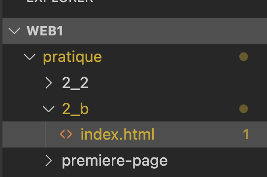

---
---

# 2-B 😈 Boss - La recette de tarte aux pommes de Ginette

:::info Objectif
Appliquer les balises HTML de texte et mise en forme (titres, paragraphes, sauts de ligne, listes, styles, citations, commentaires) sur un contenu déjà défini.
:::

Votre grand-maman vient de vous partager sa précieuse recette de tarte aux pommes écrite à la main. Avec presque deux semaines de cours de Web en vous, vous vous dites qu'il serait bien de mettre cette recette au format HTML afin qu'elle soit plus facile à lire et à consulter dans le futur.

Votre grand-maman est un peu spéciale et aime bien mettre des citations et l'endroit où elle s'approvisionne en produits dans ses recettes!

## Contenu à baliser

Voici le contenu texte que vous aurez à mettre en forme dans une page HTML.

> Recette de la tarte aux pommes de Ginette

> **Présentation**  
> La tarte aux pommes est un **classique** de la pâtisserie, réputée pour son goût *délicieux* et son parfum fruité.  

> **Fournisseur**  
> Metro Plus Drummondville
> 2070, Bd Lemire
> Drummondville, QC
> J0C 1K0

> **Citation**  
> “La tarte aux pommes est la reine des desserts.” – Paul Bocuse  

> **Ingrédients**  
> - 3 pommes  
> - 200 g de farine  
> - 100 g de beurre  
> - 50 g de sucre  
> - 1 pincée de sel  

> **Étapes**  
> 1. Préchauffer le four à 180 °C.  
> 2. Préparer la pâte : mélanger la farine, le sel et le beurre.  
> 3. Garnir le moule et disposer les pommes en rondelles.  
> 4. Saupoudrer de sucre et enfourner 35 minutes.  

## Consignes

1. **Fichier**. Créez-vous un dossier tel que `2_b` avec un fichier `index.html` à l'intérieur.
  
  
2. **Titres**  
   - `<h1>` pour "Recette de la tarte aux pommes de Ginette".  
   - `<h2>` pour chaque section: Présentation, Fournisseur, Citation, Ingrédients, Étapes.  

3. **Paragraphes**  
   - Utilisez un paragraphe pour présenter la tarte (dans la section présentation).  
   - Utilisez un paragraphe pour l'adresse
   - Utilisez un paragraphe pour la citation

4. **Sauts de ligne** 
   - Pour l’adresse du fournisseur, utilisez un saut de ligne entre chaque ligne (courts fragments).  

5. **Listes**  
   - Liste points de forme pour la liste des ingrédients.  
   - Liste numérotée pour la suite des étapes.  

6. **Styles de texte**  
   - Mettez en **gras** le mot "classique".  
   - Mettez en *italique* le mot "délicieux".  

7. **Citation**  
   - Mettez la citation de Paul Bocuse en italique.  

8. **Commentaires**  
   - Commentez au moins une section avec `<!-- ... -->` pour expliquer votre choix de balise ou de structure.  

## Résultat attendu

<BrowserWindow url="index.html">
  <h1>Recette de la tarte aux pommes de Ginette</h1>

  <h2>Présentation</h2> 
  
La tarte aux pommes est un <strong>classique</strong> de la pâtisserie, réputée pour son goût <em>délicieux</em> et son parfum fruité.

  <h2>Fournisseur</h2>
  
Metro Plus Drummondville 
    2070, Bd Lemire 
    Drummondville, QC 
    J0C 1K0

  <h2>Citation</h2>
  
<em>“La tarte aux pommes est la reine des desserts.” – Paul Bocuse</em>

  
  <h2>Ingrédients</h2>
  <ul>
    <li>3 pommes</li>
    <li>200 g de farine</li>
    <li>100 g de beurre</li>
    <li>50 g de sucre</li>
    <li>1 pincée de sel</li>
  </ul>

  <h2>Étapes</h2>
  <!-- Liste ordonnée -->
  <ol>
    <li>Préchauffer le four à 180 °C.</li>
    <li>Préparer la pâte : mélanger la farine, le sel et le beurre.</li>
    <li>Garnir le moule et disposer les pommes en rondelles.</li>
    <li>Saupoudrer de sucre et enfourner 35 minutes.</li>
  </ol>
</BrowserWindow>

 

    Cheat Code (solution) 
 

  <SandpackPlayground
      template="static"
      editorHeight={900}
      files={{
      '/index.html': `<!DOCTYPE html>
<html lang="fr">
<head>
  <meta charset="UTF-8">
  <meta name="viewport" content="width=device-width, initial-scale=1.0">
  <title>Recette de la tarte aux prommes de Ginette</title>
</head>
<body>
  <h1>Recette de la tarte aux pommes de Ginette</h1>

  <h2>Présentation</h2> 
  
La tarte aux pommes est un <strong>classique</strong> de la pâtisserie, réputée pour son goût <em>délicieux</em> et son parfum fruité.

  <h2>Fournisseur</h2>
  
Metro Plus Drummondville 
    2070, Bd Lemire 
    Drummondville, QC 
    J0C 1K0
  

  <h2>Citation</h2>
  
<em>“La tarte aux pommes est la reine des desserts.” – Paul Bocuse</em>

  
  <h2>Ingrédients</h2>
  <ul>
    <li>3 pommes</li>
    <li>200 g de farine</li>
    <li>100 g de beurre</li>
    <li>50 g de sucre</li>
    <li>1 pincée de sel</li>
  </ul>

  <!-- Étapes avec liste ordonnée -->
  <h2>Étapes</h2>
  <ol>
    <li>Préchauffer le four à 180 °C.</li>
    <li>Préparer la pâte : mélanger la farine, le sel et le beurre.</li>
    <li>Garnir le moule et disposer les pommes en rondelles.</li>
    <li>Saupoudrer de sucre et enfourner 35 minutes.</li>
  </ol>
</body>
</html>`
      }}
  />  
 
