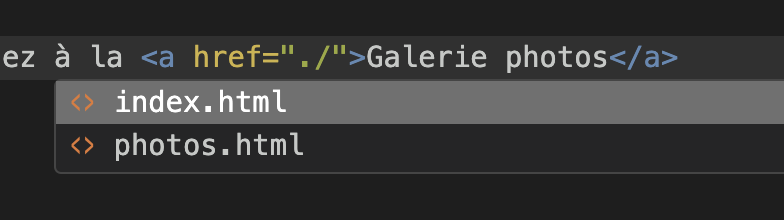
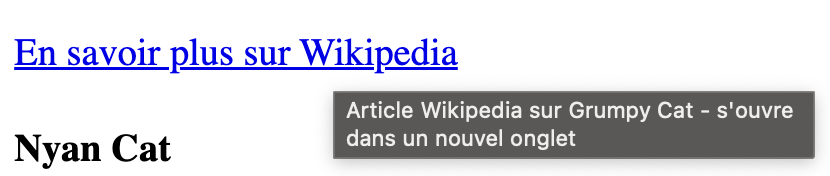

---
---

# 📚 Les liens

Un lien hypertexte (hyperlien) permet de naviguer d’une ressource à une autre (page, section, fichier, URL externe). En HTML, tout lien se définit avec la balise `<a>` et l’attribut `href`.

## La balise `<a>`

On peut faire un lien à l'aide de la balise `<a>` de cette façon:

```html
<a href="destination">Texte du lien</a>
```
* `<a>`: ouvre la balise d’ancrage (anchor).
* href: URL ou chemin cible.
* Contenu (texte ou image) sert de zone cliquable.

Par exemple, pour faire un lien vers la page Wikipedia de Grumpy Cat, le lien serait:

```html
<a href="https://en.wikipedia.org/wiki/Grumpy_Cat">Grumpy Cat</a>
```

Ce qui donnerait dans le navigateur:

<BrowserWindow url="index.html">
  <a href="https://en.wikipedia.org/wiki/Grumpy_Cat">Grumpy Cat</a>
</BrowserWindow>

:::info
* Le texte du lien (`Grumpy Cat`) doit être affiché entre les balises
* L'attribut `href` définit l'adresse vers où le lien pointe
:::

:::tip
Un lien doit être descriptif! Évitez les `cliquez ici` variations du genre.
:::

## Insérer un lien dans du texte

Il se peut que nous affichions un lien seul, sans texte autour, comme dans un menu de navigation, mais les liens se retrouvent souvent au travers de blocs de texte.

Par exemple, si on voulait plutôt afficher ceci:

<BrowserWindow url="index.html">
  <p>
    Consultez la <a href="https://en.wikipedia.org/wiki/Grumpy_Cat">page Wikipédia de Grumpy Cat</a> pour en apprendre plus sur ce chat légendaire.
  </p>
</BrowserWindow>

Il ne suffit que d'insérer la balise `a` à l'intérieur d'un paragraphe:

```html
<p>
  Consultez la <a href="https://en.wikipedia.org/wiki/Grumpy_Cat">page Wikipedia de Grumpy Cat</a> pour en apprendre plus sur ce chat légendaire.
</p>
```

## Liens externes

Ce que nous venons de décrire est un lien externe: il pointe vers un site externe à celui consulté. Dans les exemples précédents, le lien pointait vers Wikipédia, un site externe:

```html
<p>
  Consultez la <a href="https://en.wikipedia.org/wiki/Grumpy_Cat">page Wikipedia de Grumpy Cat</a> pour en apprendre plus sur ce chat légendaire.
</p>
```

## Liens internes

Il est possible de faire un lien vers **un endroit spécifique de la page consultée** ou encore vers une autre page **du site consulté**.

### Même page (ancre)

Lorsqu'on veut faire un lien vers une section de la même page, on utilise ce qu'on appelle une ancre.

Par exemple, précédemment, dans la page sur les chats célèbres, une liste des chats est présente dans le haut de la page, un peu comme une table des matières.

<SandpackPlayground
    template="static"
    editorHeight={400}
    files={{
    '/index.html': `<h1>Chats célèbres du web</h1>

  <h2>Liste des chats célèbres par popularité</h2>
  <ol>
    <li>Grumpy Cat</li>
    <li>Nyan Cat</li>
    <li>Lil BUB</li>
    <li>Maru</li>
    <li>Keyboard Cat</li>
    <li>Coroner</li>
  </ol>

  <h3>Détails individuels</h3>
  <h4>Grumpy Cat</h4>
  <p>Nom réel: <i>Tardar Sauce</i>. Grumpy Cat est célèbre pour son air constamment bougon et son regard inoubliable.</p>

  <h4>Nyan Cat</h4>
  <p>Un chat pixelisé qui laisse derrière lui un <strong>arc-en-ciel</strong> et un son de pop-tart enjoué</p>

  <h4>Lil BUB</h4>
  <p>Lil BUB a émerveillé le web avec sa langue toujours sortie et ses yeux <em>énormes</em>.</p>

  <h4>Maru</h4>
  <p>Maru est connu pour son obsession des boîtes: petites ou grandes, peu importe, il s'y glisse toujours!</p>

  <h4>Keyboard Cat</h4>
  <p>Un chat-star qui "joue" du clavier, devenant l'un des premiers mèmes video viraux.</p>

  <h4>Coroner</h4>
  <p>Coroner, avec son pelage unique, attire tous les regards et passionne les internautes.</p>
    `
    }}
/>

<p></p>

Il serait intéressant de cliquer sur chaque nom dans la liste et diriger l'utilisateur à la bonne section. Pour cela, il suffit de:

1. Assigner un identifiant à un élément HTML (l'élément cible) via l'attribut `id`.
    ```html
    <h4 id="keyboard-cat">Keyboard Cat</h4>
    ```
1. Faire référence à cet élément dans la balise `href` en utilisant l'identifiant, précédé du symbole `#`
    ```html
    <li><a href="#keyboard-card">Keyboard Cat</a></li>
    ```

Par exemple, pour l'exemple des chats célèbres, voici une sorte de table des matières utilisant des ancres pour faire des liens vers les sous-sections.

**Essayez de cliquer sur les liens pour voir le comportement!**.

<SandpackPlayground
    template="static"
    editorHeight={400}
    files={{
    '/index.html': `<h1>Chats célèbres du web</h1>

  <h2>Liste des chats célèbres par popularité</h2>
  <ol>
    <li><a href="#grumpy-cat">Grumpy Cat</a></li>
    <li><a href="#nyan-cat">Nyan Cat</a></li>
    <li><a href="#lil-bub">Lil BUB</a></li>
    <li><a href="#maru">Maru</a></li>
    <li><a href="#keyboard-cat">Keyboard Cat</a></li>
    <li><a href="#coroner">Coroner</a></li>
  </ol>

  <h3>Détails individuels</h3>
  <h4 id="grumpy-cat">Grumpy Cat</h4>
  <p>Nom réel: <i>Tardar Sauce</i>. Grumpy Cat est célèbre pour son air constamment bougon et son regard inoubliable.</p>

  <h4 id="nyan-cat">Nyan Cat</h4>
  <p>Un chat pixelisé qui laisse derrière lui un <strong>arc-en-ciel</strong> et un son de pop-tart enjoué</p>

  <h4 id="lil-bub">Lil BUB</h4>
  <p>Lil BUB a émerveillé le web avec sa langue toujours sortie et ses yeux <em>énormes</em>.</p>

  <h4 id="maru">Maru</h4>
  <p>Maru est connu pour son obsession des boîtes: petites ou grandes, peu importe, il s'y glisse toujours!</p>

  <h4 id="keyboard-cat">Keyboard Cat</h4>
  <p>Un chat-star qui "joue" du clavier, devenant l'un des premiers mèmes video viraux.</p>

  <h4 id="coroner">Coroner</h4>
  <p>Coroner, avec son pelage unique, attire tous les regards et passionne les internautes.</p>
    `
    }}
/>

### L'attribut `id`

En HTML, l’attribut `id` permet d’identifier de façon **unique** un élément dans une page.

Dans le contexte des liens, on utilise souvent `id` pour créer des **ancres**: cliquer sur un lien fait défiler la page jusqu’à l’élément correspondant.

Quelques règles importantes pour les `id`:

- Unicité: Une valeur d'id ne doit apparaître qu’une seule fois par page HTML.
- Format: Commence par une lettre, puis lettres, chiffres, tirets (-), underscores (_), deux-points (:) ou points (.). Aucun espace.
- Casse: écrire les id en **minuscule**

:::tip
Nommez vos id de façon descriptive (ex.: `introduction`, `contact-for`m, `section-tarif`) pour que vos liens internes soient clairs et maintenables.
:::

### Lien vers une autre page

Pour faire un lien vers une autre page... il faut au moins deux pages!

Imaginons que nous ayons deux pages:
- `index.html` (l'accueil du site)
- `grumpy-cat.html` (page présentant plus d'informations sur Grumpy cat)

**Remarquez des deux onglets dans l'exemple ci-bas pour voir le contenu de chacune des pages.**

<SandpackPlayground
    template="static"
    editorHeight={600}
    files={{
    '/index.html': `<h1>Chats célèbres du web</h1>

  <h2>Liste des chats célèbres par popularité</h2>
  <ol>
    <li><a href="#grumpy-cat">Grumpy Cat</a></li>
    <li><a href="#nyan-cat">Nyan Cat</a></li>
    <li><a href="#lil-bub">Lil BUB</a></li>
    <li><a href="#maru">Maru</a></li>
    <li><a href="#keyboard-cat">Keyboard Cat</a></li>
    <li><a href="#coroner">Coroner</a></li>
  </ol>

  <h3>Détails individuels</h3>
  <h4 id="grumpy-cat">Grumpy Cat</h4>
  <p>Nom réel: <i>Tardar Sauce</i>. Grumpy Cat est célèbre pour son air constamment bougon et son regard inoubliable.</p>

  <h4 id="nyan-cat">Nyan Cat</h4>
  <p>Un chat pixelisé qui laisse derrière lui un <strong>arc-en-ciel</strong> et un son de pop-tart enjoué</p>

  <h4 id="lil-bub">Lil BUB</h4>
  <p>Lil BUB a émerveillé le web avec sa langue toujours sortie et ses yeux <em>énormes</em>.</p>

  <h4 id="maru">Maru</h4>
  <p>Maru est connu pour son obsession des boîtes: petites ou grandes, peu importe, il s'y glisse toujours!</p>

  <h4 id="keyboard-cat">Keyboard Cat</h4>
  <p>Un chat-star qui "joue" du clavier, devenant l'un des premiers mèmes video viraux.</p>

  <h4 id="coroner">Coroner</h4>
  <p>Coroner, avec son pelage unique, attire tous les regards et passionne les internautes.</p>
    `,
    'grumpy-cat.html': `<h1>Grumpy Cat</h1>
<p>Page avec plus d'informations sur Grumpy Cat</p>
    `
    }}
/>

<p></p>

Pour faire un lien, **on mentionne le nom du fichier html à charger**, en utilisant un **chemin relatif**.

```html
//highlight-next-line
<a href="./grumpy-cat.html">Plus d'information sur Grumpy Cat</a>
```

Remarquez le lien ajouté ici et cliquez sur ce dernier. Vous serez redirigé vers la page de Grumpy Cat, soit `grumpy-cat.html`!

<SandpackPlayground
    template="static"
    editorHeight={300}
    files={{
    '/index.html': `<h3>Détails individuels</h3>
  <h4 id="grumpy-cat">Grumpy Cat</h4>
  <p>Nom réel: <i>Tardar Sauce</i>. Grumpy Cat est célèbre pour son air constamment bougon et son regard inoubliable.</p>
  <p><a href="./grumpy-cat.html">Plus d'information sur Grumpy Cat</a></p>
    `,
    'grumpy-cat.html': `<h1>Grumpy Cat</h1>
<p>Page avec plus d'informations sur Grumpy Cat</p>
    `
    }}
/>

### Chemins relatifs

Lorsque vous créez des liens vers d'autres pages de votre site, vous utilisez des **chemins relatifs**. Ces chemins indiquent où se trouve le fichier **par rapport à la page actuelle**. C'est pourquoi on les appelle relatifs: ils sont relatifs par rapport à la page actuelle.

#### Structure d'exemple
Imaginons cette structure de dossiers :
```
mon-site/
├── index.html
├── contact.html
└── pages/
    ├── about.html
    └── blog/
        └── article1.html
```

#### Les différentes syntaxes

##### `./page.html` (avec `./`)

Par exemple, imaginez le lien relatif suivant débutant par un `./`:

```html title="index.html"
<a href="./contact.html">Contact</a>
```

Le fichier doit être trouvé dans le **dossier courant**. C'est ce que le `./` communique comme information.

Par exemple, si nous sommes dans `index.html`, ce lien communique: va chercher la page `contact.html` qui est dans le même dossier que moi-même (`index.html`).

:::tip
Le `./` est optionnel. En effet les deux formulations suivantes sont équivalentes:

```html title="index.html"
<a href="./contact.html">Contact</a>
```

```html title="index.html"
<a href="contact.html">Contact</a>
```

**Bonne pratique:** Utilisez `./` pour être explicite sur le fait que vous référencez le dossier courant. Cela rend votre code plus lisible et évite les confusions.

VS Code est là pour vous aider! Du moment que vous entrez `./` dans l'attribut `href`, un menu contextuel apparaitra, vous permettant de choisir vers quelle page faire le lien.


:::


##### `../page.html` (avec `../`)

Par exemple, imaginez le lien relatif suivant débutant par `../`:

```html
<a href="../contact.html">Contact</a>
```

Le fichier doit être trouvé dans le **dossier parent**. C'est ce que le `../` communique comme information.

Par exemple, si nous sommes dans `pages/about.html`, ce lien communique: va chercher la page `contact.html` qui est dans le dossier parent à moi (`about.html`).

## L'attribut `target` - Contrôler l'ouverture des liens

L'attribut `target` dans la balise `<a>` détermine **où** le lien va s'ouvrir lorsque l'utilisateur clique sur ce dernier.

### Syntaxe de base
```html
<a href="https://google.com" target="_blank">Rechercher sur Google</a>
```

### Valeurs principales

#### `target="_self"` (par défaut)
- Le lien s'ouvre dans la même fenêtre/onglet
- Comportement normal, pas besoin de l'écrire

```html
<a href="page2.html">Aller à la page 2</a>
<!-- Équivaut à : <a href="page2.html" target="_self"> -->
```

#### `target="_blank"`
- Le lien s'ouvre dans un **nouvel onglet** ou nouvelle fenêtre
- **Très utile** pour les liens externes
```html
<a href="https://google.com" target="_blank">Rechercher sur Google</a>
```

### Quand utiliser `target="_blank"`?
- ✅ **Liens externes** (vers d'autres sites web)
- ✅ **Documents téléchargeables** (PDF ou autres)

- ❌ **Navigation interne** de votre site (gardez `_self`)

## L'attribut `title` - Information supplémentaire au survol

L'attribut `title` **affiche une infobulle** quand l'utilisateur survole le lien avec sa souris.



### Syntaxe
```html
<a href="contact.html" title="Nous écrire un message">Contact</a>
```

### Exemples pratiques

#### Clarifier un lien court
```html
<a href="cv.pdf" title="Télécharger mon CV en PDF">Mon CV</a>
```

#### Donner plus de contexte
```html
<a href="https://github.com/monprofil" title="Voir mes projets de programmation" target="_blank">GitHub</a>
```

### Bonnes pratiques pour `title`
- ✅ **Court et informatif** (une phrase maximum)
- ✅ **Ajoute de la valeur** au texte du lien (ne pas répéter le même texte!)
- ✅ **Décrit la destination** ou l'action

- ❌ Ne pas répéter exactement le texte du lien
- ❌ Éviter les textes trop longs

:::tip
Ces attributs améliorent l'**expérience utilisateur** en donnant plus de contrôle et d'information sur ce qui se passera en cliquant sur le lien.
:::

## Liens vers des courriels ou numéros de téléphone

### Lien courriel `mailto`

Il est possible de faire un lien vers un courriel avec l'attribut `mailto`:

```html
<a href="mailto:contact@exemple.com">Nous écrire</a>
```

Cliquer sur le lien ouvrira l'application courriel par défaut de l'utilisateur.

### Lien téléphone `tel`

De façon similaire au courriel, il est possible de faire un lien vers un numéro de téléphone:

```html
<a href="tel:+1-555-123-4567">Appeler</a>
```

Appuyer sur le lien demandera une confirmation à l'utilisateur pour appeler le numéro.

## Récapitulatif des liens

- Lien interne avec ancre: `<a href="#section-id">Texte</a>`
- Lien interne relatif: `<a href="./page.html">Lien vers page.html dans le même dossier</a>`
- Lien externe simple: `<a href="https://exemple.com">Texte</a>`
- Lien externe nouvel onglet: `<a href="https://exemple.com" target="_blank">Texte</a>`
- Lien avec infobulle: `<a href="https://exemple.com" title="Description">Texte</a>`
- Lien complet: `<a href="https://exemple.com" target="_blank" title="Description - s'ouvre dans un nouvel onglet">Texte</a>`