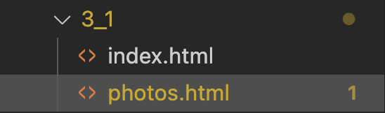

---
---

# 3-1 Ajouter des liens à une page Web

Pour ce qui suit, nous utiliserons comme base le résultat du tutoriel précédent sur les chats célèbres du Web.

Vous pouvez **réutiliser comme base** le contenu HTML suivant. Créez un dossier pour le tutoriel et **créez un fichier index.html** avec le contenu suivant (**vous pouvez copier-coller!**):

```html
<!DOCTYPE html>
<html lang="en">
<head>
    <meta charset="UTF-8">
    <meta name="viewport" content="width=device-width, initial-scale=1.0">
    <title>Chats célèbres du web</title>
</head>
<body>
    <h1>Chats célèbres du web</h1>
    <h2>Introduction</h2>

    <p>Internet nourrit depuis ses débuts une véritable passion pour les chats: de Grumpy Cat à Maru, en passant par les innombrables <i>GIFs</i> et mèmes, ces félins curieux et attachants règnent en maîtres sur nos écrans. Leur capacité à susciter sourire, étonnement et tendresse fait d’eux les vedettes incontestées du web, attirant chaque jour des millions de clics et de partages à travers le monde.</p>

    <p>Voici une <strong>sélection de chats et de mèmes félins qui ont conquis Internet</strong>.</p>

    <h2>Liste des chats célèbres par popularité</h2>
    <ol>
        <li>Grumpy Cat</li>
        <li>Nyan Cat</li>
        <li>Lil BUB</li>
        <li>Maru</li>
        <li>Keyboard Cat</li>
        <li>Coroner</li>
    </ol>

    <h3>Détails individuels</h3>
    <h4>Grumpy Cat</h4>
    <p>Nom réel: <i>Tardar Sauce</i>. Grumpy Cat est célèbre pour son air constamment bougon et son regard inoubliable.</p>

    <h4>Nyan Cat</h4>
    <p>Un chat pixelisé qui laisse derrière lui un <strong>arc-en-ciel</strong> et un son de pop-tart enjoué</p>

    <h4>Lil BUB</h4>
    <p>Lil BUB a émerveillé le web avec sa langue toujours sortie et ses yeux <em>énormes</em>.</p>

    <h4>Maru</h4>
    <p>Maru est connu pour son obsession des boîtes: petites ou grandes, peu importe, il s'y glisse toujours!</p>

    <h4>Keyboard Cat</h4>
    <p>Un chat-star qui "joue" du clavier, devenant l'un des premiers mèmes video viraux.</p>

    <h4>Coroner</h4>
    <p>Coroner, avec son pelage unique, attire tous les regards et passionne les internautes.</p>

    <h2>Récapitulatif</h2>
    <ul>
        <li>Grumpy Cat et son <strong>expression impassible</strong></li>
        <li>Nyan Cat et sa <strong>fantaisie colorée</strong></li>
        <li>Lil BUB et sa <strong>douceur irrésistible</strong></li>
        <li>Maru et son <strong>talent d'explorateur de boîtes</strong></li>
        <li>Keyboard Cat et son <strong>sens du spectacle</strong></li>
        <li>Coroner et son <strong>style inimitable</strong></li>
    </ul>
</body>
</html>
```

## Ajouter des liens internes avec ancres

Premièrement, nous voudrons construire une sorte de table des matières à partir de la liste de chats dans le haut de la page: cliquer sur un élément devrait diriger l'utilisateur vers la bonne section dans la page.

Pour cela, les liens de type `ancre` sont tout désignés! Il nous faudra:
- Assigner des attributs `id` aux sections vers laquelle nous voulons naviguer
- Ajouter des liens à l'aide de la base `a` pointant vers ces sections

1. Ajouter des IDs aux sections cibles afin de pouvoir y référer via la "table des matières" dans le haut de la page. **Ajoutez un attribut `id` à chaque titre h4**:
    ```html
    <!-- ... -->

    <h4 id="grumpy-cat">Grumpy Cat</h4>
    <h4 id="nyan-cat">Nyan Cat</h4>
    <h4 id="lil-bub">Lil BUB</h4>
    <h4 id="maru">Maru</h4>
    <h4 id="keyboard-cat">Keyboard Cat</h4>
    <h4 id="coroner">Coroner</h4>

    <!-- ... -->
    ```
2. Transformer la liste en liens de type "ancre". Ajoutez un lien vers la bonne section (le `id`) pour chaque chat de la liste dans le haut de la page.
    ```html
    <ol>
        <li><a href="#grumpy-cat">Grumpy Cat</a></li>
        <li><a href="#nyan-cat">Nyan Cat</a></li>
        <li><a href="#lil-bub">Lil BUB</a></li>
        <li><a href="#maru">Maru</a></li>
        <li><a href="#keyboard-cat">Keyboard Cat</a></li>
        <li><a href="#coroner">Coroner</a></li>
    </ol>
    ```

    :::info
    Le symbole `#` dans l'attribut `href` veut dire qu'on veut naviguer vers un élément précis dans la page identifiée par un `id` correspondant à celui suivant le `#`.
    :::

:::tip Test!
Testez les liens. Cliquer sur un lien devrait vous mener vers la bonne section dans la page.
:::

## Ajouter des liens externes (ex.: Wikipedia)

1. Ajouter des liens Wikipédia à chaque section. Pour chaque chat, ajoutez un lien externe vers la page Wikipédia de ce dernier, dans un paragraphe.
    Pour **Grumpy Cat**:
    ```html
    <h4 id="grumpy-cat">Grumpy Cat</h4>
    <p>Nom réel: <i>Tardar Sauce</i>. Grumpy Cat est célèbre pour son air constamment bougon et son regard inoubliable.</p>
    //highlight-start
    <p>
        <a href="https://fr.wikipedia.org/wiki/Grumpy_Cat">En savoir plus sur Wikipedia</a>
    </p>
    //highlight-end
    ```

    Pour **Nyan Cat**:
    ```html
    <h4 id="nyan-cat">Nyan Cat</h4>
    <p>Un chat pixelisé qui laisse derrière lui un <strong>arc-en-ciel</strong> et un son de pop-tart enjoué</p>
    //highlight-start
    <p>
        <a href="https://fr.wikipedia.org/wiki/Nyan_Cat">En savoir plus sur Wikipedia</a>
    </p>
    //highlight-end
    ```

    ... et refaire le même processus pour chaque chat.

## Attributs target et title

- L'attribut `target` permet de contrôler comment le lien se comporte (ouvrir dans un nouvel onglet ou rester sur la page actuelle.)
- L'attribut `title`, pour sa part, permet d'ajouter du contexte à un lien: une infobulle sera affichée lorsque l'utilisateur survole le lien.

### Exemple avec target="_blank"
Pour ouvrir le lien dans un nouvel onglet, ajoutez l'attribut `target="_blank"` à ce dernier:

```html
<a href="https://fr.wikipedia.org/wiki/Grumpy_Cat" target="_blank">En savoir plus sur Wikipedia</a>
```

### Exemple avec l'attribut title
Pour afficher une infobulle au survol, ajoutez l'attribut `title`:

```html
<a href="https://fr.wikipedia.org/wiki/Grumpy_Cat" title="Article Wikipedia sur Grumpy Cat">En savoir plus sur Wikipedia</a>
```

### Exemple complet avec target et title
```html
<a href="https://fr.wikipedia.org/wiki/Grumpy_Cat" target="_blank" title="Article Wikipedia sur Grumpy Cat - s'ouvre dans un nouvel onglet">En savoir plus sur Wikipedia</a>
```

## Ajouter un lien vers une autre page (ex.: Galerie photo)

**Nous allons ajouter une nouvelle page au site**, soit **une page de galerie photo**!

C'est la première fois que vous créerez une deuxième page. L'objectif et de faire un lien de la page d'accueil (`index.html`) vers cette nouvelle page.

1. **Dans le même dossier que le fichier `index.html`**, créez une page `photos.html`. Cette page devrait être au même niveau que `index.html`, de cette façon:
    
2. Mettez dans ce nouveau fichier une structure de page de base pour une page de galerie photo.
    ```html
    <!DOCTYPE html>
    <html lang="fr">
    <head>
        <meta charset="UTF-8">
        <meta name="viewport" content="width=device-width, initial-scale=1.0">
        <title>Galerie photos</title>
    </head>
    <body>
        <h1>Galerie photos</h1>
        <p>Photos et images des chats les plus célèbres du web.</p>
    </body>
    </html>
    ```
3. Nous allons maintenant faire un **lien relatif** de `index.html` vers `photos.html`.
    Pour faire un lien relatif:
        - Utiliser la balise `a` normalement
        - Dans l'attribut `href`, écrire le fichier vers lequel pointer (`photos.html`)
        - Précéder le nom du fichier par `./` pour clarifier qu'il se trouve dans le même dossier que le fichier courant (le fichier courant est `index.html` ici)
        - Le texte à mettre en lien se retrouve à l'intérieur de l'élément `<a></a>`

    ```html title="index.html"
    <!-- ... -->

    <h2>Récapitulatif</h2>
    <ul>
        <li>Grumpy Cat et son <strong>expression impassible</strong></li>
        <li>Nyan Cat et sa <strong>fantaisie colorée</strong></li>
        <li>Lil BUB et sa <strong>douceur irrésistible</strong></li>
        <li>Maru et son <strong>talent d'explorateur de boîtes</strong></li>
        <li>Keyboard Cat et son <strong>sens du spectacle</strong></li>
        <li>Coroner et son <strong>style inimitable</strong></li>
    </ul>

    //highlight-start
    <h2>Galerie Photos</h2>
    <p>
        Pour une tonne de photos sur vos chats favoris, accédez à la <a href="./photos.html">Galerie photos</a>
    </p>
    //highlight-end

    <!-- ... -->
    ```

    :::info
    Il s'agit d'un lien relatif puisque `./` signifie le dossier du fichier courant. Le lien est donc relatif au dossier contenant `index.html`.
    :::

    :::tip
    VS Code est là pour vous aider! Du moment que vous entrez `./` dans l'attribut `href`, un menu contextuel apparaitra, vous permettant de choisir vers quelle page faire le lien.

    
    :::
4. Peut-être avez-vous remarqué qu'on ne peut revenir en arrière (sauf avec le bouton "retour"). **Ajoutons un lien de retour vers l'index dans la page de photos**.
    ```html title="photos.html"
    <!DOCTYPE html>
    <html lang="fr">
    <head>
        <meta charset="UTF-8">
        <meta name="viewport" content="width=device-width, initial-scale=1.0">
        <title>Galerie photos</title>
    </head>
    <body>
        //highlight-next-line
        <a href="./index.html">Retour à l'accueil</a>
        <h1>Galerie photos</h1>
        <p>Photos et images des chats les plus célèbres du web.</p>
    </body>
    </html>
    ```

## Récapitulatif des liens

- Lien interne avec ancre: `<a href="#section-id">Texte</a>`
- Lien interne relatif: `<a href="./page.html">Lien vers page.html dans le même dossier</a>`
- Lien externe simple: `<a href="https://exemple.com">Texte</a>`
- Lien externe nouvel onglet: `<a href="https://exemple.com" target="_blank">Texte</a>`
- Lien avec infobulle: `<a href="https://exemple.com" title="Description">Texte</a>`
- Lien complet: `<a href="https://exemple.com" target="_blank" title="Description - s'ouvre dans un nouvel onglet">Texte</a>`

## Résultat final

```html title="index.html"
<!DOCTYPE html>
<html lang="en">
<head>
  <meta charset="UTF-8">
  <meta name="viewport" content="width=device-width, initial-scale=1.0">
  <title>Chats célèbres du web</title>
</head>
<body>
    <h1>Chats célèbres du web</h1>
    <h2>Introduction</h2>

    <p>Internet nourrit depuis ses débuts une véritable passion pour les chats: de Grumpy Cat à Maru, en passant par les innombrables <i>GIFs</i> et mèmes, ces félins curieux et attachants règnent en maîtres sur nos écrans. Leur capacité à susciter sourire, étonnement et tendresse fait d'eux les vedettes incontestées du web, attirant chaque jour des millions de clics et de partages à travers le monde.</p>

    <p>Voici une <strong>sélection de chats et de mèmes félins qui ont conquis Internet</strong>.</p>

    <h2>Liste des chats célèbres par popularité</h2>
    <ol>
      <li><a href="#grumpy-cat">Grumpy Cat</a></li>
      <li><a href="#nyan-cat">Nyan Cat</a></li>
      <li><a href="#lil-bub">Lil BUB</a></li>
      <li><a href="#maru">Maru</a></li>
      <li><a href="#keyboard-cat">Keyboard Cat</a></li>
      <li><a href="#coroner">Coroner</a></li>
    </ol>

    <h3>Détails individuels</h3>
    <h4 id="grumpy-cat">Grumpy Cat</h4>
    <p>Nom réel: <i>Tardar Sauce</i>. Grumpy Cat est célèbre pour son air constamment bougon et son regard inoubliable.</p>
    <p>
        <a href="https://fr.wikipedia.org/wiki/Grumpy_Cat" target="_blank" title="Article Wikipedia sur Grumpy Cat - s'ouvre dans un nouvel onglet">En savoir plus sur Wikipedia</a>
    </p>

    <h4 id="nyan-cat">Nyan Cat</h4>
    <p>Un chat pixelisé qui laisse derrière lui un <strong>arc-en-ciel</strong> et un son de pop-tart enjoué</p>
    <p>
        <a href="https://fr.wikipedia.org/wiki/Nyan_Cat" target="_blank" title="Article Wikipedia sur Nyan Cat - s'ouvre dans un nouvel onglet">En savoir plus sur Wikipedia</a>
    </p>

    <h4 id="lil-bub">Lil BUB</h4>
    <p>Lil BUB a émerveillé le web avec sa langue toujours sortie et ses yeux <em>énormes</em>.</p>
    <p>
        <a href="https://fr.wikipedia.org/wiki/Lil_Bub" target="_blank" title="Article Wikipedia sur Lil BUB - s'ouvre dans un nouvel onglet">En savoir plus sur Wikipedia</a>
    </p>

    <h4 id="maru">Maru</h4>
    <p>Maru est connu pour son obsession des boîtes: petites ou grandes, peu importe, il s'y glisse toujours!</p>
    <p>
        <a href="https://fr.wikipedia.org/wiki/Maru_(chat)" target="_blank" title="Article Wikipedia sur Maru - s'ouvre dans un nouvel onglet">En savoir plus sur Wikipedia</a>
    </p>

    <h4 id="keyboard-cat">Keyboard Cat</h4>
    <p>Un chat-star qui "joue" du clavier, devenant l'un des premiers mèmes video viraux.</p>
    <p>
        <a href="https://fr.wikipedia.org/wiki/Keyboard_Cat" target="_blank" title="Article Wikipedia sur Keyboard Cat - s'ouvre dans un nouvel onglet">En savoir plus sur Wikipedia</a>
    </p>

    <h4 id="coroner">Coroner</h4>
    <p>Coroner, avec son pelage unique, attire tous les regards et passionne les internautes.</p>
    <p>
        <a href="https://fr.wikipedia.org/wiki/Colonel_Meow" target="_blank" title="Article Wikipedia sur Colonel Meow - s'ouvre dans un nouvel onglet">En savoir plus sur Wikipedia</a>
    </p>

    <h2>Récapitulatif</h2>
    <ul>
      <li>Grumpy Cat et son <strong>expression impassible</strong></li>
      <li>Nyan Cat et sa <strong>fantaisie colorée</strong></li>
      <li>Lil BUB et sa <strong>douceur irrésistible</strong></li>
      <li>Maru et son <strong>talent d'explorateur de boîtes</strong></li>
      <li>Keyboard Cat et son <strong>sens du spectacle</strong></li>
      <li>Coroner et son <strong>style inimitable</strong></li>
    </ul>

    <h2>Galerie Photos</h2>
    <p>
      Pour une tonne de photos sur vos chats favoris, accédez à la <a href="./photos.html">Galerie photos</a>
    </p>
</body>
</html>
```

```html title="photos.html"
<!DOCTYPE html>
<html lang="fr">
<head>
  <meta charset="UTF-8">
  <meta name="viewport" content="width=device-width, initial-scale=1.0">
  <title>Galerie photos</title>
</head>
<body>
  <a href="./index.html">Retour à l'accueil</a>
  <h1>Galerie photos</h1>
  <p>Photos et images des chats les plus célèbres du web.</p>
</body>
</html>
```

## Résumé des types de liens appris

- **Lien interne avec ancre** : `<a href="#section-id">Texte</a>`
- **Lien externe simple** : `<a href="https://exemple.com">Texte</a>`
- **Lien externe nouvel onglet** : `<a href="https://exemple.com" target="_blank">Texte</a>`
- **Lien avec infobulle** : `<a href="https://exemple.com" title="Description">Texte</a>`
- **Lien complet** : `<a href="https://exemple.com" target="_blank" title="Description - s'ouvre dans un nouvel onglet">Texte</a>`