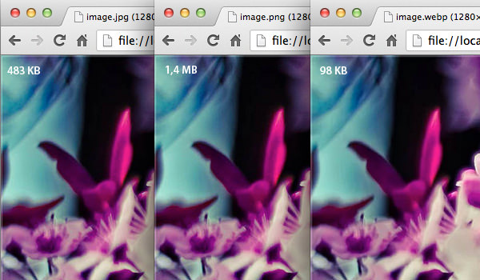
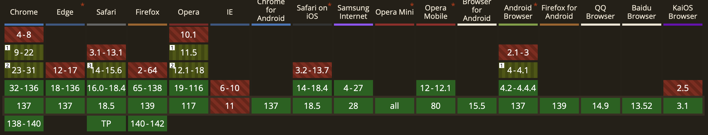

---
---

# 📚 Images et contenus riches

Les pages Web seraient un peu tristounettes s'il n'y avait pas d'images!

## Les différents formats d'images

Plusieurs formats d'image existent avec chacun leurs avantages et leurs inconvénients. Voici un bref aperçu des différents formats d'image.

| Format | Extension | Transparence | Animation | Compression | Meilleur usage | Avantages | Inconvénients |
|--------|-----------|--------------|-----------|-------------|----------------|-----------|---------------|
| JPEG | .jpg, .jpeg | ❌ | ❌ | Avec perte | Photographies | Fichiers légers, 16M couleurs | Perte de qualité, pas de transparence |
| PNG | .png | ✅ | ❌ | Sans perte | Logos, icônes, graphiques | Transparence alpha, qualité parfaite | Fichiers plus volumineux |
| GIF | .gif | Basique | ✅ | Sans perte | Animations simples | Animations, fichiers légers | 256 couleurs max |
| SVG | .svg | ✅ | ✅ | Vectoriel | Icônes, logos | Redimensionnable, modifiable CSS/JS | Complexe pour photos |
| WebP | .webp | ✅ | ✅ | Avec/sans perte | Usage moderne universel | Excellente compression | Support navigateur limité |

Voici une petite comparaison côte à côte d'images en trois formats différents: png, jpg et webp.



- `jpeg` est souvent utilisé pour les grandes images puisque le format avec compression permet d'obtenir une taille de fichier plus petite et une qualité d'image raisonnable. En effet, `jpeg` est un format d'image avec compressions, ce qui veut dire qu'il y a une perte de qualité.
- `png` est un format sans compression, donc il n'y a pas de perte de qualité! Cependant, le poids des fichiers `png` est plus grand. On les utilise régulièrement pour de petites images comme des `logo`, par exemple.
- `webp` est un format relativement nouveau qui offre le meilleur des deux mondes. Il est disponible avec ou sans compression et son efficacité est comparable à `jpeg` dans sa forme compressée. De plus, il supporte la transparence, tout comme `png`! L'enjeu est son support par les navigateurs, quoi que cela n'est presque plus tellement un problème. **Tous les navigateurs modernes le supporte**, mais les plus vieilles versions ne sont pas compatibles ou offrent un support partiel.
    

### Les images vectorielles `svg`

Il existe un format d'image un peu différent, soit les images vectorielles.

Les images vectorielles SVG (Scalable Vector Graphics) sont un format d'image basé sur des formules mathématiques plutôt que sur des pixels. Contrairement aux images bitmap comme les JPEG ou PNG, les SVG utilisent des formes géométriques, des courbes et des lignes définies par des coordonnées.

Elles sont idéales pour les illustrations (icônes, par exemple), mais ne peuvent être utilisées pour des photos.

Elles peuvent être agrandies autant qu'on le veut puisque l'image est calculée mathématiquement!

Voici un exemple d'illustration `svg`:

```html
<svg xmlns="http://www.w3.org/2000/svg" width="16" height="16" fill="currentColor" class="bi bi-badge-4k" viewBox="0 0 16 16">
  <path d="M4.807 5.001C4.021 6.298 3.203 7.6 2.5 8.917v.971h2.905V11h1.112V9.888h.733V8.93h-.733V5.001zm-1.23 3.93v-.032a47 47 0 0 1 1.766-3.001h.062V8.93zm9.831-3.93h-1.306L9.835 7.687h-.057V5H8.59v6h1.187V9.075l.615-.699L12.072 11H13.5l-2.232-3.415z"/>
  <path d="M14 3a1 1 0 0 1 1 1v8a1 1 0 0 1-1 1H2a1 1 0 0 1-1-1V4a1 1 0 0 1 1-1zM2 2a2 2 0 0 0-2 2v8a2 2 0 0 0 2 2h12a2 2 0 0 0 2-2V4a2 2 0 0 0-2-2z"/>
</svg>
```

<BrowserWindow url="">
<svg xmlns="http://www.w3.org/2000/svg" width="16" height="16" fill="currentColor" class="bi bi-badge-4k" viewBox="0 0 16 16">
  <path d="M4.807 5.001C4.021 6.298 3.203 7.6 2.5 8.917v.971h2.905V11h1.112V9.888h.733V8.93h-.733V5.001zm-1.23 3.93v-.032a47 47 0 0 1 1.766-3.001h.062V8.93zm9.831-3.93h-1.306L9.835 7.687h-.057V5H8.59v6h1.187V9.075l.615-.699L12.072 11H13.5l-2.232-3.415z"/>
  <path d="M14 3a1 1 0 0 1 1 1v8a1 1 0 0 1-1 1H2a1 1 0 0 1-1-1V4a1 1 0 0 1 1-1zM2 2a2 2 0 0 0-2 2v8a2 2 0 0 0 2 2h12a2 2 0 0 0 2-2V4a2 2 0 0 0-2-2z"/>
</svg>
</BrowserWindow>

## L'élément `` pour insérer une image

L'élément HTML `` est utilisé pour insérer une image dans une page Web.

### Syntaxe de base

```html

```

### Attributs essentiels

#### src (obligatoire)
- Spécifie le chemin vers l'image
- Peut être relatif ou absolu

#### alt (pour l'accessibilité)
- Description textuelle de l'image
- Lue par les lecteurs d'écran
- Affichée si l'image ne se charge pas. 

#### width et height (optionnel)
- Définissent les dimensions en pixels ou en pourcentage
- Évitent le redimensionnement pendant le chargement
  <SandpackPlayground
    template="static"
    showTabs={false}
    files={{
      '/index.html': ``
    }}
  />

### Chemins d'images

#### Chemin relatif

```html


```

Pour un chemin relatif, vous devrez avoir un dossier `images` dans le dossier de votre projet qui contient une image. Par exemple:

```
site/
├── images/
│   ├── logo.png
├── index.html
```

#### Chemin absolu
```html

```

## Accessibilité des Images

### L'attribut alt

L'attribut `alt` est important pour l'accessibilité puisqu'il est affiché si l'image ne se charge pas et est aussi lue par les lecteurs d'écran. Il doit être:
- Descriptif et concis
- Pertinent au contexte

Par exemple, ici l'image n'est pas valide, c'est l'attribut `alt` qui est affiché.

<SandpackPlayground
  template="static"
  showTabs={false}
  files={{
    '/index.html': ``
  }}
/>

<p></p>

### Exemples d'utilisation

```html


```

### Bonnes pratiques

- Utilisez des descriptions significatives
- Évitez "image de..." ou "photo de..."
- Pour les images complexes, ajoutez une description détaillée

## L'Élément `<figure>` et `<figcaption>`

L'élément `<figure>` permet d'associer une image à une légende. Cela est particulièrement utile pour les images qui nécessitent une explication ou un contexte.

### Syntaxe de base

```html
<figure>
    
    <figcaption>Figure 1: Statistiques d'utilisation des différents navigateurs (avril 2025)</figcaption>
</figure>
```

<SandpackPlayground
  template="static"
  showTabs={false}
  files={{
    '/index.html': `<figure>
    
    <figcaption>Figure 1: Statistiques d'utilisation des différents navigateurs (avril 2025)</figcaption>
</figure>`
  }}
/>

### Avantages de `<figure>` et `<figcaption>`

- **Sémantique claire** - Indique que l'image et sa légende forment une unité
- **Accessibilité améliorée** - Les lecteurs d'écran comprennent la relation
- **Référencement** - Les moteurs de recherche comprennent mieux le contexte

## Intégrer une image dans un lien

Il est possible d'intégrer une image dans une balise `<a>`. Cela est très commun pour les logos. En effet, vous verrez souvent un logo dans la barre de navigation mener à la page d'accueil du site.

Pour intégrer l'image dans un lien une image cliquable:

```html
<a href="https://www.google.com/">
    
</a>
```

Ce qui donnera: 
<BrowserWindow url="index.html">
  <a href="https://www.google.com/">
      
  </a>
</BrowserWindow>

## Contenus riches avec `<iframe>`

Vous avez surement déjà vu une vidéo YouTube être intégrée à même une page Web, c'est-à-dire qu'il n'était pas nécessaire de sortir de la page pour y écouter la vidéo.

L'élément `<iframe>` permet d'intégrer facilement des contenus externes dans vos pages web. C'est la méthode standard pour intégrer des vidéos YouTube, des cartes Google Maps, et autres services tiers.

Cela est très utile puisque ça vous permet d'ajouter facilement du contenu multimédia à vos pages et de les rendre plus utiles et attrayantes.

#### Syntaxe de base

```html
<iframe src="URL_du_contenu" width="largeur" height="hauteur"></iframe>
```

### Intégration de vidéos YouTube

Pour intégrer une vidéo YouTube, vous pouvez vous rendre sur la vidéo d'intérêt et:
1. Appuyez sur l'icône de partage
    

2. Appuyez sur l'icône pour intégrer le contenu
    

3. Copiez le code `iframe` fourni pour intégrer la vidéo
    


Cela vous donnera un code similaire à celui-ci:

```html
<iframe width="560" height="315" src="https://www.youtube.com/embed/2yJgwwDcgV8?si=r6H9oQvS7E9d6b7v" title="YouTube video player" frameborder="0" allow="accelerometer; autoplay; clipboard-write; encrypted-media; gyroscope; picture-in-picture; web-share" referrerpolicy="strict-origin-when-cross-origin" allowfullscreen></iframe>
```

Il ne vous suffit que de l'intégrer à votre page HTML comme n'importe quelle autre balise.

<SandpackPlayground
  template="static"
  showTabs={false}
  files={{
    '/index.html': `<iframe width="560" height="315" src="https://www.youtube.com/embed/2yJgwwDcgV8?si=r6H9oQvS7E9d6b7v" title="YouTube video player" frameborder="0" allow="accelerometer; autoplay; clipboard-write; encrypted-media; gyroscope; picture-in-picture; web-share" referrerpolicy="strict-origin-when-cross-origin" allowfullscreen></iframe>`
  }}
/>

### Intégration de cartes Google Maps

Le même principe s'applique pour intégrer une carte Google Maps, par exemple.

1. Allez sur Google Maps
2. Recherchez le lieu désiré
3. Cliquez sur "Partager"
4. Sélectionnez "Intégrer une carte"
5. Copiez le code HTML

### Autres contenus intégrables

Il existe plusieurs autres sites offrant du contenu intégrable à vos pages: Spotify, Google Forms, Microsoft Forms, Code Pen, etc.