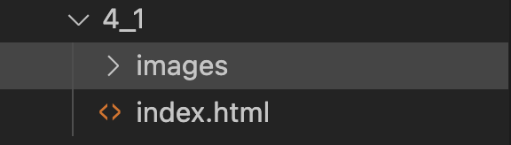
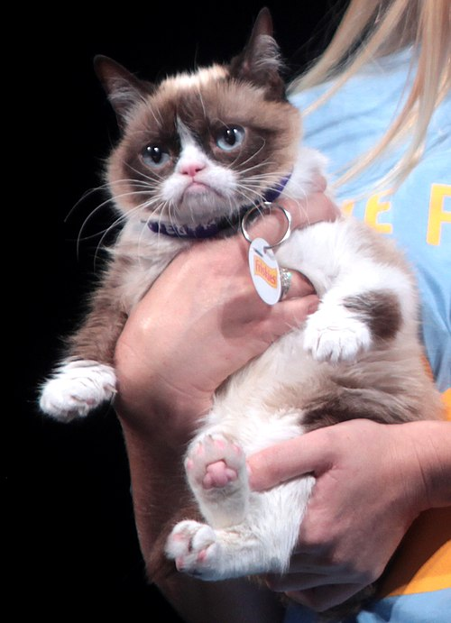
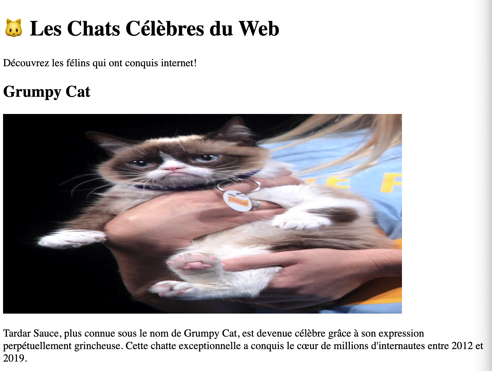
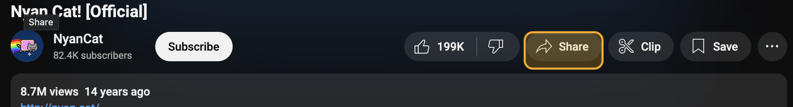
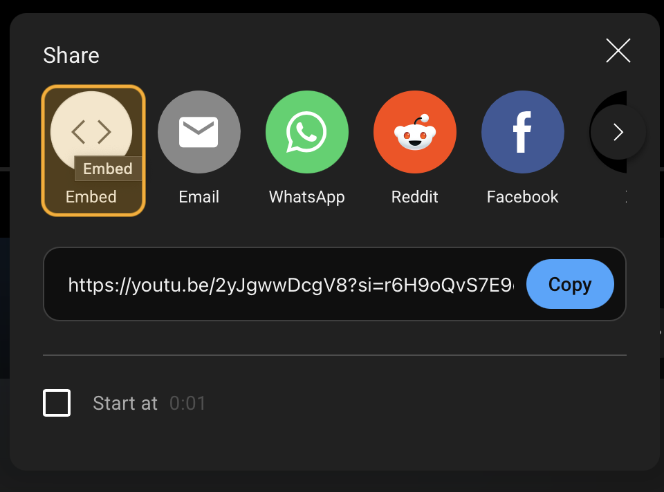
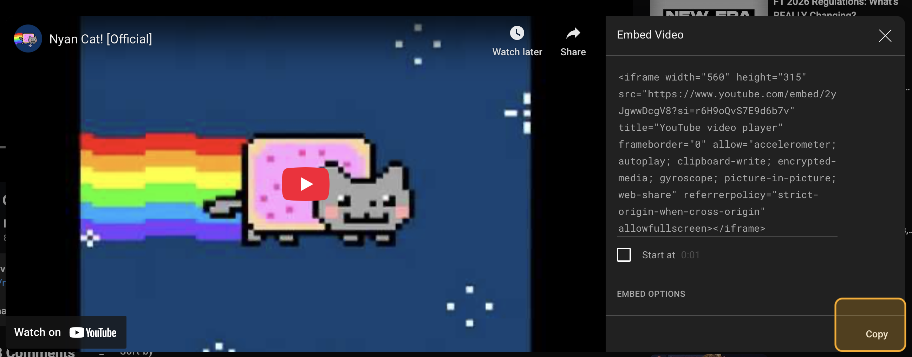
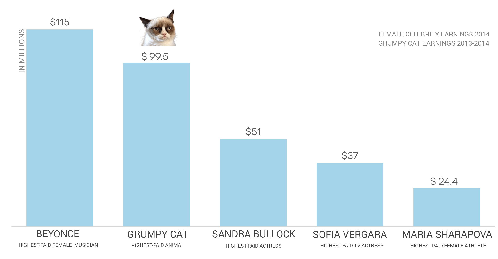

---
---

# 4-1 Intégrer des images à une page Web

Nous allons créer une page simple intégrant des images et des vidéos en provenance de YouTube. Nous resterons sur le concept des chats célèbres 🐱 😉

À la toute fin, nous aurons le site suivant:

<SandpackPlayground
    template="static"
    editorHeight={400}
    files={{
    '/index.html': `<!DOCTYPE html>
<html lang="fr">
<head>
  <meta charset="UTF-8">
  <meta name="viewport" content="width=device-width, initial-scale=1.0">
  <title>Les Chats Célèbres du Web</title>
</head>
<body>
  <h1>🐱 Les Chats Célèbres du Web</h1>
  <p>Découvrez les félins qui ont conquis internet!</p>
    
  <h2>Grumpy Cat</h2>

  

  <p>Tardar Sauce, plus connue sous le nom de Grumpy Cat, est devenue célèbre grâce à son expression perpétuellement grincheuse. Cette chatte exceptionnelle a conquis le cœur de millions d'internautes entre 2012 et 2019.</p>

  <figure>
    
    <figcaption>Revenues estimés générés par Grumpy Cat comparativement à des célébrités.</figcaption>
  </figure>
   
  <h3>Grumpy Cat en action</h3>
  <iframe width="560" height="315" src="https://www.youtube.com/embed/INscMGmhmX4?si=-qw5a8ei3M7DPV8C" title="YouTube video player" frameborder="0" allow="accelerometer; autoplay; clipboard-write; encrypted-media; gyroscope; picture-in-picture; web-share" referrerpolicy="strict-origin-when-cross-origin" allowfullscreen></iframe>
</body>
</html>
    `
    }}
/>  

## Structure de base

### Document HTML

Premièrement, créez une nouvelle page HTML (`index.html`) dans son propre dossier avec le squelette suivant:

```html title="index.html"
<!DOCTYPE html>
<html lang="fr">
<head>
    <meta charset="UTF-8">
    <meta name="viewport" content="width=device-width, initial-scale=1.0">
    <title>Les Chats Célèbres du Web</title>
</head>
<body>
    <h1>🐱 Les Chats Célèbres du Web</h1>
    <p>Découvrez les félins qui ont conquis internet!</p>
    
    <!-- Le contenu sera ajouté ici -->
    
</body>
</html>
```

### Dossier images

Comme nous devrons ajouter des images à la page, créez un dossier `images` **à l'intérieur du dossier de votre projet**. Par exemple:



## Ajouter une première image

Pour notre première image et premier bloc de contenu, on se concentrera sur Grumpy Cat. Voici une image de Grumpy Cat:



**Vous pouvez faire un `clic droit` et `Enregistrer sous...`** afin d'enregistrer l'image sur votre ordinateur.

1. Sauvegardez l'image dans le dossier `images` de votre site.
2. Ajoutez un titre et un bloc de texte pour Grumpy Cat dans le body.
    ```html
    <!DOCTYPE html>
    <html lang="fr">
    <head>
      <meta charset="UTF-8">
      <meta name="viewport" content="width=device-width, initial-scale=1.0">
      <title>Les Chats Célèbres du Web</title>
    </head>
    <body>
      <h1>🐱 Les Chats Célèbres du Web</h1>
      <p>Découvrez les félins qui ont conquis internet!</p>
        
      //highlight-start
      <h2>Grumpy Cat</h2>

      <p>Tardar Sauce, plus connue sous le nom de Grumpy Cat, est devenue célèbre grâce à son expression perpétuellement grincheuse. Cette chatte exceptionnelle a conquis le cœur de millions d'internautes entre 2012 et 2019.</p>
      //highlight-end
        
    </body>
    </html>
    ```
3. Pour ajouter une image, nous utiliserons la balise `img` et l'attribut `alt` pour sa description.
    ```html
    <!-- ... -->

    <h2>Grumpy Cat</h2>

    //highlight-next-line
    

    <p>Tardar Sauce, plus connue sous le nom de Grumpy Cat, est devenue célèbre grâce à son expression perpétuellement grincheuse. Cette chatte exceptionnelle a conquis le cœur de millions d'internautes entre 2012 et 2019.</p>

    <!-- ... -->
    ```

    :::info Balise `img`
    La balise `` permet d'insérer une image. Elle a deux attributs obligatoires:

    `src`: le chemin vers l'image
    `alt`: une description de l'image

    Ici, `src` est un chemin relatif, c'est-à-dire qu'on va récupérer l'image à partir du dossier courant. À noter que les deux façons suivantes d'écrire le chemin relatif sont équivalentes:
    - `images/grumpy-cat.jpg`
    - `./images/grumpy-cat.jpg`
    :::

    :::info Attribut `alt`
    L'attribut alt sert à:

    **Accessibilité**: Les lecteurs d'écran lisent cette description aux personnes malvoyantes
    **SEO**: Les moteurs de recherche utilisent cette information
    **Valeur refuge**: Si l'image ne se charge pas, le texte alternatif s'affiche
    :::

## Modifier la taille de l'image

Si vous jugez que la taille de l'image n'est pas adéquate, il est possible de modifier cette dernière avec les attributs `width` et `height`.

```html

```

... mais oups! Vous aurez quelque chose comme ceci:



:::caution
On vient de forcer une résolution de 300x600 à l'image, alors que ce n'est pas sa résolution native! C'est ce qui fait en sorte qu'elle est déformée
:::

Afin d'éviter la déformation de l'image, il est possible de ne préciser qu'un seul paramètre: `height` ou `width` et le navigateur s'occupera de déterminer l'autre paramètre automatiquement. Par exemple, ne spécifions que la hauteur:

```html

```

## Ajouter une vidéo YouTube

1. Pour intégrer une vidéo YouTube, vous pouvez vous rendre sur la vidéo d'intérêt, par exemple https://www.youtube.com/watch?v=INscMGmhmX4 pour Grumpy Cat et:
   1. Appuyez sur l'icône de partage
       

   2. Appuyez sur l'icône pour intégrer le contenu
       

   3. Copiez le code `iframe` fourni pour intégrer la vidéo
       
    4. Vous obtiendrez un code similaire à celui-ci:
        ```html
        <iframe width="560" height="315" src="https://www.youtube.com/embed/INscMGmhmX4?si=-qw5a8ei3M7DPV8C" title="YouTube video player" frameborder="0" allow="accelerometer; autoplay; clipboard-write; encrypted-media; gyroscope; picture-in-picture; web-share" referrerpolicy="strict-origin-when-cross-origin" allowfullscreen></iframe>
        ```
2. Insérez la vidéo dans votre document HTML
    ```html
    <body>
      <h1>🐱 Les Chats Célèbres du Web</h1>
      <p>Découvrez les félins qui ont conquis internet!</p>
        
      <h2>Grumpy Cat</h2>

      

      <p>Tardar Sauce, plus connue sous le nom de Grumpy Cat, est devenue célèbre grâce à son expression perpétuellement grincheuse. Cette chatte exceptionnelle a conquis le cœur de millions d'internautes entre 2012 et 2019.</p>
      
      //highlight-start
      <h3>Grumpy Cat en action</h3>
      <iframe width="560" height="315" src="https://www.youtube.com/embed/INscMGmhmX4?si=-qw5a8ei3M7DPV8C" title="YouTube video player" frameborder="0" allow="accelerometer; autoplay; clipboard-write; encrypted-media; gyroscope; picture-in-picture; web-share" referrerpolicy="strict-origin-when-cross-origin" allowfullscreen></iframe>
      //highlight-end
    </body>
    ```

## Ajouter une figure

L'utilisation de la balise `figure` est pertinente lorsqu'on veut ajouter un contexte et des explications supplémentaires à une image.

Par exemple, il pourrait être intéressant de mettre un graphique de statistiques de revenu générées pour Grumpy Cat.

1. Utilisez l'image suivante et déposez-la dans le dossier `images` de votre site.
    
2. On peut ensuite ajouter l'image à l'intérieur d'un élément `figure` avec `caption`
    ```html
    <body>
      <h1>🐱 Les Chats Célèbres du Web</h1>
      <p>Découvrez les félins qui ont conquis internet!</p>
        
      <h2>Grumpy Cat</h2>

      

      <p>Tardar Sauce, plus connue sous le nom de Grumpy Cat, est devenue célèbre grâce à son expression perpétuellement grincheuse. Cette chatte exceptionnelle a conquis le cœur de millions d'internautes entre 2012 et 2019.</p>

      //highlight-start
      <figure>
        
        <figcaption>Revenues estimés générés par Grumpy Cat comparativement à des célébrités.</figcaption>
      </figure>
      //highlight-end
      
      <h3>Grumpy Cat en action</h3>
      <iframe width="560" height="315" src="https://www.youtube.com/embed/INscMGmhmX4?si=-qw5a8ei3M7DPV8C" title="YouTube video player" frameborder="0" allow="accelerometer; autoplay; clipboard-write; encrypted-media; gyroscope; picture-in-picture; web-share" referrerpolicy="strict-origin-when-cross-origin" allowfullscreen></iframe>
    </body>
    ```
  
### Pourquoi utiliser `<figure>` et `<figcaption>`?

Parfois, vos images ont besoin d'une légende ou d'une explication. La balise `<figure> `permet d'associer une image à sa légende de manière sémantique.

```html
<figure>
  
  <figcaption>Revenues estimés générés par Grumpy Cat comparativement à des célébrités.</figcaption>
</figure>
```

### Différence entre alt et figcaption

**alt**: Description de ce qu'on voit (pour l'accessibilité)
**figcaption**: Légende ou contexte supplémentaire (visible par tous)

## Compléter la page (optionnel)

On pourrait compléter la page avec d'autres chats, mais à partir de là, la structure serait la même!