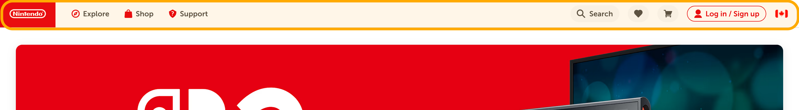
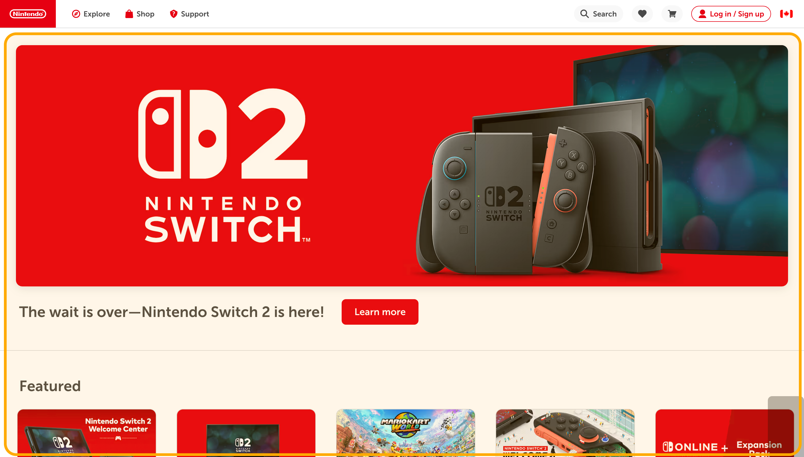
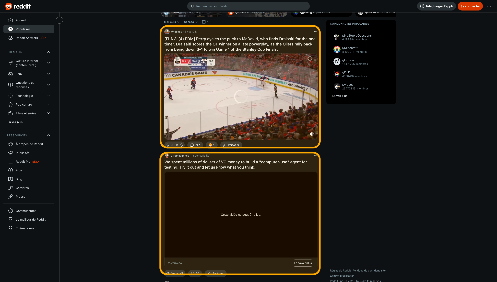
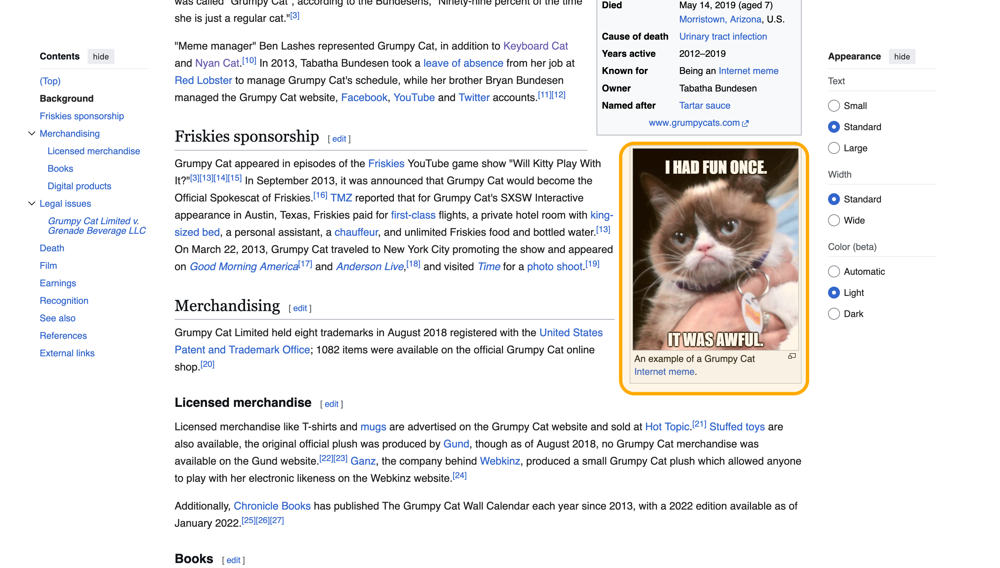
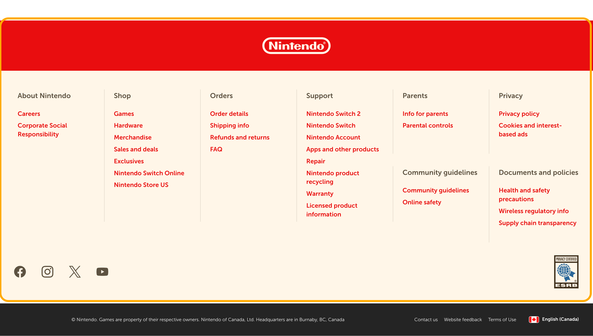
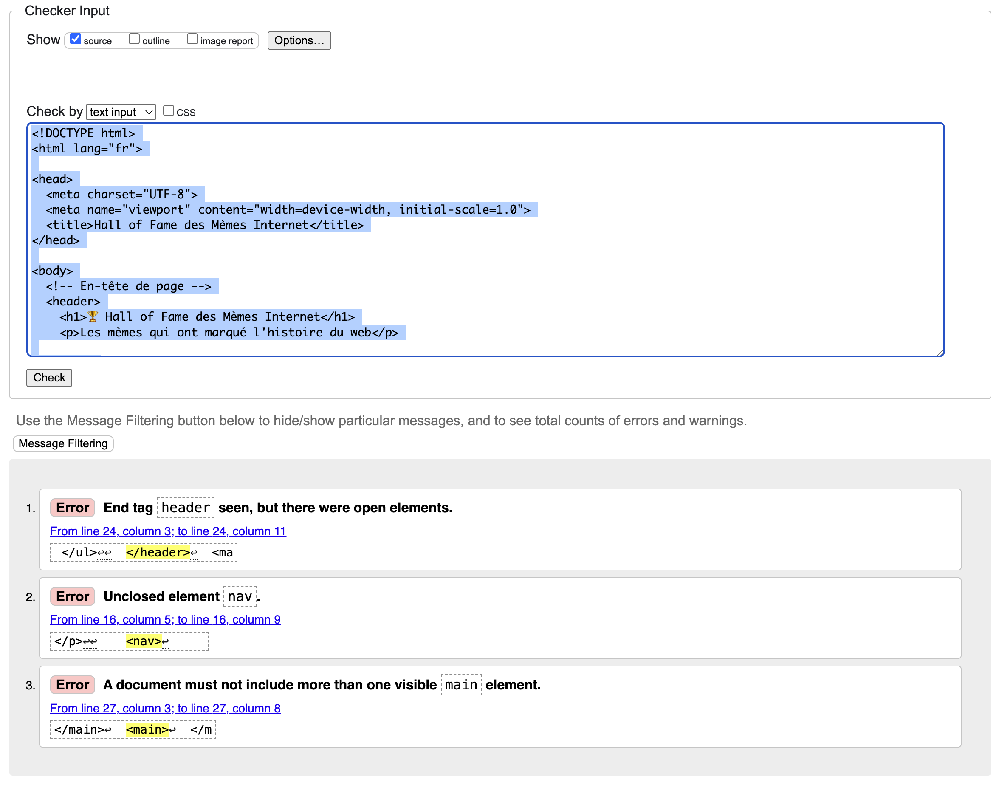

---
---

# 📚 Les balises de structure HTML5

Les balises de structure HTML5 permettent de donner un sens et une organisation logique au contenu de vos pages web.

Contrairement aux anciennes balises génériques comme `<div>`, ces éléments décrivent clairement le rôle de chaque section. Cela améliore l'accessibilité, le référencement (SEO) et la lisibilité du code.

Vos pages ont différentes sections conceptuelles. Par exemple l'en-tête, la navigation, le contenu principal ou encore le pied de page.

Bien que conceptuellement vous soyez en mesure de comprendre ces différentes sections, elles ne sont pas clairement communiquées dans votre code HTML. Anciennement, on utilisait la balise `<div>` à toutes les sauces pour porter cette valeur sémantique, mais HTML5 introduit plusieurs balises intéressantes pour structurer votre document.

### Avant HTML5: tout en `<div>`

Afin de séparer les différentes zones de contenu, il est possible d'utiliser des balises `<div>`. Par exemple, ici on utilise des balises `div` avec des ID précis afin de bien structurer le contenu de la page.

```html
<div id="header">
    <div id="navigation">...</div>
</div>
<div id="content">
    <div class="article">...</div>
</div>
<div id="sidebar">...</div>
<div id="footer">...</div>
```

Les `div` sont encore très utiles aujourd'hui, mais des balises supplémentaires permettent de mieux communiquer le rôle des principales sections de la page.

### Avec HTML5: structure sémantique

Avec `HTML5`, plusieurs balises ont fait leur apparition, telles que:

- `<header>` - En-tête de page ou section
- `<nav>` - Navigation
- `<main>` - Contenu principal
- `<section>` - Section thématique
- `<article>` - Contenu autonome
- `<aside>` - Contenu connexe/latéral
- `<footer>` - Pied de page

Par exemple:

```html
<header>
    <nav>...</nav>
</header>
<main>
    <article>...</article>
</main>
<aside>...</aside>
<footer>...</footer>
```

### Avantages des balises structurelles

L'utilisation de ces balises présente plusieurs avantages:

- **Accessibilité** - Les lecteurs d'écran naviguent plus facilement
- **SEO amélioré** - Les moteurs de recherche comprennent mieux la structure
- **Code plus lisible** - Plus facile à lire et à maintenir
- **Sémantique claire** - Le rôle de chaque section est évident
- **Navigation assistée** - Possibilité de sauter directement au contenu principal (accessibilité)

## Les balises de structure principales

### `<header>` - En-tête

Représente l'en-tête d'une page ou d'une section. Contiens généralement le titre, le logo et la navigation principale.


```html
<header>
    <h1>Grumpy Cat Museum</h1>
    <p>Le musée officiel du chat le plus grincheux du web</p>
    <nav>
        <a href="#accueil">Accueil</a>
        <a href="#galerie">Galerie</a>
        <a href="#boutique">Boutique</a>
    </nav>
</header>
```

#### Points importants
- Peut être utilisé plusieurs fois par page (en-tête de page ET d'article)
- Ne dois pas être imbriqué dans un autre `<header>`
- Souvent placé au début de `<body>` ou d'`<article>`

### `<nav>` - Navigation

Contiens les liens de navigation principaux du site.



```html
<nav>
    <ul>
        <li><a href="#nyan-cat">Nyan Cat</a></li>
        <li><a href="#keyboard-cat">Keyboard Cat</a></li>
        <li><a href="#grumpy-cat">Grumpy Cat</a></li>
        <li><a href="#lil-bub">Lil Bub</a></li>
    </ul>
</nav>
```

#### Utilisations courantes
- Menu principal du site
- Breadcrumb (fil d'Ariane)
- Pagination
- Menu de section

### `<main>` - Contenu principal

Identifie le contenu principal unique de la page. **Il ne doit y en avoir qu'un seul par page.**



```html
<main>
    <h1>L'Histoire de Keyboard Cat</h1>
    <p>Keyboard Cat, de son vrai nom Fatso, était un chat orange qui a conquis internet...</p>
    
    <section>
        <h2>Ses performances légendaires</h2>
        <p>Le chat jouait du clavier électronique dans des vidéos devenues virales...</p>
    </section>
</main>
```

**Règles importantes :**
- Un seul `<main>` par page
- Ne doit pas être enfant de `<article>`, `<aside>`, `<footer>`, `<header>`, ou `<nav>`
- Contiens le contenu central, unique à cette page

### `<article>` - Contenu indépendant

Représente un contenu indépendant, c'est-à-dire qu'il n'est pas directement lié à aucun autre élément.



```html
<article>
    <header>
        <h2>Grumpy Cat remporte le prix du mème de l'année</h2>
        <p>Publié le <time datetime="2013-05-20">20 mai 2013</time> par <strong>ChatActu</strong></p>
    </header>
    
    <p>Tardar Sauce, mieux connue sous le nom de Grumpy Cat, 
       a officiellement remporté le titre de mème de l'année...</p>
    
    <figure>
        
        <figcaption>Grumpy Cat pose avec son trophée (sans sourire, évidemment)</figcaption>
    </figure>
    
    <footer>
        <p>Tags: <a href="#meme">mème</a>, <a href="#prix">prix</a>, <a href="#2013">2013</a></p>
    </footer>
</article>
```

#### Exemples d'usage
- Article de blogue
- Post de forum  
- Commentaire
- Article de journal
- Contenu syndiqué

### `<section>` - Section thématique

Groupe du contenu thématiquement lié, généralement avec un titre.

```html
<section>
    <h2>Les chats musiciens du web</h2>
    
    <article>
        <h3>Keyboard Cat</h3>
        <p>Le pionnier des chats musiciens...</p>
    </article>
    
    <article>
        <h3>Henri le Chat Existentialiste</h3>
        <p>Un chat français philosophe et musicien...</p>
    </article>
</section>

<section>
    <h2>Les chats comédiens</h2>
    
    <article>
        <h3>Nyan Cat</h3>
        <p>Le chat pop-tart qui traverse l'espace...</p>
    </article>
</section>
```

### Quand utiliser `<section>`
- Pour regrouper du contenu par thème
- Pour diviser un long article en parties

### `<aside>` - Contenu connexe

Contenu indirectement lié au contenu principal (sidebar, encadrés, publicités).



```html
<aside>
    <h3>Le saviez-vous ?</h3>
    <p>Grumpy Cat était en réalité une femelle nommée Tardar Sauce. 
       Son expression perpétuellement grincheuse était due à 
       une forme de nanisme félin.</p>
</aside>

<aside>
    <h3>Chats populaires</h3>
    <ul>
        <li>Nyan Cat - 200M+ vues</li>
        <li>Keyboard Cat - 65M+ vues</li>
        <li>Grumpy Cat - 100M+ vues cumulées</li>
    </ul>
</aside>
```

#### Types de contenu pour `<aside>`
- Sidebar avec liens connexes
- Biographie d'auteur
- Publicités
- Citations en rapport
- Glossaire

### `<footer>` - Pied de page

Contiens les informations de fin de page ou section (copyright, liens, contact).



```html
<footer>
    <p>&copy; 2024 Grumpy Cat Museum. Tous droits réservés.</p>
    
    <nav aria-label="Liens du pied de page">
        <a href="#mentions-legales">Mentions légales</a>
        <a href="#contact">Contact</a>
    </nav>
    
    <p>Suivez-nous sur les réseaux sociaux pour plus de contenu félin !</p>
</footer>
```

#### Contenu typique d'un pied de page
- Copyright et informations légales
- Liens de navigation secondaire
- Informations de contact
- Liens vers réseaux sociaux

## Imbrication et Hiérarchie

### Règles d'imbrication importantes

```html
<!-- ✅ CORRECT -->
<main>
    <article>
        <header>
            <h1>Titre de l'article</h1>
        </header>
        <section>
            <h2>Section de l'article</h2>
        </section>
    </article>
</main>

<!-- ❌ INCORRECT -->
<article>
    <main>  <!-- main ne peut pas être dans article -->
        <section>...</section>
    </main>
</article>
```

## Éléments interactifs

### `<details>` et `<summary>` - Contenu dépliable

Ces éléments permettent de créer des sections de contenu que l'utilisateur peut afficher ou masquer, parfaites pour les FAQ, informations supplémentaires ou sections optionnelles.

<SandpackPlayground
    template="static"
    editorHeight={400}
    files={{
    '/index.html': `<details>
    <summary>Pourquoi Grumpy Cat était-elle toujours grincheuse ?</summary>
    <p>L'expression de Grumpy Cat était due à une forme de nanisme félin et à une sous-occlusion dentaire. Contrairement aux apparences, Tardar Sauce était une chatte heureuse et en bonne santé!</p>
</details>

<details>
    <summary>Les records de Keyboard Cat</summary>
    <ul>
        <li>Première vidéo virale de chat musicien</li>
        <li>Plus de 65 millions de vues cumulées</li>
        <li>Inspirateur de milliers de remix</li>
        <li>Intronisé au "Internet Hall of Fame" en 2015</li>
    </ul>
</details>`
    }}
/>

### Hiérarchie recommandée

1. **Structure principale** : `<header>`, `<main>`, `<footer>`
2. **Navigation** : `<nav>` (dans header ou seul)
3. **Contenu** : `<article>`, `<section>` (dans main)
4. **Contenu secondaire** : `<aside>`

## ❌ À éviter

1. **Plusieurs `<main>` par page** - Un seul autorisé
2. **`<main>` dans une autre balise structurelle** - Dois être au niveau racine
3. **Confondre `<section>` et `<div>`** - Section nécessite un titre logique
4. **`<article>` sans contenu autonome** - Dois pouvoir être lu indépendamment
5. **Structure illogique** - Header après main, navigation dans footer...
6. **Utiliser `<aside>` pour du contenu principal** - Réservé au contenu secondaire

## Validation et Outils

### Vérification de la structure

Quelques outils peuvent vous aider à vérifier la structure de votre document.

- [HTML5 Outliner](https://hoyois.github.io/html5outliner/) - Visualise la structure de la page
- [Validateur W3C](https://validator.w3.org/#validate_by_input) - Vérification syntaxique HTML
- [WAVE](https://wave.webaim.org/extension/) - Test d'accessibilité web

Par exemple, avec W3C, si nous tentons de valider une page qui présente des lacunes:
* Balise `nav` pas fermée
* Plus d'un `main`

```html
<!DOCTYPE html>
<html lang="fr">

<head>
  <meta charset="UTF-8">
  <meta name="viewport" content="width=device-width, initial-scale=1.0">
  <title>Hall of Fame des Mèmes Internet</title>
</head>

<body>
  <!-- En-tête de page -->
  <header>
    <h1>🏆 Hall of Fame des Mèmes Internet</h1>
    <p>Les mèmes qui ont marqué l'histoire du web</p>

    <nav>
      <h2>Navigation</h2>
      <ul>
        <li><a href="#annees-2000">Années 2000</a></li>
        <li><a href="#annees-2010">Années 2010</a></li>
        <li><a href="#annees-2020">Années 2020</a></li>
      </ul>

  </header>
  <main>
  </main>
  <main>
  </main>
</body>
</html>
```

L'outil vous indiquera les problèmes dans votre document HTML.



## À retenir
- Utilisez la sémantique appropriée pour chaque section
- Respectez la hiérarchie et les règles d'imbrication
- Testez votre structure avec des outils dédiés comme le valideur W3C
- Un seul `<main>` par page, mais plusieurs `<header>`, `<section>`, `<article>` possibles