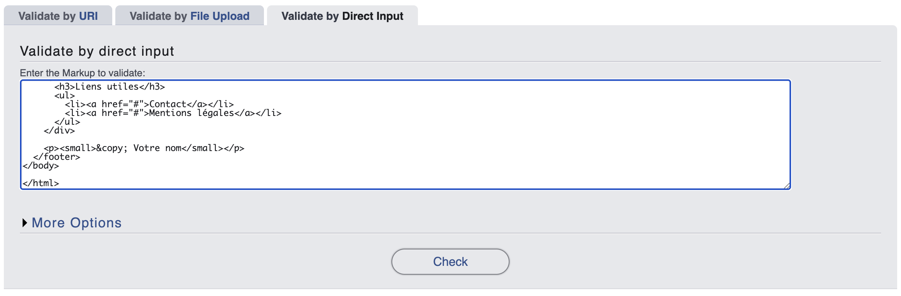

---
---

# 5-1 Intégrer les balises de structure à une page

Dans ce tutoriel, vous allez apprendre à **structurer une page web en utilisant les balises de structure HTML5**. Nous prendrons comme exemple un "Hall of Fame des Mèmes Internet" pour organiser du contenu par catégories et créer une navigation simple.

La page à créer sera la suivante:

<SandpackPlayground
template="static"
editorHeight={600}
files={{
'/index.html': `<!DOCTYPE html>
<html lang="fr">

<head>
  <meta charset="UTF-8">
  <meta name="viewport" content="width=device-width, initial-scale=1.0">
  <title>Hall of Fame des Mèmes Internet</title>
</head>

<body>
  <!-- En-tête de page -->
  <header>
    <h1>🏆 Hall of Fame des Mèmes Internet</h1>
    <p>Les mèmes qui ont marqué l'histoire du web</p>

    <nav>
      <h2>Navigation</h2>
      <ul>
        <li><a href="#annees-2000">Années 2000</a></li>
        <li><a href="#annees-2010">Années 2010</a></li>
        <li><a href="#annees-2020">Années 2020</a></li>
      </ul>
    </nav>
  </header>

  <!-- Contenu principal -->
  <main>
    <h2>Les Mèmes Légendaires</h2>

    <!-- Première section -->
    <section id="annees-2000">
      <h3>Années 2000 - Les Pionniers</h3>
      <p>L'époque où les premiers mèmes sont nés.</p>

      <!-- Premier mème -->
      <article>
        <h4>Rickroll</h4>
        <p>Année: 2007 | Origine: YouTube</p>

        <p>Description du mème Rickroll...</p>

        <details>
          <summary>Informations supplémentaires</summary>
          <p>Vidéo Youtube:</p>
          <iframe width="560" height="315" src="https://www.youtube.com/embed/dQw4w9WgXcQ?si=8K9-TocpS7Fr7RWf"
            title="YouTube video player" frameborder="0"
            allow="accelerometer; autoplay; clipboard-write; encrypted-media; gyroscope; picture-in-picture; web-share"
            referrerpolicy="strict-origin-when-cross-origin" allowfullscreen></iframe>
        </details>
      </article>

      <!-- Deuxième mème -->
      <article>
        <h4>All Your Base</h4>
        <p>Année: 2001 | Origine: Jeu vidéo</p>

        <p>Description du mème All Your Base...</p>
      </article>
    </section>

    <!-- Deuxième section -->
    <section id="annees-2010">
      <h3>Années 2010 - L'Explosion</h3>
      <p>Les réseaux sociaux démocratisent les mèmes.</p>

      <!-- Articles individuels ici -->
    </section>

    <!-- Troisième section -->
    <section id="annees-2020">
      <h3>Années 2020 - L'Ère des courtes vidéos</h3>
      <p>Vidéos courtes et mèmes multimedia.</p>

      <!-- Articles individuels ici -->
    </section>
  </main>

  <!-- Contenu complémentaire -->
  <aside>
    <div>
      <h3>💡 Le saviez-vous ?</h3>
      <p>Le terme "mème" a été inventé par Richard Dawkins en 1976.</p>
    </div>

    <div>
      <h3>🔗 Ressources</h3>
      <ul>
        <li><a href="#">Know Your Meme</a></li>
        <li><a href="#">Reddit r/memes</a></li>
        <li><a href="#">Mème Generator</a></li>
      </ul>
    </div>
  </aside>

  <!-- Pied de page -->
  <footer>
    <div>
      <h3>À propos</h3>
      <p>Hall of Fame créé par des passionnés de culture internet.</p>
    </div>

    <div>
      <h3>Liens utiles</h3>
      <ul>
        <li><a href="#">Contact</a></li>
        <li><a href="#">Mentions légales</a></li>
      </ul>
    </div>

    <p><small>&copy; Votre nom</small></p>
  </footer>
</body>

</html>
    `
    }}
/>

## Dans ce tutoriel

Vous apprendrez à:

- Planifier la structure d'une page avant de coder
- Utiliser `<header>`, `<nav>`, `<main>`, `<section>`, `<article>`, `<aside>`, `<footer>`
- Organiser du contenu par thématiques avec `<section>`
- Créer du contenu indépendant avec `<article>` 
- Ajouter de l'interactivité avec `<details>` et `<summary>`
- Comprendre la hiérarchie des balises structurelles

## Planifier la structure

Avant de coder, réfléchissons à l'organisation de notre contenu.

La page contiendra:
- En-tête avec titre et navigation
- Contenu principal organisé par décennies (2000, 2010, 2020)
- Barre latérale avec infos supplémentaires
- Pied de page

La structure hiérarchique de la page ressemblera à ceci:

```
Page complète
├── Header (titre + navigation)
├── Main (contenu principal)
│   ├── Section "Années 2000" 
│   │   ├── Article "Mème 1"
│   │   └── Article "Mème 2"
│   ├── Section "Années 2010"
│   └── Section "Années 2020"
├── Aside (informations bonus)
└── Footer
```

## Créer le squelette HTML

Commençons par la **structure de base** avec toutes les balises de structure vides:

```html
<!DOCTYPE html>
<html lang="fr">
<head>
    <meta charset="UTF-8">
    <meta name="viewport" content="width=device-width, initial-scale=1.0">
    <title>Hall of Fame des Mèmes Internet</title>
</head>
<body>
    <!-- En-tête de page -->
    <header>
        <!-- Titre principal et navigation -->
    </header>

    <!-- Contenu principal -->
    <main>
        <!-- Sections par décennie -->
    </main>

    <!-- Contenu complémentaire -->
    <aside>
        <!-- Informations bonus -->
    </aside>

    <!-- Pied de page -->
    <footer>
        <!-- Copyright et liens -->
    </footer>
</body>
</html>
```

:::info
- `<header>`: En-tête de la page, contenant le titre principal et la navigation
- `<main>`: Contenu principal de la page
- `<aside>`: Contenu connexe ou complémentaire
- `<footer>`: Pied de page contenant des informations de contact, des liens internes et les mentions de propriété intellectuelle.
:::

## Construire le header (en-tête)

Le **`<header>` contient le titre principal et la navigation**, c'est l'en-tête du site.

Le site contiendra:
```
H1: 🏆 Hall of Fame des Mèmes Internet
Introduction: Les mèmes qui ont marqué l'histoire du web
Navigation: Liens avec ancres vers les décénnies
```

1. Ajoutez le titre et l'introduction
    ```html
    <header>
        //highlight-start
        <h1>🏆 Hall of Fame des Mèmes Internet</h1>
        <p>Les mèmes qui ont marqué l'histoire du web</p>
        //highlight-end
    </header>
    ```

    :::tip
    On se souvient, un seul `h1` par page!
    :::
2. Ensuite, créons une navigation à l'aide de la balise `nav`
    ```html
    <header>
        <h1>🏆 Hall of Fame des Mèmes Internet</h1>
        <p>Les mèmes qui ont marqué l'histoire du web</p>
        
        //highlight-start
        <nav>
            <h2>Navigation</h2>
            <ul>
                <li><a href="#annees-2000">Années 2000</a></li>
                <li><a href="#annees-2010">Années 2010</a></li>
                <li><a href="#annees-2020">Années 2020</a></li>
            </ul>
        </nav>
        //highlight-end
    </header>
    ```

    :::info
    `nav` contient ici une liste avec des liens vers des sections de la page. Il est **normal que ces sections (`#annees-2000`) n'existent pas encore!
    :::

    :::info
    Pour simplifier le tutoriel, on fait des liens internes, mais cette navigation pourrait pointer vers des pages individuelles (ex.: `2000.html`).
    :::

## Structurer le contenu principal avec `<main>`

Le `<main>` contient le contenu unique de la page. C'est généralement le plus gros bloc HTML.

Mettons-y un contenu de base pour commencer, soit un titre `h2` et un paragraphe d'introduction.

```html
<!-- ... -->

<main>
    <h2>Les Mèmes Légendaires</h2>
    <p>Découvrez les mèmes qui ont défini chaque époque du web.</p>
    
    <!-- Les sections seront ajoutées ici -->
</main>

<!-- ... -->
```

:::tip
Un seul `<main>` par page!
:::

## Organiser par thématiques (décennies) avec `<section>`

Chaque décennie sera associée à un élément `<section>`. En effet, il s'agit du même genre de contenu, mais qui se répète plusieurs fois. On parle de la même thématique et donc `<section>` est tout adapté pour cela.

Chaque section contiendra une décénnie et des memes à l'intérieur. Ainsi, un titre et un paragraphe d'introduction sont de mise.

Comme nous sommes sous un niveau `h2`, les titres de ces sections seront des `h3`.

Ajoutez trois sections **à l'intérieur de `main`***:

```html
<!-- ... -->
<main>
    <h2>Les Mèmes Légendaires</h2>
    
    //highlight-start
    <!-- Première section -->
    <section id="annees-2000">
        <h3>Années 2000 - Les Pionniers</h3>
        <p>L'époque où les premiers mèmes sont nés.</p>
        
        <!-- Articles individuels ici -->
    </section>
    
    <!-- Deuxième section -->
    <section id="annees-2010">
        <h3>Années 2010 - L'Explosion</h3>
        <p>Les réseaux sociaux démocratisent les mèmes.</p>
        
        <!-- Articles individuels ici -->
    </section>
    
    <!-- Troisième section -->
    <section id="annees-2020">
        <h3>Années 2020 - L'Ère des courtes vidéos</h3>
        <p>Vidéos courtes et mèmes multimedia.</p>
        
        <!-- Articles individuels ici -->
    </section>
    //highlight-end
</main>
<!-- ... -->
```

:::tip
- Chaque `<section>` a un `id` pour que la navigation puisse y faire référence.
- Titres hiérarchiques: `<h2>` dans main, `<h3>` dans sections
- Chaque section traite d'un thème spécifique, mais elles sont reliées entre-elles.
:::

## Créer du contenu indépendant avec `<article>`

Chaque mème peut être associé à un `<article>` dans sa section. Un élément `<article>` représente un contenu indépendant, mais lié à la thématique de `<section>`. Cela est tout indiqué pour ce que nous avons à représenter puisque chaque meme d'une décénnie contient un ensemble d'information:
- Nom
- Description
- Contenu relié
- etc.

1. Créons un premier `<article>` en nous concentrant sur les années 2000:
    ```html
    <!-- ... -->
    <section id="annees-2000">
        <h3>Années 2000 - Les Pionniers</h3>
        
        //highlight-start
        <article>
            <h4>Rickroll</h4>
            <p>Année: 2007 | Origine: YouTube</p>
            
            <p>Description du mème Rickroll...</p>
        </article>
        //highlight-end
        
    </section>
    <!-- ... -->
    ```

    :::info Structure d'un `<article>`
    Dans sa forme la plus minimale, un `<article>` contient ici:
    - Titre
    - Contenu principal
    :::
2. Complétez en ajoutant un deuxième meme à la section
    ```html
    <section id="annees-2000">
        <h3>Années 2000 - Les Pionniers</h3>
        <p>L'époque où les premiers mèmes sont nés.</p>

        <!-- Premier mème -->
        <article>
            <h4>Rickroll</h4>
            <p>Année: 2007 | Origine: YouTube</p>

            <p>Description du mème Rickroll...</p>
        </article>

        //highlight-start
        <!-- Deuxième mème -->
        <article>
            <h4>All Your Base</h4>
            <p>Année: 2001 | Origine: Jeu vidéo</p>

            <p>Description du mème All Your Base...</p>
        </article>
        //highlight-end
    </section>
    ```

## Ajouter l'interactivité avec `<details>`

`<details>` et `<summary>` permettent de cacher/montrer du contenu. Nous pourrions par exemple mettre des informations supplémentaires sur un meme derrière ces balises. Imaginons que nous avions une vidéo YouTube et autre contenu du genre.

1. Ajouter la balise `details` à `Rick Roll`
    ```html
    <article>
        <h4>Rickroll</h4>
        <p>Année: 2007 | Origine: YouTube</p>

        <p>Description du mème Rickroll...</p>

        <details>

        </details>
    </article>
    ```
2. La balise `details` est composée d'un `<summary>` qui affiche une courte invitation à ouvrir le contenu supplémentaire. Par exemple, ajoutons `Informations supplémentaires`
    ```html
    <details>
        <summary>Informations supplmentaires</summary> 

    </details>
    ```

    Ce qui devrait vous donner quelque chose comme:

    <SandpackPlayground
    template="static"
    files={{
    '/index.html': `<details>
        <summary>Informations supplémentaires</summary> 
    </details>
        `
        }}
    />

    Évidemment, il n'y a pas de contenu, donc **cliquer que la flèche n'ouvrira pas de contenu supplémentaire**.
3. Le contenu de la balise `details` peut être simplement ajouté à l'intérieur de cette dernière, après la balise `summary`. Par exemple, une vidéo YouTube:
        ```html
        <details>
          <summary>Informations supplmentaires</summary> 
          //highlight-start
          <p>Vidéo Youtube:</p>
          <iframe width="560" height="315" src="https://www.youtube.com/embed/dQw4w9WgXcQ?si=8K9-TocpS7Fr7RWf" title="YouTube video player" frameborder="0" allow="accelerometer; autoplay; clipboard-write; encrypted-media; gyroscope; picture-in-picture; web-share" referrerpolicy="strict-origin-when-cross-origin" allowfullscreen></iframe>
          //highlight-end
        </details>
        ```html

:::info
- `<summary>` doit être le premier élément à l'intérieur de la balise
- Le reste du contenu "caché", après la balise `summary`
- Cet élément est parfait pour les FAQ, détails techniques, infos bonus, etc.
:::

## Ajouter le contenu latéral avec `<aside>`

`<aside>` peut être utilisé pour des informations complémentaires au niveau de la page. Par exemple, si nous voulions ajouter un bloc "Le saviez-vous" avec e l'information complémentaire sur les meme en général, `<aside>` est tout indiqué.

Vous devriez déjà avec une balise `<aside>` dans la structure `HTML` donnée au début. Nous pourrions complémenter avec l'information suivante:

1. Ajouter un bloc `Le saviez-vous ?`
    ```html
    <!-- Contenu complémentaire -->
    <aside>
        //highlight-start
        <div>
            <h3>💡 Le saviez-vous ?</h3>
            <p>Le terme "mème" a été inventé par Richard Dawkins en 1976.</p>
        </div>
        //highlight-end
    </aside>
    ```

    :::info
    Remarquez l'utilisation de `div`. Ici, il s'agit d'un bloc assez générique, alors on peut simplement utiliser une balise `div` afin de créer un bloc de contenu n'ayant pas de signification particulière.
    :::
2. `aside` peut contenir du contenu supplémentaire comme n'importe quelle balise. Ainsi, on pourrait décider d'ajouter un second bloc de contenu à l'aide de la balise `div`: 
    ```html
    <aside>
        <div>
            <h3>💡 Le saviez-vous ?</h3>
            <p>Le terme "mème" a été inventé par Richard Dawkins en 1976.</p>
        </div>

        <div>
            <h3>🔗 Ressources</h3>
            <ul>
                <li><a href="https://knowyourmeme.com">Know Your Meme</a></li>
                <li><a href="https://www.reddit.com/r/memes/">Reddit r/memes</a></li>
                <li><a href="https://imgflip.com/memegenerator">Mème Generator</a></li>
            </ul>
        </div>
    </aside>
    ```

## Finaliser avec `<footer>` pour le pied de page

Finalement, ajoutons un pied de page avec `footer`! Le pied de page contient souvent de l'information générale au site et n'est pas directement lié à la page consultée. Par exemple, une brève description du site, des liens vers des pages comment "contact" ou "mention légales, et finalement on retrouve souvent une mention sur la propriété intellectulle.

```html
<footer>
    <div>
        <h3>À propos</h3>
        <p>Hall of Fame créé par des passionnés de culture internet.</p>
    </div>

    <div>
        <h3>Liens utiles</h3>
        <ul>
        <li><a href="#">Contact</a></li>
        <li><a href="#">Mentions légales</a></li>
        </ul>
    </div>

    <p><small>&copy; Votre nom</small></p>
</footer>
```

:::info
Remarquez `&copy` qui affiche le sigle `©`! Nous verrons cela à la prochaine section.
:::

## Valider le HTML avec l'outil W3C

Validons le HTML que nous venons de générer avec l'outil W3C.

1. Visitez https://validator.w3.org/#validate_by_input
2. Copiez votre HTML
3. Collez-le dans la boîte de validation
    
4. Appuyez sur `Check`

Résultat, 1 seule erreur de mon côté:


L'erreur est liée à la vidéo YouTube, nous pouvons ignorer, ce n'est pas du HTML que nous avons écrit, il nous est fourni par YouTube.

## Résultat final

Au final, le tout devrait donner ceci. À noter que le site n'est pas complet, nous n'avons complété qu'une petite portion à titre d'exemple.

<SandpackPlayground
template="static"
editorHeight={900}
files={{
'/index.html': `<!DOCTYPE html>
<html lang="fr">

<head>
  <meta charset="UTF-8">
  <meta name="viewport" content="width=device-width, initial-scale=1.0">
  <title>Hall of Fame des Mèmes Internet</title>
</head>

<body>
  <!-- En-tête de page -->
  <header>
    <h1>🏆 Hall of Fame des Mèmes Internet</h1>
    <p>Les mèmes qui ont marqué l'histoire du web</p>

    <nav>
      <h2>Navigation</h2>
      <ul>
        <li><a href="#annees-2000">Années 2000</a></li>
        <li><a href="#annees-2010">Années 2010</a></li>
        <li><a href="#annees-2020">Années 2020</a></li>
      </ul>
    </nav>
  </header>

  <!-- Contenu principal -->
  <main>
    <h2>Les Mèmes Légendaires</h2>

    <!-- Première section -->
    <section id="annees-2000">
      <h3>Années 2000 - Les Pionniers</h3>
      <p>L'époque où les premiers mèmes sont nés.</p>

      <!-- Premier mème -->
      <article>
        <h4>Rickroll</h4>
        <p>Année: 2007 | Origine: YouTube</p>

        <p>Description du mème Rickroll...</p>

        <details>
          <summary>Informations supplémentaires</summary>
          <p>Vidéo Youtube:</p>
          <iframe width="560" height="315" src="https://www.youtube.com/embed/dQw4w9WgXcQ?si=8K9-TocpS7Fr7RWf"
            title="YouTube video player" frameborder="0"
            allow="accelerometer; autoplay; clipboard-write; encrypted-media; gyroscope; picture-in-picture; web-share"
            referrerpolicy="strict-origin-when-cross-origin" allowfullscreen></iframe>
        </details>
      </article>

      <!-- Deuxième mème -->
      <article>
        <h4>All Your Base</h4>
        <p>Année: 2001 | Origine: Jeu vidéo</p>

        <p>Description du mème All Your Base...</p>
      </article>
    </section>

    <!-- Deuxième section -->
    <section id="annees-2010">
      <h3>Années 2010 - L'Explosion</h3>
      <p>Les réseaux sociaux démocratisent les mèmes.</p>

      <!-- Articles individuels ici -->
    </section>

    <!-- Troisième section -->
    <section id="annees-2020">
      <h3>Années 2020 - L'Ère des courtes vidéos</h3>
      <p>Vidéos courtes et mèmes multimedia.</p>

      <!-- Articles individuels ici -->
    </section>
  </main>

  <!-- Contenu complémentaire -->
  <aside>
    <div>
      <h3>💡 Le saviez-vous ?</h3>
      <p>Le terme "mème" a été inventé par Richard Dawkins en 1976.</p>
    </div>

    <div>
      <h3>🔗 Ressources</h3>
      <ul>
        <li><a href="#">Know Your Meme</a></li>
        <li><a href="#">Reddit r/memes</a></li>
        <li><a href="#">Mème Generator</a></li>
      </ul>
    </div>
  </aside>

  <!-- Pied de page -->
  <footer>
    <div>
      <h3>À propos</h3>
      <p>Hall of Fame créé par des passionnés de culture internet.</p>
    </div>

    <div>
      <h3>Liens utiles</h3>
      <ul>
        <li><a href="#">Contact</a></li>
        <li><a href="#">Mentions légales</a></li>
      </ul>
    </div>

    <p><small>&copy; Votre nom</small></p>
  </footer>
</body>

</html>
    `
    }}
/>

## Points clés de la structure

### Hiérarchie des titres
- `<h1>`: Titre principal (une fois par page)
- `<h2>`: Sections principales dans `<main>`
- `<h3>`: Sous-sections et titres dans `<aside>`
- `<h4>`: Titres d'articles individuels

### Rôles de chaque balise
- `<header>`: En-tête avec titre et navigation
- `<main>`: Contenu principal unique à la page
- `<section>`: Regroupement thématique (décennies)
- `div`: contenu générique n'appartenant pas à un regroupement thématique
- `<article>`: Contenu indépendant (chaque mème)
- `<aside>`: Informations complémentaires
- `<footer>`: Informations de fin de page