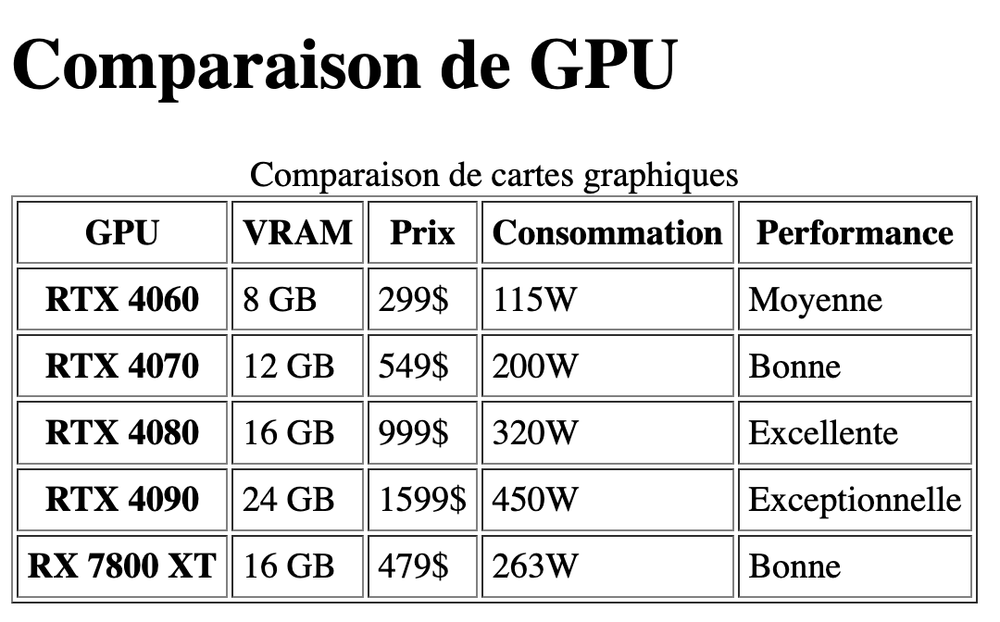

---
---

# 7-B 😈 Boss: Tableau de comparaison de GPU

:::info Objectif
Utiliser les balises de tableau pour créer un tableau de comparaison de produits.
:::

Vous devez créer un tableau comparant les produits suivants:

**RTX 4060**
- VRAM: 8 GB
- Prix: 299$
- Consommation : 115W
- Performance: Moyenne

**RTX 4070**
- VRAM: 12 GB
- Prix: 549$
- Consommation: 200W
- Performance: Bonne

**RTX 4080**
- VRAM: 16 GB
- Prix: 999$
- Consommation: 320W
- Performance: Excellente

**RTX 4090**
- VRAM: 24 GB
- Prix: 1599$
- Consommation: 450W
- Performance: Exceptionnelle

**RX 7800 XT**
- VRAM: 16 GB
- Prix: 479$
- Consommation: 263W
- Performance: Bonne

## Consignes

1. Créez un tableau comparatif à l'aide des balises `table`, `tr`, `th` et `td` afin de présenter les produits pllus haut sous forme de tableau.
2. Utilisez `caption` pour associer un titre au tableau
3. Ajoutez une bordure au tableau
4. Ajoutez une marge intérieure aux cellules

## Résultat attendu

 

    Cheat Code (solution) 
 

  <SandpackPlayground
      template="static"
      editorHeight={900}
      files={{
      '/index.html': `<!DOCTYPE html>
<html lang="en">
<head>
  <meta charset="UTF-8">
  <meta name="viewport" content="width=device-width, initial-scale=1.0">
  <title>Tableau comparatif de GPU</title>
</head>
<body>
  <h1>Comparaison de GPU</h1>
  <table border="1" cellpadding="4">
    <caption>Comparaison de cartes graphiques</caption>
    <thead>
        <tr>
            <th>GPU</th>
            <th>VRAM</th>
            <th>Prix</th>
            <th>Consommation</th>
            <th>Performance</th>
        </tr>
    </thead>
    <tbody>
        <tr>
            <th>RTX 4060</th>
            <td>8 GB</td>
            <td>299$</td>
            <td>115W</td>
            <td>Moyenne</td>
        </tr>
        <tr>
            <th>RTX 4070</th>
            <td>12 GB</td>
            <td>549$</td>
            <td>200W</td>
            <td>Bonne</td>
        </tr>
        <tr>
            <th>RTX 4080</th>
            <td>16 GB</td>
            <td>999$</td>
            <td>320W</td>
            <td>Excellente</td>
        </tr>
        <tr>
            <th>RTX 4090</th>
            <td>24 GB</td>
            <td>1599$</td>
            <td>450W</td>
            <td>Exceptionnelle</td>
        </tr>
        <tr>
            <th>RX 7800 XT</th>
            <td>16 GB</td>
            <td>479$</td>
            <td>263W</td>
            <td>Bonne</td>
        </tr>
    </tbody>
</table>
</body>
</html>`
      }}
  />  
 
