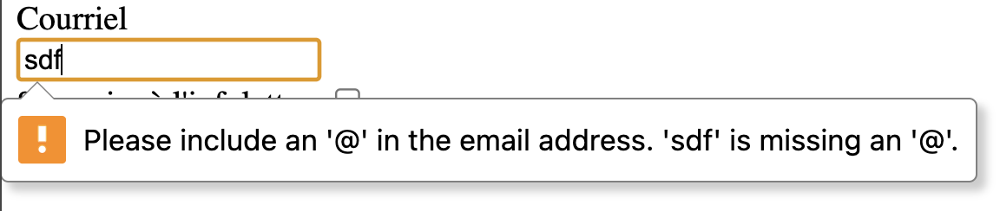
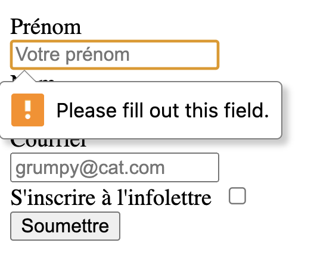

---
---

# 📚 Les formulaires

Les formulaires HTML permettent aux utilisateurs de saisir et soumettre des données. Ils sont essentiels pour les inscriptions, connexions, commandes, sondages, recherches et toute interaction nécessitant une entrée de données de l'utilisateur.

:::caution
Dans le cours, nous verrons les balises de base d'un formulaire, mais nous n'en ferons pas l'envoi en tant que tel. En effet, pour soumettre le formulaire et traiter les données, il faut soit un serveur Web capable de recevoir les données ou encore avoir recours à JavaScript pour les traiter côté navigateur.
:::

## Structure de Base d'un formulaire

### L'élément `<form>`

Tout formulaire commence par la balise `<form>`:

```html
<form>
    <!-- Champs du formulaire -->
</form>
```

La balise `form` peut prendre certains attributs tels que:
- `action`: URL où envoyer les données
- `method`: Méthode HTTP (GET ou POST)
- `enctype`: Type d'encodage (pour l'upload de fichiers)

Cependant, pour les besoins du cours, nous utilisons la balise `form` seule. En effet, les attributs supplémentaires seront traités dans vos autres cours de Web.

## L'élément `<input>` et `<label>`

Pour accepter des entrées en provenance de l'utilisateur, des champs de formulaire permettant la saisi utilisateur doivent être présents. La balise de base pour créer un champ de saisie est la balise `<input>`. La balise `<label>` quant à elle permet d'associer un libellé au champ texte.

### Champ texte simple avec `input`

Afin d'afficher un champ texte simple, on peut utiliser `input` avec le type (attribut) `text`:

<SandpackPlayground
    template="static"
    editorHeight={200}
    files={{
    '/index.html': `<input type="text">`
    }}
/>

### Identifier un champ avec `label`

Pour identifier le champ, on peut utiliser `<label>`:

<SandpackPlayground
    template="static"
    editorHeight={200}
    files={{
    '/index.html': `<label>Prénom:</label>
<input type="text">`
    }}
/>

### Libellé et retour de ligne

Pour afficher le libellé au dessus du champ, on peut simplement appliquer un retour de ligne.

<SandpackPlayground
    template="static"
    editorHeight={200}
    files={{
    '/index.html': `<label>Prénom<br /></label>
<input type="text">`
    }}
/>

### Associer un libellé au champ avec `for`

Il est important de communiquer à quel champ le libellé est associé. Pour cela, on utilise l'attribut `for`, associé à un `id` sur la balise `input`.

Par exemple:

<SandpackPlayground
    template="static"
    editorHeight={200}
    files={{
    '/index.html': `<label for="prenom">Prénom:</label>
<input type="text" id="prenom">`
    }}
/>

<p></p>

:::tip
La valeur associée à `for` et à `id` doivent correspondre! On vient dire: ce libellé est **pour (for)** l'indentidiant précisé. 
:::

### Invite à la saisi avec `placeholder`

Il est possible de mettre une valeur d'exemple dans un champ à l'aide de l'attribut `placeholder` de la façon suivante:

<SandpackPlayground
    template="static"
    editorHeight={200}
    files={{
    '/index.html': `<label for="prenom">Prénom:</label>
<input type="text" id="prenom" placeholder="Votre prénom">`
    }}
/>

L'attribut placeholder rend le formulaire plus invitant et permet d'apporter des précisions sur certains champs.

## Bouton d'envoi

Pour soumettre le formulaire, il est possible d'ajouter un bouton à l'aide de la balise `<button>`.

```html
<button type="submit">Envoyer</button>
```

<SandpackPlayground
    template="static"
    editorHeight={200}
    files={{
    '/index.html': `<form>
    <label for="prenom">Prénom:</label>
<input type="text" id="prenom" placeholder="Votre prénom">
<button>Envoyer</button>
</form>`
    }}
/>

<p></p>

## Organiser plusieurs champs à l'aide de `div`

Lorsque vous avez plusieurs champs dans votre formulaire, cela aura pour effet de les mettre un à la suite de l'autre, comme ceci:

<SandpackPlayground
    template="static"
    editorHeight={200}
    files={{
    '/index.html': `<form>
    <label for="prenom">Prénom</label><br />
    <input type="text" id="prenom" placeholder="Votre prénom">
    <label for="nom">Nom</label><br />
    <input type="text" id="nom" placeholder="Votre Nom">
    <button>Envoyer</button>
</form>`
    }}
/>

<p></p>

Pour éviter cette situation, utilisez des div pour regrouper ensemble le champ et son libellé!

<SandpackPlayground
    template="static"
    editorHeight={400}
    files={{
    '/index.html': `<form>
    <div>
      <label for="prenom">Prénom</label><br />
      <input type="text" id="prenom" placeholder="Votre prénom">
    </div>
    
    <div>
      <label for="nom">Nom</label><br />
      <input type="text" id="nom" placeholder="Votre Nom">
    </div>

    <button>Envoyer</button>
</form>`
    }}
/>

## Zone de texte multilignes - `<textarea>`

Pour afficher un champ texte pouvant afficher plusieurs lignes, vous pouvez utiliser la balise `textarea`.

<SandpackPlayground
    template="static"
    editorHeight={200}
    files={{
    '/index.html': `<label for="message">Message :</label>
<textarea id="message" rows="5" cols="40" placeholder="Votre message ici..."></textarea>`
    }}
/>

<p></p>

**Attributs utiles:**
- `rows`: Nombre de lignes visibles
- `cols`: Nombre de colonnes (caractères par ligne)
- `maxlength`: Limite de caractères

## L'élément `input` plus en détail

Nous venons de voir la base de l'élément `input`, c'est-à-dire en l'utilisant pour un champ texte à l'aide de `type="text"`, mais il existe d'autres types.

### Champs texte de base

#### `type="text"` - Texte simple

<SandpackPlayground
    template="static"
    editorHeight={200}
    files={{
    '/index.html': `<label for="prenom">Prénom:</label>
<input type="text" id="prenom">`
    }}
/>

#### `type="email"` - Adresse email

<SandpackPlayground
    template="static"
    editorHeight={200}
    files={{
    '/index.html': `<label for="email">Email:</label>
<input type="email" id="email" placeholder="nom@exemple.com">`
    }}
/>

<p></p>

:::info
L'utilité par rapport à un champ texte conventionnel est une validation en provenance du navigateur lorsqu'on essaie de soumettre un formulaire ayant un champ courriel pour lequel le courriel n'est pas dans un format valide. Par exemple:


:::

#### `type="password"` - Mot de passe

<SandpackPlayground
    template="static"
    editorHeight={200}
    files={{
    '/index.html': `<label for="motdepasse">Mot de passe:</label>
<input type="password" id="motdepasse">`
    }}
/>

<p></p>

:::info
Un champ `password` masquera l'entrée de l'utilisateur automatiquement.
:::

#### `type="url"` - URL

<SandpackPlayground
    template="static"
    editorHeight={200}
    files={{
    '/index.html': `<label for="site">Site web:</label>
<input type="url" id="site" placeholder="https://exemple.com">`
    }}
/>

### Champs numériques - `type="number"`

<SandpackPlayground
    template="static"
    editorHeight={200}
    files={{
    '/index.html': `<label for="age">Âge:</label>
<input type="number" id="age" min="0" max="120" step="1">`
    }}
/>

### Champs de date - `type="date"`

<SandpackPlayground
    template="static"
    editorHeight={200}
    files={{
    '/index.html': `<label for="naissance">Date de naissance:</label>
<input type="date" id="naissance">`
    }}
/>

### Champs de sélection

#### `type="radio"` - Boutons radio (choix unique)

<SandpackPlayground
    template="static"
    files={{
    '/index.html': `<input type="radio" id="homme" value="homme">
<label for="homme">Homme</label>

<input type="radio" id="femme" value="femme">
<label for="femme">Femme</label>

<input type="radio" id="autre" value="autre">
<label for="autre">Autre</label>`
    }}
/>

##### L'attribut `name`

Pour que les boutons radio se comportent comme faisant partie de la même sélection (possibilité d'en cocher un seul dans la liste), vous devez leur donner un attribut `name` identique.

<SandpackPlayground
    template="static"
    files={{
    '/index.html': `<input type="radio" id="homme" value="homme" name="genre">
<label for="homme">Homme</label>

<input type="radio" id="femme" value="femme" name="genre">
<label for="femme">Femme</label>

<input type="radio" id="autre" value="autre" name="genre">
<label for="autre">Autre</label>`
    }}
/>

#### `type="checkbox"` - Cases à cocher (choix multiples)

<SandpackPlayground
    template="static"
    files={{
    '/index.html': `<input type="checkbox" id="html" value="html">
    <label for="html">HTML</label>
    
    <input type="checkbox" id="css" value="css">
    <label for="css">CSS</label>
    
    <input type="checkbox" id="javascript" value="javascript">
    <label for="javascript">JavaScript</label>
    
    <input type="checkbox" id="python" value="python">
    <label for="python">Python</label>`
    }}
/>

### Champs de fichier

#### `type="file"` - Upload de fichier
```html
<label for="cv">CV (PDF) :</label>
<input type="file" id="cv">
```

### `<select>` - Liste déroulante

La balise `<select>` permet d'afficher une liste déroulante, c'est-à-dire un menu offrant des options fixes parmis lesquelles l'utilisateur doit choisir. On utilise ce champ lorsqu'on ne veut pas lister dans la page toutes les possibilités puisque cela allourdirait inutilement l'interface.

<SandpackPlayground
    template="static"
    files={{
    '/index.html': `<label for="pays">Pays:</label>
<select id="pays">
    <option value="">Sélectionnez un pays</option>
    <option value="fr">France</option>
    <option value="ca">Canada</option>
    <option value="us">États-Unis</option>
    <option value="de">Allemagne</option>
</select>`
    }}
/>

## Validations de champs requis

Pour valider qu'un champ doit être rempli avant de soumettre le formulaire, il est possible de simplement ajouter l'attribut `required` sur ce dernier.

```html
<input type="text" id="prenom" placeholder="Votre prénom" required>
```

Cela aura pour effet de déclencer un message d'erreur si les champs ne sont pas remplis:



## Bonnes Pratiques

### Structure et organisation

1. **Associez toujours les labels** avec les champs (`for` et `id`)
2. **Ordonnez logiquement** les champs (informations personnelles → contact → préférences)
3. **Un label par champ** - soyez explicites

### Expérience utilisateur

1. **Utilisez les bons types d'input** (email, tel, number, etc.)
2. Utilisez `required` pour valider les champs requis
3. **Fournissez des `placeholder` utiles**