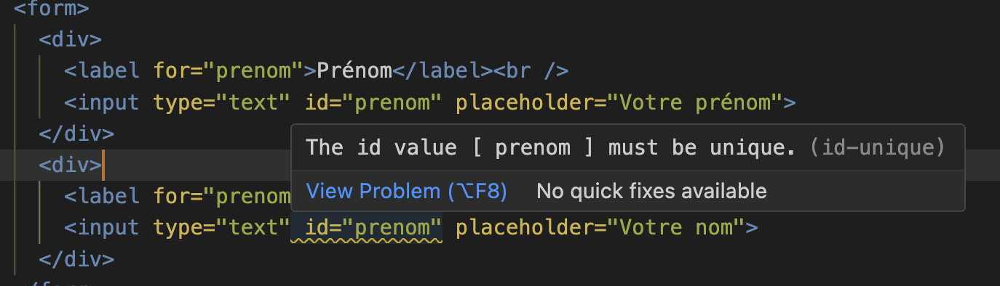

---
---

# 8-1 Intégrer un formulaire simple

Créons un formulaire simple permettant de s'inscrire à une activité. Le formulaire que nous créerons est le suivant:


<SandpackPlayground
    template="static"
    editorHeight={700}
    files={{
    '/index.html': `<!DOCTYPE html>
<html lang="en">
<head>
  <meta charset="UTF-8">
  <meta name="viewport" content="width=device-width, initial-scale=1.0">
  <title>S'inscrire à l'activité</title>
</head>
<body>
  <h1>S'inscrire à l'activité</h1>

  <form>
    <div>
      <label for="prenom">Prénom</label><br />
      <input type="text" id="prenom" placeholder="Votre prénom" required>
    </div>
    <div>
      <label for="nom">Nom</label><br />
      <input type="text" id="nom" placeholder="Votre nom" required>
    </div>
    <div>
      <label for="courriel">Courriel</label><br />
      <input type="email" id="courriel" placeholder="grumpy@cat.com" required>
    </div>
    <div>
      <label for="inscription-infolettre">S'inscrire à l'infolettre</label>&nbsp;
      <input type="checkbox" id="inscription-infolettre">
    </div>

    <button>Soumettre</button>
  </form>
</body>
</html>`
    }}
/>

## Base du formulaire

Tout formulaire commence par une balise `<form>`: ajoutez cette balise à votre document HTML.

1. Créez un document HTML de base
2. Ajoutez la balise `<form>` pour contenir le formulaire
  ```html
  <!DOCTYPE html>
  <html lang="en">
  <head>
    <meta charset="UTF-8">
    <meta name="viewport" content="width=device-width, initial-scale=1.0">
    <title>S'inscrire à l'activité</title>
  </head>
  <body>
    <h1>S'inscrire à l'activité</h1>

    //highlight-start
    <form>
      
    </form>
    //highlight-end
  </body>
  </html>
  ```

## Ajouter un champ `Prénom`

Commençons par ajouter un champ texte `prénom`.

### Ajouter le champ et le libellé
Pour cela, on utilise la balise `input` avec l'attribut `type="text"`. De plus, il nous faudra un libellé pour afficher le nom du formulaire.

1. Ajouter un `<input type="text">`
    ```html
    <form>
      //higlight-next-line
      <input type="text">
    </form>
    ```
2. Ajoutez un libellé à l'aide de `<label>`
    ```html
    <form>
      //higlight-next-line
      <label>Prénom</label>
      <input type="text">
    </form>
    ```

### Lier le champ et le libellé
Pour créer un lien entre le champ et le libellé, on doit donner un `id` au `input` et y faire ensuite référence via l'attribut `for` du libellé.

1. Ajouter un `id` au `input`
    ```html
    <form>
      <label>Prénom</label>
      //higlight-next-line
      <input type="text" id="prenom">
    </form>
    ``` 
2. Lier les deux à l'aide de `for` sur `label` 
    ```html
    <form>
      <label for="prenom">Prénom</label>
      <input type="text" id="prenom">
    </form>
    ```

### Ajouter une invite à la saisi à l'aide de `placeholder`
Afin de préciser à l'utilisateur le rôle du champ, de lui donner de l'information supplémentaire et d'agrémenter le formulaire, on peut utiliser `placeholder`.

Cela aura pour effet d'afficher une invite à la saisi à l'intérieur du champ.

```html
<form>
  <label for="prenom">Prénom</label>
  //highlight-next-line
  <input type="text" id="prenom" placeholder="Votre prénom">
</form>
```

### Utiliser un `div` pour isoler le champ

Afin d'isoler le champ et que ce dernier soit seul sur la ligne, enveloppons l'un d'un `div`.

```html
<form>
  //highlight-next-line
  <div>
    <label for="prenom">Prénom</label>
    <input type="text" id="prenom" placeholder="Votre prénom">
  //highlight-next-line
  </div>
</form>
```

De plus, ajoutez un `br` à la fin du `label` pour que le champ et le libellé soit sur deux lignes distinctes.

```html
<form>
  <div>
    <label for="prenom">Prénom</label><br />
    <input type="text" id="prenom" placeholder="Votre prénom">
  </div>
</form>
```

## Test

À cette étape, vous devriez avoir ceci:

<SandpackPlayground
    template="static"
    files={{
    '/index.html': `<!DOCTYPE html>
<html lang="en">
<head>
  <meta charset="UTF-8">
  <meta name="viewport" content="width=device-width, initial-scale=1.0">
  <title>S'inscrire à l'activité</title>
</head>
<body>
  <h1>S'inscrire à l'activité</h1>

  <form>
    <div>
      <label for="prenom">Prénom</label><br />
      <input type="text" id="prenom" placeholder="Votre prénom">
    </div>
  </form>
</body>
</html>`
    }}
/>

## Ajouter un champ nom

On peut procéder exactement de la même façon pour ajouter un champ nom:

```html
<form>
  <div>
    <label for="prenom">Prénom</label><br />
    <input type="text" id="prenom" placeholder="Votre prénom">
  </div>
  //highlight-start
  <div>
    <label for="nom">Nom</label><br />
    <input type="text" id="nom" placeholder="Votre nom">
  </div>
  //highlight-end
</form>
```

:::danger
Il est important de bien changer le `id`. Si vous faites simplement un copier coller et que vous utilisez le `id="prenom` pour le champ `nom`, vous aurez un avertissement dans VS Code:



Les `id` doivent être uniques dans la page, c'est pourquoi vous recevrez cet avertissement.
:::

## Ajouter un champ courriel

On peut ajouter un champ courriel de la même façon que les deux autres champs, mais cette fois en choisissant `type="email"`. Ce choix fait en sorte qu'un courriel au bon format (avec un "@" et un nom de domaine) doit être entré lorsque le formulaire est envoyé. Autrement, l'envoi sera empêché.

```html
<form>
  <div>
    <label for="prenom">Prénom</label><br />
    <input type="text" id="prenom" placeholder="Votre prénom">
  </div>
  <div>
    <label for="nom">Nom</label><br />
    <input type="text" id="nom" placeholder="Votre nom">
  </div>
  //highlight-start
  <div>
    <label for="courriel">Courriel</label><br />
    <input type="email" id="courriel" placeholder="grumpy@cat.com">
  </div>
  //highlight-end
</form>
```

## Ajouter un champ `S'inscrire à l'infolettre`

Il n'est pas rare de voir une boite à cocher de type `S'inscrire à l'infolettre` lorsqu'on rempli un formulaire d'inscription.

Pour ce faire, comme vu dans le document de référence, on peut utiliser un `input` avec le type `checkbox`.

```html
<form>
  <div>
    <label for="prenom">Prénom</label><br />
    <input type="text" id="prenom" placeholder="Votre prénom">
  </div>
  <div>
    <label for="nom">Nom</label><br />
    <input type="text" id="nom" placeholder="Votre nom">
  </div>
  <div>
    <label for="courriel">Courriel</label><br />
    <input type="email" id="courriel" placeholder="grumpy@cat.com">
  </div>
  //highlight-start
  <div>
    <label for="inscription-infolettre">S'inscrire à l'infolettre</label>&nbsp;
    <input type="checkbox" id="inscription-infolettre">
  </div>
  //highlight-end
</form>
```

:::info
Remarquez ici l'utilisation de `&nbsp` (espace insécable) plutôt que `br` afin que la boite à cocher et le texte du libellé soient sur la même ligne.
:::

## Ajouter un bouton soumettre

Finalement, on peut ajouter le bouton soumettre!

```html
<form>
  <div>
    <label for="prenom">Prénom</label><br />
    <input type="text" id="prenom" placeholder="Votre prénom">
  </div>
  <div>
    <label for="nom">Nom</label><br />
    <input type="text" id="nom" placeholder="Votre nom">
  </div>
  <div>
    <label for="courriel">Courriel</label><br />
    <input type="email" id="courriel" placeholder="grumpy@cat.com">
  </div>
  <div>
    <label for="inscription-infolettre">S'inscrire à l'infolettre</label>&nbsp;
    <input type="checkbox" id="inscription-infolettre">
  </div>

  //highlight-next-line
  <button>Soumettre</button>
</form>
```

## Validations

Ajoutez l'attribut `required` aux champs `prenom`, `nom` et `courriel` afin de les rendre requis par le navigateur.

Cela aura pour effet de déclencher un message d'erreur si les champs ne sont pas remplis:


```html
<form>
  <div>
    <label for="prenom">Prénom</label><br />
    //highlight-next-line
    <input type="text" id="prenom" placeholder="Votre prénom" required>
  </div>
  <div>
    <label for="nom">Nom</label><br />
    //highlight-next-line
    <input type="text" id="nom" placeholder="Votre nom" required>
  </div>
  <div>
    <label for="courriel">Courriel</label><br />
    //highlight-next-line
    <input type="email" id="courriel" placeholder="grumpy@cat.com" required>
  </div>
  <div>
    <label for="inscription-infolettre">S'inscrire à l'infolettre</label>&nbsp;
    <input type="checkbox" id="inscription-infolettre">
  </div>

  <button>Soumettre</button>
</form>
```


## Résultat final

Vous devriez avoir ceci comme résultat:

<SandpackPlayground
    template="static"
    editorHeight={700}
    files={{
    '/index.html': `<!DOCTYPE html>
<html lang="en">
<head>
  <meta charset="UTF-8">
  <meta name="viewport" content="width=device-width, initial-scale=1.0">
  <title>S'inscrire à l'activité</title>
</head>
<body>
  <h1>S'inscrire à l'activité</h1>

  <form>
    <div>
      <label for="prenom">Prénom</label><br />
      <input type="text" id="prenom" placeholder="Votre prénom" required>
    </div>
    <div>
      <label for="nom">Nom</label><br />
      <input type="text" id="nom" placeholder="Votre nom" required>
    </div>
    <div>
      <label for="courriel">Courriel</label><br />
      <input type="email" id="courriel" placeholder="grumpy@cat.com" required>
    </div>
    <div>
      <label for="inscription-infolettre">S'inscrire à l'infolettre</label>&nbsp;
      <input type="checkbox" id="inscription-infolettre">
    </div>

    <button>Soumettre</button>
  </form>
</body>
</html>`
    }}
/>