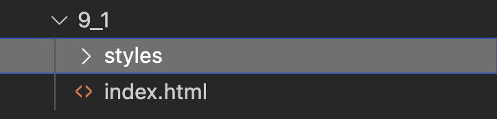
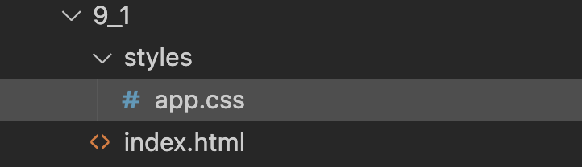

---
---

# 9-1 Première page avec CSS

Intégrons du CSS à une page et découvrons les bases!

Dans ce petit tutoriel, nous ajouterons des styles de base à une page existante. Nous verrons les différentes façons d'intégrer du style et passerons rapidement à la méthode d'intégration externe (fichier css indépendant).

## Structure et contenu de base

Premièrement, créez un nouveau fichier `index.html` dans un nouveau dossier et utilisez ce code HTML de départ.

```html
<!DOCTYPE html>
<html lang="fr">
<head>
  <meta charset="UTF-8">
  <meta name="viewport" content="width=device-width, initial-scale=1.0">
  <title>Mes jeux vidéos classiques</title>
</head>
<body>
  <header id="header">
    <h1>Mes jeux vidéos classiques</h1>
    <p>Voici une liste composée de certains de mes jeux vidéos favoris!</p>
  </header>

  <section id="liste-jeux">
    <div class="jeu meilleur">
      <h2>The Legend of Zelda: Ocarina of Times (1998)</h2>
      <p><span class="plateforme">Plateforme: </span> Nintendo 64</p>
      <p class="description">Considéré comme l'un des plus grands jeux vidéo de tous les temps, Ocarina of Time suit Link dans sa quête pour sauver Hyrule du mal incarné par Ganondorf. Le jeu révolutionne la série Zelda en passant à la 3D, introduisant un système de ciblage (Z-targeting) qui devient la norme pour les jeux d'action 3D.</p>
    </div>

    <div class="jeu">
      <h2>Space Quest 6: Roger Wilco in The Spinal Frontier (1995)</h2>
      <p><span class="plateforme">Plateforme: </span> PC (DOS/Windows)</p>
      <p class="description">Le dernier épisode de la série Space Quest des studios Sierra, ce jeu suit les mésaventures de Roger Wilco, concierge spatial devenu héros malgré lui. Dans cet épisode, Roger doit sauver sa partenaire Beatrice Creakknee Wankmeister qui a été miniaturisée et injectée dans son propre corps !</p>
    </div>

    <div class="jeu">
      <h2>Super Mario Kart (1992)</h2>
      <p><span class="plateforme">Plateforme: </span> Super Nintendo</p>
      <p class="description">Le tout premier jeu de la série Mario Kart qui établit la formule magique: courses de kart avec les personnages de l'univers Mario, circuits colorés, et objets délirants. Utilise la puce Super FX pour créer un effet de pseudo-3D révolutionnaire sur SNES.</p>
    </div>
  </section>
</body>
</html>
```

## Intégrer du style

Pour intégrer du style dans la page, nous avons essentiellement trois options:
* Balise `<style>` dans la section `head` du site
* Style appelé "inline" à même les balises
* Fichier CSS externe (recommandé)

### Utiliser la balise style

Commençons par utiliser la balise `<style>` dans le `head` du site.

1. Ajoutez la balise `<style>` de cette façon: 
    ```html
    <!DOCTYPE html>
    <html lang="fr">
    <head>
      <meta charset="UTF-8">
      <meta name="viewport" content="width=device-width, initial-scale=1.0">
      <title>Mes jeux vidéos classiques</title>

      //highlight-start
      <style>
        
      </style>
      //highlight-end
    </head>

    <!-- ... -->
    ```

    :::info
    La balise `style` permet d'intégrer du CSS à même la page. Cette balise doit être ajoutée à l'en-tête du site, soit à l'intérieur de `<head>`.
    :::
2. Nous allons modifier la couleur d'arrière-plan du site. Pour cela, nous allons cibler l'élément `body` et changer sa propriété `background-color`.
    ```html
    <!DOCTYPE html>
    <html lang="fr">
    <head>
      <meta charset="UTF-8">
      <meta name="viewport" content="width=device-width, initial-scale=1.0">
      <title>Mes jeux vidéos classiques</title>

      <style>
        //highlight-start
        body {
          background-color: aliceblue;
        }
        //highlight-end
      </style>
    </head>
    ```

    :::info
    Une règle CSS comprend:
    - Un sélecteur: l'élément ou les éléments à cibler (`body` ici). Il est possible de cibler un élément par:
      - `Élément (balise)`: `h1`, `p`, `div`
      - `Classe`: `.ma-classe`
      - `ID`: `#mon-id`
    - Les accolades (`{}`) pour délimiter les attributs à modifier
    - Les propriétés à modifier sous la forme `[propriété]: [valeur]`;

    Ici, on modifie la propriété `background-color`. Il existe plusieurs formats de couleur:
    - RGB
    - Hexadécimal
    - Nom (ex.: red, blue, aliceblue, etc)

    Nous verrons ces différentes façons de désigner des couleurs bientôt.
    :::

Votre page devrait maintenant avoir un arrière-plan bleuté!

:::caution
Cette façon d'intégrer du CSS est difficile à réutiliser. En effet, si je veux mettre l'arrière-plan de cette couleur sur plusieurs pages, je dois répéter cette balise (copier-coller!).
:::

### Utiliser la propriété `style` directement sur l'élément

Une façon alternative est de spécifier les valeurs CSS directement sur l'élément désiré. Par exemple:

```html
<!-- ... -->

<body style="background-color: red;">

<!-- ... -->
```

:::caution
Remarquez que votre arrière-plan sera maintenant rouge! Vous avez défini la même règle à deux endroits et c'est `style` sur l'élément qui l'a emporté. C'est ce qu'on appelle la **spécificité**: certaines règles ou certaines façons de déclarer les règles CSS l'emportent sur d'autres.
:::

### Utiliser un fichier externe (RECOMMANDÉ!)

La méthode recommandée est cependant d'utiliser un fichier CSS distinct pouvant être réutilisé sur plusieurs pages.

**Ajoutons un fichier `CSS`** à notre structure de fichier pour y contenir les styles du site web.

1. **Créez un dossier `styles**` au même niveau que votre fichier `index.html`

    
2. **Ajoutez un fichier `app.css`** sous le dossier `styles`
    
    

    :::info
    Le fichier a été nommé `app.css` comme dans "application", soit le style de l'application.
    :::
3. **Faire un lien entre votre fichier `HTML` et `CSS`**. Pour que `index.html` puisse faire usage de `app.css`, on doit les lier ensemble via la balise `link`. Ajoutez la référence dans la portion `head` de votre fichier `index.html`:
    ```html title="index.html"
    <!DOCTYPE html>
    <html lang="fr">
    <head>
      <meta charset="UTF-8">
      <meta name="viewport" content="width=device-width, initial-scale=1.0">
      //highlight-next-line
      <link rel="stylesheet" href="./styles/app.css">
      <title>Mes jeux vidéos classiques</title>
    ```

    :::info
    La balise `<link>` permet de faire un lien vers une ressource externe et de l'inclure dans la page comme si elle en faisait partie intégrale.

    L'attribut `rel` indique quelle est la relation entre le document HTML et la ressource liée, c'est-à-dire que le type de contenu à charger est une feuille de style.

    L'attribut `href` spécifie où trouver le fichier CSS. Il est possible de préciser des chemins autant relatifs que absolus.
    :::

4. Écrire la règle CSS pour la couleur de l'arrière-plan dans le fichier `app.css`
    ```css title="styles/app.css"
    body {
      background-color: aliceblue;
    }
    ```
5. Assurez-vous de retirer le style "inline" et aussi dans l'en-tête pour qu'il ne vous reste que ceci.
    ```html title="index.html"
    <!DOCTYPE html>
    <html lang="fr">
    <head>
      <meta charset="UTF-8">
      <meta name="viewport" content="width=device-width, initial-scale=1.0">
      <link rel="stylesheet" href="./styles/app.css">
      <title>Mes jeux vidéos classiques</title>
    </head>
    <body>
    ```

Votre arrière-plan devrait être bleu maintenant et ce style provient de `app.css`! 🎉

## Styliser l'en-tête avec un `id`

Si vous remarquez, l'en-tête du site a le id `header`.

```html
<header id="header">
```

Pour cibler un élément par `id` en CSS, on précède le `id` en question d'un `#` (C'est un peu comme le mécanisme d'ancres dans les liens en HTML).

1. Ajoutez une nouvelle règle dans votre fichier CSS pour cibler l'élément avec le id `header`
    ```css
    body {
      background-color: aliceblue;
    }

    //highlight-start
    #header {
      
    }
    //highlight-end
    ```
2. Modifions la couleur d'arrière-plan
    ```css
    body {
      background-color: aliceblue;
    }

    #header {
      //highlight-next-line
      background-color: rgb(33,33,33);
    }
    ```

    :::info
    Ici, j'ai utilisé le format `rgb`! Ce dernier prend trois niveaux de couleur entre 0 et 255:
    - Red (rouge)
    - Green (vert)
    - Blue (bleu)

    Une couleur est formée à partir de ces trois paramètres.

    Nous verrons dans la section sur les couleurs les différents formats de couleur.
    :::
3. Modifions la couleur du texte à l'intérieur de l'en-tête avec `color`.
    ```css
    body {
      background-color: aliceblue;
    }

    #header {
      background-color: rgb(33,33,33);
      //highlight-next-line
      color: rgb(255,255,255);
    }
    ```

    :::info
    La propriété `color` contrôle la couleur du texte à l'intérieur d'un élément.
    :::

À cette étape-ci, vous devriez avoir quelque chose comme ceci:

<SandpackPlayground
    template="static"
    editorHeight={700}
    files={{
    '/index.html': `<!DOCTYPE html>
<html lang="fr">
<head>
  <meta charset="UTF-8">
  <meta name="viewport" content="width=device-width, initial-scale=1.0">
  <link rel="stylesheet" href="./styles/app.css">
  <title>Mes jeux vidéos classiques</title>
</head>
<body>
  <header id="header">
    <h1>Mes jeux vidéos classiques</h1>
    <p>Voici une liste composée de certains de mes jeux vidéos favoris!</p>
  </header>

  <section id="liste-jeux">
    <div class="jeu meilleur">
      <h2>The Legend of Zelda: Ocarina of Times (1998)</h2>
      <p><span class="plateforme">Plateforme: </span> Nintendo 64</p>
      <p class="description">Considéré comme l'un des plus grands jeux vidéo de tous les temps, Ocarina of Time suit Link dans sa quête pour sauver Hyrule du mal incarné par Ganondorf. Le jeu révolutionne la série Zelda en passant à la 3D, introduisant un système de ciblage (Z-targeting) qui devient la norme pour les jeux d'action 3D.</p>
    </div>

    <div class="jeu">
      <h2>Space Quest 6: Roger Wilco in The Spinal Frontier (1995)</h2>
      <p><span class="plateforme">Plateforme: </span> PC (DOS/Windows)</p>
      <p class="description">Le dernier épisode de la série Space Quest des studios Sierra, ce jeu suit les mésaventures de Roger Wilco, concierge spatial devenu héros malgré lui. Dans cet épisode, Roger doit sauver sa partenaire Beatrice Creakknee Wankmeister qui a été miniaturisée et injectée dans son propre corps !</p>
    </div>

    <div class="jeu">
      <h2>Super Mario Kart (1992)</h2>
      <p><span class="plateforme">Plateforme: </span> Super Nintendo</p>
      <p class="description">Le tout premier jeu de la série Mario Kart qui établit la formule magique: courses de kart avec les personnages de l'univers Mario, circuits colorés, et objets délirants. Utilise la puce Super FX pour créer un effet de pseudo-3D révolutionnaire sur SNES.</p>
    </div>
  </section>
</body>
</html>`,
'styles/app.css': `body {
  background-color: aliceblue;
}

#header {
  background-color: rgb(33,33,33);
  color: rgb(255,255,255);
}
`
    }}
/>

## Cibler une classe CSS

Si vous remarquez, les jeux ont tous la même classe CSS:

```html
<div class="jeu">
```

:::info
Une classe CSS est un identifiant que vous appliquez à un ou plusieurs éléments HTML pour leur associer des styles CSS communs

Via une règle CSS, on peut cibler les éléments portant cette classe et tous les modifier en même temps!
:::

Pour cibler une classe en CSS, on utilise le `.` suivi du nom de la classe.

1. Ajoutez une règle CSS pour cibler la classe `jeu`
    ```css
    body {
      background-color: aliceblue;
    }

    #header {
      background-color: rgb(33,33,33);
      color: rgb(255,255,255);
    }

    //highlight-start
    .jeu {
      
    }
    //highlight-end
    ```
2. Ajoutons une règle pour appliquer une bordure de couleur à l'aide de `border`
    ```css
    body {
      background-color: aliceblue;
    }

    #header {
      background-color: rgb(33,33,33);
      color: rgb(255,255,255);
    }

    .jeu {
      border: 2px solid rgb(220, 220, 180)
    }
    ```

    :::info
    Nous verrons le tout plus en détail prochainement, mais une bordure prend trois valeurs:
    - `[épaisseur]` `[type]` `couleur`

    Ici, on crée une **bordure de 2 pixels de large**, **solide (pas de pointillé)** et de **couleur `rgb(220, 220, 180)`**
    :::

Vous devriez maintenant avoir une bordure autour de chaque élément de jeu! 🎉

<SandpackPlayground
    template="static"
    editorHeight={700}
    files={{
    '/index.html': `<!DOCTYPE html>
<html lang="fr">
<head>
  <meta charset="UTF-8">
  <meta name="viewport" content="width=device-width, initial-scale=1.0">
  <link rel="stylesheet" href="./styles/app.css">
  <title>Mes jeux vidéos classiques</title>
</head>
<body>
  <header id="header">
    <h1>Mes jeux vidéos classiques</h1>
    <p>Voici une liste composée de certains de mes jeux vidéos favoris!</p>
  </header>

  <section id="liste-jeux">
    <div class="jeu meilleur">
      <h2>The Legend of Zelda: Ocarina of Times (1998)</h2>
      <p><span class="plateforme">Plateforme: </span> Nintendo 64</p>
      <p class="description">Considéré comme l'un des plus grands jeux vidéo de tous les temps, Ocarina of Time suit Link dans sa quête pour sauver Hyrule du mal incarné par Ganondorf. Le jeu révolutionne la série Zelda en passant à la 3D, introduisant un système de ciblage (Z-targeting) qui devient la norme pour les jeux d'action 3D.</p>
    </div>

    <div class="jeu">
      <h2>Space Quest 6: Roger Wilco in The Spinal Frontier (1995)</h2>
      <p><span class="plateforme">Plateforme: </span> PC (DOS/Windows)</p>
      <p class="description">Le dernier épisode de la série Space Quest des studios Sierra, ce jeu suit les mésaventures de Roger Wilco, concierge spatial devenu héros malgré lui. Dans cet épisode, Roger doit sauver sa partenaire Beatrice Creakknee Wankmeister qui a été miniaturisée et injectée dans son propre corps !</p>
    </div>

    <div class="jeu">
      <h2>Super Mario Kart (1992)</h2>
      <p><span class="plateforme">Plateforme: </span> Super Nintendo</p>
      <p class="description">Le tout premier jeu de la série Mario Kart qui établit la formule magique: courses de kart avec les personnages de l'univers Mario, circuits colorés, et objets délirants. Utilise la puce Super FX pour créer un effet de pseudo-3D révolutionnaire sur SNES.</p>
    </div>
  </section>
</body>
</html>`,
'styles/app.css': `body {
  background-color: aliceblue;
}

#header {
  background-color: rgb(33,33,33);
  color: rgb(255,255,255);
}

.jeu {
  border: 2px solid rgb(220, 220, 180)
}
`
    }}
/>

## Tester la spécificité

Il existe plusieurs façons de cibler des éléments de façon plus précise. De plus, il est possible d'écraser une règle CSS par une autre en étant plus précis au niveau de notre sélecteur.

### Plusieurs classes

Remarquez le premier jeu ayant deux classes CSS:

```html
<div class="jeu meilleur">
```

Il a une classe `jeu` et une classe `meilleur`. Il est possible de cibler cet élément précisément (ayant les deux classes!) de cette façon:

```css
body {
  background-color: aliceblue;
}

#header {
  background-color: rgb(33,33,33);
  color: rgb(255,255,255);
}

.jeu {
  border: 2px solid rgb(220, 220, 180)
}

//highlight-start
.jeu.meilleur {
  border: 2px solid red;
}
//highlight-end
```

Remarquez que comme cette règle est plus spécifique que juste `jeu`, elle vient remplacer la règle précédente de bordure et le jeu portera maintenant une bordure rouge!

### Spécificité élément vs classe

De façon similaire, on pourrait donner un style à tous les `p`, mais préciser un style différent pour la classe `description`. Même si cette dernière est appliquée sur un `p`, comme la classe est plus précise, c'est cette dernière qui aura priorité!

```css
p {
  font-style: italic;
}

.description {
  font-style: normal;
}
```

### Spécificité hiérarchique

De la même façon, on pourrait cibler précisément le `p` dans `header` même si ce dernier n'a pas de classe à proprement dit.

```css
#header p {
  color: blanchedalmond;
  font-style: normal;
}
```

Cela aura pour effet d'être appliqué seulement sur le p de l'en-tête, en plus d'écraser la règle générique sur `p`!

:::info
Pour cibler un élément à l'intérieur d'un autre, on combine les sélecteurs, séparés par des espaces.
:::

## Résultat final

Vous devriez avoir un résultat ressemblant à ceci:

<SandpackPlayground
    template="static"
    editorHeight={700}
    files={{
    '/index.html': `<!DOCTYPE html>
<html lang="fr">
<head>
  <meta charset="UTF-8">
  <meta name="viewport" content="width=device-width, initial-scale=1.0">
  <link rel="stylesheet" href="./styles/app.css">
  <title>Mes jeux vidéos classiques</title>
</head>
<body>
  <header id="header">
    <h1>Mes jeux vidéos classiques</h1>
    <p>Voici une liste composée de certains de mes jeux vidéos favoris!</p>
  </header>

  <section id="liste-jeux">
    <div class="jeu meilleur">
      <h2>The Legend of Zelda: Ocarina of Times (1998)</h2>
      <p><span class="plateforme">Plateforme: </span> Nintendo 64</p>
      <p class="description">Considéré comme l'un des plus grands jeux vidéo de tous les temps, Ocarina of Time suit Link dans sa quête pour sauver Hyrule du mal incarné par Ganondorf. Le jeu révolutionne la série Zelda en passant à la 3D, introduisant un système de ciblage (Z-targeting) qui devient la norme pour les jeux d'action 3D.</p>
    </div>

    <div class="jeu">
      <h2>Space Quest 6: Roger Wilco in The Spinal Frontier (1995)</h2>
      <p><span class="plateforme">Plateforme: </span> PC (DOS/Windows)</p>
      <p class="description">Le dernier épisode de la série Space Quest des studios Sierra, ce jeu suit les mésaventures de Roger Wilco, concierge spatial devenu héros malgré lui. Dans cet épisode, Roger doit sauver sa partenaire Beatrice Creakknee Wankmeister qui a été miniaturisée et injectée dans son propre corps !</p>
    </div>

    <div class="jeu">
      <h2>Super Mario Kart (1992)</h2>
      <p><span class="plateforme">Plateforme: </span> Super Nintendo</p>
      <p>Le tout premier jeu de la série Mario Kart qui établit la formule magique: courses de kart avec les personnages de l'univers Mario, circuits colorés, et objets délirants. Utilise la puce Super FX pour créer un effet de pseudo-3D révolutionnaire sur SNES.</p>
    </div>
  </section>
</body>
</html>`,
'styles/app.css': `body {
  background-color: aliceblue;
}

#header {
  background-color: rgb(33,33,33);
  color: rgb(255,255,255);
}

.jeu {
  border: 2px solid rgb(220, 220, 180)
}

.jeu.meilleur {
  border: 2px solid red;
}

p {
  font-style: italic;
}

.description {
  font-style: normal;
}

#header p {
  color: blanchedalmond;
  font-style: normal;
}
`
    }}
/>
