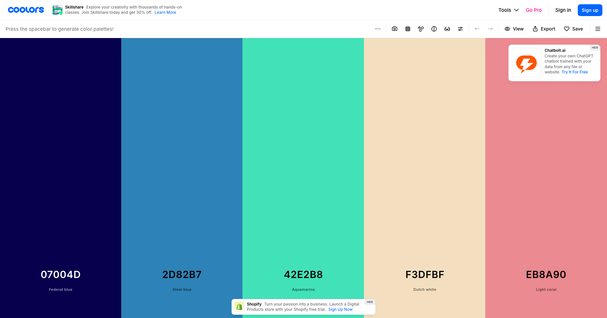

---
---

# 📚 Les couleurs

Maintenant que vous savez comment intégrer du CSS à vos pages, voyons de façon plus précise comment géréer les couleurs.

## Formats de couleurs

### Noms de couleurs prédéfinis

CSS propose plusieurs noms de couleurs prédéfinis. En voici quelques exemples:

```css
.rouge { color: red; }
.bleu { color: blue; }
.vert { color: green; }
.noir { color: black; }
.blanc { color: white; }
.gris { color: gray; }
.orange { color: orange; }
.violet { color: purple; }
```

Vous pouvez trouver une liste exhaustive ici: https://www.w3.org/wiki/CSS/Properties/color/keywords

<SandpackPlayground
  template="static"
  showTabs={true}
  files={{
    '/index.html': `<!DOCTYPE html>
<html>
<head>
    <link rel="stylesheet" href="styles.css">
</head>
<body>
    <p class="rouge">Texte rouge</p>
    <p class="bleu">Texte bleu</p>
    <p class="vert">Texte vert</p>
    <p class="orange">Texte orange</p>
    <p class="violet">Texte violet</p>
    <p class="gris">Texte gris</p>
</body>
</html>`,
    '/styles.css': `.rouge { color: red; }
.bleu { color: blue; }
.vert { color: green; }
.orange { color: orange; }
.violet { color: purple; }
.gris { color: gray; }`
  }}
/>

### Format RGB et RGBA

Le format RGB spécifie les valeurs Rouge, Vert, Bleu (0-255). RGBA ajoute un canal alpha pour la transparence (0-1).

```css
/* Format RGB */
.rouge-rgb { color: rgb(255, 0, 0); }      /* Rouge pur */
.vert-rgb { color: rgb(0, 128, 0); }       /* Vert foncé */
.bleu-rgb { color: rgb(0, 0, 255); }       /* Bleu pur */

/* Format RGBA avec transparence */
.rouge-transparent { color: rgba(255, 0, 0, 0.5); }    /* Rouge 50% transparent */
.vert-transparent { color: rgba(0, 128, 0, 0.7); }     /* Vert 30% transparent */
.bleu-transparent { color: rgba(0, 0, 255, 0.3); }     /* Bleu 70% transparent */
```

<SandpackPlayground
  template="static"
  showTabs={true}
  files={{
    '/index.html': `<!DOCTYPE html>
<html>
<head>
    <link rel="stylesheet" href="styles.css">
</head>
<body>
    <p class="rouge-rgb">Rouge RGB(255, 0, 0)</p>
    <p class="vert-rgb">Vert RGB(0, 128, 0)</p>
    <p class="bleu-rgb">Bleu RGB(0, 0, 255)</p>
    
    <h3>Avec transparence (RGBA)</h3>
    <p class="rouge-transparent">Rouge avec 50% transparence</p>
    <p class="vert-transparent">Vert avec 30% transparence</p>
    <p class="bleu-transparent">Bleu avec 70% transparence</p>
</body>
</html>`,
    '/styles.css': `.rouge-rgb { color: rgb(255, 0, 0); }
.vert-rgb { color: rgb(0, 128, 0); }
.bleu-rgb { color: rgb(0, 0, 255); }

.rouge-transparent { color: rgba(255, 0, 0, 0.5); }
.vert-transparent { color: rgba(0, 128, 0, 0.7); }
.bleu-transparent { color: rgba(0, 0, 255, 0.3); }`
  }}
/>

### Format hexadécimal

Le format hexadécimal utilise le symbole `#` suivi de 6 caractères représentant les valeurs Rouge-Vert-Bleu.

**Le système hexadécimal (base 16) utilise:**
- **Chiffres :** 0, 1, 2, 3, 4, 5, 6, 7, 8, 9
- **Lettres :** A, B, C, D, E, F (équivalent à 10, 11, 12, 13, 14, 15)

**Décomposition de couleurs hexadécimales**

Voici un exemple de décomposition de différentes couleurs hexadécimales, avec leur équivalent décimal en RGB.

| Couleur hex | Rouge (RR) | Vert (GG) | Bleu (BB) | Équivalent RGB |
|-------------|------------|-----------|-----------|----------------|
| #FF0000     | FF = 255   | 00 = 0    | 00 = 0    | rgb(255, 0, 0) |
| #00FF00     | 00 = 0     | FF = 255  | 00 = 0    | rgb(0, 255, 0) |
| #0000FF     | 00 = 0     | 00 = 0    | FF = 255  | rgb(0, 0, 255) |
| #FF8C00     | FF = 255   | 8C = 140  | 00 = 0    | rgb(255, 140, 0) |
| #808080     | 80 = 128   | 80 = 128  | 80 = 128  | rgb(128, 128, 128) |

:::tip
Chaque groupe de deux caractères représente un chiffre entre 0 et 255. Le premier groupe de 2 représente l'intensité de la couleur rouge, puis le groupe suivant la couleur vert et finalement la couleur bleue. Il
:::

```css
/* Format long (6 caractères) */
.rouge-hex { color: #FF0000; }    /* Rouge pur */
.vert-hex { color: #00FF00; }     /* Vert pur */
.bleu-hex { color: #0000FF; }     /* Bleu pur */
.gris-hex { color: #808080; }     /* Gris moyen */

/* Format court (3 caractères) - équivalent au format long */
.rouge-court { color: #F00; }     /* Équivaut à #FF0000 */
.vert-court { color: #0F0; }      /* Équivaut à #00FF00 */
.bleu-court { color: #00F; }      /* Équivaut à #0000FF */
```

<SandpackPlayground
  template="static"
  showTabs={true}
  files={{
    '/index.html': `<!DOCTYPE html>
<html>
<head>
    <link rel="stylesheet" href="styles.css">
</head>
<body>
    <p class="rouge-hex">Rouge #FF0000</p>
    <p class="vert-hex">Vert #00FF00</p>
    <p class="bleu-hex">Bleu #0000FF</p>
    <p class="violet-hex">Violet #9932CC</p>
    <p class="orange-hex">Orange #FF8C00</p>
    <p class="gris-hex">Gris #808080</p>
</body>
</html>`,
    '/styles.css': `.rouge-hex { color: #FF0000; }
.vert-hex { color: #00FF00; }
.bleu-hex { color: #0000FF; }
.violet-hex { color: #9932CC; }
.orange-hex { color: #FF8C00; }
.gris-hex { color: #808080; }`
  }}
/>

## Propriétés utilisant les couleurs

Voici les principales propriétés pour contrôler les couleurs de votre contenu.

### Couleur du texte (`color`)

La propriété `color` définit la couleur du texte.

```css
.texte-rouge { color: #e74c3c; }
.texte-bleu { color: rgb(52, 152, 219); }
```

### Couleur de fond (`background-color`)

La propriété `background-color` définit la couleur d'arrière-plan d'un élément.

```css
body { background-color: #333333; }
.fond-jaune { background-color: #f1c40f; }
.fond-rouge { background-color: rgba(231, 76, 60, 0.8); }
.fond-vert { background-color: hsl(141, 71%, 48%); }
```

<SandpackPlayground
  template="static"
  showTabs={true}
  files={{
    '/index.html': `<!DOCTYPE html>
<html>
<head>
    <link rel="stylesheet" href="styles.css">
</head>
<body>
    <div class="exemple-1">
        <p>Texte blanc sur fond bleu</p>
    </div>
    
    <div class="exemple-2">
        <p>Texte bleu foncé sur fond jaune</p>
    </div>
    
    <div class="exemple-3">
        <p>Texte blanc sur fond vert semi-transparent</p>
    </div>
    
    <div class="exemple-4">
        <p class="texte-rouge">Texte rouge sur fond gris clair</p>
    </div>
</body>
</html>`,
    '/styles.css': `.exemple-1 {
    background-color: #3498db;
    color: white;
    padding: 15px;
}

.exemple-2 {
    background-color: #f1c40f;
    color: #2c3e50;
    padding: 15px;
}

.exemple-3 {
    background-color: rgba(46, 204, 113, 0.8);
    color: white;
    padding: 15px;
}

.exemple-4 {
    background-color: #ecf0f1;
    padding: 15px;
}

.texte-rouge {
    color: #e74c3c;
}`
  }}
/>

### Couleur d'arrière-plan de la page

Il est fréquent d'utiliser `background-color` sur le `body` de la page pour changer la couleur d'arrière-plan de la page entière. Pour cela, il suffit de:

```css
body {
  background-color: #cacaca;
}
```

<SandpackPlayground
  template="static"
  showTabs={true}
  files={{
    '/index.html': `<!DOCTYPE html>
<html>
<head>
    <link rel="stylesheet" href="styles.css">
</head>
<body>
    <p>La couleur de fond de la apge a été changée pour du gris (#cacaca).</p>
</body>
</html>`,
    '/styles.css': `body {
      background-color: #cacaca;
    }`
  }}
/>

### Couleur des bordures (`border-color`)

Les bordures peuvent avoir des couleurs spécifiques pour chaque côté.

On définit une bordure avec la syntaxe `border: [largeur] [type] [couleur];`.

Par exemple:

```css
.bordure-rouge { border: 2px solid #e74c3c; }
.bordure-multiple { 
    border-top: 3px solid red;
    border-right: 3px solid blue;
    border-bottom: 3px solid green;
    border-left: 3px solid orange;
}
```

### Autres propriétés utilisant les couleurs

```css
/* Couleur du soulignement */
.souligne-rouge { 
    text-decoration: underline;
    text-decoration-color: #e74c3c;
}

/* Couleur de l'ombre */
.ombre-coloree { 
    text-shadow: 2px 2px 4px rgba(0, 0, 0, 0.5);
    box-shadow: 0 4px 8px rgba(52, 152, 219, 0.3);
}

/* Couleur du contour */
.contour-bleu { 
    outline: 2px solid #3498db;
}
```

<SandpackPlayground
  template="static"
  showTabs={true}
  files={{
    '/index.html': `<!DOCTYPE html>
<html>
<head>
    <link rel="stylesheet" href="styles.css">
</head>
<body>
    <div class="bordure-simple">
        <p>Bordure rouge simple</p>
    </div>
    
    <div class="bordure-multiple">
        <p>Bordures multicolores</p>
    </div>
    
    <p class="souligne-rouge">Texte avec soulignement rouge</p>
    
    <div class="ombre-coloree">
        <p>Boîte avec ombre bleue</p>
    </div>
</body>
</html>`,
    '/styles.css': `.bordure-simple {
    border: 3px solid #e74c3c;
    padding: 15px;
}

.bordure-multiple {
    border-top: 4px solid #e74c3c;
    border-right: 4px solid #3498db;
    border-bottom: 4px solid #2ecc71;
    border-left: 4px solid #f39c12;
    padding: 15px;
}

.souligne-rouge {
    text-decoration: underline;
    text-decoration-color: #e74c3c;
}

.ombre-coloree {
    padding: 20px;
    box-shadow: 0 4px 12px rgba(52, 152, 219, 0.4);
}`
  }}
/>

## Palettes de couleurs

Il est important d'avoir une palette de couleurs cohérente pour votre site web. Une bonne palette contient généralement:
- 1-2 couleurs principales à tonalité modérée (pas de rouge éclatant, par exemple)
- 1-2 couleurs d'accent (des couleurs qui "ressortent)
- Quelques nuances de gris pour les textes, arrière-plans ou éléments d'interface secondaires

### Outil recommandé pour générer des palettes

L'outil [Coolors.co](https://coolors.co) est excellent pour générer des palettes de couleur!



### Couleurs monochromatiques

Une palette monochromatique utilise différentes nuances d'une même couleur.

```css
/* Palette bleue monochromatique */
.bleu-tres-clair { color: hsl(220, 50%, 90%); }
.bleu-clair { color: hsl(220, 50%, 70%); }
.bleu-moyen { color: hsl(220, 50%, 50%); }
.bleu-fonce { color: hsl(220, 50%, 30%); }
.bleu-tres-fonce { color: hsl(220, 50%, 10%); }
```

<SandpackPlayground
  template="static"
  showTabs={true}
  files={{
    '/index.html': `<!DOCTYPE html>
<html>
<head>
    <link rel="stylesheet" href="styles.css">
</head>
<body>
    <h3>Palette monochromatique</h3>
    <div class="couleur bleu-1">Très clair</div>
    <div class="couleur bleu-2">Clair</div>
    <div class="couleur bleu-3">Moyen</div>
    <div class="couleur bleu-4">Foncé</div>
    <div class="couleur bleu-5">Très foncé</div>
</body>
</html>`,
    '/styles.css': `.couleur {
    padding: 20px;
    margin: 5px 0;
    color: white;
    text-align: center;
}

.bleu-1 { 
    background-color: hsl(220, 50%, 90%); 
    color: #333; 
}
.bleu-2 { 
    background-color: hsl(220, 50%, 70%); 
    color: #333; 
}
.bleu-3 { background-color: hsl(220, 50%, 50%); }
.bleu-4 { background-color: hsl(220, 50%, 30%); }
.bleu-5 { background-color: hsl(220, 50%, 10%); }`
  }}
/>

### Couleurs complémentaires

Les couleurs complémentaires créent un contraste élevé et sont visuellement attrayantes ensemble.

```css
/* Exemples de couleurs complémentaires */
.bleu-complementaire { color: hsl(220, 100%, 50%); }    /* Bleu */
.orange-complementaire { color: hsl(40, 100%, 50%); }   /* Orange */

.rouge-complementaire { color: hsl(0, 100%, 50%); }     /* Rouge */
.cyan-complementaire { color: hsl(180, 100%, 50%); }    /* Cyan */
```

<SandpackPlayground
  template="static"
  showTabs={true}
  files={{
    '/index.html': `<!DOCTYPE html>
<html>
<head>
    <link rel="stylesheet" href="styles.css">
</head>
<body>
    <h3>Couleurs complémentaires</h3>
    <div class="couleur comp-1">Bleu</div>
    <div class="couleur comp-2">Orange</div>
    <div class="couleur comp-3">Rouge</div>
    <div class="couleur comp-4">Cyan</div>
</body>
</html>`,
    '/styles.css': `.couleur {
    padding: 20px;
    margin: 5px 0;
    color: white;
    text-align: center;
}

.comp-1 { background-color: hsl(220, 100%, 50%); }
.comp-2 { 
    background-color: hsl(40, 100%, 50%); 
    color: #333; 
}
.comp-3 { background-color: hsl(0, 100%, 50%); }
.comp-4 { 
    background-color: hsl(180, 100%, 50%); 
    color: #333; 
}`
  }}
/>

## Transparence et opacité

### Propriété `opacity`

La propriété `opacity` affecte la transparence de tout l'élément et ses enfants.

```css
.transparent-50 { opacity: 0.5; }    /* 50% transparent */
.transparent-25 { opacity: 0.25; }   /* 75% transparent */
.opaque { opacity: 1; }              /* Complètement opaque (défaut) */
.invisible { opacity: 0; }           /* Complètement transparent */
```

### Transparence avec `rgba`

Pour une transparence sélective, utilisez `rgba()` sur des propriétés spécifiques.

```css
/* Fond transparent, texte opaque */
.fond-transparent {
    background-color: rgba(52, 152, 219, 0.3);
    color: rgb(44, 62, 80);
}

/* Texte transparent, fond opaque */
.texte-transparent {
    background-color: rgb(241, 196, 15);
    color: rgba(44, 62, 80, 0.6);
}
```

<SandpackPlayground
  template="static"
  showTabs={true}
  files={{
    '/index.html': `<!DOCTYPE html>
<html>
<head>
    <link rel="stylesheet" href="styles.css">
</head>
<body>
    <div class="fond-image">
        <div class="boite opacity-100">
            <p>Opacité 100%</p>
        </div>
        
        <div class="boite opacity-50">
            <p>Opacité 50%</p>
        </div>
        
        <div class="boite opacity-25">
            <p>Opacité 25%</p>
        </div>
    </div>
    
    <div class="fond-transparent">
        <p>Fond transparent, texte opaque</p>
    </div>
    
    <div class="texte-transparent">
        <p>Fond opaque, texte semi-transparent</p>
    </div>
</body>
</html>`,
    '/styles.css': `.fond-image {
    background: linear-gradient(45deg, #3498db, #2ecc71);
    padding: 20px;
}

.boite {
    background-color: white;
    color: #2c3e50;
    padding: 15px;
    margin: 10px 0;
}

.opacity-100 { opacity: 1; }
.opacity-50 { opacity: 0.5; }
.opacity-25 { opacity: 0.25; }

.fond-transparent {
    background-color: rgba(52, 152, 219, 0.3);
    color: rgb(44, 62, 80);
    padding: 15px;
    margin: 15px 0;
}

.texte-transparent {
    background-color: rgb(241, 196, 15);
    color: rgba(44, 62, 80, 0.6);
    padding: 15px;
    margin: 15px 0;
}`
  }}
/>