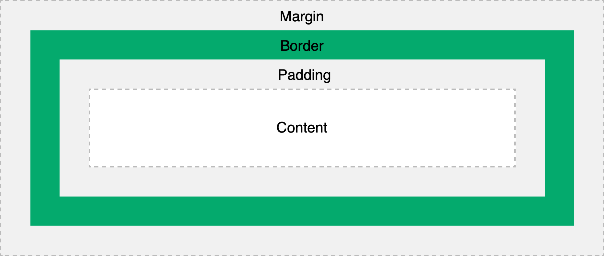

---
---

# 📚 Modèle de boîte et positionnement

## Le modèle de boîte (Box Model)

### Concept de base
Chaque élément HTML est représenté comme une boîte rectangulaire composée de 4 zones:



### Les 4 composantes du modèle de boîte

#### Content (Contenu)
- Zone où apparaissent le texte, les images, etc.
- Contrôlée par `width` et `height`
- `max-width` limite la largeur maximale (utile pour le design adaptatif)

```css
.element {
    width: 300px;        /* Largeur fixe */
    max-width: 100%;     /* Ne dépassera jamais 100% du parent */
    height: 200px;       /* Hauteur fixe */
}
```

#### Padding (Espacement interne)
- Espace entre le contenu et la bordure
- Toujours transparent
- Propriétés: `padding-top`, `padding-right`, `padding-bottom`, `padding-left`

```css
.element {
    padding: 10px;                   /* Tous les côtés */
    padding: 10px 20px;              /* Vertical | Horizontal */
    padding: 10px 20px 15px 25px;    /* Top | Right | Bottom | Left */
}
```

#### Border (Bordure)
- Entoure le padding et le contenu
- Visible par défaut
- Propriétés: `border-width`, `border-style`, `border-color`

```css
.element {
    border: 2px solid #333;        /* width style color */
    border-top: 1px dashed red;      /* Bordure spécifique */
    border-radius: 5px;              /* Coins arrondis */
}
```

**Border-radius**: Arrondit les coins de la bordure
```css
.element {
    border-radius: 10px;             /* Tous les coins */
    border-radius: 50%;              /* Cercle parfait */
    border-radius: 10px 20px;        /* Top-left/bottom-right | Top-right/bottom-left */
}
```

#### Margin (Marge externe)
- Espace autour de l'élément
- Toujours transparent
- Peut avoir des valeurs négatives

```css
.element {
    margin: 20px;                    /* Tous les côtés */
    margin: 10px auto;               /* Centrage horizontal */
    margin-bottom: -10px;            /* Valeur négative */
}
```

## La propriété `display`

### `display: block`
- Prend toute la largeur disponible
- Commence sur une nouvelle ligne
- Accepte `width`, `height`, `margin`, `padding`

```css
.block-element {
    display: block;
    width: 50%;        /* Fonctionne */
    height: 100px;     /* Fonctionne */
}
```
:::info
**Exemples d'éléments block:** `div`, `p`, `h1-h6`, `section`, `article`
:::

### `display: inline`
- Prend seulement l'espace nécessaire
- Reste sur la même ligne
- **N'accepte PAS** `width`, `height`, `margin` vertical (mais ok pour horizontal)

```css
.inline-element {
    display: inline;
    width: 200px;          /* IGNORÉ */
    height: 50px;          /* IGNORÉ */
    margin: 10px 20px;     /* Seul le margin horizontal fonctionne */
    padding: 10px;         /* Padding fonctionne mais peut créer des chevauchements */
}
```

:::info
**Exemples d'éléments inline:** `span`, `a`, `strong`, `em`, `img`
:::

### `display: inline-block`
- Combine les avantages des deux
- Reste sur la même ligne MAIS accepte width/height

```css
.inline-block-element {
    display: inline-block;
    width: 200px;          /* Fonctionne */
    height: 50px;          /* Fonctionne */
    margin: 10px;          /* Fonctionne complètement */
}
```

### Exemples du comportement des propriétés `display`

<SandpackPlayground
template="static"
showTabs={true}
files={{
'/index.html': `<!DOCTYPE html>
<html>
<head>
<link rel="stylesheet" href="styles.css">
</head>
<body>
<h2>Comportements Display</h2>

<h3>Block</h3>
<div class="block-demo">Élément 1</div>
<div class="block-demo">Élément 2</div>

<h3>Inline</h3>
<span class="inline-demo">Élément 1</span>
<span class="inline-demo">Élément 2</span>
<span class="inline-demo">Élément 3</span>

<h3>Inline-block</h3>
<div class="inline-block-demo">Élément 1</div>
<div class="inline-block-demo">Élément 2</div>
<div class="inline-block-demo">Élément 3</div>
</body>
</html>`,
'styles.css': `body {
  font-family: Arial, sans-serif;
  margin: 20px;
}

h2, h3 {
  color: #333;
  margin: 20px 0 10px 0;
}

.block-demo {
  display: block;
  background-color: #ffeb3b;
  border: 2px solid #f57f17;
  padding: 10px;
  margin: 5px 0;
  width: 200px;
}

.inline-demo {
  display: inline;
  background-color: #e1f5fe;
  border: 2px solid #0277bd;
  padding: 10px;
  margin: 5px;
  /* width et height sont ignorés */
  width: 200px;
  height: 50px;
}

.inline-block-demo {
  display: inline-block;
  background-color: #f3e5f5;
  border: 2px solid #7b1fa2;
  padding: 10px;
  margin: 5px;
  width: 120px;
  height: 60px;
  vertical-align: top;
}`
}}
/>

### `display: none` et `visibility: hidden`
- Élément complètement retiré du contenu
- Comme s'il n'existait pas

```css
.hidden {
    display: none;         /* Invisible ET ne prend pas d'espace */
}

/* Comparaison avec visibility */
.invisible {
    visibility: hidden;    /* Invisible MAIS prend encore son espace */
}
```

### Exemples de `display: none` vs `visibility: hidden`

<SandpackPlayground
template="static"
showTabs={true}
files={{
'/index.html': `<!DOCTYPE html>
<html>
<head>
<link rel="stylesheet" href="styles.css">
</head>
<body>
<h2>Display none vs Visibility hidden</h2>

<h3>Avec display: none</h3>
<div class="box">Élément 1</div>
<div class="box display-none">Élément 2 - Display none</div>
<div class="box">Élément 3</div>

<h3>Avec visibility: hidden</h3>
<div class="box">Élément 1</div>
<div class="box visibility-hidden">Élément 2 - Visibility hidden</div>
<div class="box">Élément 3</div>
</body>
</html>`,
'styles.css': `body {
  font-family: Arial, sans-serif;
  margin: 20px;
}

h2, h3 {
  color: #333;
  margin: 20px 0 10px 0;
}

.box {
  background-color: #4caf50;
  color: white;
  padding: 15px;
  margin: 10px 0;
  text-align: center;
}

.display-none {
  display: none;
}

.visibility-hidden {
  visibility: hidden;
}`
}}
/>

## Le positionnement (`position`)

### `position: static` (par défaut)
- Position normale dans le flux du document
- Les propriétés `top`, `right`, `bottom`, `left` sont ignorées

```css
.static-element {
    position: static;      /* Valeur par défaut */
    top: 50px;            /* IGNORÉ */
}
```

### `position: relative`
- Positionné par rapport à sa position normale
- L'espace original est conservé dans le flux

```css
.relative-element {
    position: relative;
    top: 20px;            /* Décalage de 20px vers le bas */
    left: 30px;           /* Décalage de 30px vers la droite */
}
```

**Usage typique:** Créer un contexte de positionnement pour des éléments `position: absolute`

### `position: absolute`
- Positionné par rapport au premier parent relative (display: relative)
- Retiré du flux normal (ne prend plus d'espace)

```css
.parent {
    position: relative;    /* Crée le contexte */
}

.absolute-element {
    position: absolute;
    top: 0;               /* 0px du haut du parent */
    right: 0;             /* 0px de la droite du parent */
}
```

### `position: fixed`
- Positionné par rapport à la fenêtre du navigateur
- Reste en place lors du scroll

```css
.fixed-header {
    position: fixed;
    top: 0;
    left: 0;
    width: 100%;
    background: white;
    z-index: 1000;
}
```

### `position: sticky`
- Hybride entre relative et fixed
- "Colle" quand l'utilisateur scroll

```css
.sticky-nav {
    position: sticky;
    top: 20px;            /* Distance du haut avant de "coller" */
}
```

**Note:** Nécessite un parent avec une hauteur définie

### Exemples des types de positionnement

<SandpackPlayground
template="static"
showTabs={true}
files={{
'/index.html': `<!DOCTYPE html>
<html>
<head>
<link rel="stylesheet" href="styles.css">
</head>
<body>
<h2>Types de positionnement</h2>

<div class="container">
  <div class="static">Static (défaut)</div>
  <div class="relative">Relative (décalé de 20px vers la droite et 30px à partir du haut)</div>
  <div class="absolute">Absolute (coin supérieur droit)</div>
</div>

<div class="fixed">Fixed (coin inférieur droit)</div>

<div class="sticky-container">
  <div class="sticky">Sticky (scroll pour voir l'effet)</div>
  <div class="content">
    <p>Contenu long pour permettre le scroll...</p>
    <p>Lorem ipsum dolor sit amet consectetur.</p>
    <p>Encore du contenu...</p>
    <p>Et encore plus de contenu...</p>
    <p>Pour créer un scroll...</p>
    <p>Et voir l'effet sticky...</p>
    <p>Continuez à scroller...</p>
    <p>L'élément sticky reste en place...</p>
  </div>
</div>
</body>
</html>`,
'styles.css': `body {
  font-family: Arial, sans-serif;
  margin: 20px;
  padding-bottom: 200px;
}

.container {
  position: relative;
  border: 2px dashed #666;
  height: 300px;
  padding: 10px;
  background-color: #f9f9f9;
}

.static {
  position: static;
  background-color: #ffeb3b;
  padding: 10px;
  margin: 10px;
  border: 2px solid #f57f17;
}

.relative {
  position: relative;
  top: 20px;
  left: 30px;
  background-color: #e1f5fe;
  padding: 10px;
  margin: 10px;
  border: 2px solid #0277bd;
}

.absolute {
  position: absolute;
  top: 10px;
  right: 10px;
  background-color: #f3e5f5;
  padding: 10px;
  border: 2px solid #7b1fa2;
  width: 150px;
}

.fixed {
  position: fixed;
  bottom: 20px;
  right: 20px;
  background-color: #ffccbc;
  padding: 10px;
  border: 2px solid #d84315;
  border-radius: 5px;
  z-index: 1000;
}

.sticky-container {
  margin-top: 50px;
  height: 200px;
  overflow-y: auto;
  border: 2px solid #999;
}

.sticky {
  position: sticky;
  top: 0;
  background-color: #fce4ec;
  padding: 10px;
  border-bottom: 2px solid #c2185b;
  margin: 0;
}

.content {
  padding: 20px;
}

.content p {
  margin: 20px 0;
  line-height: 1.6;
}`
}}
/>

## `z-index` et empilement

### Concept
La propriété `z-index` contrôle l'ordre d'empilement des éléments (quel élément apparaît au-dessus).

### Règles importantes
1. Fonctionne seulement avec `position` autre que `static`
2. Plus la valeur est élevée, plus l'élément est au-dessus
3. Valeurs négatives possibles

```css
.background {
    position: absolute;
    z-index: 1;
}

.content {
    position: relative;
    z-index: 10;          /* Au-dessus de background */
}

.modal {
    position: fixed;
    z-index: 1000;        /* Au-dessus de tout */
}
```

### Exemples de `z-index`

<SandpackPlayground
template="static"
showTabs={true}
files={{
'/index.html': `<!DOCTYPE html>
<html>
<head>
<link rel="stylesheet" href="styles.css">
</head>
<body>
<h2>Z-index et empilement</h2>

<div class="demo-container">
  <div class="box box1">Z-index: 1</div>
  <div class="box box2">Z-index: 10</div>
  <div class="box box3">Z-index: 5</div>
</div>
</body>
</html>`,
'styles.css': `body {
  font-family: Arial, sans-serif;
  margin: 20px;
}

.demo-container {
  position: relative;
  height: 200px;
  border: 2px dashed #666;
  margin: 20px 0;
}

.box {
  position: absolute;
  width: 100px;
  height: 60px;
  color: white;
  font-weight: bold;
  text-align: center;
  padding: 10px;
  font-size: 14px;
}

.box1 {
  top: 20px;
  left: 20px;
  background-color: #f44336;
  z-index: 1;
}

.box2 {
  top: 60px;
  left: 80px;
  background-color: #4caf50;
  z-index: 10;
}

.box3 {
  top: 100px;
  left: 140px;
  background-color: #2196f3;
  z-index: 5;
}`
}}
/>

## Propriété `overflow` et débordement

### `overflow: visible` (par défaut)
Le contenu déborde de son conteneur s'il est plus grand que le conteneur.

```css
.container {
    width: 200px;
    height: 100px;
    overflow: visible;    /* Contenu visible même s'il dépasse */
}
```

### `overflow: hidden`
Le contenu qui dépasse est coupé et non visible.

```css
.container {
    overflow: hidden;     /* Contenu coupé, pas de scroll */
}
```

### `overflow: scroll`
Ajoute toujours des barres de défilement.

```css
.container {
    overflow: scroll;     /* Barres de scroll toujours présentes */
}
```

### `overflow: auto`
Ajoute des barres de défilement seulement si nécessaire.

```css
.container {
    overflow: auto;       /* Barres de scroll si contenu dépasse */
}
```

### `overflow-x` et `overflow-y`: contrôle par axe
Les propriétés `overflow-x` et `overflow-y` contrôlent le dépassement par axe.
```css
.container {
    overflow-x: hidden;   /* Horizontal caché */
    overflow-y: auto;     /* Vertical automatique (barre de défilement si nécessaire) */
}
```

### Exemples des propriétés `overflow`

<SandpackPlayground
template="static"
showTabs={true}
files={{
'/index.html': `<!DOCTYPE html>
<html>
<head>
<link rel="stylesheet" href="styles.css">
</head>
<body>
<h2>Propriétés Overflow</h2>

<h3>Visible (défaut)</h3>
<div class="container visible">
  <div class="content">Ce contenu dépasse largement de son conteneur.</div>
</div>

<h3>Hidden</h3>
<div class="container hidden">
  <div class="content">Ce contenu dépasse mais est coupé.</div>
</div>

<h3>Scroll</h3>
<div class="container scroll">
  <div class="content">Ce contenu a des barres de scroll.</div>
</div>

<h3>Auto</h3>
<div class="container auto">
  <div class="content">Ce contenu montre des barres de scroll seulement si nécessaire.</div>
</div>
</body>
</html>`,
'styles.css': `body {
  font-family: Arial, sans-serif;
  margin: 20px;
}

h2, h3 {
  color: #333;
  margin: 20px 0 10px 0;
}

.container {
  width: 200px;
  height: 100px;
  border: 2px solid #666;
  background-color: #f9f9f9;
  margin: 0 0 50px 0;
}

.content {
  width: 300px;
  height: 120px;
  background-color: #e3f2fd;
  padding: 10px;
  font-size: 14px;
}

.visible {
  overflow: visible;
}

.hidden {
  overflow: hidden;
}

.scroll {
  overflow: scroll;
}

.auto {
  overflow: auto;
}`
}}
/>

## `float` (historique, rarement utilisé de nos jours)

:::info
Float était utilisé pour les layouts avant Flexbox/Grid, concepts que nous verrons prochainement. Aujourd'hui, on l'utilise beaucoup moins.
:::

### `float: left`, `float: right`, `float: none`
```css
.element {
    float: left;          /* Flotte à gauche */
    float: right;         /* Flotte à droite */
    float: none;          /* Pas de flottement (défaut) */
}
```

### `float: clear`
Pour empêcher les éléments de flotter autour

```css
.clear-both {
    clear: both;          /* Empêche le flottement des deux côtés */
}
```