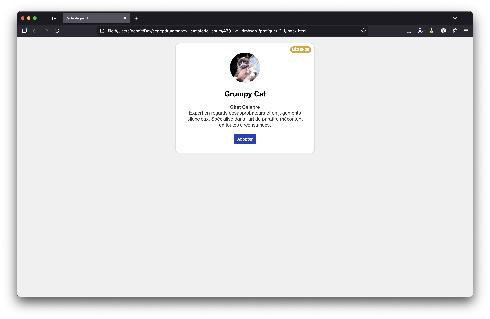
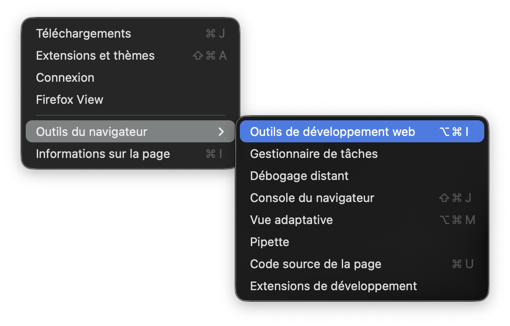
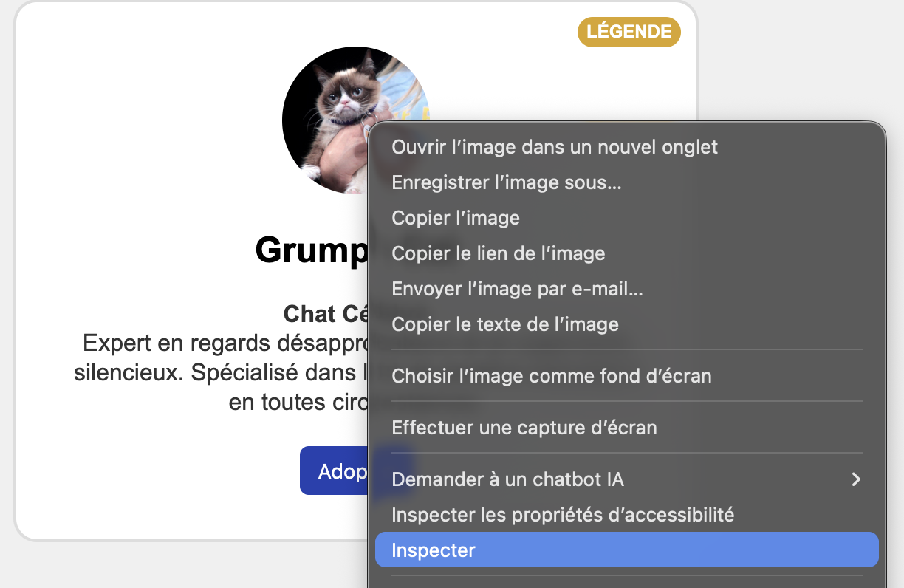
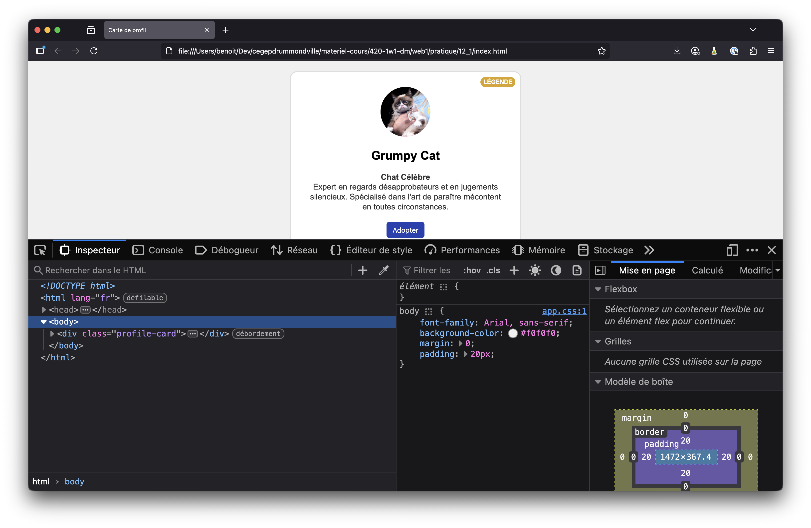
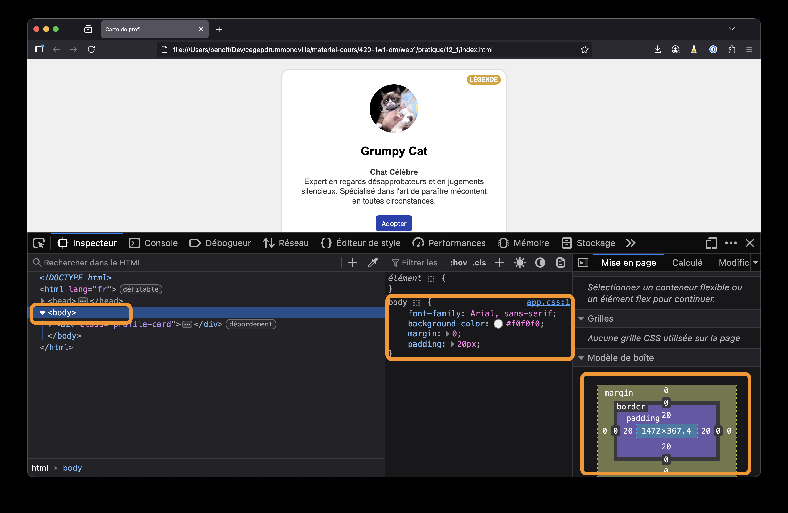
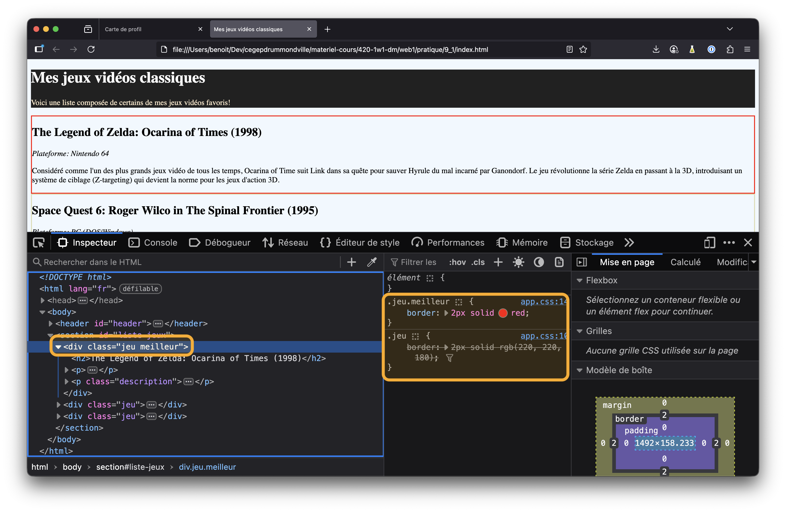
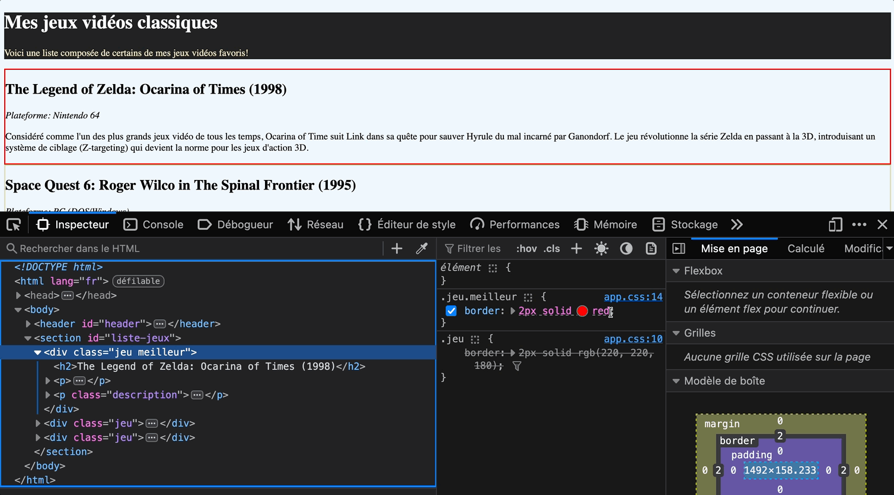
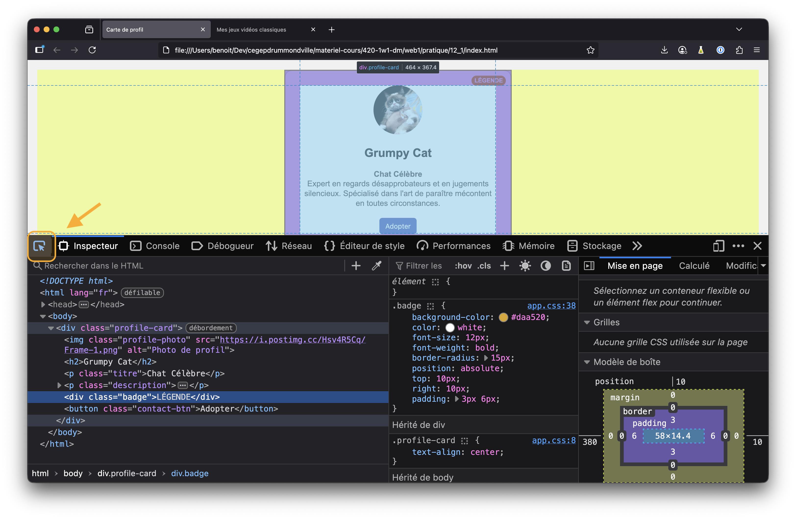

---
---

# 📚 Utiliser les outils de développement du navigateur

Il peut parfois être difficile de comprendre ce qui se produit visuellement dans le navigateur. On a un visuel en tête, on croit avoir écrit le bon CSS, mais visiblement le navigateur a un avis différent! 😉

Pour déboguer le CSS, on peut utiliser les outils de développement web à partir de Firefox, Chrome ou votre navigateur favoris. Peu importe le navigateur, ils se ressemblent tous un peu.

Les outils de développeurs de Firefox sont présentés ici.

## Ouvrir les outils de développement Web

1. Premièrement, assurez-vous d'être sur la page Web que vous voulez déboguer
    
2. Ensuite, utilisez le menu `Outils` -> `Outils du navigateur` -> `Outils de développement Web`
    

    :::info
    Vous pouvez aussi faire un clic droit sur un élément dans la page et choisir `Inspecter`

    
    :::

## Onglet `Inspecteur`

Plusieurs onglets sont disponibles pour déboguer plusieurs aspects de notre page Web. La portion qui nous intéresse pour ce cours est l'onglet `Inspecteur`.

Le panneau de gauche vous permet de sélectionner un élément HTML et les panneaux de droite vous donnent de l'information sur l'élément sélectionné. Par exemple, dans l'exemple précédent, `body` est sélectionné et on voit bien les règles CSS appliquées à ce dernier, en plus du modèle de boîte:

## Visualiser le principe de cascade

Les outils de développement pourront vous renseigner sur la ou les règles ayant priorité sur un élément et celles qui ont été écrasées selon le principe de cascade.

Par exemple, dans l'exemple ici, deux règles s'appliquent à l'élément, mais seulement la plus spécifique est appliquée. L'autre règle est rayée pour vous montrer qu'elle est ignorée et remplacée par une plus spécifique.

## Modifier le CSS dans les outils de développement

Si vous voulez tester quelque chose rapidement, vous pouvez faire une modification directement dans les outils de développeur et la modif sera appliquée à la page!

:::caution
Ces modifications sont temporaires, si vous rechargez la page, elles sont perdues. Parfait pour tester quelque chose rapidement, mais vous devrez répliquer dans votre fichier CSS si vous voulez conserver les changements.
:::

## Sélectionner un élément sur la page

Le bouton suivant vous permet de sélectionner un élément dans la page à l'aide de la souris.

