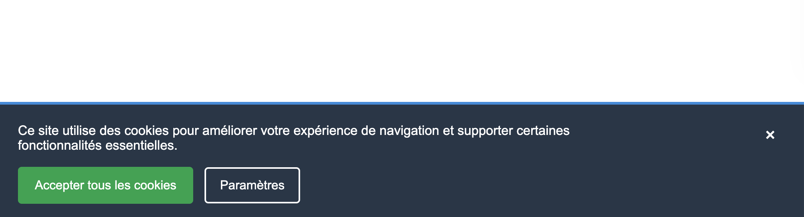

---
---

# 12-B-2 😈 Boss - Bandeau de cookies

À partir du HTML et CSS de base suivant:

```html
<!DOCTYPE html>
<html lang="fr">
<head>
  <meta charset="UTF-8">
  <meta name="viewport" content="width=device-width, initial-scale=1.0">
  <link rel="stylesheet" href="./styles/app.css">
  <title>Bandeau de cookie</title>
</head>
<body>
  <div class="cookie-banner">
      <div class="cookie-content">
          <button class="close-button">&times;</button>
          <p class="cookie-text">
              Ce site utilise des cookies pour améliorer votre expérience de navigation et supporter certaines fonctionnalités essentielles.
          </p>
          <button class="cookie-button">Accepter tous les cookies</button>
          <button class="cookie-button-secondary">Paramètres</button>
      </div>
  </div>
</body>
</html>
```

```css
body {
  font-family: Arial, Helvetica, sans-serif;
  font-size: 14px;
}

.cookie-banner {

}

.cookie-content {

}

.cookie-text {

}

.cookie-button {

}

.cookie-button-secondary {

}

.close-button {

}
```

Reproduisez le plus fidèlement possible le visuel suivant:

<BrowserWindow>
    
</BrowserWindow>

## Instructions

- Positionnez le bandeau de façon fixe dans le bas de la page
    :::tip
    Utilisez `position: fixed` en plus des propriétés `bottom`, `left`, `right`
    :::
- La largeur maximale du texte doit être `600px`.
- Vous pouvez choisir les couleurs que vous voulez, ça n'a pas d'importance, l'idée est de positionner les éléments correctement.

<details>
    <summary>
      Cheat Code (solution) 
    </summary>

    <SandpackPlayground
        template="static"
        editorHeight={600}
        files={{
        '/index.html': `<!DOCTYPE html>
<html lang="fr">
<head>
  <meta charset="UTF-8">
  <meta name="viewport" content="width=device-width, initial-scale=1.0">
  <link rel="stylesheet" href="./styles/app.css">
  <title>Bandeau de cookie</title>
</head>
<body>
  <div class="cookie-banner">
      <div class="cookie-content">
          <button class="close-button">&times;</button>
          <p class="cookie-text">
              Ce site utilise des cookies pour améliorer votre expérience de navigation et supporter certaines fonctionnalités essentielles.
          </p>
          <button class="cookie-button">Accepter tous les cookies</button>
          <button class="cookie-button-secondary">Paramètres</button>
      </div>
  </div>
</body>
</html>`,
'styles/app.css': `body {
    font-family: Arial, Helvetica, sans-serif;
    font-size: 14px;
}

.cookie-banner {
    position: fixed;
    bottom: 0;
    left: 0;
    right: 0;
    background-color: #2c3e50;
    color: white;
    padding: 20px;
    border-top: 3px solid #3498db;
}

.cookie-content {
    position: relative;
}

.cookie-text {
    margin: 0 0 15px 0;
    max-width: 600px;
}

.cookie-button {
    background-color: #27ae60;
    color: white;
    border: none;
    padding: 12px 18px;
    margin-right: 8px;
    border-radius: 4px;
}

.cookie-button-secondary {
    background-color: transparent;
    color: white;
    border: 2px solid white;
    padding: 10px 15px;
    border-radius: 4px;
}

.close-button {
    position: absolute;
    top: 0;
    right: 5px;
    background-color: transparent;
    color: white;
    border: none;
    font-size: 20px;
}
`
        }}
    />  
</details>