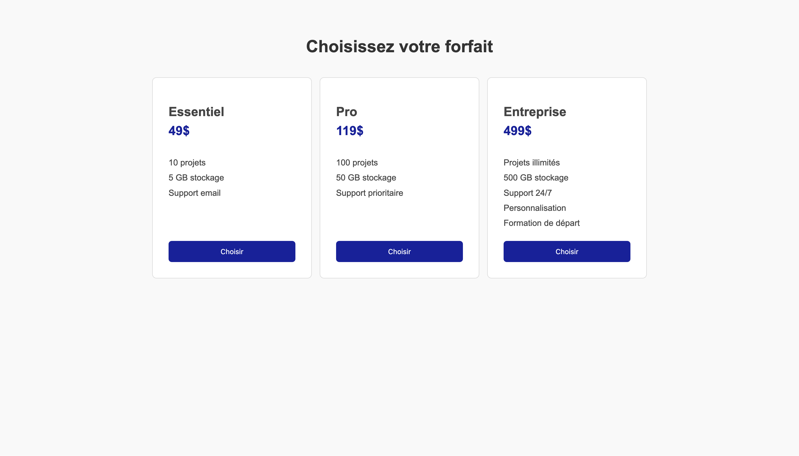

---
---

# 13-B-1 😈 Boss - Choix de forfaits

En vous basant sur le HTML et CSS de départ suivant:

```html
<!DOCTYPE html>
<html lang="fr">
<head>
  <meta charset="UTF-8">
  <meta name="viewport" content="width=device-width, initial-scale=1.0">
  <title>Boss tableau de prix</title>
  <link rel="stylesheet" href="./styles/app.css">
</head>
<body>
  <div class="conteneur">
    <h1>Choisissez votre forfait</h1>
    
    <div class="liste-forfaits">
      <div class="forfait">
        <h2>Essentiel</h2>
        <div class="prix">49$</div>
        <ul class="fonctionnalites">
          <li>10 projets</li>
          <li>5 GB stockage</li>
          <li>Support email</li>
        </ul>
        <button>Choisir</button>
      </div>
      
      <div class="forfait">
        <h2>Pro</h2>
        <div class="prix">119$</div>
        <ul class="fonctionnalites">
          <li>100 projets</li>
          <li>50 GB stockage</li>
          <li>Support prioritaire</li>
        </ul>
        <button>Choisir</button>
      </div>
      
      <div class="forfait">
        <h2>Entreprise</h2>
        <div class="prix">499$</div>
        <ul class="fonctionnalites">
          <li>Projets illimités</li>
          <li>500 GB stockage</li>
          <li>Support 24/7</li>
          <li>Personnalisation</li>
          <li>Formation de départ</li>
        </ul>
        <button>Choisir</button>
      </div>
    </div>
  </div>
</body>
</html>
```

```css
body {
  font-family: Arial, sans-serif;
  background-color: #f9f9f9;
  padding: 40px 20px;
  color: #444444;
}

h1 {
  text-align: center;
  color: #333;
  margin-bottom: 40px;
}

.forfait {
  background-color: white;
  border: 1px solid #dadada;
  border-radius: 8px;
  padding: 30px;
  width: 240px;
}

.forfait h2 {
  margin-bottom: 8px;
}

.prix {
  font-size: 24px;
  color: #182198;
  font-weight: bold;
  margin: 0 0 12px 0;
}

.fonctionnalites {
  list-style: none;
  padding-left: 0;
  margin: 20px 0;
}

.fonctionnalites li {
  padding: 5px 0;
}

button {
  background-color: #182198;
  color: white;
  border: none;
  padding: 12px;
  border-radius: 6px;
  cursor: pointer;
  width: 100%;
}
```

Reproduisez le plus fidèlement possible le visuel suivant:

<BrowserWindow url="index.html">
    
</BrowserWindow>

## Instructions

* Positionnez les boîtes de forfaits à l'aide de Flexbox de sorte que:
  * Elles soient disposées côte à côte (horizontalement)
  * Elles soient centrées horizontalement dans la page (en utilisant la bonne propriété Flexbox)
  * Elles aient la même largeur
* Il doit y avoir de l'espace entre les forfaits, gérés à l'aide de Flexbox
* À l'intérieur de chaque boite de forfait, le contenu doit être organisé verticalement (de haut en bas)
* Les boutons doivent être alignés en bas, même si les forfaits ont des contenus de hauteurs différentes (notez que le forfait "Entreprise" a 5 items dans sa liste, les autres en ont 3)

:::tip
Comment faire pour que les boutons restent en bas même si les listes de fonctionnalités ont des hauteurs différentes?

Une propriété Flexbox permet de faire "pousser" un élément pour occuper l'espace disponible...
:::

<details>
    <summary>
      Cheat Code (solution) 
    </summary>

    <SandpackPlayground
        template="static"
        editorHeight={900}
        files={{
        '/index.html': `<!DOCTYPE html>
<html lang="fr">
<head>
  <meta charset="UTF-8">
  <meta name="viewport" content="width=device-width, initial-scale=1.0">
  <title>Boss tableau de prix</title>
  <link rel="stylesheet" href="./styles/app.css">
</head>
<body>
  <div class="conteneur">
    <h1>Choisissez votre forfait</h1>
    
    <div class="liste-forfaits">
      <div class="forfait">
        <h2>Essentiel</h2>
        <div class="prix">49$</div>
        <ul class="fonctionnalites">
          <li>10 projets</li>
          <li>5 GB stockage</li>
          <li>Support email</li>
        </ul>
        <button>Choisir</button>
      </div>
      
      <div class="forfait">
        <h2>Pro</h2>
        <div class="prix">119$</div>
        <ul class="fonctionnalites">
          <li>100 projets</li>
          <li>50 GB stockage</li>
          <li>Support prioritaire</li>
        </ul>
        <button>Choisir</button>
      </div>
      
      <div class="forfait">
        <h2>Entreprise</h2>
        <div class="prix">499$</div>
        <ul class="fonctionnalites">
          <li>Projets illimités</li>
          <li>500 GB stockage</li>
          <li>Support 24/7</li>
          <li>Personnalisation</li>
          <li>Formation de départ</li>
        </ul>
        <button>Choisir</button>
      </div>
    </div>
  </div>
</body>
</html>`,
'styles/app.css': `body {
  font-family: Arial, sans-serif;
  background-color: #f9f9f9;
  padding: 40px 20px;
  color: #444444;
}

h1 {
  text-align: center;
  color: #333;
  margin-bottom: 40px;
}

.liste-forfaits {
  display: flex;
  justify-content: center;
  gap: 15px;
}

.forfait {
  display: flex;
  flex-direction: column;
  background-color: white;
  border: 1px solid #dadada;
  border-radius: 8px;
  padding: 30px;
  width: 240px;
}

.forfait h2 {
  margin-bottom: 8px;
}

.prix {
  font-size: 24px;
  color: #182198;
  font-weight: bold;
  margin: 0 0 12px 0;
}

.fonctionnalites {
  flex-grow: 1;
  list-style: none;
  padding-left: 0;
  margin: 20px 0;
}

.fonctionnalites li {
  padding: 5px 0;
}

button {
  background-color: #182198;
  color: white;
  border: none;
  padding: 12px;
  border-radius: 6px;
  cursor: pointer;
  width: 100%;
}
`
        }}
    />  
</details>