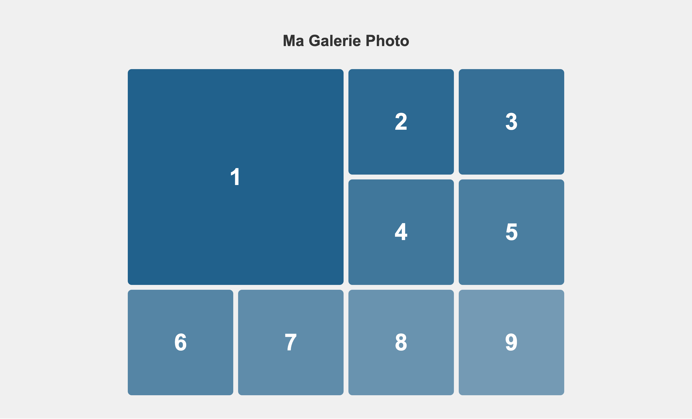

# 14-B-1 😈 Boss - Galerie photo

En vous basant sur le HTML et CSS de départ suivant:

```html
<!DOCTYPE html>
<html lang="fr">
<head>
  <meta charset="UTF-8">
  <meta name="viewport" content="width=device-width, initial-scale=1.0">
  <title>Boss galerie photo</title>
  <link rel="stylesheet" href="./styles/app.css">
</head>
<body>
  <div class="conteneur">
    <h1>Ma Galerie Photo</h1>
    
    <div class="galerie">
      <div class="photo photo-1">
        <div class="numero">1</div>
      </div>
      <div class="photo photo-2">
        <div class="numero">2</div>
      </div>
      <div class="photo photo-3">
        <div class="numero">3</div>
      </div>
      <div class="photo photo-4">
        <div class="numero">4</div>
      </div>
      <div class="photo photo-5">
        <div class="numero">5</div>
      </div>
      <div class="photo photo-6">
        <div class="numero">6</div>
      </div>
      <div class="photo photo-7">
        <div class="numero">7</div>
      </div>
      <div class="photo photo-8">
        <div class="numero">8</div>
      </div>
      <div class="photo photo-9">
        <div class="numero">9</div>
      </div>
    </div>
  </div>
</body>
</html>
```

```css
body {
  font-family: Arial, sans-serif;
  background-color: #f0f0f0;
  padding: 40px 20px;
}

h1 {
  text-align: center;
  color: #333;
  margin-bottom: 40px;
}

.galerie {
  max-width: 1200px;
  margin: 0 auto;
}

.photo {
  background-color: #ddd;
  border-radius: 8px;
  aspect-ratio: 1;
  display: flex;
  align-items: center;
  justify-content: center;
}

.numero {
  font-size: 48px;
  color: white;
  font-weight: bold;
}

.photo-1 { background-color: rgba(33, 97, 140, 1); }
.photo-2 { background-color: rgba(33, 97, 140, .95); }
.photo-3 { background-color: rgba(33, 97, 140, .9); }
.photo-4 { background-color: rgba(33, 97, 140, .85); }
.photo-5 { background-color: rgba(33, 97, 140, .8); }
.photo-6 { background-color: rgba(33, 97, 140, .75); }
.photo-7 { background-color: rgba(33, 97, 140, .7); }
.photo-8 { background-color: rgba(33, 97, 140, .65); }
.photo-9 { background-color: rgba(33, 97, 140, .6); }
```

Reproduisez le plus fidèlement possible le visuel suivant:



## Instructions

- La galerie doit avoir **4 colonnes** de largeur égale
- La photo **#1** (en haut à gauche) doit occuper **2 colonnes ET 2 rangées**
- Il doit y avoir de l'espace entre toutes les photos
- Les autres photos (2 à 9) occupent 1 cellule chacune

:::tip
Pour faire occuper plusieurs cellules à un élément, `span` dans la propriété `grid-column` ou `grid-row` **sur un item de la grille** pourrait vous être utile!
:::

<details>
    <summary>
      Cheat Code (solution) 
    </summary>

    <SandpackPlayground
        template="static"
        editorHeight={900}
        files={{
        '/index.html': `<!DOCTYPE html>
<html lang="fr">
<head>
  <meta charset="UTF-8">
  <meta name="viewport" content="width=device-width, initial-scale=1.0">
  <title>Boss galerie photo</title>
  <link rel="stylesheet" href="./styles/app.css">
</head>
<body>
  <div class="conteneur">
    <h1>Ma Galerie Photo</h1>
    
    <div class="galerie">
      <div class="photo photo-1">
        <div class="numero">1</div>
      </div>
      <div class="photo photo-2">
        <div class="numero">2</div>
      </div>
      <div class="photo photo-3">
        <div class="numero">3</div>
      </div>
      <div class="photo photo-4">
        <div class="numero">4</div>
      </div>
      <div class="photo photo-5">
        <div class="numero">5</div>
      </div>
      <div class="photo photo-6">
        <div class="numero">6</div>
      </div>
      <div class="photo photo-7">
        <div class="numero">7</div>
      </div>
      <div class="photo photo-8">
        <div class="numero">8</div>
      </div>
      <div class="photo photo-9">
        <div class="numero">9</div>
      </div>
    </div>
  </div>
</body>
</html>`,
'styles/app.css': `body {
  font-family: Arial, sans-serif;
  background-color: #f0f0f0;
  padding: 40px 20px;
}

h1 {
  text-align: center;
  color: #333;
  margin-bottom: 40px;
}

.galerie {
  max-width: 900px;
  margin: 0 auto;
  display: grid;
  grid-template-columns: 1fr 1fr 1fr 1fr; /* ou repeat(4, 1fr) */
  row-gap: 10px;
  column-gap: 10px;
}

.photo {
  background-color: #ddd;
  border-radius: 8px;
  aspect-ratio: 1;
  display: flex;
  align-items: center;
  justify-content: center;
}

.numero {
  font-size: 48px;
  color: white;
  font-weight: bold;
}

.photo-1 { 
  background-color: rgba(33, 97, 140, 1);
  grid-column: span 2;
  grid-row: span 2;
}
.photo-2 { background-color: rgba(33, 97, 140, .95); }
.photo-3 { background-color: rgba(33, 97, 140, .9); }
.photo-4 { background-color: rgba(33, 97, 140, .85); }
.photo-5 { background-color: rgba(33, 97, 140, .8); }
.photo-6 { background-color: rgba(33, 97, 140, .75); }
.photo-7 { background-color: rgba(33, 97, 140, .7); }
.photo-8 { background-color: rgba(33, 97, 140, .65); }
.photo-9 { background-color: rgba(33, 97, 140, .6); }`
        }}
    />  
</details>