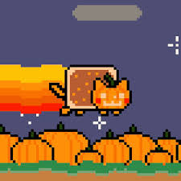
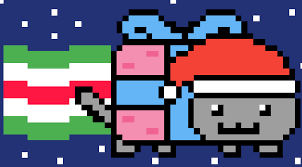
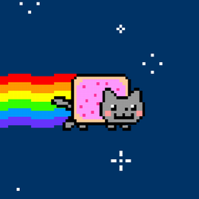

---
---

# ⚠️ IMPORTANT: Fichiers de départ pour les niveaux de la semaine 9

Pour l'activité en classe, contrairement aux semaines précédentes, un seul fichier de départ sera utilisé pour les différents niveaux de cette semaine.

Comme nous avons plusieurs petits éléments à voir, cela nous évitera de créer quatre structures de fichiers HTML/CSS.

## Télécharger les fichiers de départ (recommandé)

:::tip fichier zip avec tout!
Vous pouvez <a target="_blank" href={ require("./files/niveau15.zip").default } download>Télécharger l'archive zip de départ suivante</a> plutôt que de tout créer à la main!
:::

## Créer la structure de base

**Créez un nouveau dossier pour le projet et ajoutez un fichier `index.html`** avec le contenu suivant:

```html
<!DOCTYPE html>
<html lang="fr">
<head>
    <meta charset="UTF-8">
    <meta name="viewport" content="width=device-width, initial-scale=1.0">
    <link rel="stylesheet" href="./styles/app.css">
    <title>Nyan Cat</title>
</head>
<body>
    <header>
        <h1>🌈 Nyan Cat</h1>
        <p>Vole dans l'espace depuis 2011</p>
    </header>

    <main>
        <section class="grille-nyan">
            <article class="carte-nyan">
                
                <h3>Nyan Original</h3>
                <p class="description">Le légendaire chat arc-en-ciel</p>
                <span class="badge">Classique</span>
            </article>

            <article class="carte-nyan">
                
                <h3>Tac Nayn</h3>
                <p class="description">Le jumeau maléfique</p>
                <span class="badge">Méchant</span>
            </article>

            <article class="carte-nyan">
                
                <h3>Nyan Halloween</h3>
                <p class="description">Édition effrayante</p>
                <span class="badge">Saisonnier</span>
            </article>

            <article class="carte-nyan">
                
                <h3>Nyan Noël</h3>
                <p class="description">Spécial des fêtes</p>
                <span class="badge">Saisonnier</span>
            </article>
        </section>
    </main>

    <footer>
        <p>Nyan Cat © 2011 🚀</p>
    </footer>
</body>
</html>
```

## Ajouter un fichier CSS

1. **Créez un dossier `styles`** et ajoutez un fichier `app.css`
2. **Ajoutez ces styles de base** dans `app.css`:

```css
body {
    background-color: #001a33;
    color: #ffffff;
    font-family: Arial, sans-serif;
    margin: 0;
    padding: 20px;
}

header {
    text-align: center;
    margin-bottom: 40px;
}

h1 {
    color: #ff6b6b;
    font-size: 48px;
    margin-bottom: 8px;
}

header p {
    color: #cccccc;
    font-size: 16px;
}

.grille-nyan {
    display: grid;
    grid-template-columns: repeat(2, 1fr);
    gap: 20px;
    max-width: 800px;
    margin: 0 auto;
}

.carte-nyan {
    background-color: #0a2540;
    border: 2px solid #0099ff;
    border-radius: 8px;
    padding: 20px;
    text-align: center;
}

.image-nyan {
    width: 150px;
    height: 150px;
    object-fit: contain;
    margin-bottom: 16px;
}

.carte-nyan h3 {
    color: #ffa500;
    margin: 0 0 8px 0;
    font-size: 20px;
}

.description {
    color: #cccccc;
    font-size: 14px;
    margin-bottom: 12px;
}

.badge {
    display: inline-block;
    background-color: #0099ff;
    color: white;
    padding: 4px 12px;
    border-radius: 12px;
    font-size: 12px;
    font-weight: bold;
}

footer {
    text-align: center;
    margin-top: 40px;
    color: #ffa500;
    font-size: 14px;
}
```

Voici les images utilisées.





