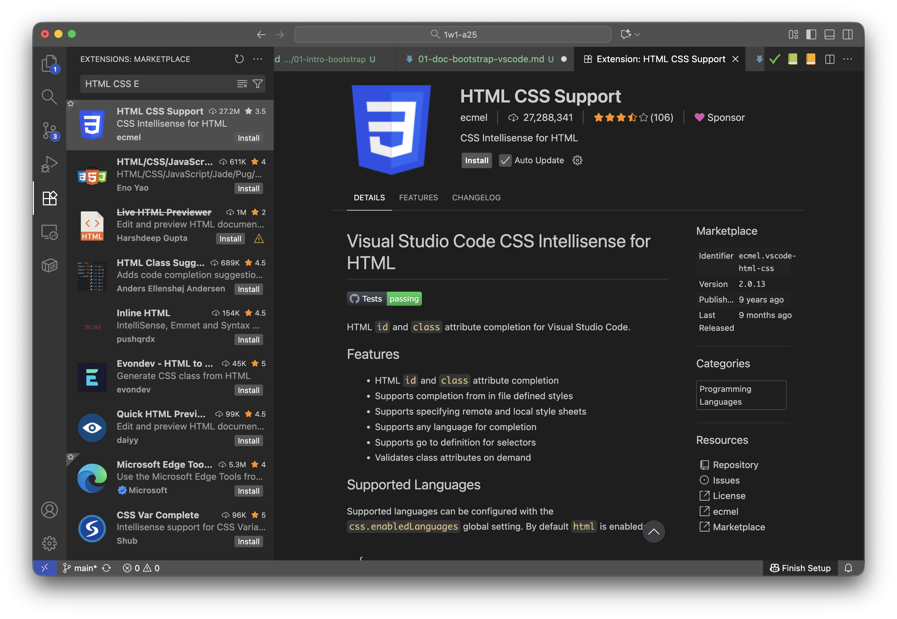

---
---

# 📚 Bootstrap et VS Code

Lorsque vous utilisez Bootstrap, vous ajouterez essentiellement des classes à votre HTML en provenance de Bootstrap. Pour vous aider, vous pouvez utiliser l'extension `HTML CSS Support` qui ajoutera le mécanisme d'auto-complétion pour les classes de Bootstrap.

