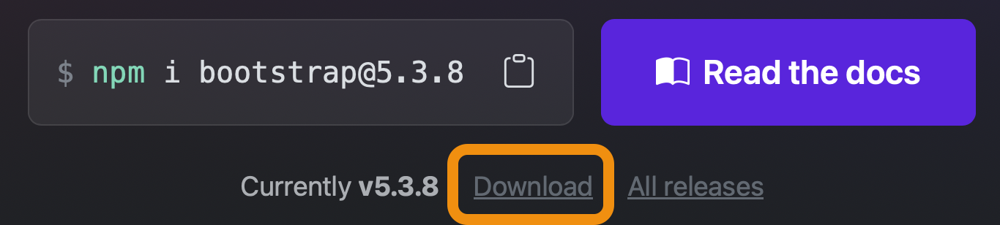
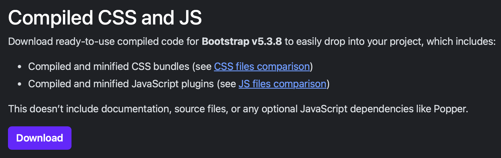

---
---

# 19-1 Activité découverte de Bootstrap

Avec cette activité, nous allons explorer les bases de Bootstrap et intégrer cette librairie visuelle à un site web simple.

## Préparation: Télécharger et intégrer Bootstrap

### Étape 1: Télécharger Bootstrap

1. Allez sur le site officiel  [https://getbootstrap.com](https://getbootstrap.com)
2. Cliquez sur le bouton **Download**
    
3. Téléchargez la version **Compiled CSS and JS**
    
4. Décompressez le fichier ZIP téléchargé

### Étape 2: Organiser vos fichiers

Créez la structure de dossiers suivante pour votre projet:

```
mon-portfolio/
├── index.html
├── styles/
│   └── bootstrap.min.css
└── js/
    └── bootstrap.bundle.min.js
```

**Instructions**
- Créez un dossier, par exemple `mon-portfolio`
- À l'intérieur, créez deux sous-dossiers: `styles` et `js`
- Copiez le fichier `bootstrap.min.css` (depuis le dossier `css` de Bootstrap) dans votre dossier `styles/`
- Copiez le fichier `bootstrap.bundle.min.js` (depuis le dossier `js` de Bootstrap) dans votre dossier `js/`

## Fichier de départ

Dans votre dossier `mon-portfolio`, créez un fichier `index.html` avec ce contenu minimal:

```html
<!DOCTYPE html>
<html lang="fr">
<head>
    <meta charset="UTF-8">
    <meta name="viewport" content="width=device-width, initial-scale=1.0">
    <title>Mon Portfolio Bootstrap</title>
</head>
<body>
    <h1>Bienvenue sur mon portfolio</h1>
    <p>Développeur web passionné</p>
    
    <h2>Mes projets</h2>
    
    <div>
        <h3>Projet 1</h3>
        <p>Mon premier site web en HTML.</p>
    </div>
    
    <div>
        <h3>Projet 2</h3>
        <p>Un second projet utilisant le HTML et du CSS.</p>
    </div>
    
    <div>
        <h3>Projet 3</h3>
        <p>Un projet Bootstrap sur un sujet qui me passionne.</p>
    </div>
</body>
</html>
```

## Intégrer Bootstrap

### Ajouter le CSS de Bootstrap

Dans la section `<head>`, ajoutez le lien vers Bootstrap CSS:

```html
<head>
    <meta charset="UTF-8">
    <meta name="viewport" content="width=device-width, initial-scale=1.0">
    <title>Mon Portfolio Bootstrap</title>
    //highlight-next-line
    <link rel="stylesheet" href="styles/bootstrap.min.css">
</head>
```

Rafraîchissez votre page dans le navigateur.

### Questions de découverte
- Que remarquez-vous comme changement visuel?
- La police de caractères a-t-elle changé?
- Les marges et espacements sont-ils différents?

:::info
Bootstrap applique automatiquement des styles de base à tous les éléments HTML. Même sans ajouter de classes Bootstrap, votre page a déjà un aspect plus moderne!
:::

### Ajouter le JavaScript de Bootstrap

Avant la fermeture de `</body>`, ajoutez le script Bootstrap :

```html
    </div>
    
    <script src="js/bootstrap.bundle.min.js"></script>
</body>
</html>
```

:::info
Le JavaScript de Bootstrap est nécessaire pour certains composants interactifs. Nous n'en aurons pas besoin dans cette activité, mais c'est une bonne pratique de toujours l'inclure.
:::

## Le conteneur

### Ajouter un conteneur

Enveloppez tout le contenu de votre `<body>` dans un `<div>` avec la classe `container`.

```html
<body>
  //highlight-next-line
    <div class="container">
        <h1>Bienvenue sur mon portfolio</h1>
        <p>Développeur web passionné</p>
        
        <h2>Mes projets</h2>
        
        <!-- projets -->
    //highlight-next-line    
    </div>
    
    <script src="js/bootstrap.bundle.min.js"></script>
</body>
```

Rafraîchissez la page.

### Questions
- Que s'est-il passé avec votre contenu?
- Est-il toujours collé aux bords de la fenêtre?
- Essayez de redimensionner votre fenêtre (plus large, plus étroite). Que remarquez-vous?

:::info Classe `container`
La classe `container`:
- Centre le contenu horizontalement
- Ajoute des marges sur les côtés
- Limite la largeur maximale du contenu pour une meilleure lisibilité
- S'adapte automatiquement à la taille de l'écran
:::

## Les espacements (margin et padding)

### Marge en haut du container

Ajoutez une marge en haut du conteneur à l'aide de la classe `mt-5`.

```html
<body>
    //highlight-next-line
    <div class="container mt-5">
        <h1>Bienvenue sur mon portfolio</h1>
```

#### Question
- Voyez-vous de l'espace entre le haut de la page et votre contenu?
- Essayez de changer pour `mt-4`, `mt-3` et ainsi de suite.

### Marges sur le titre de section

Ajoutez une marge en bas du titre "Mes projets".

```html
<div class="container mt-5">
    <h1>Bienvenue sur mon portfolio</h1>
    <p>Développeur web passionné</p>
    
    //highlight-next-line
    <h2 class="mb-4">Mes projets</h2>
    
    <div>
        <h3>Projet 1</h3>
```

#### Questions
- Que signifie `mt` dans `mt-5`?
- Que signifie `mb` dans `mb-4`?
- Essayez `mt-3` au lieu de `mt-5` sur le container. Quelle différence?
- Essayez `mb-2` au lieu de `mb-4` sur le h2. La marge est-elle plus petite?

Revenez à `mt-5` et `mb-4`.

:::info Classes d'espacement Bootstrap
- `m` = margin (marge à l'extérieur de l'élément)
- `p` = padding (espacement à l'intérieur de l'élément)
- `t` = top (haut), `b` = bottom (bas), `s` = start (gauche), `e` = end (droite)
- Les chiffres vont de 0 à 5 :
  - `0` = aucun espace
  - `1` = très petit
  - `3` = moyen
  - `5` = très grand

Exemples:
- `mt-3`: marge en haut de taille 3
- `mb-5`: marge en bas de taille 5
- `p-4`: padding de tous les côtés de taille 4
:::

## Les classes typographiques et de couleur

### Agrandir le titre principal

Transformez le titre principal avec la classe `display-4`.

```html
<div class="container mt-5">
    //highlight-next-line
    <h1 class="display-4">Bienvenue sur mon portfolio</h1>
    <p>Développeur web passionné</p>
```

#### Questions
- Le titre est-il plus grand maintenant?
- Essayez `display-1`, `display-2`, `display-3`. Quelle différence entre ces classes?

Gardez `display-4`.

:::info Classes `display-*`
- `display-1`: Très grand titre (le plus grand)
- `display-2`: Grand titre
- `display-3`: Titre moyen-grand
- `display-4`: Titre moyen
- Jusqu'à `display-6`
:::

### Styliser le paragraphe d'introduction

Modifiez le paragraphe sous le titre en y ajoutant la classe `lead`.

```html
<h1 class="display-4">Bienvenue sur mon portfolio</h1>
//highlight-next-line
<p class="lead">Développeur web passionné</p>
```

#### Question
- Le texte du paragraphe est-il plus visible maintenant?

:::info
La classe `lead` agrandit légèrement le texte et l'épaissit pour le rendre plus visible. Utile pour les textes d'introduction!
:::

### Ajouter de la couleur au texte

Ajoutez une couleur au paragraphe en essayant `text-muted`.

```html
<h1 class="display-4">Bienvenue sur mon portfolio</h1>
//highlight-next-line
<p class="lead text-muted">Développeur web passionné</p>
```

#### Questions
- Quelle couleur a le texte maintenant?
- Essayez `text-primary`. Quelle couleur?
- Essayez `text-success`. Et maintenant?

Revenez à `text-muted`.

:::info Classes de couleur de texte
- `text-primary`: Bleu
- `text-success`: Vert
- `text-danger`: Rouge
- `text-warning`: Jaune
- `text-muted`: Gris pâle
:::

## Les boutons

### Ajouter un bouton

Après le paragraphe avec `lead`, ajoutez un bouton:

```html
<h1 class="display-4">Bienvenue sur mon portfolio</h1>
<p class="lead text-muted">Développeur web passionné</p>
//highlight-next-line
<button class="btn btn-primary">Voir mes projets</button>
```

#### Questions
- Quelles sont les deux classes sur le bouton?
- Enlevez `btn-primary`. Que se passe-t-il?
- Remettez `btn-primary`.

:::
Pour créer un bouton Bootstrap, il faut **toujours** deux classes:
1. `btn`: La classe de base
2. Une classe de couleur comme `btn-primary`, `btn-success`, etc.
 
Sans les deux, le bouton n'aura pas le bon style!
:::

### Essayer différentes couleurs

Changez `btn-primary` pour:
- `btn-success` (vert)
- `btn-danger` (rouge)
- `btn-warning` (jaune)

Revenez à `btn-primary`.

### Changer la taille du bouton

Ajoutez `btn-lg` pour agrandir le bouton.

```html
<button class="btn btn-primary btn-lg">Voir mes projets</button>
```

#### Questions
- Le bouton est-il plus grand?
- Essayez `btn-sm` au lieu de `btn-lg`. Plus petit?

Gardez `btn-lg`.

:::info Taille des boutons
- `btn-lg`: Grand bouton
- Taille normale: aucune classe supplémentaire
- `btn-sm`: Petit bouton
:::

## Centrer le contenu

### Centrer la section d'en-tête

Enveloppez le titre, le paragraphe et le bouton dans un `<div>` et ajoutez les classes `text-center` et `mb-5`:

```html
<div class="container mt-5">
  //highlight-next-line
    <div class="text-center mb-5">
        <h1 class="display-4">Bienvenue sur mon portfolio</h1>
        <p class="lead text-muted">Développeur web passionné</p>
        <button class="btn btn-primary btn-lg">Voir mes projets</button>
  //highlight-next-line
    </div>
    
    <h2 class="mb-4">Mes projets</h2>
```

#### Questions
- Le contenu de l'en-tête est-il centré maintenant?
- Que fait `mb-5` sur ce `<div>`?

:::info
La classe `text-center` centre tout le contenu texte à l'intérieur d'un élément.
:::

## Couleurs de fond et padding

### Ajouter des couleurs de fond aux projets

Ajoutez des classes de couleur de fond à vos sections de projets, soit `bg-primary`. `bg-success` et `bg-warning`.

```html
<h2 class="mb-4">Mes projets</h2>

//highlight-next-line
<div class="bg-primary text-white">
    <h3>Projet 1</h3>
    <p>Mon premier site web en HTML.</p>
</div>

//highlight-next-line
<div class="bg-success text-white">
    <h3>Projet 2</h3>
    <p>Un second projet utilisant le HTML et du CSS.</p>
</div>

//highlight-next-line
<div class="bg-warning">
    <h3>Projet 3</h3>
    <p>Un projet Bootstrap sur un sujet qui me passionne.</p>
</div>
```

#### Questions
- Pourquoi ajoutons-nous `text-white` avec `bg-primary` et `bg-success`?
- Pourquoi pas avec `bg-warning`?
- Essayez `bg-danger` sur le premier projet. Quelle couleur?

Revenez aux couleurs de départ.

:::info Classes de couleur de fond
- `bg-primary`: Fond bleu
- `bg-success`: Fond vert
- `bg-danger`: Fond rouge
- `bg-warning`: Fond jaune

Avec les fonds foncés (primary, success, danger), ajoutez `text-white` pour rendre le texte lisible!
:::

### Ajouter du padding

Ajoutez du padding à l'aide de `p-*` pour que le contenu ne soit pas collé aux bords.

```html
//highlight-next-line
<div class="bg-primary text-white p-4">
    <h3>Projet 1</h3>
    <p>Mon premier site web en HTML.</p>
</div>

//highlight-next-line
<div class="bg-success text-white p-4">
    <h3>Projet 2</h3>
    <p>Un second projet utilisant le HTML et du CSS.</p>
</div>

//highlight-next-line
<div class="bg-warning p-4">
    <h3>Projet 3</h3>
    <p>Un projet Bootstrap sur un sujet qui me passionne.</p>
</div>
```

#### Questions
- Que fait la classe `p-4`?
- Le contenu est-il mieux espacé à l'intérieur des boîtes?
- Essayez `p-2`. Plus petit?
- Essayez `p-5`. Plus grand?

Gardez `p-4`.

:::info
Le padding (`p`) ajoute de l'espace **à l'intérieur** d'un élément, entre son contenu et ses bordures.
:::

## Système de grille simple

### Créer une ligne

Enveloppez vos trois projets dans un `<div>` avec la classe `row`.

```html
<h2 class="mb-4">Mes projets</h2>

//highlight-next-line
<div class="row">
    <div class="bg-primary text-white p-4">
        <h3>Projet 1</h3>
        <p>Mon premier site web en HTML.</p>
    </div>
    
    <div class="bg-success text-white p-4">
        <h3>Projet 2</h3>
        <p>Un second projet utilisant le HTML et du CSS.</p>
    </div>
    
    <div class="bg-warning p-4">
        <h3>Projet 3</h3>
        <p>Un projet Bootstrap sur un sujet qui me passionne.</p>
    </div>
//highlight-next-line
</div>
```

#### Question
- Quelque chose a changé? Probablement pas beaucoup pour l'instant!

### Ajouter des colonnes

Enveloppez chaque projet dans un `<div>` avec la classe `col`.

```html
<div class="row">
  //highlight-next-line
    <div class="col">
        <div class="bg-primary text-white p-4">
            <h3>Projet 1</h3>
            <p>Mon premier site web en HTML.</p>
        </div>
    //highlight-next-line
    </div>
    
    //highlight-next-line
    <div class="col">
        <div class="bg-success text-white p-4">
            <h3>Projet 2</h3>
            <p>Un second projet utilisant le HTML et du CSS.</p>
        </div>
    //highlight-next-line
    </div>
    
    //highlight-next-line
    <div class="col">
        <div class="bg-warning p-4">
            <h3>Projet 3</h3>
            <p>Un projet Bootstrap sur un sujet qui me passionne.</p>
        </div>
    //highlight-next-line
    </div>
</div>
```

#### Questions
- Comment les projets sont-ils disposés maintenant?
- Sont-ils côte à côte?
- Occupent-ils la même largeur?
- Redimensionnez votre fenêtre. Que se passe-t-il quand la fenêtre devient très petite?

:::info Système de grille Bootstrap :
- `row` : Crée une ligne qui peut contenir des colonnes
- `col` : Crée une colonne qui occupe une fraction égale de l'espace disponible
- Si vous avez 3 `col` dans une `row`, chacune prendra 1/3 de la largeur
- Si vous avez 2 `col`, chacune prendra 1/2 de la largeur
- Sur petits écrans (mobile), les colonnes s'empilent automatiquement

À noter que le système de grille de Bootstrap est très puissant et beaucoup plus complet que cet exemple. Nous verrons prochainement en détail comment utiliser pleinement la grille Bootstrap.
:::

## Récapitulatif des concepts Bootstrap

Félicitations! Vous avez découvert les concepts suivants 😊

**L'intégration de Bootstrap** en téléchargeant et organisant les fichiers  
**Le conteneur** (`container`) pour centrer et limiter la largeur du contenu  
**Les espacements**:
  - Margin (`mt`, `mb`) pour l'espace extérieur
  - Padding (`p`) pour l'espace intérieur
**Les classes typographiques** (`display-*`, `lead`)  
**Les couleurs**:
  - Texte (`text-primary`, `text-muted`, `text-white`)
  - Fond (`bg-primary`, `bg-success`, `bg-warning`)
**Les boutons** (`btn`, `btn-primary`, `btn-lg`, `btn-sm`)  
**L'alignement** (`text-center`)  
**Le système de grille de base** (`row`, `col`)

Au final, Bootstrap fourni un ensemble de classes permettant d'appliquer des styles prédéfinit à vos sites web.