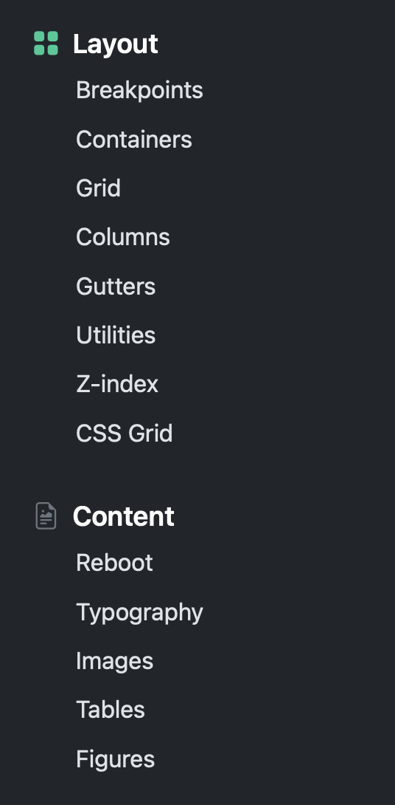
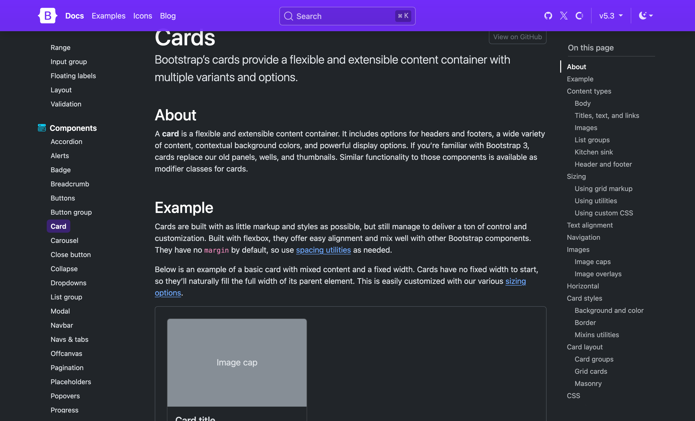
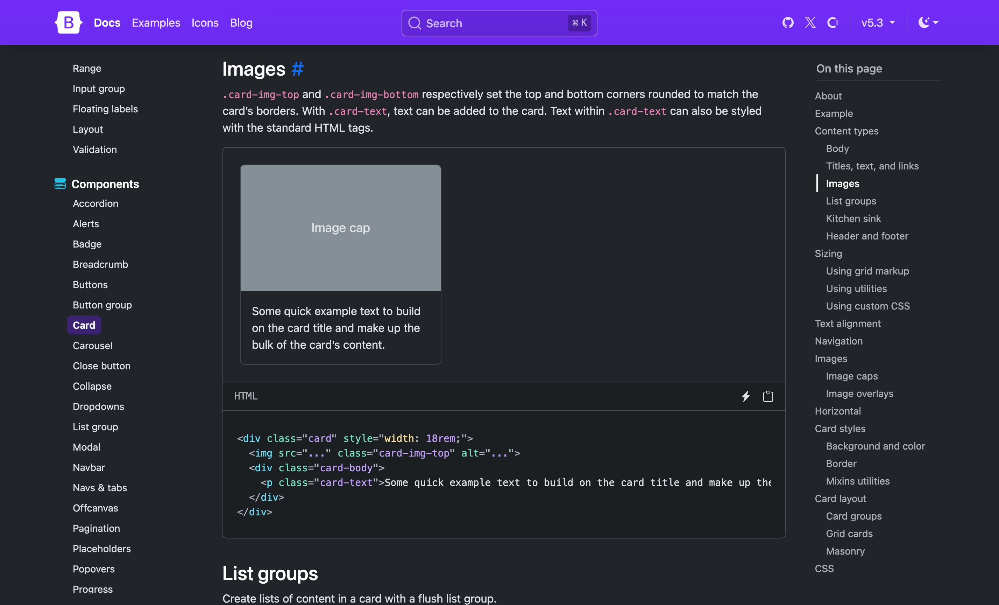
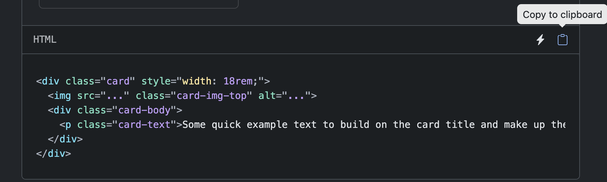
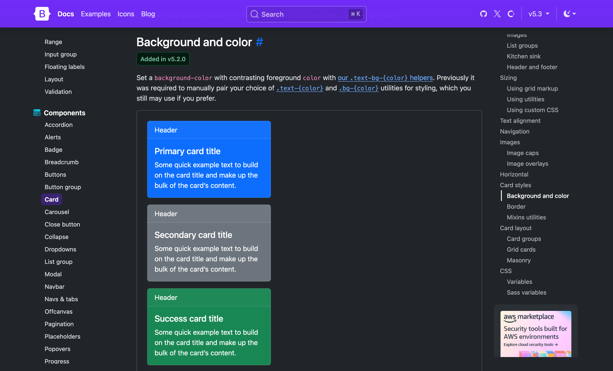
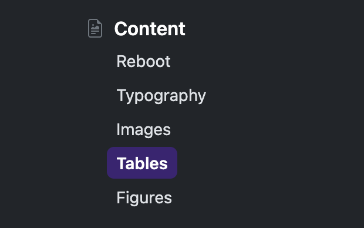
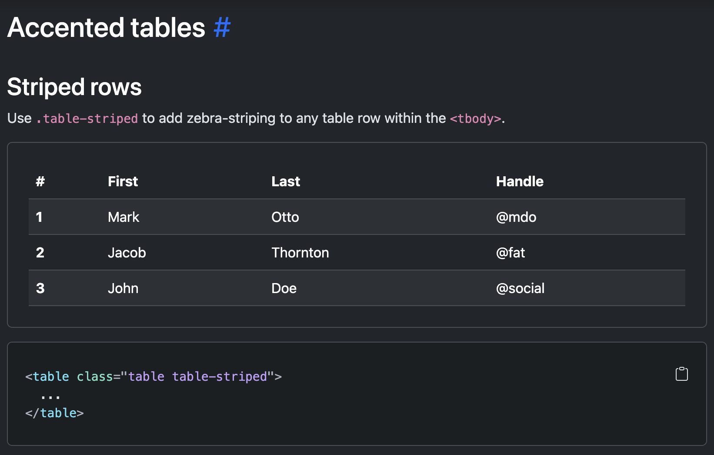

---
---

# Niveau 20 - Utiliser la documentation de Bootstrap

La documentation de Bootstrap sera votre meilleur ami pour le reste de la session! En effet, tout ce dont vous avez besoin pour utiliser Bootstrap se retrouve sur le site de documentation.

De plus, comme la documentation est très complète, il est inutile de dupliquer la documentation dans les notes de cours. Lors des prochains cours, plutôt que des cours théoriques plus traditionnels, des activités d'exploration vous seront proposées et vous devrez fouiller dans la documentation pour trouver l'information nécessaire.

## Accéder à la documentation

**URL officielle:** [https://getbootstrap.com/docs/5.3/getting-started/introduction/](https://getbootstrap.com/docs/5.3/getting-started/introduction/)

:::info Version importante
Assurez-vous d'être sur la **version 5.3** (ou la version que vous utilisez). Les anciennes versions (Bootstrap 3, 4 ou même 5 avant 5.3) ont ou peuvent avoir une syntaxe différente!
:::

## Structure de la documentation

La documentation Bootstrap est organisée en grandes sections dans le menu de gauche:



### 📚 Sections principales

**Getting started** (Démarrage)
- Installation et configuration de base
- À consulter une seule fois au début

**Customize** (personnaliser)
- Présente les différentes façons de personnaliser Bootstrap. Il s'agit de techniques plus avancées que nous n'utiliserons pas.

**Layout** (Mise en page)
- **Breakpoints**: points de rupture responsive
- **Containers**: enveloppes pour centrer le contenu
- **Grid**: système de colonnes
- **Columns**: détails sur les colonnes
- **gutters**: contrôler l'espacement des colonnes
- **utilities**: classes utilitaires pertinentes

**Content** (Contenu)
- **Typography**: styles de texte
- **Images**: gestion des images
- **Tables**: tableaux stylisés
- **figure**: styles pour `<figure>`

**Forms** (Formulaires)
- Tout ce qui à trait au style des formulaires

**Components** (Composants)
- Contiens des blocs préstylisés pour des types de contenu fréquents:
  - Navbar, Cards, Buttons, Forms, Modal, Carousel, etc.
- Vous passerez du temps dans cette section!

**Helpers**
- Des classes utilitaires et des petits *goodies* permettant de faciliter certaines tâches

**Utilities** (Utilitaires)
- Classes pour spacing (margin/padding)
- Classes pour colors, display, flexbox, etc.
- Très pratique pour des ajustements fréquents tels que les espacements.

## Anatomie d'une page de documentation

Chaque page de la documentation a essentiellement la même structure. Prenons l'exemple des **Cards** (https://getbootstrap.com/docs/5.3/components/card/):

### 1. Description et exemple visuel

En haut de page, vous verrez :
- Une courte description du composant
- Un **exemple visuel** interactif (ce à quoi ça ressemble)



### 2. Le code HTML

Juste en dessous de chaque exemple, il y a une **boîte grise** contenant le code HTML complet.



```html
<div class="card" style="width: 18rem;">
  
  <div class="card-body">
    <p class="card-text">Some quick example text to build on the card title and make up the bulk of the card’s content.</p>
  </div>
</div>
```

:::info Bouton "Copy"
Utilisez le bouton `Copy to clipboard` pour copier l'exemple et l'utiliser dans votre projet!

:::

### 3. Les variations

Plus bas sur la page, vous trouverez les **variations** du composant:
- Carte avec header
- Carte avec footer
- Carte horizontale
- Groupes de cartes
- Etc.

Chacune avec son propre exemple et code.

### 4. Options et classes disponibles

Vers le bas de la page, vous trouverez souvent 
- Liste des classes CSS disponibles
- Options de couleurs (primary, success, danger, etc.)
- Tailles disponibles (sm, lg, etc.)



## Comment approcher votre recherche

1. **Partez de votre objectif**. Par exemple: "je veux appliquer un style à un tableau (`<table>`)... est-ce que Bootstrap fournit des styles pour cela?
2. Utilisez la recherche ou le menu de gauche pour trouver une catégorie qui se rapproche de votre objectif
    
3. Généralement, vous pourrez trouver un exemple qu'il vous sera possible de copier à l'aide du bouton `Copy to clipboard`
    
4. Modifiez le contenu de l'exemple pour votre besoin
5. Appliquez les modifications désirées à l'aide des variations proposées. Par exemple dans le cas d'un tableau, si on voulait des rangées alternées en couleur, on pourrait ajouter la classe `table-striped`.
    

## Stratégies de recherche efficaces

### 1. Utiliser le menu de navigation

Si vous savez ce que vous cherchez:
- Boutons → Components > Buttons
- Navigation → Components > Navbar
- Formulaires → Forms

### 2. Utiliser l'outil de recherche

La barre de recherche dans la navigation principale est très utile pour effectuer une recherche dans toute la documentation. Par exemple, recherche `table` vous retournera instantanément les résultats pertinents sur les styles qu'on peut ajouter aux éléments `table`


### 2. Utiliser Ctrl+F (Recherche dans la page)

La documentation est longue. Utilisez **Ctrl+F** (ou Cmd+F sur Mac) pour chercher dans UNE page en particulier.

**Exemples de recherches utiles :**
- Chercher "color" pour trouver les options de couleurs
- Chercher "size" pour trouver les tailles disponibles
- Chercher un mot-clé spécifique comme "rounded" ou "shadow"

### 3. Google Bootstrap + ce que vous cherchez

Parfois, Google est plus rapide :
- "bootstrap 5.3 navbar" → premier résultat = page Navbar
- "bootstrap 5.3 card horizontal" → exemples de cartes horizontales
- "bootstrap 5.3 form" → formulaires

:::info Astuce
Ajoutez toujours "bootstrap 5.3" à votre recherche Google pour éviter les résultats des anciennes versions.
:::

