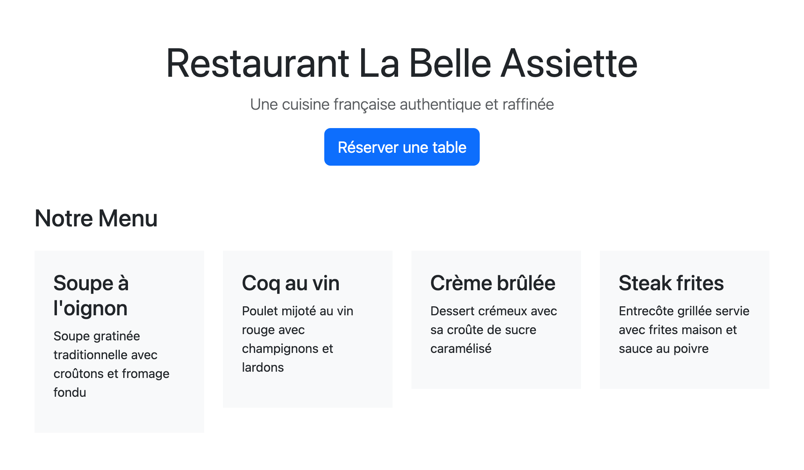

---
---

# 😈 Boss: Page Menu de Restaurant

Créez une page web pour présenter le menu d'un restaurant de votre choix en utilisant les concepts Bootstrap que vous avez appris jusqu'à maintenant.

## Résultat attendu

Votre page doit ressembler à ceci (vous pouvez personnaliser les couleurs et le contenu):

## Contraintes et exigences

:::caution
Vous ne devez qu'utiliser des classes Bootstrap! Pas de CSS personnalisé pour cet exercice.
:::

Votre page doit **obligatoirement** contenir:

### 1. Structure de base
- Un fichier HTML avec l'intégration de Bootstrap (via fichiers téléchargés, comme présenté dans la [documentation ici](../01-s11/01-intro-bootstrap/00-doc-intro-bootstrap.md).)
- Un conteneur (`container`) pour restreindre automatiquement la largeur de la page (https://getbootstrap.com/docs/5.3/layout/containers/)

### 2. En-tête centrée
- Un titre principal, `<h1>` avec `display-3` ou `display-4` (https://getbootstrap.com/docs/5.3/content/typography/#display-headings)
- Un slogan/sous-titre avec `lead` (https://getbootstrap.com/docs/5.3/content/typography/#lead)
- Un bouton "Réserver une table" avec:
  - Les classes `btn` et `btn-primary` (https://getbootstrap.com/docs/5.3/components/buttons/#variants)
  - La taille `btn-lg` (https://getbootstrap.com/docs/5.3/components/buttons/#sizes)
- Le tout centré avec `text-center` (https://getbootstrap.com/docs/5.3/utilities/text/#text-alignment)
- Une marge inférieure (dans le bas) `mb-5` pour espacer de la section suivante (https://getbootstrap.com/docs/5.3/utilities/spacing/#margin-and-padding)

### 3. Section Menu (4 plats minimum)
- Un titre de section `<h2>` avec `mb-4` (https://getbootstrap.com/docs/5.3/utilities/spacing/#margin-and-padding)
- Une grille Bootstrap avec `row` et `col`
- **4 cartes de plats** disposées côte à côte, chacune contenant:
  - Le nom du plat (titre `<h3>`)
  - Une description courte
  - Un fond avec la couleur Bootstrap `light` pour les cartes (https://getbootstrap.com/docs/5.3/utilities/background/#background-color)
  - Du padding à l'intérieur des cartes, `p-4`, pour aérer le contenu

## Thématiques suggérées

Choisissez un type de restaurant qui vous inspire:
- 🍕 Pizzeria italienne
- 🍜 Restaurant asiatique
- 🌮 Cuisine mexicaine
- 🍔 Burger gourmet
- 🥐 Bistro français
- 🍱 Restaurant de sushis

## Bonus (optionnel)

Pour aller plus loin:
- Ajoutez une section "À propos du restaurant" avec un fond de couleur et du texte
- Variez les tailles de boutons (`btn-sm`, `btn-lg`)
- Ajoutez un deuxième bouton avec une couleur différente (`btn-success`, `btn-outline-primary`)
- Amusez-vous!

    

      Cheat Code (solution) 
    

    <SandpackPlayground
        template="static"
        editorHeight={900}
        files={{
        '/index.html': `<!DOCTYPE html>
<html lang="fr">
<head>
  <meta charset="UTF-8">
  <meta name="viewport" content="width=device-width, initial-scale=1.0">
  <title>Restaurant La Belle Assiette</title>
  <!-- Vous devez ajouter Bootstrap en le téléchargeant. Le CDN ici est pour l'exemple seulement. -->
  <link href="https://cdn.jsdelivr.net/npm/bootstrap@5.3.0/dist/css/bootstrap.min.css" rel="stylesheet">
</head>
<body>
  

      <!-- En-tête du restaurant -->
      

          <h1 class="display-4"><strong>Restaurant La Belle Assiette</strong></h1>
          
Une cuisine française authentique et raffinée

          <button class="btn btn-primary btn-lg">Réserver une table</button>
      

      
      <!-- Section Menu -->
      <h2 class="mb-4">Notre Menu</h2>
      
      

          

              

                  <h3>Soupe à l'oignon</h3>
                  
Soupe gratinée traditionnelle avec croûtons et fromage fondu

              

          

          
          

              

                  <h3>Coq au vin</h3>
                  
Poulet mijoté au vin rouge avec champignons et lardons

              

          

          
          

              

                  <h3>Crème brûlée</h3>
                  
Dessert crémeux avec sa croûte de sucre caramélisé

              

          

          
          

              

                  <h3>Steak frites</h3>
                  
Entrecôte grillée servie avec frites maison et sauce au poivre

              

          

      

  

  
  <!-- Vous devez ajouter Bootstrap en le téléchargeant. Le CDN ici est pour l'exemple seulement. -->
  
</body>
</html>`
        }}
    />  

