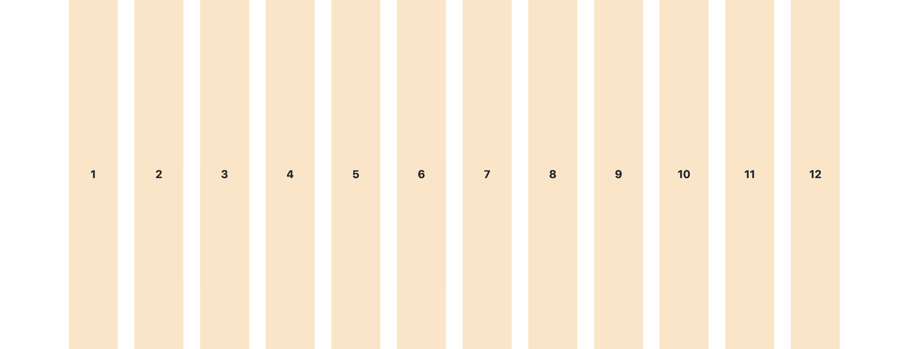

---
---

# 📚 Le système de grille Bootstrap

<DocCard item={{
  type: 'link',
  href: 'https://getbootstrap.com/docs/5.3/layout/grid/',
  label: 'Documentation officielle grille Bootstrap' }} />

<br />

Le système de grille de Bootstrap est l'un de ses outils les plus puissants. Il permet de créer des mises en page adaptatives (responsive) facilement, sans écrire de CSS complexe.

## Qu'est-ce que le système de grille?

Le système de grille Bootstrap divise l'écran en **12 colonnes**. Vous pouvez ensuite choisir combien de ces colonnes chaque élément occupera.

:::info Pourquoi 12 colonnes?
Le nombre 12 est divisible par 1, 2, 3, 4, 6 et 12, ce qui offre beaucoup de flexibilité pour créer différentes mises en page:
- 2 éléments côte à côte → 6 colonnes chacun (6 + 6 = 12)
- 3 éléments côte à côte → 4 colonnes chacun (4 + 4 + 4 = 12)
- 4 éléments côte à côte → 3 colonnes chacun (3 + 3 + 3 + 3 = 12)
:::



<SandpackPlayground
  template="static"
  showTabs={false}
  files={{
    '/index.html': `<!DOCTYPE html>
<html lang="fr">
<head>
    <meta charset="UTF-8">
    <meta name="viewport" content="width=device-width, initial-scale=1.0">
    <link href="https://cdn.jsdelivr.net/npm/bootstrap@5.3.0/dist/css/bootstrap.min.css" rel="stylesheet">
</head>
<body>
    <div class="container mt-4">
        <h4>Visualisation des 12 colonnes</h4>
        <div class="row">
            <div class="col-1 bg-primary text-white border border-white p-3 text-center">1</div>
            <div class="col-1 bg-primary text-white border border-white p-3 text-center">1</div>
            <div class="col-1 bg-primary text-white border border-white p-3 text-center">1</div>
            <div class="col-1 bg-primary text-white border border-white p-3 text-center">1</div>
            <div class="col-1 bg-primary text-white border border-white p-3 text-center">1</div>
            <div class="col-1 bg-primary text-white border border-white p-3 text-center">1</div>
            <div class="col-1 bg-primary text-white border border-white p-3 text-center">1</div>
            <div class="col-1 bg-primary text-white border border-white p-3 text-center">1</div>
            <div class="col-1 bg-primary text-white border border-white p-3 text-center">1</div>
            <div class="col-1 bg-primary text-white border border-white p-3 text-center">1</div>
            <div class="col-1 bg-primary text-white border border-white p-3 text-center">1</div>
            <div class="col-1 bg-primary text-white border border-white p-3 text-center">1</div>
        </div>
    </div>
    
    <script src="https://cdn.jsdelivr.net/npm/bootstrap@5.3.0/dist/js/bootstrap.bundle.min.js"></script>
</body>
</html>`
  }}
/>

<br />

## Les trois composants essentiels

Pour utiliser la grille Bootstrap, vous avez besoin de trois éléments qui s'emboîtent:

### 1. Container (conteneur)

Le `container` enveloppe tout et centre le contenu sur la page.

```html
<div class="container">
    <!-- Votre contenu ici -->
</div>
```

:::info Deux types de containers
- `container`: largeur fixe avec marges sur les côtés
- `container-fluid`: prend 100% de la largeur de l'écran
:::

### 2. Row (ligne)

La `row` crée une ligne horizontale qui contiendra vos colonnes.

```html
<div class="container">
    <div class="row">
        <!-- Vos colonnes ici -->
    </div>
</div>
```

### 3. Col (colonne)

Les `col` sont placées à l'intérieur d'une `row` et contiennent votre contenu.

```html
<div class="container">
    <div class="row">
        <div class="col">
            Colonne 1
        </div>
        <div class="col">
            Colonne 2
        </div>
    </div>
</div>
```

:::caution Structure obligatoire
Vous devez **toujours** respecter cet ordre:
1. Container
2. Row
3. Col

Sinon, la grille ne fonctionnera pas correctement!
:::

## Colonnes de largeur égale

La classe `col` (sans chiffre) crée des colonnes qui **partagent l'espace équitablement**.

<SandpackPlayground
  template="static"
  showTabs={false}
  files={{
    '/index.html': `<!DOCTYPE html>
<html lang="fr">
<head>
    <meta charset="UTF-8">
    <meta name="viewport" content="width=device-width, initial-scale=1.0">
    <link href="https://cdn.jsdelivr.net/npm/bootstrap@5.3.0/dist/css/bootstrap.min.css" rel="stylesheet">
</head>
<body>
    <div class="container mt-4">
        <h4>2 colonnes égales</h4>
        <div class="row mb-3">
            <div class="col bg-success text-white p-4 text-center border">
                Colonne 1 (50%)
            </div>
            <div class="col bg-success text-white p-4 text-center border">
                Colonne 2 (50%)
            </div>
        </div>
        
        <h4>3 colonnes égales</h4>
        <div class="row mb-3">
            <div class="col bg-success text-white p-4 text-center border">
                Colonne 1 (33%)
            </div>
            <div class="col bg-success text-white p-4 text-center border">
                Colonne 2 (33%)
            </div>
            <div class="col bg-success text-white p-4 text-center border">
                Colonne 3 (33%)
            </div>
        </div>
        
        <h4>4 colonnes égales</h4>
        <div class="row">
            <div class="col bg-success text-white p-4 text-center border">
                Col 1
            </div>
            <div class="col bg-success text-white p-4 text-center border">
                Col 2
            </div>
            <div class="col bg-success text-white p-4 text-center border">
                Col 3
            </div>
            <div class="col bg-success text-white p-4 text-center border">
                Col 4
            </div>
        </div>
    </div>
    
    <script src="https://cdn.jsdelivr.net/npm/bootstrap@5.3.0/dist/js/bootstrap.bundle.min.js"></script>
</body>
</html>`
  }}
/>

<br />

## Colonnes de largeur spécifique

Vous pouvez spécifier **combien de colonnes (sur 12)** chaque élément doit occuper avec `col-{nombre}`.

### Exemples de répartition

```html
<!-- Une colonne prend 8/12, l'autre 4/12 -->
<div class="row">
    <div class="col-8">Plus large (8/12)</div>
    <div class="col-4">Plus étroit (4/12)</div>
</div>

<!-- Trois colonnes égales de 4/12 chacune -->
<div class="row">
    <div class="col-4">Colonne 1</div>
    <div class="col-4">Colonne 2</div>
    <div class="col-4">Colonne 3</div>
</div>
```

<SandpackPlayground
  template="static"
  showTabs={false}
  files={{
    '/index.html': `<!DOCTYPE html>
<html lang="fr">
<head>
    <meta charset="UTF-8">
    <meta name="viewport" content="width=device-width, initial-scale=1.0">
    <link href="https://cdn.jsdelivr.net/npm/bootstrap@5.3.0/dist/css/bootstrap.min.css" rel="stylesheet">
</head>
<body>
    <div class="container mt-4">
        <h4>8 colonnes + 4 colonnes</h4>
        <div class="row mb-3">
            <div class="col-8 bg-info p-4 text-center border fw-bold">
                col-8 (8/12 = 66%)
            </div>
            <div class="col-4 bg-info p-4 text-center border fw-bold">
                col-4 (4/12 = 33%)
            </div>
        </div>
        
        <h4>6 colonnes + 6 colonnes</h4>
        <div class="row mb-3">
            <div class="col-6 bg-info p-4 text-center border fw-bold">
                col-6 (50%)
            </div>
            <div class="col-6 bg-info p-4 text-center border fw-bold">
                col-6 (50%)
            </div>
        </div>
        
        <h4>3 + 6 + 3 colonnes</h4>
        <div class="row mb-3">
            <div class="col-3 bg-info p-4 text-center border fw-bold">
                col-3
            </div>
            <div class="col-6 bg-info p-4 text-center border fw-bold">
                col-6
            </div>
            <div class="col-3 bg-info p-4 text-center border fw-bold">
                col-3
            </div>
        </div>
        
        <h4>4 + 4 + 4 colonnes</h4>
        <div class="row">
            <div class="col-4 bg-info p-4 text-center border fw-bold">
                col-4
            </div>
            <div class="col-4 bg-info p-4 text-center border fw-bold">
                col-4
            </div>
            <div class="col-4 bg-info p-4 text-center border fw-bold">
                col-4
            </div>
        </div>
    </div>
    
    <script src="https://cdn.jsdelivr.net/npm/bootstrap@5.3.0/dist/js/bootstrap.bundle.min.js"></script>
</body>
</html>`
  }}
/>

<br />

:::tip Calcul rapide
Essentiellement, votre total doit toujours donner 12!
:::

## Colonnes qui s'empilent automatiquement

Si le total des colonnes dépasse 12, elles **passent automatiquement à la ligne suivante**.

<SandpackPlayground
  template="static"
  showTabs={false}
  files={{
    '/index.html': `<!DOCTYPE html>
<html lang="fr">
<head>
    <meta charset="UTF-8">
    <meta name="viewport" content="width=device-width, initial-scale=1.0">
    <link href="https://cdn.jsdelivr.net/npm/bootstrap@5.3.0/dist/css/bootstrap.min.css" rel="stylesheet">
</head>
<body>
    <div class="container mt-4">
        <h4>8 + 8 colonnes (total = 16, donc déborde)</h4>
        <div class="row">
            <div class="col-8 bg-warning p-4 text-center border fw-bold">
                col-8 (première ligne)
            </div>
            <div class="col-8 bg-warning p-4 text-center border fw-bold">
                col-8 (deuxième ligne automatiquement)
            </div>
        </div>
    </div>
    
    <script src="https://cdn.jsdelivr.net/npm/bootstrap@5.3.0/dist/js/bootstrap.bundle.min.js"></script>
</body>
</html>`
  }}
/>

<br />

## Grille responsive (adaptatif)

Le vrai pouvoir de la grille Bootstrap, c'est qu'elle peut **changer selon la taille de l'écran**!

### Les breakpoints (points de rupture)

Bootstrap définit des tailles d'écran:

| Breakpoint | Taille | Appareil typique | Classe |
|------------|--------|------------------|--------|
| Extra small | < 576px | Mobile (portrait) | `col-` |
| Small | ≥ 576px | Mobile (paysage) | `col-sm-` |
| Medium | ≥ 768px | Tablette | `col-md-` |
| Large | ≥ 992px | Ordinateur portable | `col-lg-` |
| Extra large | ≥ 1200px | Grand écran | `col-xl-` |
| XXL | ≥ 1400px | Très grand écran | `col-xxl-` |

### Utilisation des breakpoints

```html
<!-- Sur tablette (md) et +: 2 colonnes de 6 -->
<!-- Sur mobile: s'empile automatiquement -->
<div class="row">
    <div class="col-md-6">Colonne 1</div>
    <div class="col-md-6">Colonne 2</div>
</div>
```

:::caution
Utilisez le bouton "Open in sandbox" dans l'aperçu pour ouvrir le contenu en pleine page et pouvoir voir l'effet sur différentes tailles!
:::

<SandpackPlayground
  template="static"
  showTabs={false}
  files={{
    '/index.html': `<!DOCTYPE html>
<html lang="fr">
<head>
    <meta charset="UTF-8">
    <meta name="viewport" content="width=device-width, initial-scale=1.0">
    <link href="https://cdn.jsdelivr.net/npm/bootstrap@5.3.0/dist/css/bootstrap.min.css" rel="stylesheet">
</head>
<body>
    <div class="container mt-4">
        <p class="alert alert-info">
            <strong>💡 Essayez de réduire la largeur de votre navigateur!</strong><br>
            Les colonnes s'empileront automatiquement sur petits écrans.
        </p>
        
        <h4>col-md-6 (2 colonnes sur tablette et +)</h4>
        <div class="row">
            <div class="col-md-6 bg-danger text-white p-4 text-center border mb-2">
                Colonne 1
            </div>
            <div class="col-md-6 bg-danger text-white p-4 text-center border mb-2">
                Colonne 2
            </div>
        </div>
    </div>
    
    <script src="https://cdn.jsdelivr.net/npm/bootstrap@5.3.0/dist/js/bootstrap.bundle.min.js"></script>
</body>
</html>`
  }}
/>

<br />

:::info Comment ça fonctionne?
`col-md-6` signifie:
- Sur écrans **medium (md) et plus grands**: occupe 6 colonnes (50%)
- Sur écrans **plus petits que medium**: occupe 12 colonnes (100%, donc s'empile)
:::

## Combiner plusieurs breakpoints

Vous pouvez combiner plusieurs classes pour des mises en page différentes selon la taille d'écran!

:::caution
Utilisez le bouton "Open in sandbox" dans l'aperçu pour ouvrir le contenu en pleine page et pouvoir voir l'effet sur différentes tailles!
:::

```html
<div class="row">
    <div class="col-12 col-md-6 col-lg-4">
        <!-- Mobile: 100% largeur -->
        <!-- Tablette: 50% largeur -->
        <!-- Desktop: 33% largeur -->
    </div>
</div>
```

<SandpackPlayground
  template="static"
  showTabs={false}
  files={{
    '/index.html': `<!DOCTYPE html>
<html lang="fr">
<head>
    <meta charset="UTF-8">
    <meta name="viewport" content="width=device-width, initial-scale=1.0">
    <link href="https://cdn.jsdelivr.net/npm/bootstrap@5.3.0/dist/css/bootstrap.min.css" rel="stylesheet">
</head>
<body>
    <div class="container mt-4">
        <p class="alert alert-info">
            <strong>💡 Redimensionnez votre navigateur pour voir la magie!</strong><br>
            Mobile: 1 colonne | Tablette: 2 colonnes | Desktop: 3 colonnes
        </p>
        
        <div class="row">
            <div class="col-12 col-md-6 col-lg-4 mb-3">
                <div class="bg-primary text-white p-4 text-center">Carte 1</div>
            </div>
            <div class="col-12 col-md-6 col-lg-4 mb-3">
                <div class="bg-primary text-white p-4 text-center">Carte 2</div>
            </div>
            <div class="col-12 col-md-6 col-lg-4 mb-3">
                <div class="bg-primary text-white p-4 text-center">Carte 3</div>
            </div>
        </div>
    </div>
    
    <script src="https://cdn.jsdelivr.net/npm/bootstrap@5.3.0/dist/js/bootstrap.bundle.min.js"></script>
</body>
</html>`
  }}
/>

<br />

## Cas d'usage pratiques

### Layout classique 2/3 + 1/3 (contenu principal + sidebar)

<SandpackPlayground
  template="static"
  showTabs={false}
  files={{
    '/index.html': `<!DOCTYPE html>
<html lang="fr">
<head>
    <meta charset="UTF-8">
    <meta name="viewport" content="width=device-width, initial-scale=1.0">
    <link href="https://cdn.jsdelivr.net/npm/bootstrap@5.3.0/dist/css/bootstrap.min.css" rel="stylesheet">
</head>
<body>
    <div class="container mt-4">
        <h2>Blog avec sidebar</h2>
        <div class="row">
            <div class="col-md-8">
                <div class="bg-light p-4 border">
                    <h3>Contenu principal</h3>
                    <p>Article de blog, contenu principal, etc.</p>
                    <p>Occupe 8 colonnes (66%) sur tablette et desktop.</p>
                    <p>Pleine largeur sur mobile.</p>
                </div>
            </div>
            <div class="col-md-4">
                <div class="bg-secondary bg-opacity-25 p-4 border">
                    <h4>Sidebar</h4>
                    <p>Navigation secondaire</p>
                    <p>Occupe 4 colonnes (33%).</p>
                </div>
            </div>
        </div>
    </div>
    
    <script src="https://cdn.jsdelivr.net/npm/bootstrap@5.3.0/dist/js/bootstrap.bundle.min.js"></script>
</body>
</html>`
  }}
/>

<br />

### Galerie de produits (4 colonnes)

<SandpackPlayground
  template="static"
  showTabs={false}
  files={{
    '/index.html': `<!DOCTYPE html>
<html lang="fr">
<head>
    <meta charset="UTF-8">
    <meta name="viewport" content="width=device-width, initial-scale=1.0">
    <link href="https://cdn.jsdelivr.net/npm/bootstrap@5.3.0/dist/css/bootstrap.min.css" rel="stylesheet">
</head>
<body>
    <div class="container mt-4">
        <h2>Galerie de produits</h2>
        <div class="row">
            <div class="col-6 col-md-4 col-lg-3 mb-3">
                <div class="border rounded p-3 text-center bg-white">
                    <div class="bg-light rounded p-5 mb-3">📱</div>
                    <h5>Produit 1</h5>
                    <p class="fw-bold">99.99$</p>
                </div>
            </div>
            <div class="col-6 col-md-4 col-lg-3 mb-3">
                <div class="border rounded p-3 text-center bg-white">
                    <div class="bg-light rounded p-5 mb-3">💻</div>
                    <h5>Produit 2</h5>
                    <p class="fw-bold">299.99$</p>
                </div>
            </div>
            <div class="col-6 col-md-4 col-lg-3 mb-3">
                <div class="border rounded p-3 text-center bg-white">
                    <div class="bg-light rounded p-5 mb-3">🎧</div>
                    <h5>Produit 3</h5>
                    <p class="fw-bold">149.99$</p>
                </div>
            </div>
            <div class="col-6 col-md-4 col-lg-3 mb-3">
                <div class="border rounded p-3 text-center bg-white">
                    <div class="bg-light rounded p-5 mb-3">⌚</div>
                    <h5>Produit 4</h5>
                    <p class="fw-bold">199.99$</p>
                </div>
            </div>
        </div>
    </div>
    
    <script src="https://cdn.jsdelivr.net/npm/bootstrap@5.3.0/dist/js/bootstrap.bundle.min.js"></script>
</body>
</html>`
  }}
/>

<br />

## Espacement entre les colonnes (gutters)

Bootstrap ajoute automatiquement de l'espace entre les colonnes. Vous pouvez le contrôler avec les classes `g-*` sur la `row`.

```html
<!-- Pas d'espace entre les colonnes -->
<div class="row g-0">...</div>

<!-- Petit espace -->
<div class="row g-2">...</div>

<!-- Espace par défaut -->
<div class="row">...</div>

<!-- Grand espace -->
<div class="row g-5">...</div>
```

<SandpackPlayground
  template="static"
  showTabs={false}
  files={{
    '/index.html': `<!DOCTYPE html>
<html lang="fr">
<head>
    <meta charset="UTF-8">
    <meta name="viewport" content="width=device-width, initial-scale=1.0">
    <link href="https://cdn.jsdelivr.net/npm/bootstrap@5.3.0/dist/css/bootstrap.min.css" rel="stylesheet">
</head>
<body>
    <div class="container mt-4">
        <h4>Pas d'espace (g-0)</h4>
        <div class="row g-0 mb-4">
            <div class="col-4 bg-primary text-white p-4 text-center border">Col 1</div>
            <div class="col-4 bg-primary text-white p-4 text-center border">Col 2</div>
            <div class="col-4 bg-primary text-white p-4 text-center border">Col 3</div>
        </div>
        
        <h4>Espace normal (par défaut)</h4>
        <div class="row mb-4">
            <div class="col-4 bg-primary text-white p-4 text-center border">Col 1</div>
            <div class="col-4 bg-primary text-white p-4 text-center border">Col 2</div>
            <div class="col-4 bg-primary text-white p-4 text-center border">Col 3</div>
        </div>
        
        <h4>Grand espace (g-5)</h4>
        <div class="row g-5">
            <div class="col-4 bg-primary text-white p-4 text-center border">Col 1</div>
            <div class="col-4 bg-primary text-white p-4 text-center border">Col 2</div>
            <div class="col-4 bg-primary text-white p-4 text-center border">Col 3</div>
        </div>
    </div>
    
    <script src="https://cdn.jsdelivr.net/npm/bootstrap@5.3.0/dist/js/bootstrap.bundle.min.js"></script>
</body>
</html>`
  }}
/>

<br />

## Résumé des concepts clés

| Concept | Exemple | Description |
|---------|---------|-------------|
| Container | `<div class="container">` | Enveloppe et centre le contenu |
| Row | `<div class="row">` | Crée une ligne pour les colonnes |
| Colonne égale | `<div class="col">` | Colonnes de largeur égale |
| Colonne fixe | `<div class="col-6">` | Colonne de 6/12 (50%) |
| Responsive | `<div class="col-md-6">` | 50% sur tablette et plus grand |
| Multiple | `<div class="col-12 col-md-6 col-lg-4">` | Différentes largeurs selon l'écran |
| Espacement | `<div class="row g-4">` | Contrôle l'espace entre colonnes |

:::tip Meilleure pratique
Pensez toujours **mobile d'abord**! Commencez par définir la mise en page mobile, puis ajoutez les breakpoints pour les écrans plus grands.

```html
<!-- ✅ Bon: mobile first -->
<div class="col-12 col-md-6 col-lg-4">

<!-- ❌ Moins bon: pas mobile first -->
<div class="col-lg-4 col-md-6 col-12">
```
:::

## Pour aller plus loin

La grille Bootstrap offre encore plus de fonctionnalités avancées:
- Colonnes avec décalage (`offset`)
- Réorganisation des colonnes (`order`)
- Alignement vertical
- Colonnes imbriquées (grille dans une grille)

Consultez la documentation officielle pour en apprendre davantage:

<DocCard item={{
  type: 'link',
  href: 'https://getbootstrap.com/docs/5.3/layout/grid/',
  label: 'Documentation officielle grille Bootstrap' }} />