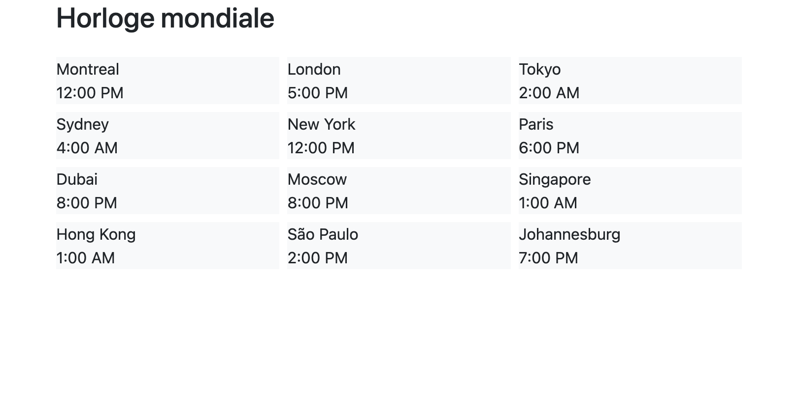

---
---

# 🏆 21-Défi Grille: Horloge mondiale

Créez une page (ex.: `horloge.html`) affichant les heures pour différentes régions du monde. Les heures peuvent être fictives, il s'agit plus d'un prétexte pour afficher dans la page plusieurs éléments et les positionner de façon adaptative.

<BrowserWindow>
  
</BrowserWindow>

## Objectifs

Utilisez le [système de grille](https://getbootstrap.com/docs/5.3/layout/grid/) pour afficher les heures de façon suivante en fonction de la taille de l'écran:

- Mobile: 2 par rangée
- Tablette (md): 3 par rangée
- Ordinateur (lg): 4 par rangée
- Ordinateur (xl): 6 par rangée
- Appliquez une couleur d'arrière-plan aux colonnes (ex.: `bg-light`)
- Modifiez l'espacement entre les colonnes (gutter)

:::tip
Commencez par organiser le contenu, vous pourrez travailler sur la couleur d'arrière-plan et l'espacement entre les colonnes par la suite!
:::

## Kit de départ

:::caution
Vous pouvez utiliser le HTML de départ suivant qui contient déjà Bootstrap et une base HTML.

<a target="_blank" href={ require("./files/horloge_starter_kit.zip").default } download>Télécharger au format zip le projet de départ</a>.
:::