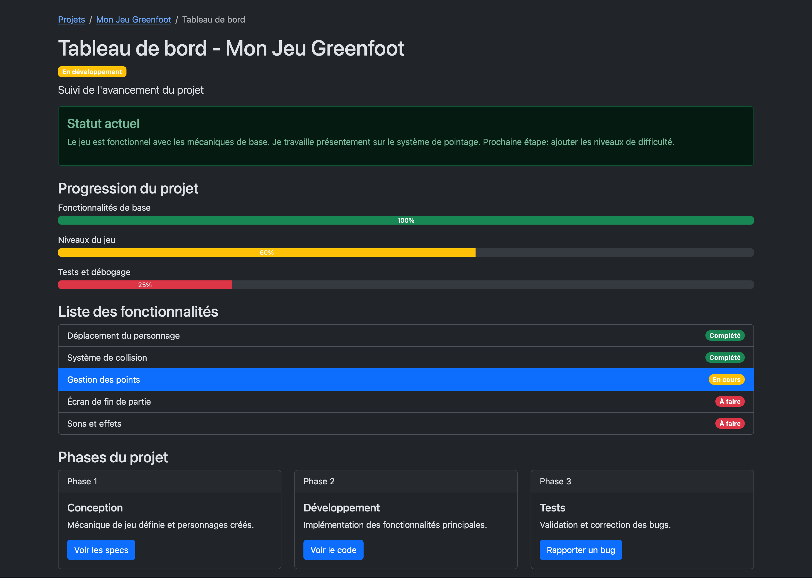
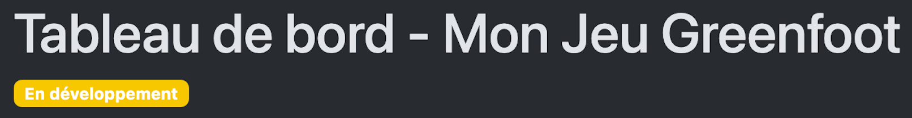
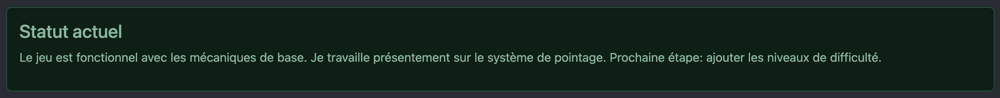
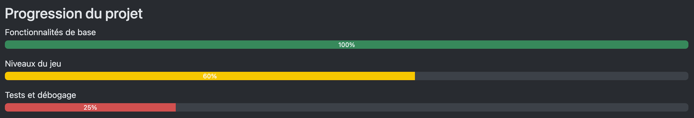
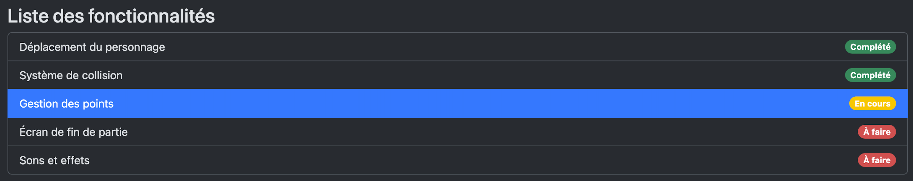
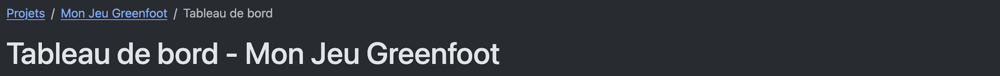

---
---

# 🏆 23-Défi: Maîtriser les composants Bootstrap

Créez une page HTML complète en utilisant **uniquement la documentation Bootstrap** pour découvrir et intégrer différents composants.

:::tip
L'objectif est d'apprendre à naviguer dans la documentation et à assembler des composants. Prenez votre temps et expérimentez! Ce n'est pas grave si vous n'avez pas le temps de finir dans le temps donné en classe.
:::

## Contexte

Vous développez un jeu en Greenfoot dans votre cours d'initiation à la programmation. Votre professeur vous demande de créer un **tableau de bord** pour suivre l'avancement de votre projet. Cette page lui permettra de visualiser rapidement l'état de votre développement.

:::info
Vous devez trouver **tous les composants dans la documentation officielle**:  
[https://getbootstrap.com/docs/5.3/components/](https://getbootstrap.com/docs/5.3/components/)

Copiez les exemples, adaptez-les à votre contenu, et assemblez le tout!
:::

<BrowserWindow>
    
</BrowserWindow>

## Kit de départ

:::caution
Vous pouvez utiliser le HTML de départ suivant qui contient déjà Bootstrap et une base HTML.

<a target="_blank" href={ require("./files/greenfoot_starter_kit.zip").default } download>Télécharger au format zip le projet de départ</a>.
:::

## Objectifs

Votre page doit contenir **tous les éléments suivants**. Vous devez chercher dans la liste de composant le composant approprié et l'intégrer pour remplir l'objectif.

### 1. En-tête de page

- Un **badge** en dessous ou à côté du titre indiquant "En développement"

### 2. Statut actuel

- Une **alert** de type `info`, `success`, `warning` ou `danger` (selon l'état!) pour communiquer l'état du projet au professeur
- L'alert doit contenir un titre (`alert-heading`): "Statut actuel"
- Texte (exemple): "Le jeu est fonctionnel avec les mécaniques de base. Je travaille présentement sur le système de pointage. Prochaine étape: ajouter les niveaux de difficulté."

### 3. Progression du projet

- Trois **barres de progression** (**progress bar**) montrant:
  - Fonctionnalités de base: 100%
  - Niveaux du jeu: 60%
  - Tests et débogage: 25%
- Chaque barre doit avoir une couleur différente (success, warning, danger ou autre)
- Affichez le pourcentage dans chaque barre

:::tip
Le texte au dessus de la barre est simplement un `
` (ou autre), il ne fait pas partie du composant directement.
:::

### 4. Liste des fonctionnalités

- Une **liste groupée** (list group) de 5 fonctionnalités
- Au moins 2 items doivent avoir un **badge** indiquant le statut
- Un item doit être marqué comme "actif"

**Contenu fourni (utilisez tel quel) :**

| Fonctionnalité            | Badge                    |
| ------------------------- | ------------------------ |
| Déplacement du personnage | Complété (vert)          |
| Système de collision      | Complété (vert)          |
| Gestion des points        | En cours (jaune) - ACTIF |
| Écran de fin de partie    | À faire (rouge)          |
| Sons et effets            | À faire (rouge)          |

### 5. Phases du projet

- Chaque card doit contenir :
  - Un en-tête de card (`card-header`)
  - Un titre
  - Du texte descriptif
  - Un **bouton**

**Contenu fourni (utilisez tel quel) :**

| Card | Header  | Titre         | Texte                                           | Bouton           |
| ---- | ------- | ------------- | ----------------------------------------------- | ---------------- |
| 1    | Phase 1 | Conception    | Mécanique de jeu définie et personnages créés.  | Voir les specs   |
| 2    | Phase 2 | Développement | Implémentation des fonctionnalités principales. | Voir le code     |
| 3    | Phase 3 | Tests         | Validation et correction des bugs.              | Rapporter un bug |

### 6. Navigation (fil d'Ariane)

- Un **breadcrumb** en haut de page montrant: `Projets > Mon Jeu Greenfoot > Tableau de bord`

## Conseils

:::tip
- **Utilisez la recherche de bootstrap ou CTRL+F** dans les pages de documentation pour trouver rapidement ce que vous cherchez
- **Trouvez l'exemple qui se rapproche le plus** de votre besoin
- **Copiez d'abord** l'exemple de base, puis personnalisez
:::

# Solution

    

      Cheat Code (solution) 
    

    Votre résultat pourrait être différent, l'important est d'avoir tous les composants demandés.

    <SandpackPlayground
        template="static"
        editorHeight={900}
        files={{
        '/index.html': `<!DOCTYPE html>
<html lang="fr" data-bs-theme="dark">
<head>
    <meta charset="UTF-8">
    <meta name="viewport" content="width=device-width, initial-scale=1.0">
    <title>Tableau de bord - Mon Jeu Greenfoot</title>
    <link href="https://cdn.jsdelivr.net/npm/bootstrap@5.3.0/dist/css/bootstrap.min.css" rel="stylesheet">
</head>
<body>
    

        <!-- Breadcrumb -->
        <nav aria-label="breadcrumb">
            <ol class="breadcrumb">
                <li class="breadcrumb-item"><a href="#">Projets</a></li>
                <li class="breadcrumb-item"><a href="#">Mon Jeu Greenfoot</a></li>
                <li class="breadcrumb-item active" aria-current="page">Tableau de bord</li>
            </ol>
        </nav>
        
        <!-- En-tête -->
        <h1>Tableau de bord - Mon Jeu Greenfoot</h1>
        En développement
        
Suivi de l'avancement du projet

        
        <!-- Alert - Statut actuel -->
        

            <h4 class="alert-heading">Statut actuel</h4>
            
Le jeu est fonctionnel avec les mécaniques de base. Je travaille présentement sur le système de pointage. Prochaine étape: ajouter les niveaux de difficulté.

        

        
        <!-- Progression du projet -->
        <h3 class="mt-4">Progression du projet</h3>
        
        
Fonctionnalités de base

        

            
100%

        

        
        
Niveaux du jeu

        

            
60%

        

        
        
Tests et débogage

        

            
25%

        

        
        <!-- Liste des fonctionnalités -->
        <h3 class="mt-4">Liste des fonctionnalités</h3>
        <ul class="list-group mb-4">
            <li class="list-group-item d-flex justify-content-between align-items-center">
                Déplacement du personnage
                Complété
            </li>
            <li class="list-group-item d-flex justify-content-between align-items-center">
                Système de collision
                Complété
            </li>
            <li class="list-group-item active d-flex justify-content-between align-items-center">
                Gestion des points
                En cours
            </li>
            <li class="list-group-item d-flex justify-content-between align-items-center">
                Écran de fin de partie
                À faire
            </li>
            <li class="list-group-item d-flex justify-content-between align-items-center">
                Sons et effets
                À faire
            </li>
        </ul>
        
        <!-- Phases du projet (Cards) -->
        <h3 class="mt-4">Phases du projet</h3>
        

            

                

                    
Phase 1

                    

                        <h5 class="card-title">Conception</h5>
                        
Mécanique de jeu définie et personnages créés.

                        <a href="#" class="btn btn-primary">Voir les specs</a>
                    

                

            

            

                

                    
Phase 2

                    

                        <h5 class="card-title">Développement</h5>
                        
Implémentation des fonctionnalités principales.

                        <a href="#" class="btn btn-primary">Voir le code</a>
                    

                

            

            

                

                    
Phase 3

                    

                        <h5 class="card-title">Tests</h5>
                        
Validation et correction des bugs.

                        <a href="#" class="btn btn-primary">Rapporter un bug</a>
                    

                

            

        

    

</body>
</html>`
        }}
    />  

