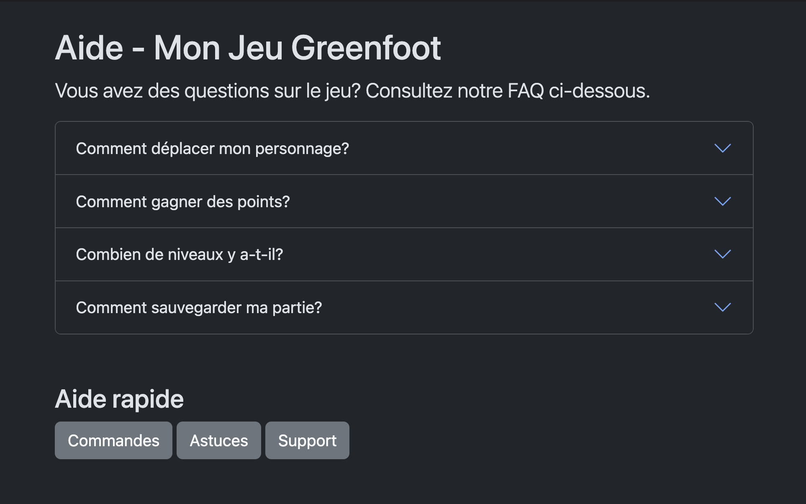

# 🏆 24-Défi - Composants avec JavaScript

Créez une page d'aide (FAQ) en utilisant deux composants Bootstrap nécessitant du JavaScript:
- Un **accordion** (Type 1 - automatique)
- Des **popovers** (Type 2 - nécessite initialisation)

## Contexte

Vous créez une page d'aide pour votre jeu Greenfoot. Cette page contient une **FAQ** (questions fréquentes) sous forme d'accordéon et des **boutons d'aide** avec des popovers pour des informations supplémentaires.

:::info
Vous devez trouver comment utiliser ces composants dans la documentation officielle:  
[https://getbootstrap.com/docs/5.3/components/](https://getbootstrap.com/docs/5.3/components/)
:::

<BrowserWindow>
  
</BrowserWindow>

## Kit de départ

:::caution
Vous pouvez utiliser le HTML de départ suivant qui contient déjà Bootstrap et une base HTML.

<a target="_blank" href={ require("./files/aide_starter_kit.zip").default } download>Télécharger au format zip le projet de départ</a>.
:::

## Objectifs

### 1 - Lier le fichier JavaScript
- Liez le fichier `bootstrap.bundle.min.js` à l'endroit indiqué dans le fichier `HTML`

:::tip
Ce fichier est dans le dossier `js` de l'archive Bootstrap que vous pouvez télécharger à partir du site de Bootstrap.

Référerez-vous à [l'introduction à Bootstrap](../../../01-s11/01-intro-bootstrap/00-doc-intro-bootstrap.md) pour la procédure de téléchargement au besoin.
:::

### 2 - Ajouter un accordion (FAQ)
- Un **accordion** avec 4 questions/réponses
- Chaque question peut s'ouvrir/fermer indépendamment

**Contenu fourni (utilisez tel quel ou inventez votre contenu!)**

| Question                          | Réponse                                                                                                    |
| --------------------------------- | ---------------------------------------------------------------------------------------------------------- |
| Comment déplacer mon personnage ? | Utilisez les flèches du clavier pour déplacer votre personnage dans toutes les directions.                 |
| Comment gagner des points ?       | Collectez les objets verts pour gagner 10 points chacun. Évitez les objets rouges qui retirent des points. |
| Combien de niveaux y a-t-il ?     | Le jeu contient 5 niveaux de difficulté croissante. Chaque niveau débloque de nouvelles mécaniques.        |
| Comment sauvegarder ma partie ?   | Votre progression est sauvegardée automatiquement après chaque niveau complété.                            |

### 3 - Section d'aide rapide avec boutons popovers
- Un titre **Aide rapide**
- Trois **boutons** avec des popovers (info-bulles au clic)

**Contenu fourni (utilisez tel quel ou utilisez votre propre contenu!)**

| Bouton    | Texte du popover                                                                                |
| --------- | ----------------------------------------------------------------------------------------------- |
| Commandes | Flèches : déplacer, Espace : sauter, P : pause                                                  |
| Astuces   | Restez en mouvement pour éviter les ennemis. Les power-ups apparaissent toutes les 30 secondes. |
| Support   | Contactez-nous à support@jeu.com pour toute question.                                           |

:::tip
Les popovers nécessitent du code JavaScript d'initialisation. Utilisez la section **Enable popovers** (https://getbootstrap.com/docs/5.3/components/popovers/#enable-popovers)
:::

## Conseils

- **Accordion**: Cherchez "Accordion" dans la doc Bootstrap et partez de l'exemple de base
- **Popover**: Cherchez "Popovers" dans la doc Bootstrap

:::tip
- Vous aurez besoin de l'attribut `data-bs-toggle="popover"` qui devrait déjà être inclus dans l'exemple de la documentation
- N'oubliez pas de modifier `data-bs-content` pour le texte
- **N'oubliez pas** le code JavaScript d'initialisation!
:::

## Ressources

**Documentation des composants :**
- [Accordion](https://getbootstrap.com/docs/5.3/components/accordion/)
- [Popovers](https://getbootstrap.com/docs/5.3/components/popovers/)
