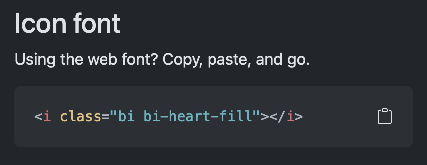

---
---

# 📚 Les icônes Bootstrap

Bootstrap propose une bibliothèque d'**icônes gratuites** appelée **Bootstrap Icons** avec plus de 2000 icônes.

Les icônes améliorent l'interface utilisateur:
- Rendent les boutons plus visuels et intuitifs
- Permettent de gagner de l'espace (remplacer du texte)
- Ajoutent des référents visuels connus

## Inclure Bootstrap Icons à votre site

Pour utiliser les icônes, vous devez inclure la **bibliothèque Bootstrap Icons** en plus de Bootstrap CSS. Le plus simple est d'utiliser un lien CDN (Content delivery network). Au fond, on charge la feuille de style à partir d'une adresse publique plutôt qu'à partir de votre ordinateur.

```html
<link rel="stylesheet" href="https://cdn.jsdelivr.net/npm/bootstrap-icons@1.13.1/font/bootstrap-icons.min.css">
```

```html
<!DOCTYPE html>
<html lang="fr">
<head>
    <meta charset="UTF-8">
    <meta name="viewport" content="width=device-width, initial-scale=1.0">
    <title>Ma page avec icônes</title>
    
    <!-- Bootstrap CSS -->
    <link rel="stylesheet" href="styles/bootstrap.min.css">
    
    //highlight-start
    <!-- Bootstrap Icons -->
    <link rel="stylesheet" href="https://cdn.jsdelivr.net/npm/bootstrap-icons@1.13.1/font/bootstrap-icons.min.css">
    //highlight-end
</head>
<body>
    <!-- Votre contenu -->
</body>
</html>
```

:::caution Important
Bootstrap Icons est **séparé** de Bootstrap CSS. Vous devez inclure les deux!
:::

## Utilisation de base

Les icônes Bootstrap utilisent des **classes CSS**. Le format est le suivant

```html
<i class="bi bi-nom-icone"></i>
```

- `bi`: classe de base (obligatoire). `bi` pour `Bootstrap Icons`
- `bi-nom-icone`: nom de l'icône spécifique à utiliser

:::info
Ici la balise `<i>` sert d'élément de base pour "héberger" l'icône.
:::

### Exemple

<SandpackPlayground
  template="static"
  showTabs={false}
  files={{
    '/index.html': `<!DOCTYPE html>
<html lang="fr">
<head>
    <link href="https://cdn.jsdelivr.net/npm/bootstrap@5.3.0/dist/css/bootstrap.min.css" rel="stylesheet">
    <link rel="stylesheet" href="https://cdn.jsdelivr.net/npm/bootstrap-icons@1.13.1/font/bootstrap-icons.min.css">
</head>
<body>
    <div class="container mt-4">
        <h3>Quelques icônes</h3>
        
        <i class="bi bi-heart"></i> Cœur
        <i class="bi bi-star"></i> Étoile
        <i class="bi bi-house"></i> Maison
        <i class="bi bi-person"></i> Personne
        <i class="bi bi-gear"></i> Paramètres
    </div>
</body>
</html>`
  }}
/>

<br />

### Comment trouver une icône

1. Allez sur [https://icons.getbootstrap.com/](https://icons.getbootstrap.com/)
2. Utilisez la barre de recherche (ex: "heart", "home", "user")
3. Cliquez sur l'icône qui vous intéresse
4. Copiez le `icon font` et intégrez le tout à votre site
    

## Icônes dans les boutons

Les icônes peuvent être utilisées dans les boutons Bootstrap:

<SandpackPlayground
  template="static"
  showTabs={false}
  files={{
    '/index.html': `<!DOCTYPE html>
<html lang="fr">
<head>
    <link href="https://cdn.jsdelivr.net/npm/bootstrap@5.3.0/dist/css/bootstrap.min.css" rel="stylesheet">
    <link rel="stylesheet" href="https://cdn.jsdelivr.net/npm/bootstrap-icons@1.13.1/font/bootstrap-icons.min.css">
</head>
<body>
    <div class="container mt-4">
        <h3>Boutons avec icônes</h3>
        
        <!-- Icône + texte -->
        <button class="btn btn-primary">
            <i class="bi bi-download"></i> Télécharger
        </button>
        
        <button class="btn btn-success">
            <i class="bi bi-check-circle"></i> Valider
        </button>
        
        <button class="btn btn-danger">
            <i class="bi bi-trash"></i> Supprimer
        </button>
        
        <h3 class="mt-4">Boutons icône seulement</h3>
        
        <!-- Icône seule -->
        <button class="btn btn-primary">
            <i class="bi bi-heart"></i>
        </button>
        
        <button class="btn btn-secondary">
            <i class="bi bi-share"></i>
        </button>
        
        <button class="btn btn-info">
            <i class="bi bi-bell"></i>
        </button>
    </div>
</body>
</html>`
  }}
/>

<br />

## Modifier la taille des icônes

Utilisez les classes utilitaires Bootstrap pour changer la taille:
- `fs-1`: Très grand
- `fs-2`: Grand
- `fs-3`: Moyen-grand
- `fs-4`: Moyen
- `fs-5`: Normal
- `fs-6`: Petit

<SandpackPlayground
  template="static"
  showTabs={false}
  files={{
    '/index.html': `<!DOCTYPE html>
<html lang="fr">
<head>
    <link href="https://cdn.jsdelivr.net/npm/bootstrap@5.3.0/dist/css/bootstrap.min.css" rel="stylesheet">
    <link rel="stylesheet" href="https://cdn.jsdelivr.net/npm/bootstrap-icons@1.13.1/font/bootstrap-icons.min.css">
</head>
<body>
    <div class="container mt-4">
        <h3>Tailles d'icônes</h3>
        
        <!-- Avec classes de taille de police -->
        <i class="bi bi-star fs-1"></i> fs-1 (très grand)
        <br>
        <i class="bi bi-star fs-3"></i> fs-3 (grand)
        <br>
        <i class="bi bi-star fs-5"></i> fs-5 (normal)
        <br>
        <i class="bi bi-star fs-6"></i> fs-6 (petit)
    </div>
</body>
</html>`
  }}
/>

<br />

## Colorer les icônes

Utilisez les classes de couleur Bootstrap, tel que `text-danger` pour colorer les icônes:

<SandpackPlayground
  template="static"
  showTabs={false}
  files={{
    '/index.html': `<!DOCTYPE html>
<html lang="fr">
<head>
    <link href="https://cdn.jsdelivr.net/npm/bootstrap@5.3.0/dist/css/bootstrap.min.css" rel="stylesheet">
    <link rel="stylesheet" href="https://cdn.jsdelivr.net/npm/bootstrap-icons@1.13.1/font/bootstrap-icons.min.css">
</head>
<body>
    <div class="container mt-4">
        <h3>Icônes colorées</h3>
        
        <i class="bi bi-heart-fill text-danger fs-2"></i>
        <i class="bi bi-star-fill text-warning fs-2"></i>
        <i class="bi bi-check-circle-fill text-success fs-2"></i>
        <i class="bi bi-info-circle-fill text-primary fs-2"></i>
        <i class="bi bi-x-circle-fill text-secondary fs-2"></i>
    </div>
</body>
</html>`
  }}
/>

<br />

## Icônes pleines vs contour

Beaucoup d'icônes existent en deux versions:

```html
<!-- Contour (outline) -->
<i class="bi bi-heart"></i>

<!-- Pleine (fill) -->
<i class="bi bi-heart-fill"></i>
```

<SandpackPlayground
  template="static"
  showTabs={false}
  files={{
    '/index.html': `<!DOCTYPE html>
<html lang="fr">
<head>
    <link href="https://cdn.jsdelivr.net/npm/bootstrap@5.3.0/dist/css/bootstrap.min.css" rel="stylesheet">
    <link href="https://cdn.jsdelivr.net/npm/bootstrap-icons@1.11.0/font/bootstrap-icons.css" rel="stylesheet">
</head>
<body>
    <div class="container mt-4">
        <h3>Contour vs Plein</h3>
        
        <div class="fs-2">
            <i class="bi bi-heart"></i> bi-heart (contour)
            <br>
            <i class="bi bi-heart-fill"></i> bi-heart-fill (plein)
            <br><br>
            <i class="bi bi-star"></i> bi-star (contour)
            <br>
            <i class="bi bi-star-fill"></i> bi-star-fill (plein)
        </div>
    </div>
</body>
</html>`
  }}
/>

<br />

:::tip
Pour obtenir la version pleine, ajoutez simplement `-fill` au nom de l'icône!
:::

## Combinaison avec les composants Bootstrap

Les icônes s'intègrent facilement avec les composants Bootstrap:

<SandpackPlayground
  template="static"
  showTabs={false}
  files={{
    '/index.html': `<!DOCTYPE html>
<html lang="fr">
<head>
    <link href="https://cdn.jsdelivr.net/npm/bootstrap@5.3.0/dist/css/bootstrap.min.css" rel="stylesheet">
    <link href="https://cdn.jsdelivr.net/npm/bootstrap-icons@1.11.0/font/bootstrap-icons.css" rel="stylesheet">
</head>
<body>
    <div class="container mt-4">
        <!-- Alert avec icône -->
        <div class="alert alert-success">
            <i class="bi bi-check-circle-fill"></i>
            Opération réussie !
        </div>
        
        <!-- Badge avec icône -->
        <span class="badge bg-primary">
            <i class="bi bi-bell-fill"></i> 5
        </span>
        
        <!-- Card avec icône -->
        <div class="card mt-3" style="width: 18rem;">
            <div class="card-body">
                <h5 class="card-title">
                    <i class="bi bi-star-fill text-warning"></i>
                    Favoris
                </h5>
                <p class="card-text">Vos éléments favoris.</p>
            </div>
        </div>
    </div>
</body>
</html>`
  }}
/>

<br />

## Bonnes pratiques

### Cohérence visuelle

Utilisez le même style d'icônes (toutes outline OU toutes fill) dans une même interface :

```html
<!-- ✅ Bon : cohérent -->
<i class="bi bi-house"></i>
<i class="bi bi-person"></i>
<i class="bi bi-gear"></i>

<!-- ❌ Mauvais : mélange -->
<i class="bi bi-house-fill"></i>
<i class="bi bi-person"></i>
<i class="bi bi-gear-fill"></i>
```

### Icônes significatives

Choisissez des icônes qui ont du **sens** pour l'action :

```html
<!-- ✅ Bon : sens clair -->
<button class="btn btn-danger">
    <i class="bi bi-trash"></i> Supprimer
</button>

<!-- ❌ Mauvais : sens confus -->
<button class="btn btn-danger">
    <i class="bi bi-heart"></i> Supprimer
</button>
```

### Accessibilité

Ajoutez du texte visible:

```html
<!-- Avec texte visible -->
<button class="btn btn-primary">
    <i class="bi bi-download"></i> Télécharger
</button>

<!-- Sans texte : ajouter aria-label -->
<button class="btn btn-primary" aria-label="Télécharger">
    <i class="bi bi-download"></i>
</button>
```