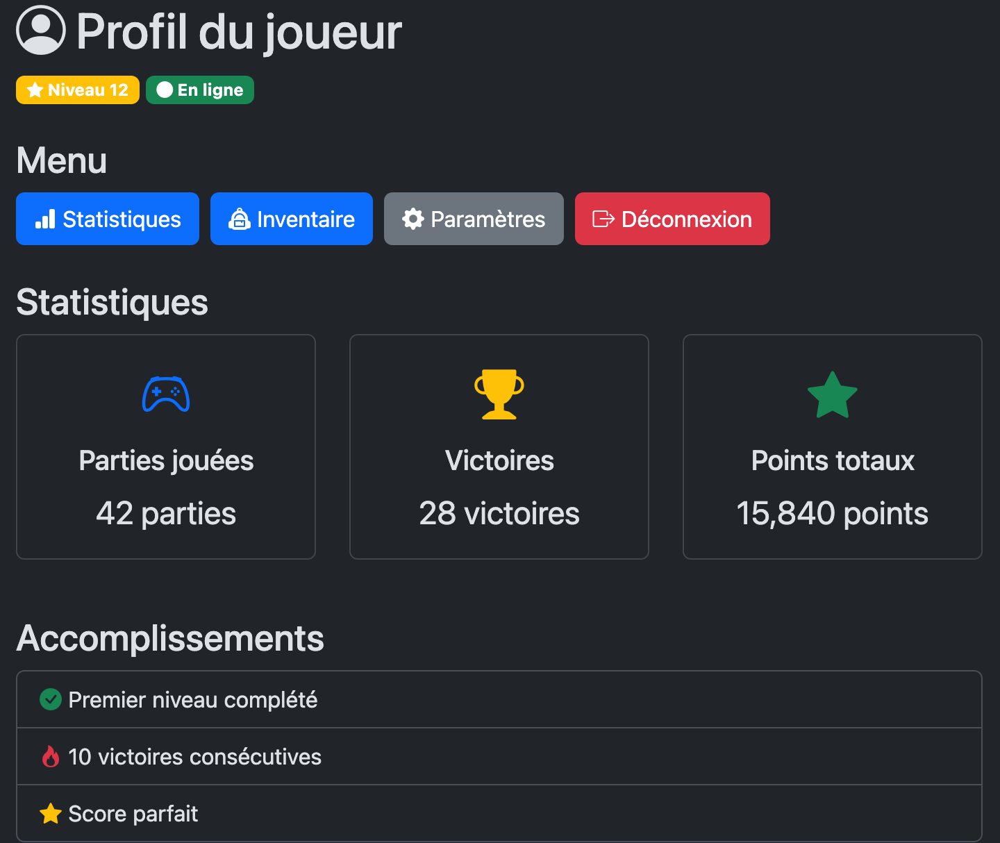

---
---

# 🏆 25-Défi - Utiliser les icônes Bootstrap

## Votre mission

Ajoutez des **icônes Bootstrap** appropriées à une interface déjà construite.

Trouvez les icônes appropriées sur le site officiel :  
[https://icons.getbootstrap.com/](https://icons.getbootstrap.com/)

:::info
Vous devez **seulement ajouter les icônes**, tout le reste du HTML est déjà fourni!
:::

## Contexte

Vous avez une page de **profil utilisateur** pour votre jeu. L'interface est construite, mais il manque les icônes pour la rendre plus visuelle.

<BrowserWindow>
    
</BrowserWindow>

## Exigences
1. Ajoutez la [feuille de styles pour les icônes Bootstrap](01-doc-icones.md)
2. Ajoutez les icônes aux endroits indiqués par les commentaires `TODO` dans le HTML.

## Kit de départ

:::caution
Vous pouvez utiliser le HTML de départ suivant qui contient déjà Bootstrap et une base HTML.

<a target="_blank" href={ require("./files/starter_kit_icones.zip").default } download>Télécharger au format zip le projet de départ</a>.
:::

## Conseils

### Comment trouver une icône

1. Allez sur [https://icons.getbootstrap.com/](https://icons.getbootstrap.com/)
2. Utilisez la barre de recherche (ex: "heart", "home", "user")
3. Cliquez sur l'icône qui vous intéresse
4. Copiez le `icon font` et intégrez le tout à votre site
    

### Mots-clés utiles

- Personne: `person`, `user`
- Étoile: `star`
- Cercle: `circle`
- Graphique: `graph`, `chart`, `bar-chart`
- Sac/boîte:  `bag`, `box`, `backpack`
- Engrenage: `gear`
- Déconnexion: `door`, `box-arrow-right`
- Manette: `controller`
- Trophée: `trophy`
- Crochet: `check`
- Feu: `fire`
