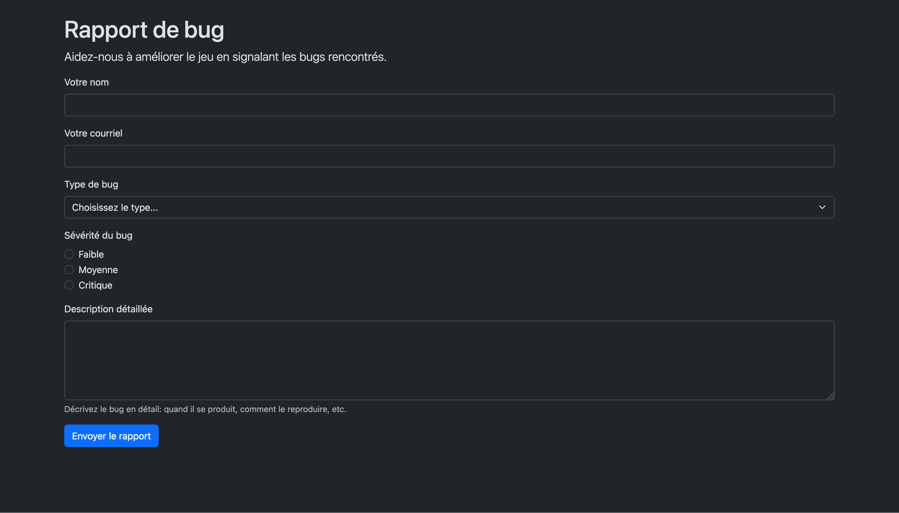

# 🏆 26-Défi - Formulaire de rapport de bug

Créez un **formulaire de rapport de bug** pour votre jeu Greenfoot en utilisant les classes de formulaire Bootstrap.

## Contexte

Vous développez un jeu en Greenfoot et vous voulez permettre aux testeurs de rapporter des bugs facilement. Créez un formulaire structuré pour collecter les informations nécessaires.

:::caution
Vous devez utiliser les bonnes classes Bootstrap pour styliser chaque type de champ. Consultez la documentation Bootstrap pour trouver les classes appropriées!
:::

<BrowserWindow>
    
</BrowserWindow>

## Kit de départ

:::caution
Vous pouvez utiliser le HTML de départ suivant qui contient déjà Bootstrap et une base HTML.

<a target="_blank" href={ require("./files/starter_kit_formulaires.zip").default } download>Télécharger au format zip le projet de départ</a>.
:::

## Exigences

Créez un formulaire avec les champs suivants:

### 1. Nom du testeur (champ texte)
- Type: `text`
- Label: `Votre nom`
- **Documentation:** [Form controls](https://getbootstrap.com/docs/5.3/forms/form-control/)

### Courriel (champ email)
- Type: `email`
- Label: `Votre email`
- **Documentation :** [Form controls](https://getbootstrap.com/docs/5.3/forms/form-control/)

### 3. Type de bug (liste déroulante)
- Label: `Type de bug`
- Options fournies:
  - `Choisissez le type...` (option par défaut, sélectionnée)
  - `Graphique`
  - `Gameplay`
  - `Son`
  - `Contrôles`
  - `Autre`
- **Documentation:** [Select](https://getbootstrap.com/docs/5.3/forms/select/)

### 4. Niveau de sévérité (boutons radio)
- Label: `Sévérité du bug`
- Options fournies:
  - `Faible`
  - `Moyenne`
  - `Critique`
- **Documentation:** [Checks and radios](https://getbootstrap.com/docs/5.3/forms/checks-radios/)

### 5. Description du bug (zone de texte)
- Label: `Description détaillée`
- Hauteur: 5 lignes (`rows="5"`)
- Texte d'aide: "Décrivez le bug en détail: quand il se produit, comment le reproduire, etc."
- **Documentation:** [Form controls](https://getbootstrap.com/docs/5.3/forms/form-control/)

### 7. Boutons
- Bouton principal: `Envoyer le rapport`

## Ressources

**Documentation Bootstrap Forms:**
- [Form controls](https://getbootstrap.com/docs/5.3/forms/form-control/) - text, email, textarea
- [Select](https://getbootstrap.com/docs/5.3/forms/select/) - listes déroulantes
- [Checks and radios](https://getbootstrap.com/docs/5.3/forms/checks-radios/) - checkbox et radio
- [Buttons](https://getbootstrap.com/docs/5.3/components/buttons/) - styliser les boutons

# Solution

    

      Cheat Code (solution) 
    

    Votre résultat pourrait être différent, l'important est d'avoir utilisé les bonnes classes Bootstrap pour chaque type de champ.

    <SandpackPlayground
        template="static"
        editorHeight={900}
        files={{
        '/index.html': `<!DOCTYPE html>
<html lang="fr" data-bs-theme="dark">
<head>
    <meta charset="UTF-8">
    <meta name="viewport" content="width=device-width, initial-scale=1.0">
    <title>Rapport de bug - Mon Jeu Greenfoot</title>
    <link href="https://cdn.jsdelivr.net/npm/bootstrap@5.3.0/dist/css/bootstrap.min.css" rel="stylesheet">
</head>
<body>
    

        <h1>Rapport de bug</h1>
        
Aidez-nous à améliorer le jeu en signalant les bugs rencontrés.

        
        <form>
            
            

                <label for="nom" class="form-label">Votre nom</label>
                <input type="text" class="form-control" id="nom" required>
            

            
            

                <label for="courriel" class="form-label">Votre courriel</label>
                <input type="email" class="form-control" id="courriel" required>
            

            
            

                <label for="type" class="form-label">Type de bug</label>
                <select class="form-select" id="type">
                    <option selected>Choisissez le type...</option>
                    <option value="graphique">Graphique</option>
                    <option value="gameplay">Gameplay</option>
                    <option value="son">Son</option>
                    <option value="controles">Contrôles</option>
                    <option value="autre">Autre</option>
                </select>
            

            
            

                <label class="form-label">Sévérité du bug</label>
                

                    <input class="form-check-input" type="radio" name="severite" id="faible">
                    <label class="form-check-label" for="faible">
                        Faible
                    </label>
                

                

                    <input class="form-check-input" type="radio" name="severite" id="moyenne">
                    <label class="form-check-label" for="moyenne">
                        Moyenne
                    </label>
                

                

                    <input class="form-check-input" type="radio" name="severite" id="critique">
                    <label class="form-check-label" for="critique">
                        Critique
                    </label>
                

            

            
            

                <label for="description" class="form-label">Description détaillée</label>
                <textarea class="form-control" id="description" rows="5"></textarea>
                
Décrivez le bug en détail: quand il se produit, comment le reproduire, etc.

            

        
            
            <button type="submit" class="btn btn-primary">Envoyer le rapport</button>
            
        </form>
    

</body>
</html>`
        }}
    />  

