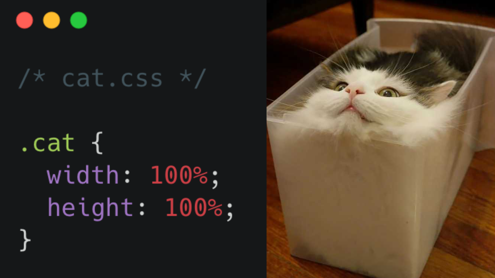

# Développement d'applications Web I

Ce cours se donne à la première session. Il sert à faire l’initiation à la programmation web côté client en développant des pages web statiques.

Il permet de faire l’initiation à la programmation web côté client. Seule la programmation avec des langages de balisage et de style sera enseignée dans ce cours.

Cette fondation sera réutilisée dans les cours Développement d’application Web II, III, et IV, ainsi que les cours de Projet Web I et II.

## Plan de cours

<DocCard item={{
  type: 'link',
  href: 'https://cegepdrummond-my.sharepoint.com/my?viewid=b7ab69eb%2D045b%2D4285%2Dac4f%2Da9028eb997c1&id=%2Fpersonal%2Fpresley%5Fnkambou%5Fcegepdrummond%5Fca%2FDocuments%2FCOURS%2F420%2D1W1%2DDM%2DA26%2F420%2D1W1%2DDM%5FPN%5FMKW%5FA26%2Epdf&parent=%2Fpersonal%2Fpresley%5Fnkambou%5Fcegepdrummond%5Fca%2FDocuments%2FCOURS%2F420%2D1W1%2DDM%2DA26',
  label: 'Voir le plan de cours (PDF)' }} />

## Grille d'évaluation du cours

| Évaluation                 | Semaine    | Pondération |
| -------------------------- | ---------- |-------------|
| Test sur les bases du HTML | Semaine 4  | 10%         |
| Site Web HTML              | Semaine 5  | 5%          |
| Site Web HTML & CSS        | Semaine 10 | 10%         |
| Examen pratique HTML & CSS | Semaine 10 | 15%         |
| Site Web avec Bootstrap    | Semaine 15 | 20%         |
| Examen                     | Examen     | 40%         |

## Communication et disponibilité

Vous pouvez nous contacter via Mio ou Discord.

Vous pouvez m'écrire au moment qui vous convient et **je répondrai en fonction de mes disponibilités**. Je demeure évidemment disponible durant les périodes de disponibilité prévues.

Il peut m'arriver, à l'occasion, de répondre en soirée ou encore durant la fin de semaine, mais **il ne faut pas vous y attendre**. Ainsi, assurez-vous d'être suffisamment à jour dans vos travaux afin de prévoir un délai de réponse à vos questions.

S.v.p., assurez-vous d'inclure un max d'information dans vos communications pour m'aider à vous aider. Par exemple: captures d'écran, détail de message d'erreur, etc. Nous gagnerons tous du temps ainsi!

### Périodes de disponibilité

| **Jour** | **Plage horaire** | **Lieu**   |
|----------|-------------------| ---------- |
| Mardi    | 12:00 - 14:00     | 1325-1     |
| Vendredi | 12:00 - 14:00     | @ distance |

## Mes informations

* Email: [presley.nkambou@cegepdrummond.ca](mailto:presley.nkambou@cegepdrummond.ca)
* Discord: Presley Nkambou

## Remerciements

Merci à Pierre-Luc Boulanger et Benoit tremblay. Certaines des notions présentées sont inspirées de leurs notes de cours.

## ✌️